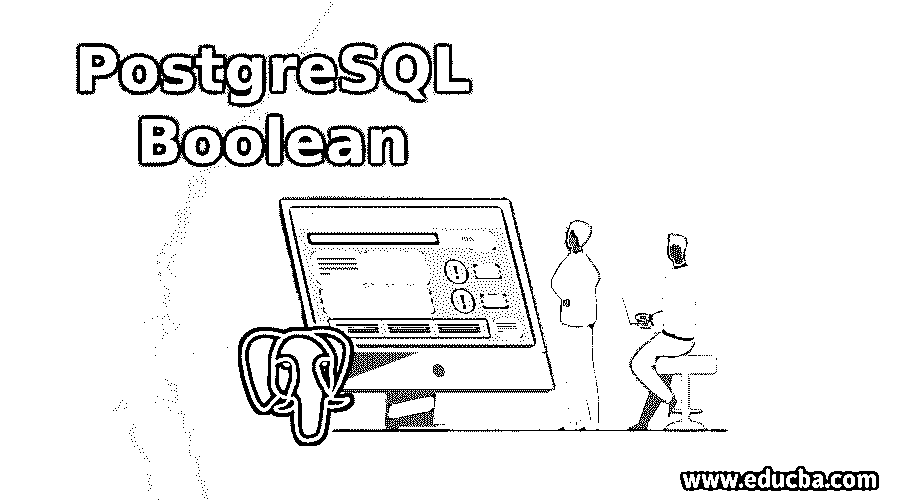
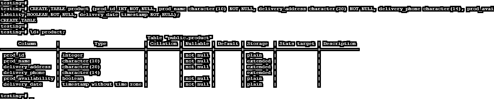
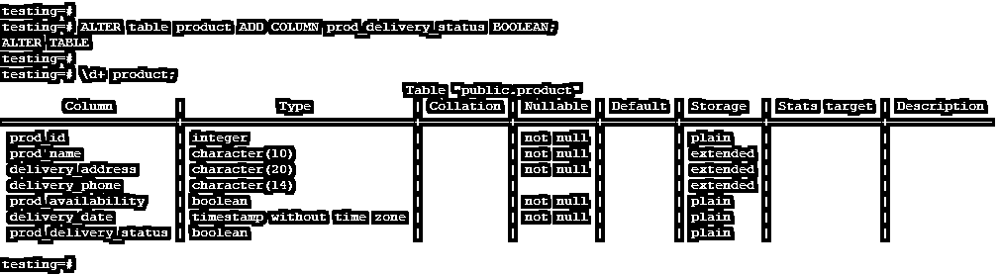
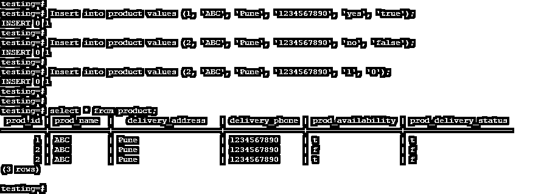
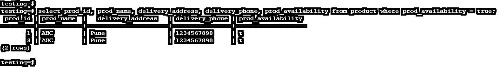
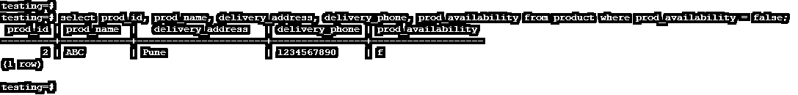

# PostgreSQL 布尔值

> 原文：<https://www.educba.com/postgresql-boolean/>

## PostgreSQL 布尔值的定义

PostgreSQL Boolean 是一种简单的数据类型，我们仅用它来表示真假数据或值的结构。PostgreSQL 将支持 SQL 标准的 SQL99 定义的布尔数据类型；Boolean 也称为“bool”，bool 是 PostgreSQL 中布尔数据类型的别名。我们可以在 PostgreSQL 中设置布尔数据类型的空值；如果我们设置了一个布尔数据类型的空值，那么它不会因为 true 或 false 而中断。在 PostgreSQL 中，布尔数据类型有三种状态，如 true、false 和 null。

### 语法和参数

PostgreSQL 布尔值的语法和参数如下所示:

<small>Hadoop、数据科学、统计学&其他</small>

**语法:**

下面是 PostgreSQL 中布尔数据类型的语法如下。我们已经在创建和插入表时定义了布尔数据类型。

`CREATE TABLE table_name (Any table name given to the table) (Column_name data
Type NOT NULL, Column_name (Column name to define Boolean data
Type) BOOLEAN NOT NULL (Define not null value of Boolean data type column));`

`Alter table table_name ADD COLUMN column_name BOOLEAN (Define Boolean data
type to the column)`

`Insert into table_name values (true, ‘t’, ‘true’, ‘y’, ‘yes’, ‘1’);`

`Insert into table_name values (false, ‘f’, ‘false’, ‘f’, ’no’, ‘0’);`

**参数:**

下面是对上述语法的参数描述如下。

*   **创建:**创建一个新的表格，定义表格列的布尔数据类型。我们已经在创建表的时候定义了布尔数据类型。此外，我们已经在使用 alter 命令创建表之后定义了它。
*   **表名:**新建一个表，在 PostgreSQL 中将列的数据类型定义为 Boolean。我们可以给新创建的表起任何名字。
*   **列名:**我们定义了布尔数据类型的列的名称。我们在 PostgreSQL 中设置了布尔值 true、false 和 null。
*   **数据类型:**定义列的数据类型。我们可以定义任何数据类型的列。布尔是最有用和最重要的数据类型。
*   **Not Null:** 我们定义了一个列的 Not Null 值。如果我们没有设置列的空值，那么在表中不允许插入空值。
*   **Boolean:** 它是一种简单的数据类型，仅用于表示真或假数据或值的结构。在 PostgreSQL 中，布尔数据类型有三种状态，如 true、false 和 null。
*   **Add:** 使用 alter 命令和定义的布尔数据类型向 PostgreSQL 中的同一列添加新列。
*   **Alter:** 在创建了一个表并为同一个列定义了一个布尔数据类型之后，我们添加了一个列。
*   **真，t，是，1，y:** 这是布尔数据类型的有效真值。
*   **False，f，no，0，n:** 这是 PostgreSQL 中布尔数据类型的有效 False 值

### Boolean 数据类型在 PostgreSQL 中如何工作？

下面是布尔数据类型的工作原理。

*   数据类型中的 PostgreSQL Boolean 有三种状态，如 true、false 和 null。
*   PostgreSQL 将支持 SQL 标准的 SQL99 定义的布尔数据类型；布尔也称为“bool”，bool 是布尔数据类型的别名。
*   它是一种简单的数据类型，仅用于表示真假数据或值的结构。
*   我们可以设置布尔数据类型的空值；如果我们设置了一个布尔数据类型的空值，那么它不会因为 true 或 false 而中断。
*   在 PostgreSQL 中，我们可以将布尔值定义为 null、true 和 false。在定义了一个真布尔数据类型之后，所有在真之下的值都被检索。
*   如果我们将布尔值定义为 false，则将从表中检索所有 false 值。将布尔值定义为 null 不会因 true 或 false 而中断。
*   布尔数据类型的有效真值如下。
    *   真实的
    *   t
    *   “真的”
    *   你好
    *   “是的”
    *   One
*   布尔数据类型的有效假值如下。
    *   错误的
    *   f '
    *   “错误”
    *   “不”
    *   没有
    *   Zero

*   除了 true 和 false 之外，所有 PostgreSQL 布尔数据类型值都用引号括起来。
*   布尔支持单一数据类型，但是布尔有三种状态。
*   布尔数据类型是一种简单的数据类型，只表示真值和假值。

### PostgreSQL 布尔值示例

下面是布尔数据类型的例子如下。

1.在创建表时，我们已经为列定义了布尔数据类型。我们已经创建了一个产品表，在 availability 列中，我们必须定义布尔数据类型如下。

`testing=# CREATE TABLE product (prod_id INT NOT NULL, prod_name character(10) NOT NULL, delivery_address character(20) NOT NULL, delivery_phone character(14), prod_availability BOOLEAN NOT NULL, delivery_date timestamp NOT NULL);`

2.在创建表之后，我们已经定义了布尔数据类型。下面是同样的例子如下。

`testing=# ALTER table product ADD COLUMN prod_delivery_status BOOLEAN;`

3.将布尔数据插入表中。

`testing=# Insert into product values (1, 'ABC', 'Pune', '1234567890', 'yes', 'true');
testing=# Insert into product values (2, 'ABC', 'Pune', '1234567890', 'no', 'false');
testing=# Insert into product values (2, 'ABC', 'Pune', '1234567890', '1', '0');
testing=# select * from product;`

4.从产品可用性为真的表中检索数据。

`testing=# select prod_id, prod_name, delivery_address, delivery_phone, prod_availability from product where prod_availability = true;`

5.从产品可用性为假的表中检索数据。

`testing=# select prod_id, prod_name, delivery_address, delivery_phone, prod_availability from product where prod_availability = false;`

### 推荐文章

这是一个 PostgreSQL 布尔的指南。这里我们讨论 boolean 数据类型的定义以及它在 PostgreSQL 中是如何工作的，并附有例子。您也可以看看以下文章，了解更多信息–

1.  [如何在 PostgreSQL 中删除表？](https://www.educba.com/postgresql-table/)
2.  [PostgreSQL 过程](https://www.educba.com/postgresql-procedures/)
3.  [MongoDB 替代品](https://www.educba.com/mongodb-alternatives/)
4.  [MongoDB vs PostgreSQL](https://www.educba.com/mongodb-vs-postgresql/)
5.  [PostgreSQL RANK() |如何工作？](https://www.educba.com/postgresql-rank/)
6.  [PostgreSQL COALESCE |如何工作？](https://www.educba.com/postgresql-coalesce/)