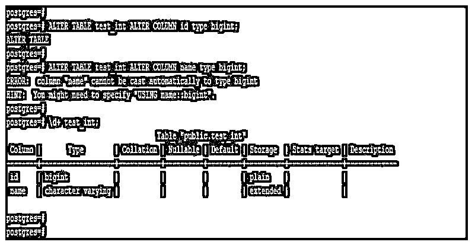
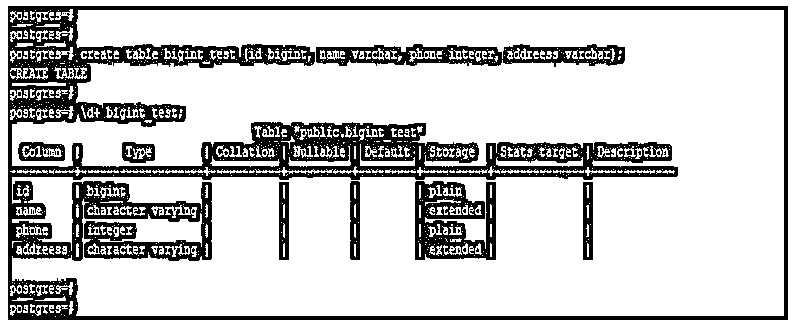
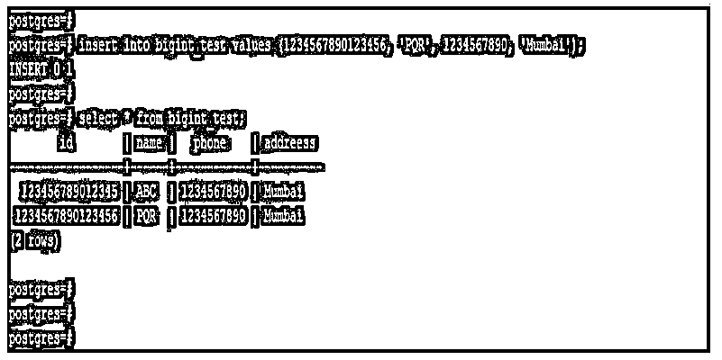

# PostgreSQL BIGINT

> 原文：<https://www.educba.com/postgresql-bigint/>

## PostgreSQL BIGINT 简介

PostgreSQL BIGINT 是 PostgreSQL 中用于存储整型值的数值数据类型，我们可以在 PostgreSQL 中使用 BIGINT 数据类型来存储整型值。PostgreSQL 中 bigint 数据类型的大小是 8 个字节，bigint 数据类型的范围是-9223372036854775808 到 9223372036854775807。Bigint 数据类型在 PostgreSQL 中非常有用和重要，用来存储大量的整数。PostgreSQL 中的数值数据类型包含了 smallint、integer 和 bigint，每种数据类型都有不同的存储大小结构，smallint 和 integer 包含了不同的存储大小。

### PostgreSQL BIGINT 的语法

下面是 PostgreSQL 中 BIGINT 数据类型的语法:

<small>Hadoop、数据科学、统计学&其他</small>

`Create table name_of_table (name_of_column1 data_type, name_of_column2 data_type, name_of_column3 data_type, …, name_of_columnN BIGINT);`

`Name_of_variable or name_of_column BIGINT;`

`Alter table name_of_tablealter columnname_of_column type bigint;`

**下面是 PostgreSQL 中 BIGINT 数据类型的参数描述语法:**

*   **Create table:** 通过将数据类型定义为列的 bigint，这被定义为 PostgreSQL 中的 Create table。我们可以创建任何表，并将数据类型定义为列的 bigint。
*   **表名:**通过将列的数据类型定义为 bigint，这在 PostgreSQL 中被定义为表名。我们可以在创建表时为列定义 bigint 数据类型。在使用 alter 命令创建表之后，我们还将数据类型定义为 bigint。
*   **列 1 的名称到列 N 的名称:**这被定义为在表上创建列，并为其定义 bigint 数据类型。
*   **数据类型:**定义为创建表格时，给表格列分配数据类型。我们可以根据存储到表中的数据来定义数据类型。
*   **Bigint:** 这被定义为我们在创建表时用于该列的数据类型。使用 bigint 数据类型，我们可以在 PostgreSQL 中存储更多的整数。
*   **变量名:**这只是我们在创建表格时使用的列名。
*   **Alter table:** 该命令用于在 PostgreSQL 中更改表，使用 Alter 命令我们将列的数据类型从一种数据类型更改为另一种数据类型。
*   **Alter column:** 该命令用于在 PostgreSQL 中更改列，使用 Alter 命令我们将列的数据类型从一种数据类型更改为另一种数据类型。
*   **Type:** 这被定义为在 PostgreSQL 中的 alter table 命令时我们正在改变的数据类型。

### PostgreSQL 中 BIGINT 数据类型如何工作？

*   如果我们想将大整数类型的值存储到表中，同时我们在 PostgreSQL 中使用 bigint 数据类型。
*   与使用 smallint 和 integer 数据类型相比，bigint 数据类型性能较低。因此，在 PostgreSQL 中使用 bigint 数据类型时，我们有充分的理由在应用程序中使用相同的数据类型。
*   我们可以把 smallint 或者 integer 的数据类型改成 bigint。但是我们不能将 varchar 数据类型直接转换为 bigint，这将导致错误，即我们不能自动将数据类型转换为 bigint。
*   下面的例子显示了我们可以将数据类型 smallint 或 integer 更改为 bigint，但是不能直接将 varchar 数据类型更改为 bigint。
*   在下面的第一个示例中，我们已经将数据类型从 int 更改为 bigint，我们已经成功地将其更改为 bigint，因为在 PostgreSQL 中可以将数值数据类型更改为 bigint。
*   在第二个示例中，不可能更改数据类型，因为我们不能将 varchar 数据类型直接转换为 bigint 数据类型。

**代码:**

`ALTER TABLE test_int ALTER COLUMN id type bigint;
ALTER TABLE test_int ALTER COLUMN name type bigint;
\d+ test_int;`

**输出:**

*   Bigint 数据类型将消耗大量存储空间来将数据存储到表中。我们可以在 PostgreSQL 中使用 bigint 数据类型存储星系恒星或科学常数的数量。

### 例子

下面是提到的例子:

#### 示例#1

使用 bigint 数据类型创建表。

*   下面的示例显示了如何在 PostgreSQL 中使用 bigint 数据类型创建表。
*   我们将表名创建为 bigint_test，并将列名的 bigint 数据类型定义为 id。

**代码:**

`create table bigint_test (id bigint, name varchar, phone integer, addreess varchar);
\d+ bigint_test;`

**输出:**

#### 实施例 2

将值插入 bigint 数据类型列。

*   以下示例显示了将值插入 bigint 数据类型列。

**代码:**

`insert into bigint_test values (123456789012345, 'ABC', 1234567890, 'Mumbai');
insert into bigint_test values (1234567890123456, 'PQR', 1234567890, 'Mumbai');
select * from bigint_test;`

**输出:**

#### 实施例 3

更改列以将数据类型从 integer 更改为 bigint。

*   下面是 alter column 将数据类型从 integer 更改为 bigint 的示例。
*   我们正在将 phone 列的数据类型从 integer 更改为 bigint。

**代码:**

`ALTER TABLE bigint_test ALTER COLUMN phone type bigint;
\d+ bigint_test`

**输出:**

### 推荐文章

这是一个 PostgreSQL BIGINT 的指南。这里我们讨论 BIGINT 数据类型如何在 PostgreSQL 中工作，并通过查询示例来更好地理解。您也可以看看以下文章，了解更多信息–

1.  [PostgreSQL 物化视图](https://www.educba.com/postgresql-materialized-views/)
2.  [PostgreSQL 重新索引](https://www.educba.com/postgresql-reindex/)
3.  [hstore in PostgreSQL](https://www.educba.com/hstore-in-postgresql/)
4.  [PostgreSQL 回合](https://www.educba.com/postgresql-round/)