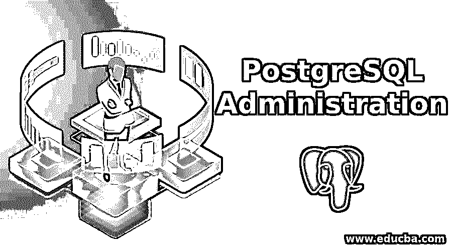
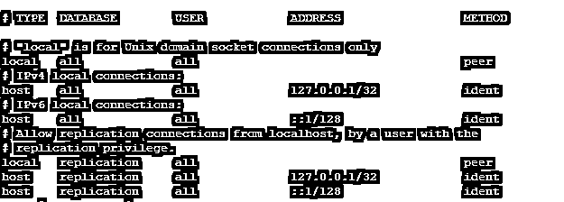
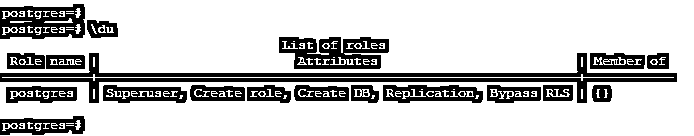
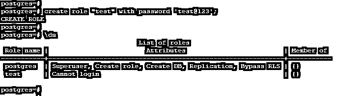
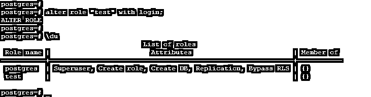

# PostgreSQL 管理

> 原文：<https://www.educba.com/postgresql-administration/>

## PostgreSQL 管理的定义

PostgreSQL 管理用于对数据库进行身份验证，防止未经身份验证的用户访问数据库；PostgreSQL 管理对于提供对数据库、表和所有对象的适当访问是必不可少的。PostgreSQL 管理中使用角色和用户对数据库进行身份验证。许多方法已经被用来验证数据库的用户，如信任，MD5，LDAP，密码，SSPI，Kerberos，ident，对等 radius，证书，PAM。这些方法使用不同的身份验证算法对数据库进行身份验证；基本上，我们在 PostgreSQL 中使用 MD5 认证方法来认证数据库用户。

### 为什么我们需要 PostgreSQL 管理？

下面是 PostgreSQL 中的管理需求。

<small>Hadoop、数据科学、统计学&其他</small>

*   在 PostgreSQL 中，角色和用户扮演着重要的角色。该角色没有默认登录权限，而用户拥有数据库的默认登录权限。
*   PostgreSQL 管理的主要需求是对数据库进行身份验证，防止未经授权的访问。
*   如果我们不管理我们的数据库，那么它将从未经认证的用户访问。
*   在 PostgreSQL 中，角色和用户管理对于向每个用户提供适当的访问非常重要。
*   如果我们给用户不适当的特权，那么就会发生数据被滥用的情况。
*   根据标准指南，必须给每个用户适当的权限。超级用户权限不会授予任何其他用户。
*   在 PostgreSQL 中，Postgres 是超级用户；该用户拥有访问数据库的所有权限。
*   根据 PostgreSQL 管理，我们需要按照策略备份数据库，以避免任何数据丢失。
*   如果我们有一个数据备份，突然我们的数据库将崩溃，将有数据丢失的机会。
*   为了避免数据丢失，我们需要按照备份策略进行备份。将根据完整、增量和差异来定义备份策略。
*   PostgreSQL 备份主要分为两种类型。
*   逻辑学的
*   身体的
*   我们使用 pg_dump 或 pg_dumpall 命令进行了逻辑备份，使用 pg_basebackup 或从第三方工具(如 pgBackRest 等)进行了物理备份。

### PostgreSQL 管理是如何工作的？

下面是 PostgreSQL 管理的工作过程。

*   我们在 PostgreSQL 中使用规则和用户来验证数据库。用户拥有数据库的默认登录权限，而角色没有数据库的登录权限。
*   用户的默认连接数据库是 Postgres。
*   如果任何用户连接到 PostgreSQL 数据库，他需要足够的权限来访问该数据库。
*   在 PostgreSQL 中，数据库级用户必须有连接权限；在模式级别，它需要对指定模式的用户权限。
*   我们还需要在数据库上创建的用户来访问数据库，并赋予数据库特定的权限。
*   创建用户后，我们需要将用户条目放在 conf 文件中；这是 PostgreSQL 数据库的认证文件。
*   这个文件包含用户名、数据库名、主机名，我们可以通过它们访问数据库；此外，我们需要提到该用户的身份验证方法。
*   下面是 pg_hba.conf 文件的默认设置如下。

*   我们可以从本地主机或任何主机访问 PostgreSQL 数据库。我们需要在 pg_hba.conf 文件中定义该主机的 IP 地址。
*   用户连接到数据库的用户验证方法。如果认证成功，则用户连接到特定的数据库；否则，它将因出错而断开连接。
*   身份验证后，用户有权访问数据库并执行用户有权访问的查询。
*   如果用户无权执行指定的查询，它将抛出一个名为“权限被拒绝”的错误。
*   用户还通过 PostgreSQL 中的对等身份验证进行连接；它将通过操作系统用户认证进行访问。但是在这种情况下，我们需要两个用户有相同的名字。
*   下面是 PostgreSQL 的配置文件如下。
*   Postgresql.conf
*   Pg_hba.conf
*   postgresql.auto.auto.conf
*   pg_ident.conf
*   PostgreSQL 中使用了多种身份验证方法，如信任、MD5、LDAP、密码、SSPI、Kerberos、ident、对等 radius、证书、PAM。
*   这些方法各有不同的认证算法；基本上，我们使用 MD5 认证方法来认证 PostgreSQL 用户的数据库。

### PostgreSQL 管理的角色

以下是 PostgreSQL 管理的角色。

*   在 PostgreSQL 中，角色和用户对于管理数据库非常重要。用户拥有数据库的默认登录权限。角色没有数据库的默认登录权限。
*   我们可以考虑一个组在 PostgreSQL 中的作用。
*   PostgreSQL 角色对于管理 PostgreSQL 数据库非常重要。
*   PostgreSQL 管理中使用角色和用户对数据库进行身份验证。
*   有多种身份验证方法用于对用户的数据库进行身份验证。
*   PostgreSQL 管理用于对数据库进行身份验证，防止未经身份验证的访问；PostgreSQL 管理对于提供对数据库、表和所有对象的适当访问是必不可少的。
*   我们可以使用以下命令查看 PostgreSQL 用户和角色。默认的管理用户是 Postgres。
*   Postgres 是默认的管理用户，对数据库拥有完全的访问和授权。
*   请查看下图，在 PostgreSQL 中查找数据库用户。

`postgres=# \du`

*   下面是我们在 PostgreSQL 数据库中创建一个新角色的命令如下。

`postgres=# create role "test" with password 'test@123';
postgres=# \du`

*   PostgreSQL 角色默认没有默认权限，如上图所示。我们需要手动给它。
*   以下命令显示了如何在 PostgreSQL 中为角色授予登录权限。

`alter role “test” with login;
\du`

### PostgreSQL 管理的优势

以下是 PostgreSQL 管理的优点。

*   使用 PostgreSQL 管理，我们可以通过按照备份策略进行备份来防止数据丢失。
*   我们可以通过在 PostgreSQL 中使用适当的认证方法来阻止用户的访问。
*   我们可以通过授予用户适当的数据库访问权限来阻止用户。
*   使用 PostgreSQL 管理，我们可以实现高可用性解决方案，以避免生产环境中的停机时间。

### 结论

PostgreSQL 角色和用户在 PostgreSQL 管理中起着非常重要的作用。该角色没有默认登录权限，而用户拥有数据库的默认登录权限。PostgreSQL 管理的主要需求是对数据库进行身份验证，防止未经授权的访问。

### 推荐文章

这是一个 PostgreSQL 管理指南。这里我们讨论 PostgreSQL 管理的介绍和工作原理，以及不同的例子和代码实现。您也可以看看以下文章，了解更多信息–

1.  [PostgreSQL 左连接](https://www.educba.com/postgresql-left-join/)
2.  [PostgreSQL 自然连接](https://www.educba.com/postgresql-natural-join/)
3.  [PostgreSQL 除了](https://www.educba.com/postgresql-except/)
4.  [PostgreSQL 联合](https://www.educba.com/postgresql-coalesce/)