# PostgreSQL 命令

> 原文：<https://www.educba.com/postgresql-commands/>

## PostgreSQL 命令简介

PostgreSQL 支持我们可以从 psql 提示符执行的各种命令。psql 提示符是 PostgreSQL 的一个交互式界面前端，与默认安装提供的终端相同。我们可以使用 psql 提示符交互式地编写各种命令和查询，并执行它们到 PostgreSQL 以获得结果。它提供了各种元命令。我们可以将输入作为命令行参数或来自文件的命令。如果 shell 命令没有任何错误地完成，那么 psql 返回 0。如果 shell 命令由于文件未找到或内存不足等错误而失败，psql 将返回 1。如果服务器连接失败，psql 返回 2。

<small>Hadoop、数据科学、统计学&其他</small>

### 带示例的 PostgreSQL 命令列表

PostgreSQL 支持我们可以从 psql 提示符执行的各种命令。

首先，我们将打开 psql 提示符，看起来像下面的快照。

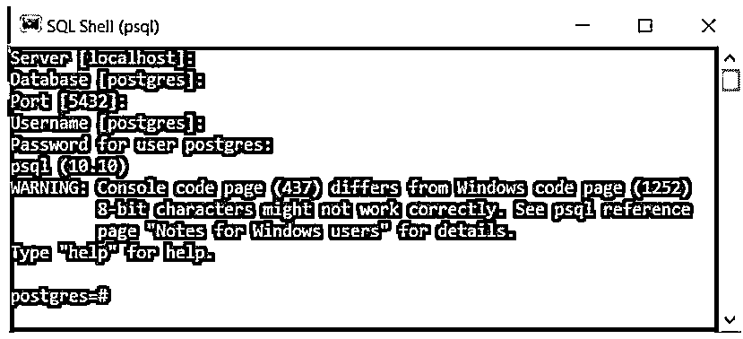

下面给出了各种元命令:

#### 1.命令列出 PostgreSQL 中所有可用的命令

“\？”command 返回 PostgreSQL 中可用的所有命令。

说明“\？”的结果命令，方法是使用以下快照。

**代码:**

`\?`

**输出:**

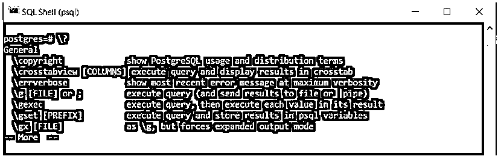

#### 2.命令来获取 PostgreSQL 的版本

' SELECT VERSION()'语句返回 PostgreSQL 的版本。

使用下面的快照说明“SELECT”命令的结果。

**代码:**

`SELECT VERSION();`

**输出:**

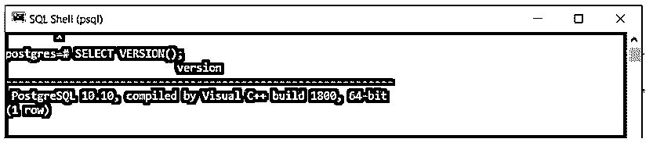

#### 3.命令列出所有可用的数据库

' \l '命令返回 PostgreSQL 中所有可用的数据库。

使用以下快照说明' \l '命令的结果。

**代码:**

`\l`

**输出:**

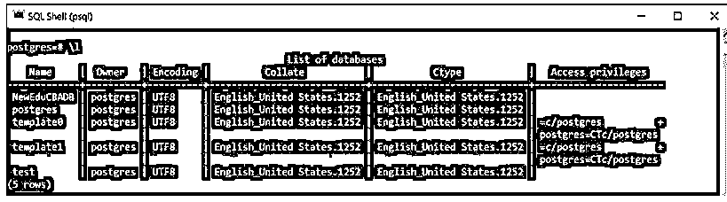

#### 4.PostgreSQL 数据库连接命令

该命令用于连接到数据库。

使用下面的快照说明上述命令的结果。

**代码:**

`-d NewEduCBADB -U postgres –W`

**输出:**

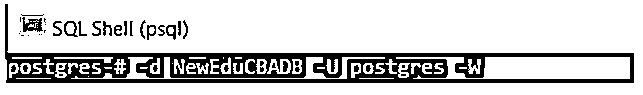

#### 5.将数据库连接切换到新数据库的命令

用于将连接切换到新数据库的' \c db_name [username]'命令。

使用下面的快照说明上述命令的结果。

**代码:**

`\c NewEduCBADB`

**输出:**

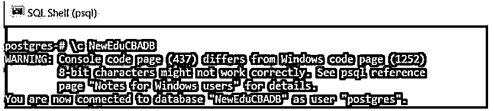

#### 6.列出当前数据库中所有表的命令

' \dt '命令返回当前数据库中的表。

使用下面的快照说明' \dt '命令的结果。

**代码:**

`\dt`

**输出:**

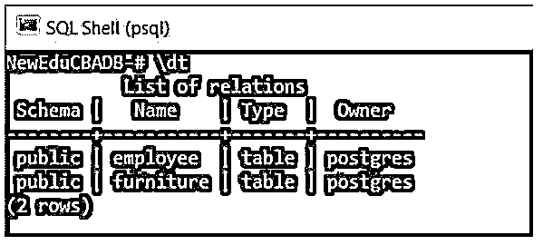

#### 7.描述表的命令

用于描述表的' \d table_name '命令。

使用下面的快照说明上述命令的结果。

**代码:**

`\d furniture`

**输出:**

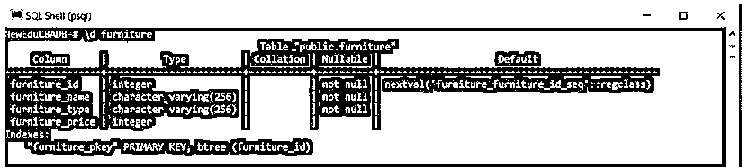

#### 8.列出可用模式的命令

用于列出当前数据库的所有模式的' \dn '命令。

使用下面的快照说明上述命令的结果。

**代码:**

`\dn`

**输出:**

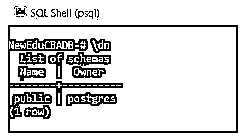

#### 9.列出可用功能的命令

用于列出当前数据库的所有函数的' \df '命令。

使用下面的快照说明上述命令的结果。

**代码:**

`\df`

**输出:**

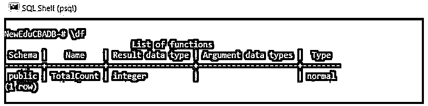

#### 10.列出可用视图的命令

用于列出当前数据库中可用视图的' \dv '命令。

使用下面的快照说明上述命令的结果。

**代码:**

`\dv`

**输出:**

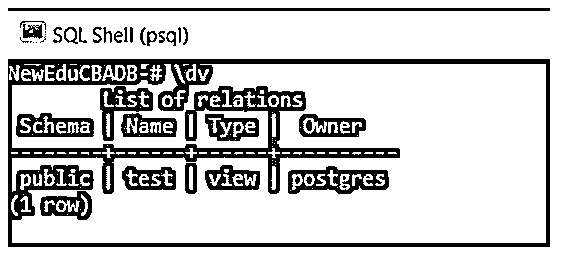

#### 11.列出用户及其角色的命令

用于列出所有用户及其角色的' \du '命令。

使用下面的快照说明上述命令的结果。

**代码:**

`\du`

**输出:**

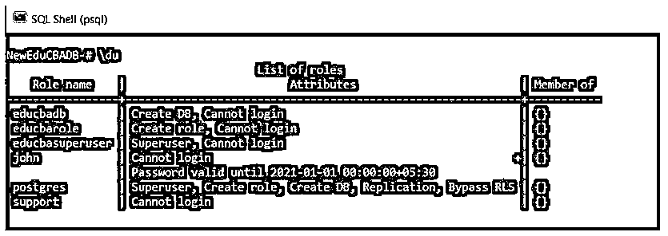

#### 12.查看完整历史的命令

1.  用于查看 PostgreSQL 中完整历史记录的' \s '命令。
2.  我们可以使用' \s filename '命令将历史记录保存在文件中。

#### 13.命令列出所有 SQL 命令

用于列出 PostgreSQL 中所有 SQL 命令的' \h '命令。

使用下面的快照说明上述命令的结果。

**代码:**

`\h`

**输出:**

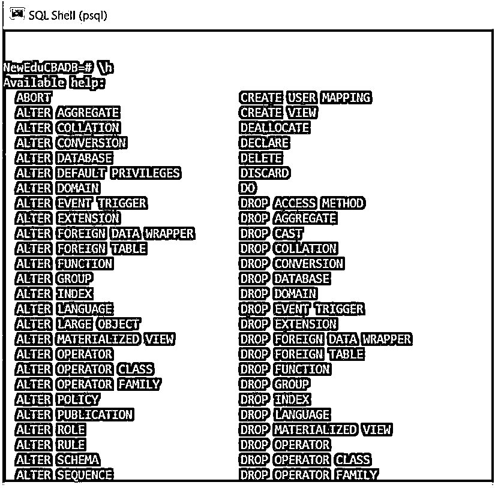

#### 14.命令来获取有关 psql 命令的帮助

如果我们想获得任何语句的详细信息，我们可以使用这个命令。

使用下面的快照说明该命令的结果。

**代码:**

`\h DROP TABLE`

**输出:**

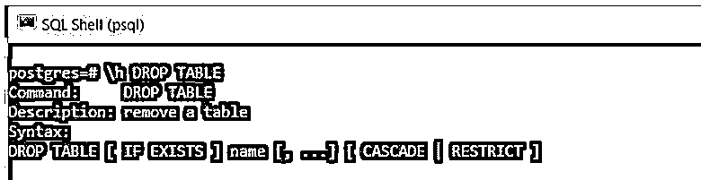

#### 15.命令来获取 SQL 查询的执行时间

用于获取 PostgreSQL 中 SQL 查询的执行时间的' \timing '命令。

使用下面的快照说明上述命令的结果。

**代码:**

`\timing`

**输出:**

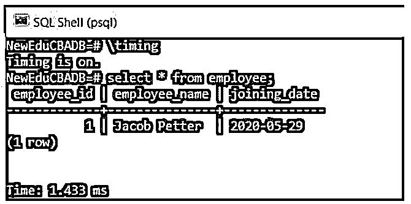

#### 16.执行前一个 psql 命令的命令

用于执行前一个命令的' \g '命令。

使用下面的快照说明上述命令的结果。
**代号:**

`\g`

**输出:**

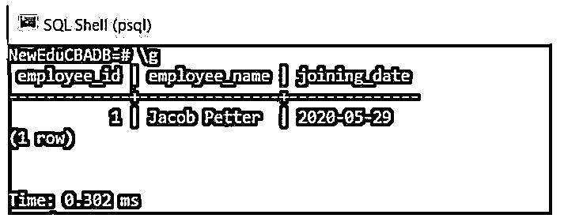

#### 17.命令在文本编辑器中使用 psql

用于在文本编辑器中打开最近执行的 SQL 查询的' \e '命令。我们可以在文本编辑器的查询中编辑它，并再次运行它。

使用下面的快照说明上述命令的结果。

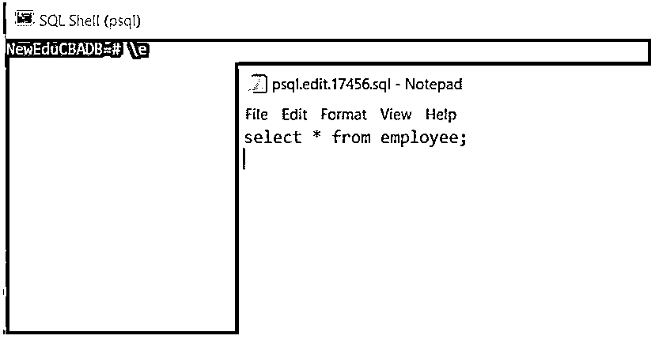

现在，我们将在文本编辑器中修改 SQL 查询，然后关闭文本编辑器。

使用下面的快照说明该步骤的结果。T3】

**第一步:**修改 SQL 查询。

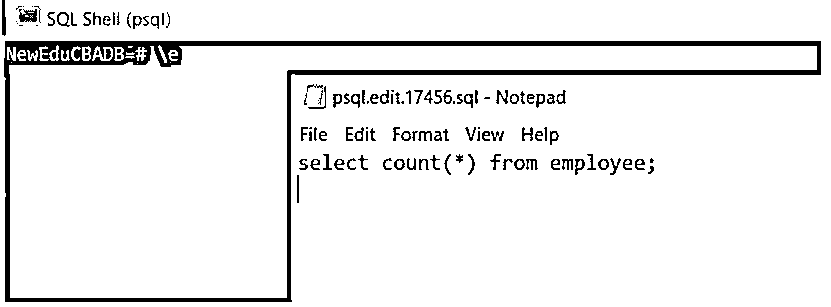

**第二步:**关闭文本编辑器。

**代码:**

`\e`

**输出:**

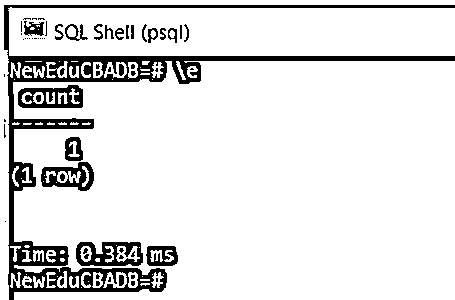

#### 18.将输出格式从对齐列切换到非对齐列的命令，反之亦然

命令' \a '用于将输出格式从对齐列切换到非对齐列，反之亦然。

我们将使用' \a '命令来切换输出格式。

使用下面的快照说明上述命令的结果。

**代码:**

`\a`

**输出:**

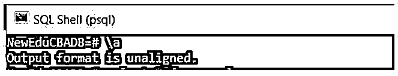

为了说明' \a '命令对输出格式更改的影响，我们将执行' select * from employee '命令并查看输出。

**代码:**

`select * from employee;`

**输出:**

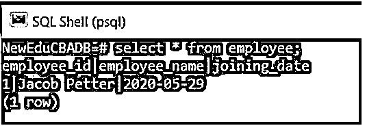

现在，我们将使用' \a '命令再次切换输出格式。

使用下面的快照说明上述命令的结果。

**代码:**

`\a`

**输出:**

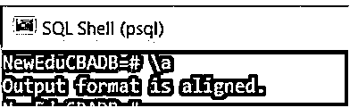

为了说明' \a '命令对输出格式更改的影响，我们将执行 select * from employee '命令并查看输出。

**代码:**

`select * from employee;`

**输出:**

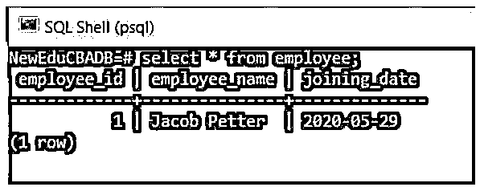

#### 19.将输出格式切换到 HTML 格式的命令

命令' \H '用于将输出格式化为 HTML 格式。

使用下面的快照说明上述命令的结果。

**代码:**

`\H`

**输出:**

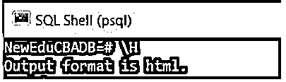

为了说明' \H '命令对输出格式更改的影响，我们将执行' select * from employee '命令并查看输出。

**代码:**

`select * from employee;`

**输出:**

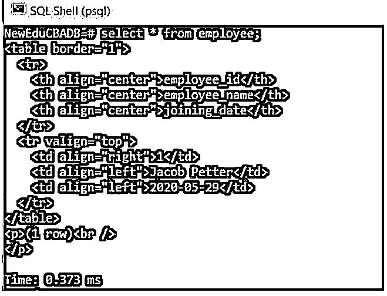

#### 20.在 PostgreSQL 中退出 psql 的命令

' \q '命令用于退出 PostgreSQL 中的 psql。

使用下面的快照说明上述命令的结果。

**代码:**

`\q`

**输出:**

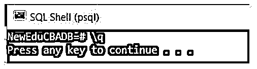

### 结论

在本文中，我们看到了如何使用 PostgreSQL 命令以及 PostgreSQL 命令是如何工作的。此外，我们还看到了几个 PostgreSQL 命令的例子。

### 推荐文章

这是 PostgreSQL 命令指南。这里我们讨论 PostgreSQL 命令的介绍，以及相应的命令列表和编程示例。您也可以看看以下文章，了解更多信息–

1.  [PostgreSQL CTE](https://www.educba.com/postgresql-cte/)
2.  [PostgreSQL 变量](https://www.educba.com/postgresql-variables/)
3.  [PostgreSQL 完全外部连接](https://www.educba.com/postgresql-full-outer-join/)
4.  [PostgreSQL 授权](https://www.educba.com/postgresql-grant/)