# PostgreSQL 运算符

> 原文：<https://www.educba.com/postgresql-operators/>

## PostgreSQL 运算符简介

PostgreSQL Operators 是一个数据库管理系统和开源软件，使公众能够方便地使用关系数据库。简单地说，关系数据库的目的实际上是数据的可管理性。

### PostgreSQL 运算符

下面是不同的 PostgreSQL 运算符，如下所示:

<small>Hadoop、数据科学、统计学&其他</small>

#### 1.逻辑运算符

在 PostgreSQL 中，逻辑运算符由通用运算符组成，即在 PostgreSQL 中，逻辑运算符用于执行如下所述的逻辑运算。

*   运筹学
*   和
*   不

##### 形容词（adjective 的缩写）OR 运算符

| **或** | 如果操作数的任一值为真，则运算符返回真。 |

*   作为逻辑传递的值可以在不同的组合中应用，以获得所需的结果。
*   所以让我们看看下面的真值表。
*   我们可以假设 0 为假，1 为真。因此，0 或 1 是 1，这基本上是正确的。
*   我们可以看到，OR 运算符只有在 X 和 Y 都为 FALSE 时才返回 FALSE (0)。

| **X** | **Y** | **X 或 Y** |
| Zero | Zero | Zero |
| Zero | One | One |
| One | Zero | One |
| One | One | One |

##### b.逻辑积算符

| **和** | 只有当所有操作数的值都为 TRUE 时，运算符才返回 TRUE。 |

*   与 OR 运算符不同，AND 运算符仅在 X 和 Y 都是 TRU **E.** 时返回 TRUE (1)

| **X** | **Y** | **X 和 Y** |
| Zero | Zero | Zero |
| Zero | One | Zero |
| One | Zero | Zero |
| One | One | One |

##### 碳（carbon 的缩写）“非”算符

| **不是** | 该运算符对操作数的初始值求反。如果操作数值为真，则返回假。 |

关于 NOT 操作符，逻辑是如果操作数为 TRUE，操作符返回 FALSE，反之亦然。

| **X** | **非(X)** |
| Zero | One |
| One | Zero |

#### 2.算术运算符/数学运算符

算术运算符执行特定的数学运算，如加、减等。在 PostgreSQL 中，算术运算符用于执行算术运算，如下所述。

| **操作员姓名** | **操作员** | **功能** | **例子** | **结果** |
| **加法** | + | 将操作数的值相加 | 10 +11 | Twenty-one |
| **减法** | – | 减去操作数的值 | 10 -11 | -1 |
| **乘法运算** | * | 对操作数执行乘法 | 10 * 11 | One hundred and ten |
| **分部** | / | 对操作数执行除法 | 10/5 | Two |
| 模块 | % | 执行除法，但将余数作为输出返回 | 11%10 | One |
| **求幂运算** | ^ | 这提供了所需操作数的幂值 | 10^2 | One hundred |
| **平方根** | &#124; / | 执行操作数的平方根运算 | &#124;/ 16 | Four |
| **立方根** | &#124; &#124; / | 执行操作数的立方根运算 | &#124;&#124;/64 | Four |
| **阶乘** | ! | 返回给定数字的阶乘(后缀形式) | 4! | Twenty-four |
| **阶乘(带前缀运算符)** | !! | 返回给定数字的阶乘(前缀形式) | ! ! Four | Twenty-four |

#### 3.按位运算符

为了理解按位运算符的功能，我们需要理解这些运算符只对积分有效，并且运算符的功能实际上是以操作数的二进制形式(用 0 和 1 表示)发生的。在 PostgreSQL 中，按位运算符用于执行按位运算符，如下所述。

| **操作员姓名** | **操作员** | **例子** | **结果** |
| **按位与** | “&”号 | 10 & 12 | Eight |
| **按位或** | &#124; | 10 &#124; 12 | Fourteen |
| **按位非** | ~ | ~10 | Five |
| **按位异或** | # | 10 # 12 | Six |
| **按位左移** | << | 10 << 2 | Forty |
| **按位右移** | >> | 100 >> 2 | Twenty-five |

#### 让我们以两个操作数为例:

*   10–二进制表示是 1010。
*   12–二进制表示是 1100。

下面参考操作数 10 和 12 如何被解释成它们的等价二进制形式。

10–二进制表示是 1010

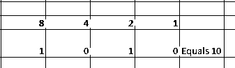

12–二进制表示是 1100

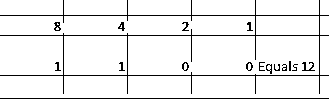

##### 形容词（adjective 的缩写）按位 AND 运算符

该运算符解释二进制表示形式的操作数，并对操作数的每个数字执行 and 函数。

**<u>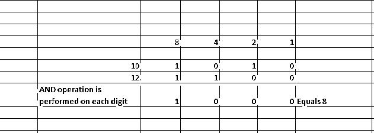

</u>** 

##### b.按位 OR 运算符

该运算符解释二进制表示形式的操作数，并对操作数的每个数字执行 or 函数。

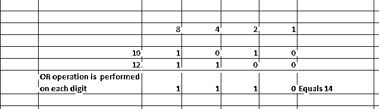

##### 碳（carbon 的缩写）按位非运算符

该运算符对操作数的每个数字执行求反运算。它一次只能接受一个操作数；因此它被称为一元运算符。

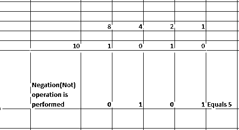

在上面的例子中，所有的 0 都被转换成 1，反之亦然。

##### d.按位异或运算符

该运算符解释二进制表示的操作数，并对操作数的每个数字执行 XOR 函数。

*   如果任一操作数为真或 1，XOR 函数返回真或 1
*   如果所有操作数都为真或所有操作数都为假，XOR 函数返回假或 0。

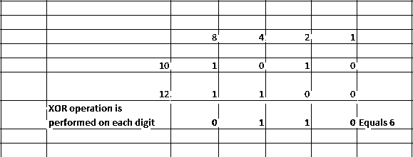

##### e.按位左移运算符

该运算符将给定数字的二进制表示形式的位向左移动指定的位数。假设指定的位数是 x，那么将 10 的每一位左移 x 位表示为 10 <

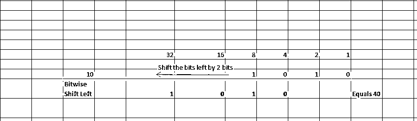

##### 氟（fluorine 的缩写）按位右移运算符

该运算符将二进制表示中给定数字的位向右移动指定的位数。假设指定的位数是 x，那么将 10 的每一位向右移动 x 位表示为 10 < <x.if x="" is="" then="">> 2 是 25。</x.if>

### 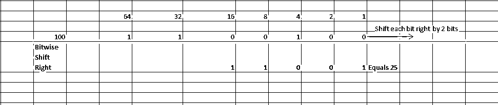

#### 4.比较运算符

比较运算符是解释表达式并提供布尔值输出的运算符。(对或错)。在 PostgreSQL 中，比较运算符用于执行比较运算符，如下所述。

下面显示了一些常用的比较运算符。

| **操作员** | **操作员姓名** |
| < | 不到一个操作者 |
| > | 大于运算符 |
| = | 等于 |
| <>或者！= | 不等于 |
| <= | 小于或等于运算符 |
| >= | 大于或等于运算符 |

##### 形容词（adjective 的缩写）运算符“< .”

该运算符比较给定的表达式，如果表达式中的第一个操作数小于第二个操作数，则返回 TRUE，否则返回 FALSE。

**<u>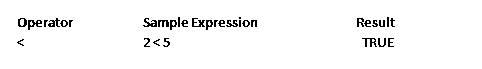

</u>** 

##### b.运算符“> .”

该运算符比较给定的表达式，如果表达式中的第一个操作数大于第二个操作数，则返回 TRUE，否则返回 FALSE。

**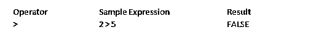

** 

##### 碳（carbon 的缩写）运算符“= .”

该运算符比较表达式中的操作数，如果两个操作数的值相同，则返回 TRUE，否则返回 FALSE。

<u>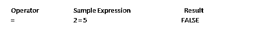

</u> 

##### d.运算符'<>'和'！=.'

该运算符比较表达式中的操作数，如果两个操作数的值不同，则返回 TRUE，否则返回 FALSE。

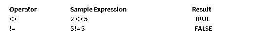

##### e.运算符“< = .”

如果第一个操作数的值小于或等于第二个操作数的值，则该运算符返回 TRUE。

<u>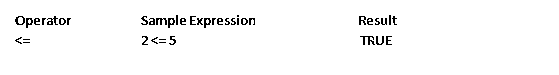

</u> 

##### 氟（fluorine 的缩写）运算符“> = .”

如果第一个操作数的值大于或等于第二个操作数的值，则该运算符返回 TRUE。

**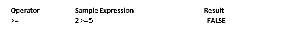

** 

### 推荐文章

这是 PostgreSQL 操作符的指南。我们讨论不同类型的 PostgreSQL 操作符，如算术操作符、比较操作符和逻辑操作符，以及带有示例的位操作符。您也可以阅读以下文章，了解更多信息——

1.  [MySQL 操作符](https://www.educba.com/mysql-operators/)
2.  [Oracle 和 PostgreSQL](https://www.educba.com/oracle-vs-postgresql/)
3.  [SQL Server vs PostgreSQL](https://www.educba.com/sql-server-vs-postgresql/)
4.  [具有特性的 PostgreSQL 版本](https://www.educba.com/postgresql-versions/)