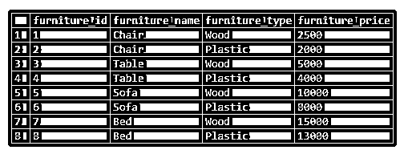
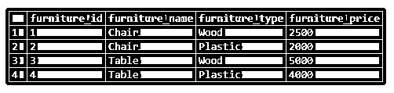
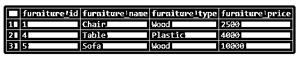
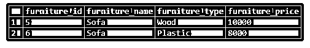
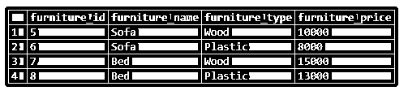

# PostgreSQL IN 运算符

> 原文：<https://www.educba.com/postgresql-in-operator/>

## 运算符中 PostgreSQL 的定义

PostgreSQL IN 运算符用于 WHERE 子句中。借助 in 运算符，我们可以减少 where 子句中写入的多个 OR 条件。PostgreSQL IN 运算符检查给定值是否存在于提供的值列表中。我们可以在 SELECT、UPDATE、INSERT 或 DELETE SQL 语句中使用 PostgreSQL IN 运算符。

**语法:**

<small>Hadoop、数据科学、统计学&其他</small>

PostgreSQL IN 运算符的语法如下:

`value IN (value1, value2, value3\. ...)`

**说明:**

表达式返回 true 或 false 如果该值存在于提供的值列表中，即 value1、value2 和 value3 等，则返回 true。

我们可以提供数字或字符串类型的值列表。我们还可以使用如下的 SELECT 语句从已定义的 SELECT 语句的结果集中检索值列表。

`value IN (SELECT value FROM table_name);`

**说明:**

括号中定义的 SQL 语句称为子查询。子查询是嵌套在另一个查询中的查询。

### PostgreSQL 中的 IN 运算符是如何工作的？

*   如果 PostgreSQL IN 运算符发现定义的值列表中是否存在任何值定义的 IN 条件，则返回 true。
*   如果 PostgreSQL IN 运算符没有找到任何存在的值，则返回 false。
*   如果我们使用带有 IN 运算符的子查询，那么它会在子查询的结果集中找到值；如果找到，则返回 true，否则返回 false。

### 在 PostgreSQL 中实现 IN 运算符的示例

为了理解示例，让我们创建一个名为“furniture”的表:

#### 示例 1–在表格中插入数据

`CREATE table furniture
(
furniture_id SERIAL PRIMARY KEY,
furniture_name VARCHAR (256) NOT null,
furniture_type VARCHAR (256) NOT null,
furniture_price int NULL
);`

现在，在家具表中插入一些数据，以便执行 SQL 语句。

`INSERT INTO furniture (furniture_name,furniture_type,furniture_price)
VALUES
('Chair','Wood',2500),
('Chair','Plastic',2000),
('Table','Wood',5000),
('Table','Plastic',4000),
('Sofa','Wood',10000),
('Sofa','Plastic',8000),
('Bed','Wood',15000),
('Bed','Plastic',13000);1`

借助下面的快照和 SELECT 语句说明上面语句的结果。

`SELECT * FROM furniture;`

#### 示例 2–带有字符值的 PostgreSQL

现在我们将演示 PostgreSQL IN 运算符与字符或字符串值的用法。我们已经定义了两个家具名称的列表，分别为“椅子”和“桌子”。在这里，我们发现家具表的 furniture_name 列中是否存在这些家具名称，并返回家具表的匹配记录，如下所示。

`SELECT *
FROM furniture
WHERE furniture_name IN ('Chair', 'Table');`

借助下面的快照说明上述语句的结果。

#### 示例# 3–带有数值的 PostgreSQL

现在，我们将演示 PostgreSQL IN 运算符在数值中的用法。我们已经定义了两种家具价格的列表，分别为 2500、4000、10000 等。在这里，我们发现家具表的 furniture_price 列中是否存在这些家具价格，并返回家具表的匹配记录，如下所示。

`SELECT *
FROM furniture
WHERE furniture_price IN (2500, 4000, 10000);`

借助下面的快照说明上述语句的结果。

#### 示例# 4–带有子查询的 PostgreSQL

现在我们将演示 PostgreSQL IN 操作符的使用，并编写子查询。我们编写了一个子查询，返回 furniture_name 为“Sofa”的家具价格。

`SELECT *
FROM furniture
WHERE furniture_price
IN (
SELECT
furniture_price
FROM
furniture
WHERE
furniture_name = 'Sofa'
);`

借助下面的快照说明上述语句的结果。

#### 示例 5–PostgreSQL IN with NOT

现在我们将演示 PostgreSQL NOT IN 运算符与字符或字符串值的用法。我们已经定义了两个家具名称的列表，分别为“椅子”和“桌子”。在这里，我们发现家具表的 furniture_name 列中是否存在这些家具名称，只有当它匹配并返回家具表的其他记录时，它才跳过该行，如下所示。

`SELECT *
FROM furniture
WHERE furniture_name NOT IN ('Chair', 'Table');`

借助下面的快照说明上述语句的结果。

### 结论

我们希望从上面的文章中，您已经理解了如何使用 PostgreSQL IN 以及 PostgreSQL IN 条件如何从值列表中查找存在。此外，我们还在 operator 中添加了一些 PostgreSQL 示例，以便更详细地理解它。

### 推荐文章

这是一个操作符中的 PostgreSQL 指南。这里我们讨论 PostgreSQL IN 操作符的定义和工作方式，以及不同的例子和代码实现。您也可以阅读以下文章，了解更多信息——

1.  [在 PostgreSQL 中创建数据库](https://www.educba.com/postgresql-database/)
2.  [PostgreSQL DISTINCT](https://www.educba.com/postgresql-distinct/)
3.  [PostgreSQL 视图](https://www.educba.com/postgresql-views/)
4.  [PostgreSQL 中的游标](https://www.educba.com/cursors-in-postgresql/)