# PostgreSQL 备忘单

> 原文：<https://www.educba.com/postgresql-cheat-sheet/>

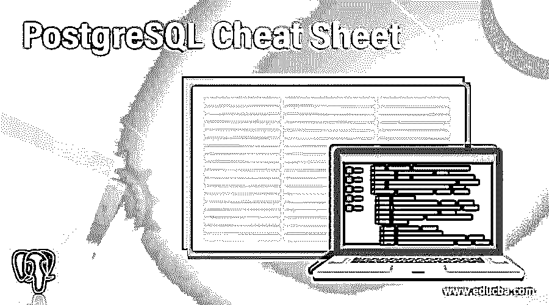

## PostgreSQL 备忘单介绍

PostgreSQL 备忘单被定义为如何使用 PostgreSQL 的基本命令，我们创建了 PostgreSQL 的基本备忘单来快速浏览 PostgreSQL 数据库。我们可以创建一个备忘单，比如如何列出数据库，如何列出表，如何列出所有用户，如何创建数据库，如何删除数据库，如何删除表。我们还可以检查特定用户如何访问特定数据库。

### PostgreSQL 备忘单

下面是备忘单的基本命令，用于概述 PostgreSQL 数据库。

<small>Hadoop、数据科学、统计学&其他</small>

#### 1.使用 psql 命令访问 PostgreSQL 服务器

下面是使用 psql 命令访问数据库服务器的语法和示例。

**语法**

`psql –U [username] –W [password] –d [database_name]`

**例子**

`psql -U postgres -W -d testing`

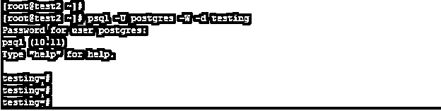

#### 2.连接到特定的数据库

下面是连接到特定数据库的语法和示例。我们已经连接到测试数据库。

**语法**

`\c name_of_database;`

**例子**

`\c testing;`

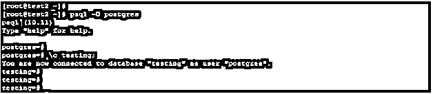

#### 3.检查 PostgreSQL 数据库的版本

下面是检查 PostgreSQL 版本的语法和示例。

**语法**

`select version();`

**例子**

`select version();`

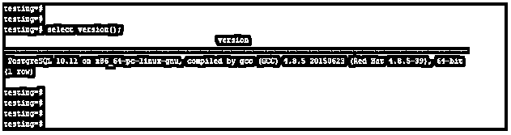

#### 4.列出 PostgreSQL 服务器中的所有数据库

下面是从数据库服务器检查所有数据库的语法和示例。

**语法**

`# \l       OR       \l+`

**例子**

`\l+`

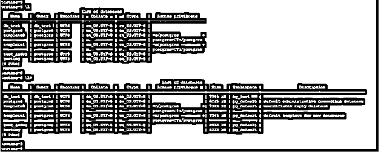

#### 5.列出 PostgreSQL 服务器中的所有模式

下面是从数据库服务器检查所有模式的语法和示例。

**语法**

`# \dn    OR       \dn+`

**例子**

`\dn
\dn+`

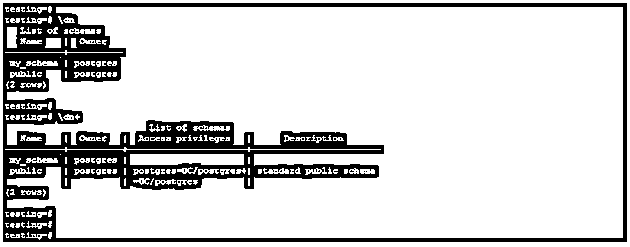

#### 6.列出 PostgreSQL 服务器中的所有表空间

下面是从数据库服务器检查所有表空间的语法和示例。

**语法**

`# \db    OR       \db+`

**例子**

`\db
\db+`

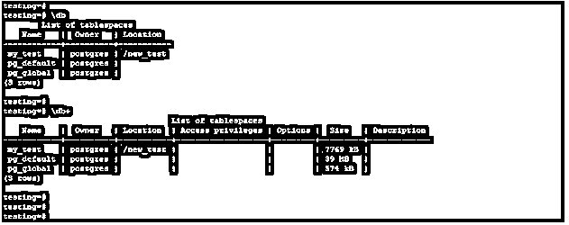

#### 7.列出 PostgreSQL 服务器中的所有索引

下面是从数据库服务器检查所有索引的语法和示例。

**语法**

`# \di     OR       \di+`

**例子**

`\di
\di+`

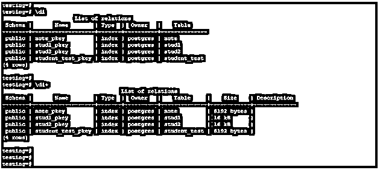

#### 8.列出特定数据库中的所有表

下面是检查特定数据库中所有表的语法和示例。

**语法**

`# \dt    OR       \dt+`

**例子**

`\dt
\dt+`

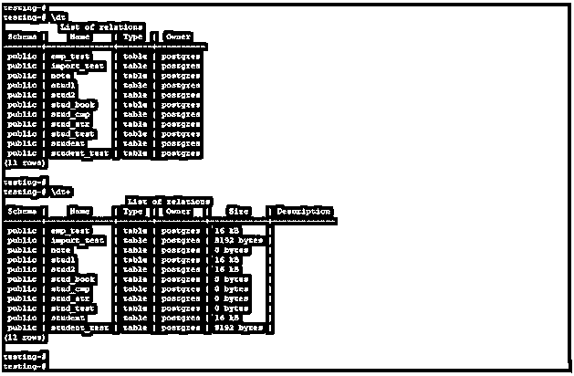

#### 9.列出 PostgreSQL 服务器中的所有序列

下面是从数据库服务器检查所有序列的语法和示例。

**语法**

`# \ds    OR       \ds+`

**例子**

`\ds
\ds+`

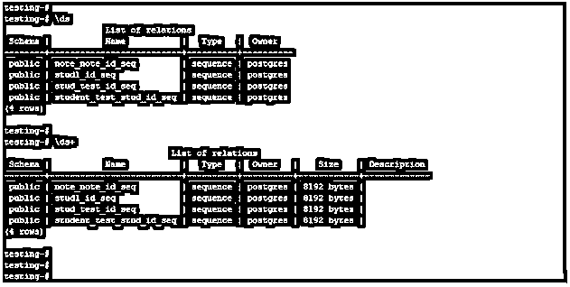

#### 10.列出 PostgreSQL 服务器中的所有视图

下面是从数据库服务器检查所有视图的语法和示例。

**语法**

`# \dv    OR       \dv+`

**例子**

`\dv
\dv+`

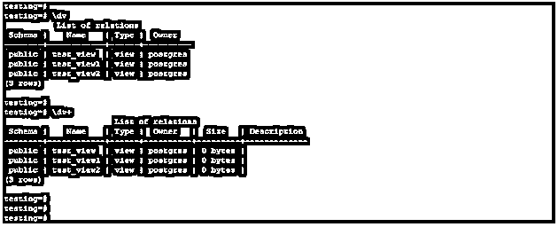

#### 11.列出 PostgreSQL 服务器的扩展名

下面是从数据库服务器检查扩展的语法和示例。

**语法**

`# \dx    OR       \dx+`

**例子**

`\dx
\dx+`

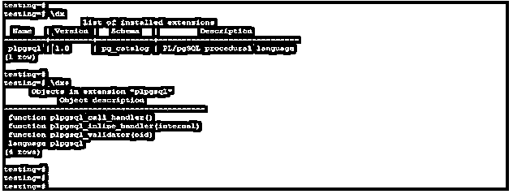

#### 12.显示数据库表的详细信息

下面是显示数据库表详细信息的语法和示例。

**语法**

`\d name_of_table;
\d+ name_of_table;`

**例子**

`\d stud1;
\d+ stud1;`

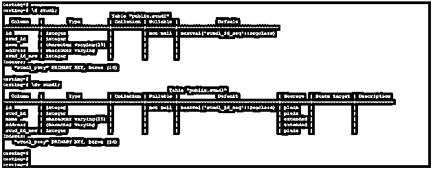

#### 13.在 PostgreSQL 中创建新用户

下面是在 PostgreSQL 中创建新用户的示例和语法。我们已经创建了一个测试用户。

**语法**

`Create user name_of_user;`

**例子**

`Create user test password 'abc@123';`

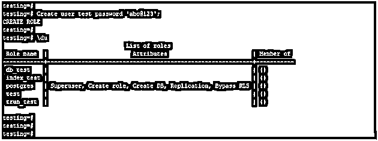

#### 14.在 PostgreSQL 中创建新数据库

下面是在 PostgreSQL 中创建新数据库的示例和语法。我们已经创建了一个测试数据库。

**语法**

`Create database name_of_database;`

**例子**

`Create database test;`

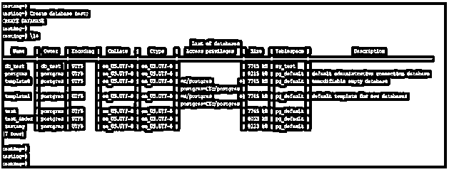

#### 15.在 PostgreSQL 中删除数据库

下面是在 PostgreSQL 中删除数据库的示例和语法。我们已经删除了测试数据库。

**语法**

`Drop database name_of_database;`

**例子**

`Drop database test;`

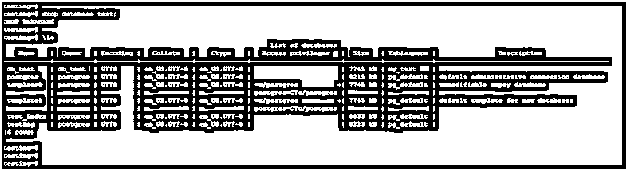

#### 16.在 PostgreSQL 中创建新表

下面是在 PostgreSQL 中创建新表的示例和语法。我们已经创建了一个测试表。

**语法**

`Create table name_of_table (name_of_column1 data_type, name_of_column1 data_type,name_of_column1 data_type, …, name_of_columnN data_type,);`

**例子**

`Create table test (id int, name varchar, address varchar, phone int);`

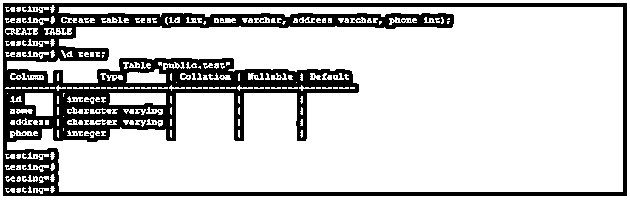

#### 17.在 PostgreSQL 中创建新视图

下面是在 PostgreSQL 中创建新视图的示例和语法。我们已经创建了一个测试视图。

**语法**

`Create view name_of_viewAS select column_name1, column_name2, column_name3, …, column_nameN from table_name;`

**例子**

`Create view test AS select * from stud1;`

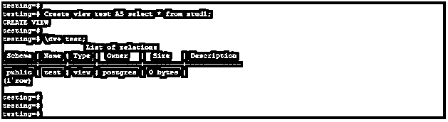

#### 18.在 PostgreSQL 中创建新索引

下面是在 PostgreSQL 中创建新索引的示例和语法。我们创建了一个 test_idx 索引。

**语法**

`Create index name_of_index AS on name_of_table (name_of_column);`

**例子**

`create index test_idx on stud1 (id);`

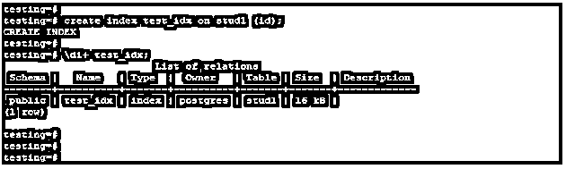

#### 19.删除 PostgreSQL 中的索引

下面是在 PostgreSQL 中删除索引的示例和语法。我们必须删除 test_idx 索引。

**语法**

`Drop index name_of_index;`

**例子**

`Drop index test_idx;`

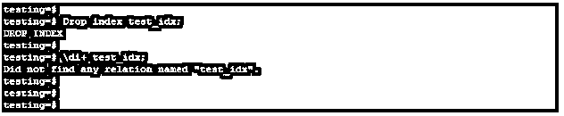

### 推荐文章

这是一个 PostgreSQL 备忘单指南。在这里，我们讨论备忘单的基本命令，以概述 PostgreSQL 数据库以及相应的查询示例。您也可以看看以下文章，了解更多信息–

1.  PostgreSQL 中的[数组](https://www.educba.com/array-in-postgresql/)
2.  [PostgreSQL 替换](https://www.educba.com/postgresql-replace/)
3.  [PostgreSQL 集群](https://www.educba.com/postgresql-cluster/)
4.  [PostgreSQL Trunc()](https://www.educba.com/postgresql-trunc/)