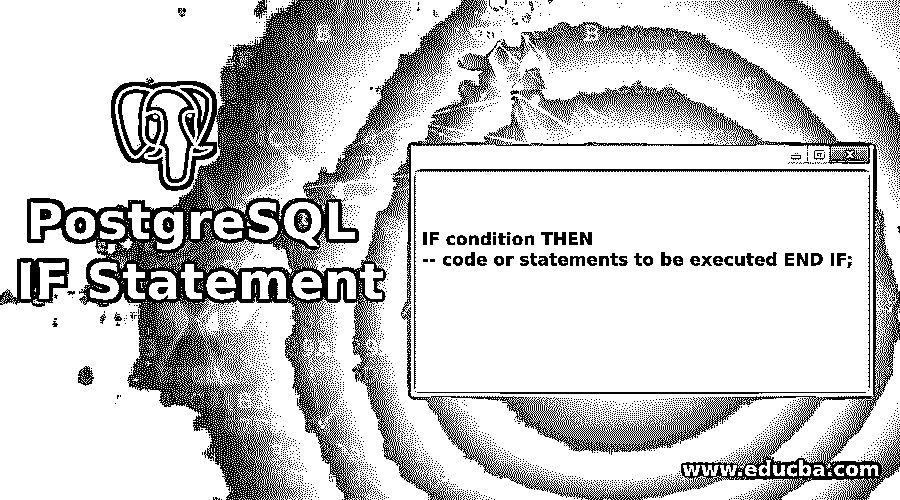
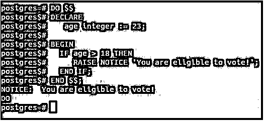
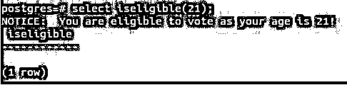
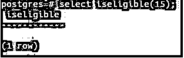
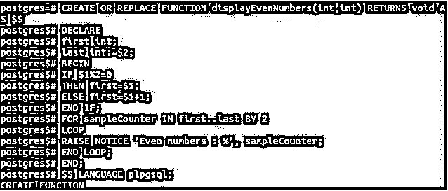
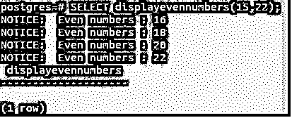

# PostgreSQL IF 语句

> 原文：<https://www.educba.com/postgresql-if-statement/>

## PostgreSQL IF 语句简介

任何 SQL 或数据库语言都提供了使用查询来控制数据库，并允许用户有效而有力地操作它。一些语句帮助用户更好地控制查询，并帮助基于 PostgreSQL 条件做出决策；这些语句被称为控制语句。其中最重要和最强大的是 if 语句。这条语句允许我们仅在满足某些条件时执行某些代码。在本文中，我们将学习 PostgreSQL 中 if 语句的一般语法，并借助一些例子了解其实际用法。

### 句法

`IF condition THEN
-- code or statements to be executed END IF;`

<small>Hadoop、数据科学、统计学&其他</small>

**说明:**条件是取值为 true 或 false 的布尔表达式。该条件可以是从变量比较到查询结果的任何表达式，也可以是返回布尔值的 isNull 语句或 exists 语句；如果该条件的计算结果为 true，则在执行 then 关键字后指定要执行的代码或语句。if 块的主体从 THEN 关键字开始，直到 IF 语句结束。如果条件的计算结果不为真，那么 If 块中的语句就会被跳过。这是 psql 中 if 语句的语法。

### PostgreSQL IF 语句如何工作？

**用法:**我们可以在函数、存储过程、DO 语句内部的语句序列或者与简单循环语句、for 循环、while 循环等循环一起使用这个 if 语句。将表达式与声明的变量、数字、字符串比较、查询结果以及任何返回布尔值(如 isnull、exists 等)的函数一起使用。

### 实现 PostgreSQL IF 语句的示例

让我们考虑一个简单的例子，我们将声明一个名为年龄的变量。如果年龄大于 18 岁，那么我们会以通知的形式提出一个消息，说“他/她有资格投票”。让我们看看如何在 do 语句的帮助下执行这个执行。

#### 示例#1

**代码:**

`DO $$ DECLARE
age integer := 23;
BEGIN
IF age > 18 THEN
RAISE NOTICE 'You are eligible to vote!';
END IF;
END $$;`

**输出:**

**解释:**DO 语句指定 Postgres 需要执行下面的语句。接下来是声明部分，我们声明名为 age 的变量，并将其初始化为 23 个整数值。然后我们开始 or 执行部分，在那里我们将放置 if 语句，在其中我们将检查年龄是否大于 18 岁；如果是这样的话，那就举个告示说:“你有资格投票！”.

#### 实施例 2

现在，让我们将变量初始化为一个小于 19 的值，例如 15，看看这是输出。然后输出如下所示:

**代码:**

`DO $$ DECLARE
age integer := 15;
BEGIN
IF age > 18 THEN
RAISE NOTICE 'You are eligible to vote!';
END IF;
END $$;`

**输出:**

``

 `**解释:**不发出通知，只是跳过 if 块中的语句执行。

#### 实施例 3

让我们编写一个函数，并尝试通过传递 age 变量来调用它们，而不是在上面的示例中静态声明和初始化:

**代码:**

`CREATE OR REPLACE FUNCTION iseligible(int) RETURNS void AS $$ DECLARE
age int:=$1;
BEGIN
IF age > 18 THEN
RAISE NOTICE 'You are eligible to vote as your age is %!', age; END IF;
END;
$$ LANGUAGE plpgsql;`

**输出:**

**解释:**这将创建一个名为 iseligible 的函数。每当我们想要传递您想要检查资格的年龄值时，我们都可以调用这个函数。在 psql 命令提示符终端上复制并粘贴上述语句后的输出如下。

#### 实施例 4

现在，我们要检查一个 21 岁小伙子的资格；然后我们可以用下面的方法调用我们的函数:

**代码:**

`SELECT iseligible(21);`

**输出:**

**解释:**这将显示通知以及我们的消息，这意味着 if 语句中的条件被评估为真，并且该块的主体是否被执行。

#### 实施例 5

现在，让我们用小于 19 的值来试一下，取 15。那么我们的号召声明将是:

**代码:**

`SELECT iseligible(15);`

**输出:**

#### 实施例 6

让我们举一个例子，在这个例子中，我们将使用一个 for 循环，并在其中使用 if 语句。我们必须检索传递给我们函数的两个数之间的所有偶数并打印出来。我们的功能将是这样的:

**代码:**

`CREATE OR REPLACE FUNCTION displayEvenNumbers(int,int) RETURNS void AS $$ DECLARE
first  int; last int:=$2; BEGIN
IF $1%2=0
THEN first=$1;
ELSE first=$1+1;
END IF;
FOR sampleCounter IN first..last BY 2 LOOP
RAISE NOTICE 'Even numbers : %', sampleCounter; END LOOP;
END;
$$ LANGUAGE plpgsql;`

**输出:**

如果函数创建成功，上面的函数将给出以下输出。

**解释:**这里，第一个参数将是起始数，第二个参数将是结束数，我们希望它们之间是偶数。我们将首先使用模数运算符和 if 语句检查起始数是偶数还是奇数。如果第一个参数是偶数，我们将把该值赋给“第一个”变量；否则，我们将为第一个参数值加 1，然后将该值赋给“第一个”变量。然后，我们将使用一个从“第一个”变量到“最后一个”变量的 for 循环，其中第二个参数的值被分配给“最后一个”变量，并且步长值将为 2，因为所有偶数在连续的偶数值之间的差值为 2。

#### 实施例 7

现在，我们可以使用下面的查询语句调用 displayevennumbers 函数来获取 15 到 22 之间的偶数。

**代码:**

`SELECT displayevennumbers(15,22);`

**输出:**

### 结论

If 语句是条件语句的最简单形式，可用于确定条件，当条件评估为 true 时，可基于该条件执行语句。如果语句可用于 do 语句、函数或存储过程，以及条件中提到的任何计算结果为布尔值的表达式的循环和查询语句。

### 推荐文章

这是一个 PostgreSQL IF 语句的指南。在这里，我们将讨论 PostgreSQL IF 语句的介绍、语法、工作原理以及代码和输出示例。您也可以浏览我们的其他相关文章，了解更多信息——

1.  [PostgreSQL 限制](https://www.educba.com/postgresql-limit/)
2.  [PostgreSQL 别名](https://www.educba.com/postgresql-alias/)
3.  [PostgreSQL ROLLUP](https://www.educba.com/postgresql-rollup/)
4.  PostgreSQL 函数|如何工作？
5.  [PostgreSQL 日志|前 9 个参数](https://www.educba.com/postgresql-log/)
6.  [PostgreSQL 集群|示例](https://www.educba.com/postgresql-cluster/)
7.  [SQL While 循环指南](https://www.educba.com/sql-while-loop/)`