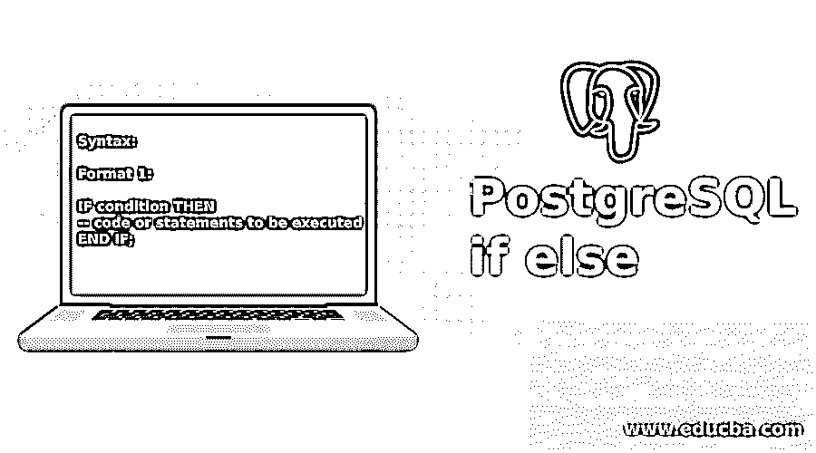
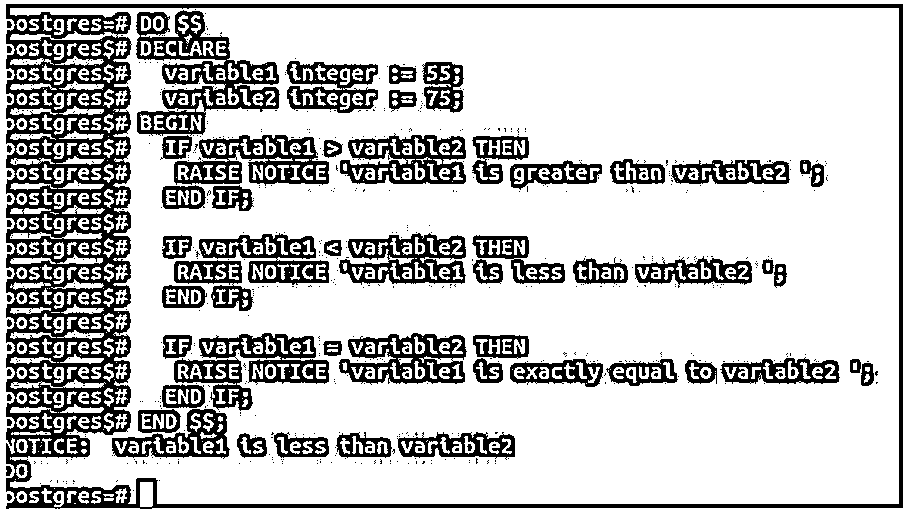
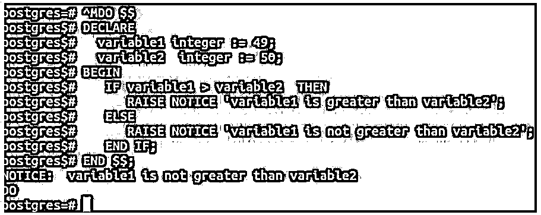
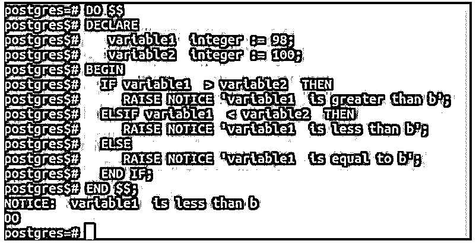
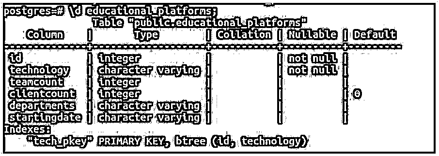
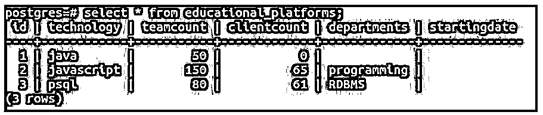
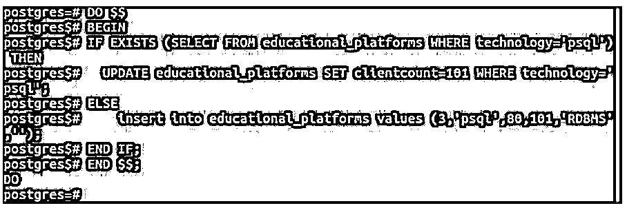
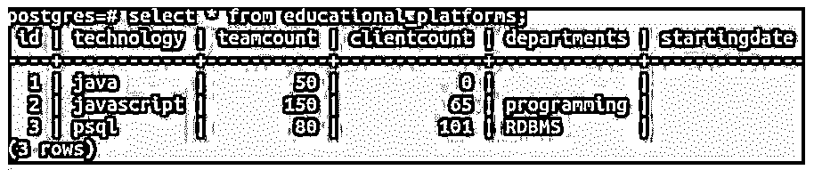

# PostgreSQL if else

> 原文：<https://www.educba.com/postgresql-if-else/>

## PostgreSQL if else 简介

使用这些查询可以控制数据库，并允许用户在任何 SQL 或数据库语言中有效而有力地操作它。一些语句帮助用户更好地控制查询，并帮助基于 PostgreSQL 条件做出决策；这些语句被称为控制语句。其中最关键和最强大的是 if-else 语句。这条语句允许我们仅在满足某些条件时执行某些代码。如果没有，那么可能会执行一些其他代码。

**语法:**

<small>Hadoop、数据科学、统计学&其他</small>

**格式一:**

`IF condition THEN
-- code or statements to be executed
END IF;`

**格式二:**

`IF condition THEN
-- code or statements to be executed
ELSE
-- code or statements to be executed
END IF;`

**格式三:**

`IF condition THEN
-- code or statements to be executed
ELSE IF THEN
-- code or statements to be executed
ELSE
-- code or statements to be executed
END IF;`

如果我们希望在满足某个条件的情况下执行某些语句，我们可以只使用 if 语句，或者我们可以使用第二种格式，在这种格式中，当条件评估为 true 以及当条件评估为 false 时，可以相应地执行我们的语句。在另一个 if 的 else 内部嵌套 if 也是可能的。这是一个完全可定制的结构，可以根据我们的方便和要求使用。

### PostgreSQL if else 的示例

下面是一些例子:

#### 示例#1

在我们的第一个例子中，我们将考虑两个变量，然后，使用上面提到的格式 1；我们将以这样一种方式编写语句，当变量 1 小于或大于或等于变量 2 时，在使用比较运算符对它们进行比较后，将发出一条适当的消息和通知。这里，将使用三个独立的 if 语句来实现我们的用例需求。

**代码:**

`DO $$
DECLARE
variable1 integer := 55;
variable2 integer := 75;
BEGIN
IF variable1 > variable2 THEN
RAISE NOTICE 'variable1 is greater than variable2 ';
END IF;
IF variable1 < variable2 THEN
RAISE NOTICE 'variable1 is less than variable2 ';
END IF;
IF variable1 = variable2 THEN
RAISE NOTICE 'variable1 is exactly equal to variable2 ';
END IF;
END $$;`

**输出:**

如您所见，因为 55 小于 75，所以显示消息“变量 1 小于变量 2”。这只能通过使用简单的 if 语句来实现。

#### 实施例 2

现在让我们考虑与示例 1 相同的示例，但是使用格式 2 来执行操作。格式 2 包含一个简单的 if，如果条件评估为 false，那么将执行 else 块。考虑两个变量 variable1 和 variable2，如果条件评估为真，我们将比较变量 1 是否大于变量 2，然后注意将出现变量 1 大于变量 2 的说法；否则，将执行 else 块中的语句，并在那里发出适当的通知。

**代码:**

`DO $$
DECLARE
variable1 integer := 49;
variable2 integer := 50;
BEGIN
IF variable1 > variable2 THEN
RAISE NOTICE 'variable1 is greater than variable2';
ELSE
RAISE NOTICE 'variable1 is not greater than variable2';
END IF;
END $$;`

**输出:**

正如我们所看到的，这里我们不能检查相等的条件。即使两个变量相等，也会显示消息，说明变量 1 不大于变量 2，这意味着它可以很小或相等。这个问题可以通过使用 if-else 的 format3 来解决，在这种情况下，我们可以将其他 if-else 或 if 语句嵌套到原始语句中的任意级别。

#### 实施例 3

现在，我们将使用 format3 实现与示例 1 和示例 2 相同的用例场景，并为这个数字比较用例应用最紧凑和最合适的解决方案。

**代码:**

`DO $$
DECLARE
variable1 integer := 98;
variable2 integer := 100;
BEGIN
IF variable1 > variable2 THEN
RAISE NOTICE 'variable1 is greater than b';
ELSIF variable1 < variable2 THEN
RAISE NOTICE 'variable1 is less than b';
ELSE
RAISE NOTICE 'variable1 is equal to b';
END IF;
END $$;`

首先，将检查变量 1 大于变量 2 的条件，如果不是，则转到 else if 块，在该块中将检查小于条件，如果两个条件的评估结果都为假，则将出现一条消息，通知两者相等。

**输出:**

当变量 1 和变量 2 分别有 98 和 100 个值时，情况如下。

#### 实施例 4

现在让我们看一个这些条件最常被使用的例子，也就是说，使用查询结果来指定条件。在我的数据库中有一个名为 educational_platforms 的表，使用下面的命令对它进行描述

**代码:**

`\d educational_platforms;`

**输出:**

如果没有，您可以创建一个。让我们看看表格的内容。

**代码:**

`select * from educational_platforms;`

**输出:**

如果使用 psql 技术的条目存在，我们必须将该条目的客户端数量更新为 100；否则，使用 psql 技术插入记录。下面是可以做到这一点的语句。

**代码:**

`DO $$
BEGIN
IF EXISTS (SELECT FROM educational_platforms WHERE technology='psql') THEN
UPDATE educational_platforms SET clientcount=101 WHERE technology='psql';
ELSE
insert into educational_platforms values (3,'psql',80,101,'RDBMS','');
END IF;
END $$;`

**输出:**

让我们再检查一下表格的内容。

**代码:**

`select * from educational_platforms;`

**输出:**

### 结论

我们可以在 PostgreSQL 数据库中方便地使用 if、if-else 和嵌套 if-else 语句来实现我们的用例需求。我们可以在函数、存储过程、变量、查询语句或循环语句中使用这些条件语句，只要我们想检查条件，并根据条件的输出执行一些语句。

### 推荐文章

这是一个 PostgreSQL if-else 的指南。在这里，我们讨论 PostgreSQL if-else 的介绍以及相应的示例，以便更好地理解。您也可以看看以下文章，了解更多信息–

1.  [PostgreSQL 触发器](https://www.educba.com/postgresql-triggers/)
2.  [PostgreSQL 管理](https://www.educba.com/postgresql-administration/)
3.  [PostgreSQL 别名](https://www.educba.com/postgresql-alias/)
4.  [PostgreSQL 滞后()](https://www.educba.com/postgresql-lag/)
5.  [PostgreSQL NOW 指南()](https://www.educba.com/postgresql-now/)
6.  [PostgreSQL 随机|示例](https://www.educba.com/postgresql-random/)
7.  [PostgreSQL 查询指南](https://www.educba.com/postgresql-queries/)