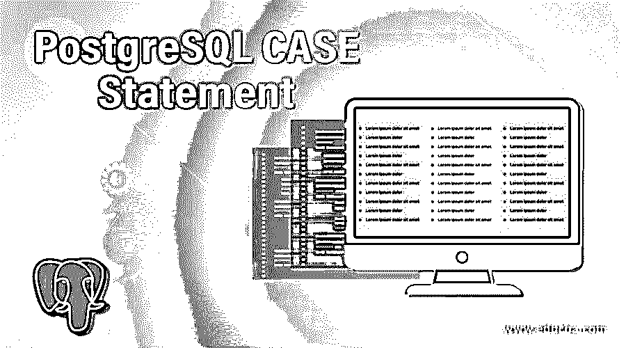
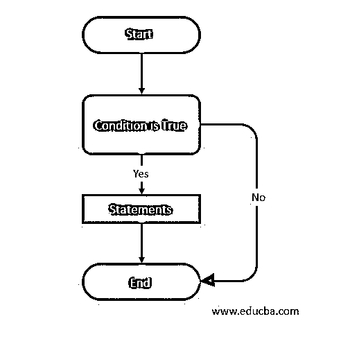
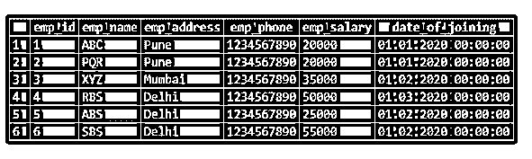
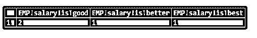

# PostgreSQL CASE 语句

> 原文：<https://www.educba.com/postgresql-case-statement/>

## PostgreSQL CASE 语句简介

PostgreSQL case 语句与 C 和 C++等其他语言中定义的 if-else 语句相同。PostgreSQL 提供了两种形式或类型的 case 语句，第一种是一般形式的 case 语句，第二种是简单形式的 case 语句。我们可以在 PostgreSQL 中使用 case 语句，使用 when 和 then 关键字，就像在其他编程语言中使用 if 和 else 一样。case 语句在 PostgreSQL 中对于形成条件表达式是有意义的；我们通过在 PostgreSQL 中使用 when 和 then 关键字来表述条件。

### 句法

下面是 case 语句的语法。

<small>Hadoop、数据科学、统计学&其他</small>

#### 1.一般情况表达式

下面的语法显示了一般的 case 表达式。

*   **案例**(开始案例陈述)
*   **WHEN** (当关键字用于制定条件时)condition_1 THEN(Then 关键字用于制定条件)result_1(第一个 case 语句的结果)
*   **WHEN** (当关键字用于制定条件时)condition_2 THEN(Then 关键字用于制定条件)result_2(第二个 case 语句的结果)
*   [WHEN …](我们可以在一个 case 语句中使用多个条件)
*   [ELSE result_n](如果 case 语句结果失败，则执行该语句)
*   **结束**(案件陈述结束)

#### 2.简单事例表达式

下面的语法显示了简单的 case 表达式。

*   **案例表达式**
*   **当**(当关键字用于制定条件时)value_1 THEN(Then 关键字用于制定条件时)
*   **result_1** (第一个 case 语句的结果)
*   **WHEN** (当关键字用于制定条件时)value_2 THEN(Then 关键字用于制定条件)
*   **result_2** (第二个 case 语句的结果)
*   **【WHEN…】**(我们可以在一个 case 语句中使用多个条件)
*   **否则**
*   **结果 _n**
*   **结束；**(案件陈述结束)

##### 参数

下面是上述语法的参数描述。

*   **case:** 我们可以在 PostgreSQL 中使用 Case 关键字开始 Case 语句。case 语句的主体将以 case 开始，以 end 关键字结束。
*   **When:** 当关键字用于制定 PostgreSQL 中 case 语句的条件时。
*   **然后:**然后用一个关键字来公式化 PostgreSQL 中 case 语句的条件。
*   **条件 1 和条件 2:** 我们可以使用条件语句来检索数据的结果。如果一个条件失败，触发器将转到第二个条件；如果为真，将显示所有条件的结果。
*   **结果 1 到结果 N:** 这是 PostgreSQL 中 case 语句的实际结果。
*   **Else:** Else 关键字用于定义 case 语句中的真或假条件。如果 case 语句条件为假，则 else 部分将执行；否则，它不会执行。
*   **End:** 我们可以使用 End 关键字来结束 PostgreSQL 中的 case 语句。case 语句的主体将以 case 开始，以 end 关键字结束。
*   **值 1 和值 2:** 值不过是 case 语句中的一个条件。

### 流程图

下图显示了 case 语句的流程图。

*   上面的流程图说明 case 语句以 case 或 start 关键字开始。通常我们使用 case 关键字来开始 case 语句。
*   之后，光标转到我们在语句中使用的条件。如果给定的条件为真，那么它将执行我们在 case 语句中编写的语句。
*   如果条件为假，则光标直接转到 end 语句。
*   在执行任何 case 语句之前，我们需要定义 case 语句的流程图。
*   该流程图只是我们在查询中使用的 case 语句的图形表示。
*   在 PostgreSQL 中创建 case 语句时，流程图是最重要和最有用的。

### PostgreSQL 中的 CASE 语句是如何工作的？

下面是工作:

*   When and then 关键字用于制定 case 语句的条件。
*   我们可以使用条件语句来检索数据的结果。如果一个条件失败，触发器将转到第二个条件；如果为真，将显示第一个条件的结果。条件表达式在 case 语句中显示结果是最重要的。
*   Else 关键字用于定义 case 语句中的真或假条件。如果 case 语句条件为假，则 else 部分将执行；否则，它不会在 PostgreSQL case 语句中执行。
*   我们可以在 PostgreSQL 中使用 case 关键字开始 case 语句，并以 end 关键字结束。case 语句的主体将以 case 开始，以 end 关键字结束。
*   PostgreSQL case 语句与另一种语言(如 C 和 C++)中定义的 if-else 语句相同。
*   在 PostgreSQL 中，case 语句对于制定条件表达式非常重要；我们通过使用 when 和 then 关键字来表述条件。
*   PostgreSQL 提供了两种形式或类型的 case 语句，第一种是一般形式的 case 语句，第二种是简单形式的 case 语句。
*   我们可以在 PostgreSQL 中使用 case 语句，使用 when 和 then 关键字，就像在其他编程语言中使用 if 和 else 一样。

### 实现 PostgreSQL CASE 语句的示例

下面是一些例子。我们已经用雇员表描述了 case 语句的例子。

**代码:**

`select * from employee;`

**输出:**

#### 1.通用 PostgreSQL case 表达式

以下示例显示了一般 PostgreSQL case 表达式。在这个例子中，我们找到了员工的好、更好和最好的工资。

**代码:**

`SELECT
SUM (CASE WHEN emp_salary = 20000 THEN 1
ELSE 0
END) AS "EMP salary is good",
SUM (CASE WHEN emp_salary = 35000 THEN 1
ELSE 0
END) AS "EMP salary is better",
SUM (CASE WHEN emp_salary = 55000 THEN 1
ELSE 0
END) AS "EMP salary is best"
FROM Employee;`

**输出:**

#### 2.简单的 PostgreSQL case 表达式

以下示例显示了一个简单的 PostgreSQL case 表达式。在这个例子中，我们找到了员工的好、更好和最好的工资。

**代码:**

`SELECT
SUM (CASE emp_salary WHEN 20000 THEN 1
ELSE 0
END) AS "EMP salary is good",
SUM (CASE emp_salary WHEN 35000 THEN 1
ELSE 0
END) AS "EMP salary is better",
SUM (CASE emp_salary WHEN 55000 THEN 1
ELSE 0
END) AS "EMP salary is best"
FROM Employee;`

**输出:**

### 结论

When and then 关键字用于制定 case 语句的条件。case 语句与另一种语言(如 C 和 C++)中定义的 if-else 语句相同。我们可以在 PostgreSQL 中用 case 关键字开始 case 语句，用 end 关键字结束。

### 推荐文章

这是一个 PostgreSQL CASE 语句的指南。这里我们讨论 PostgreSQL CASE 语句的语法，以及相应的流程图和例子。您也可以浏览我们的其他相关文章，了解更多信息——

1.  [PostgreSQL 偏移量](https://www.educba.com/postgresql-offset/)
2.  [PostgreSQL 自然连接](https://www.educba.com/postgresql-natural-join/)
3.  [PostgreSQL 子查询](https://www.educba.com/postgresql-subquery/)
4.  [PostgreSQL 提交](https://www.educba.com/postgresql-commit/)
5.  [PostgreSQL 查询示例](https://www.educba.com/postgresql-queries/)