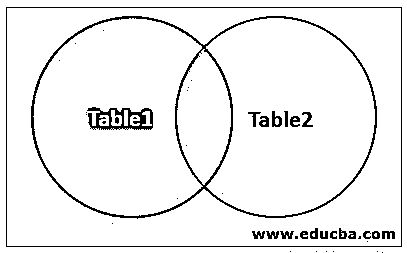
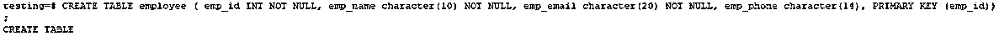
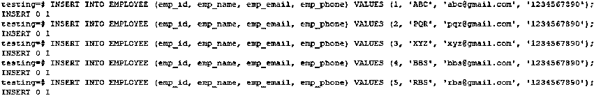
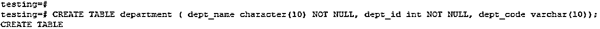
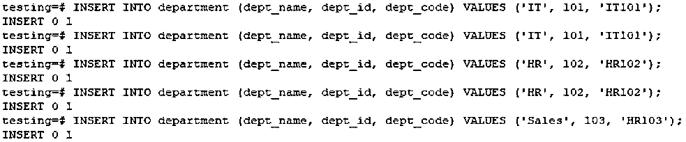
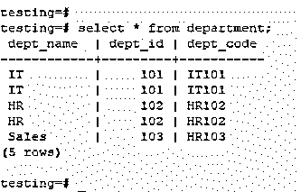
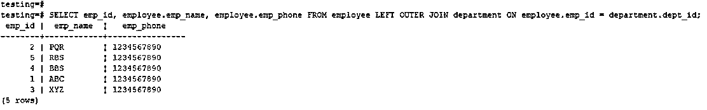
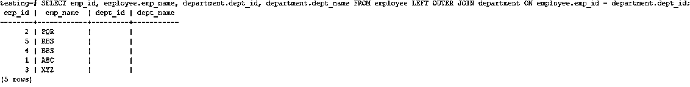

# PostgreSQL 中的左外连接

> 原文：<https://www.educba.com/left-outer-join-in-postgresql/>

## PostgreSQL 左外连接介绍

左外连接也称为左连接，它将从左表中检索所有行，从右表中检索所有匹配的行，也从两个表中检索所有匹配的记录，如果我们想从第一个表中提取所有记录，而不需要第二个表中的任何记录，那么我们创建左连接第二个表，例如该列有空值， 左连接或左外连接是 PostgreSQL 中最重要的连接类型， [PostgreSQL 左连接](https://www.educba.com/postgresql-left-join/)来自 PostgreSQL 外连接，它是 PostgreSQL 外连接的类型。

**语法**

<small>Hadoop、数据科学、统计学&其他</small>

左连接将从左表中检索所有行，并从右表中检索匹配记录。

下面是左外部连接的语法如下:

**语法#1**

`Select columns from table_name1 LEFT OUTER JOIN table_name2 on table_name1.column = table_name2.column;`

**语法#2**

`SELECT (*) FROM table_name1 LEFT OUTER JOIN table_name2 on table_name1.column = table_name2.column;`

### PostgreSQL 中左外连接的使用

下图显示了 PostgreSQL 中左外部连接的虚拟表示:

**上图说明:**

*   当使用左外部连接来连接表时，PostgreSQL 首先执行普通连接，然后从左表开始扫描。
*   PostgreSQL left join 从左表中检索所有行，从右表中检索所有匹配行。如果两个表都不匹配，则右边的表具有空值。
*   以上左连接的图像表示显示了从表 1 中检索所有行并从表 2 中匹配行的过程。
*   PostgreSQL 左连接两个表并根据使用条件获取数据行，从两个表中匹配也从连接子句前的表中获取不匹配的行。
*   我假设 ABC 表有一个带连接条件的 PQR 表的左连接(我们认为 ABC 是左表，PQR 是右表)。
*   PostgreSQL 左加入 ABC 表依赖于 PQR 表。此外，所有表都依赖于 ABC，而 ABC 依赖于除表 PQR 之外的所有正在使用左连接条件的表。
*   左连接条件将决定如何从 PQR 表中检索行。

在这种情况下，PostgreSQL 中将显示 ABC 和 PQR 表的输出值如下:

1.  它将从 ABC 表中提取所有选定的值。
2.  该值将与 PQR 表中的列名相结合。
3.  从关联的(右表)表中检索所有匹配的行。
4.  然后将右表(PQR 表)中每一列的值设置为 null，这与 ABC 表不匹配。

*   PostgreSQL 左连接也称为左外连接。它将从左表中获取所有记录，并从右表中获取匹配的记录。如果右边的表有空值，则不会出现匹配记录。
*   PostgreSQL left join 用于在单个查询中从多个表中选择数据。
*   使用 PostgreSQL left join 从多个表中检索数据，我们需要在第一个表上有主键约束，在第二个表上有外键约束。
*   PostgreSQL 左外连接与 SQL 语言中的左连接相同。
*   PostgreSQL 左连接以 [PostgreSQL 外连接](https://www.educba.com/postgresql-outer-join/)的类型出现。

PostgreSQL 外部连接有三种类型:

1.  左外部联接或左联接
2.  右外部联接或右联接
3.  完全外部联接。

*   PostgreSQL 中的 In left outer join 或 left join 将返回表 1 中的所有记录，并且只返回表 2 中的匹配或相交记录。
*   PostgreSQL 左连接或左外连接用于从一个表中检索所有数据，并从第二个表中检索匹配记录。

### 实现左外连接的示例

以下是左外部联接的示例。我们使用雇员和部门表来描述 PostgreSQL 中的左连接。

#### 示例#1

创建一个雇员和部门表，并将数据插入其中

**代码:**

`CREATE TABLE employee ( emp_id INT NOT NULL, emp_name character(10) NOT NULL, emp_email character(20) NOT NULL, emp_phone character(14), PRIMARY KEY (emp_id));`

**输出:**

**代码:**

`INSERT INTO EMPLOYEE (emp_id, emp_name, emp_email, emp_phone) VALUES (1, 'ABC', 'abc@gmail.com', '1234567890');
INSERT INTO EMPLOYEE (emp_id, emp_name, emp_email, emp_phone) VALUES (2, 'PQR', 'pqr@gmail.com', '1234567890');
INSERT INTO EMPLOYEE (emp_id, emp_name, emp_email, emp_phone) VALUES (3, 'XYZ', 'xyz@gmail.com', '1234567890');
INSERT INTO EMPLOYEE (emp_id, emp_name, emp_email, emp_phone) VALUES (4, 'BBS', 'bbs@gmail.com', '1234567890');
INSERT INTO EMPLOYEE (emp_id, emp_name, emp_email, emp_phone) VALUES (5, 'RBS', 'rbs@gmail.com', '1234567890');`

**输出:**

**代码:**

`CREATE TABLE department ( dept_name character(10) NOT NULL, dept_id int NOT NULL, dept_code varchar(10));`

**输出:**

**代码:**

`INSERT INTO department (dept_name, dept_id, dept_code) VALUES ('IT', 101, 'IT101');
INSERT INTO department (dept_name, dept_id, dept_code) VALUES ('IT', 101, 'IT101');
INSERT INTO department (dept_name, dept_id, dept_code) VALUES ('HR', 102, 'HR102');
INSERT INTO department (dept_name, dept_id, dept_code) VALUES ('HR', 102, 'HR102');
INSERT INTO department (dept_name, dept_id, dept_code) VALUES ('Sales', 103, 'HR103');`

**输出:**

**代码:**

`select * from department;`

**输出:**

#### 实施例 2

在雇员和部门表之间创建左连接

**代码:**

`SELECT emp_id, employee.emp_name, employee.emp_phone FROM employee LEFT OUTER JOIN department ON employee.emp_id = department.dept_id;`

**输出:**

**代码:**

`SELECT emp_id, employee.emp_name, department.dept_id, department.dept_name FROM employee LEFT OUTER JOIN department ON employee.emp_id = department.dept_id;`

**输出:**

**上表说明:**

*   在上表中，我们必须连接雇员和部门表。在第一个示例中，将显示 employee 表中的所有记录。在第二个示例中，employee 和 department 表中没有匹配的记录，显示一个空集。
*   上面的示例使用相同的从同一个表中检索不同的输出。
*   在我们的例子中，employee 表已经离开了这个表，department 表是右边的表。
*   我们使用雇员表作为 id 列，部门表作为 dept_id 列来连接表。
*   左连接的第二个示例在从一个表中选择数据时很有用，并且在第二个表中没有匹配项。

### 结论

左连接是 PostgreSQL 中最重要的连接类型。左连接将从左表中获取所有行，并从右表中获取匹配的行。我们需要第一个表上的主键来检索使用 PostgreSQL 左连接或左外连接连接两个表的数据。

### 推荐文章

这是一个关于 PostgreSQL 中左外连接的指南。在这里，我们讨论了左外连接的基本概念、语法、工作原理，并借助图表和相应的例子来实现左外连接。您也可以浏览我们的其他相关文章，了解更多信息——

1.  [SQL 中的 IF ELSE 语句](https://www.educba.com/if-else-statement-in-sql/)
2.  [SQL 外部连接的前 4 种类型](https://www.educba.com/sql-outer-join/)
3.  [如何运行 PostgreSQL INTERSECT？](https://www.educba.com/postgresql-intersect/)
4.  [Oracle 中的外部连接](https://www.educba.com/outer-join-in-oracle/)
5.  [SQL 左连接|示例](https://www.educba.com/sql-left-join/)