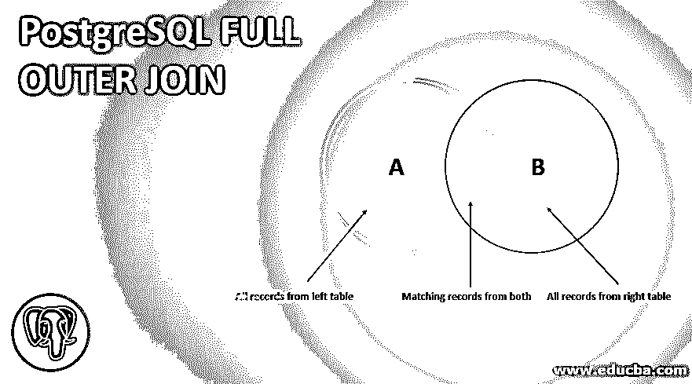
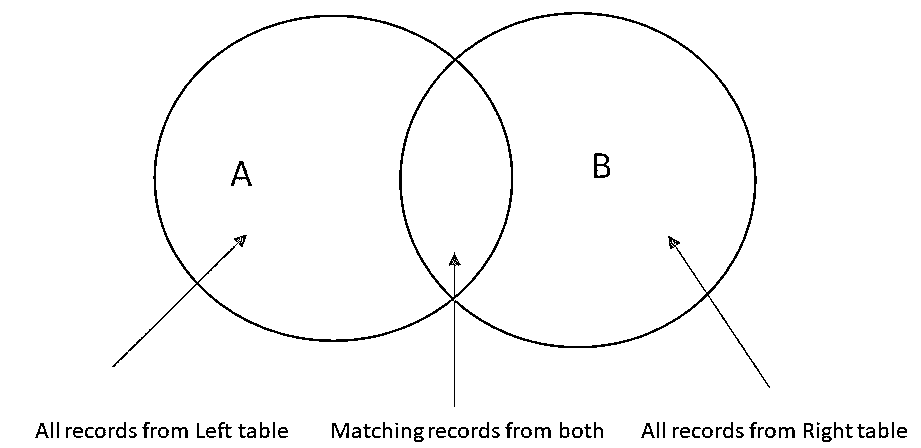
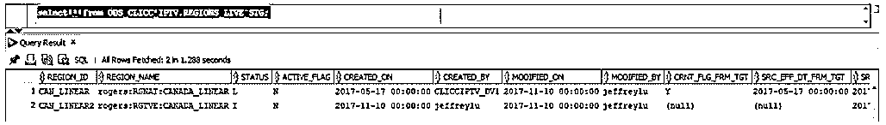
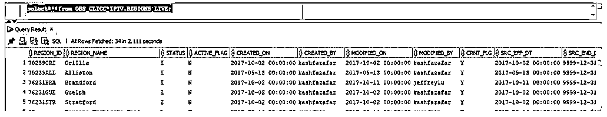
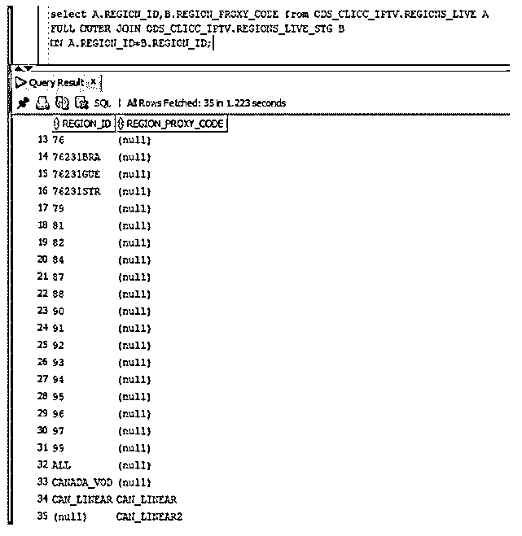
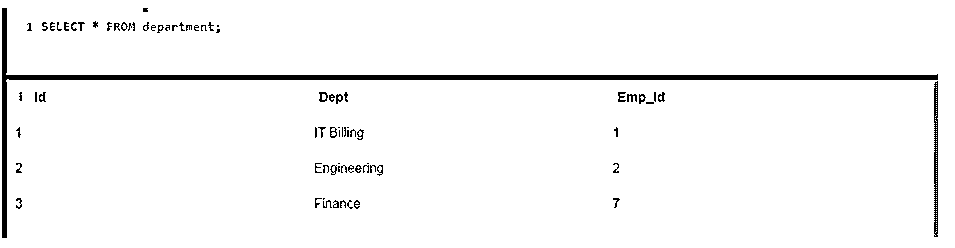
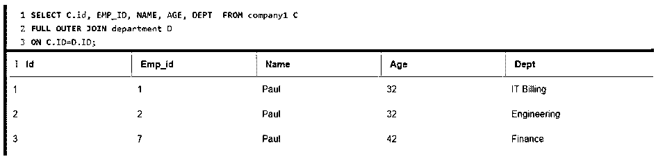
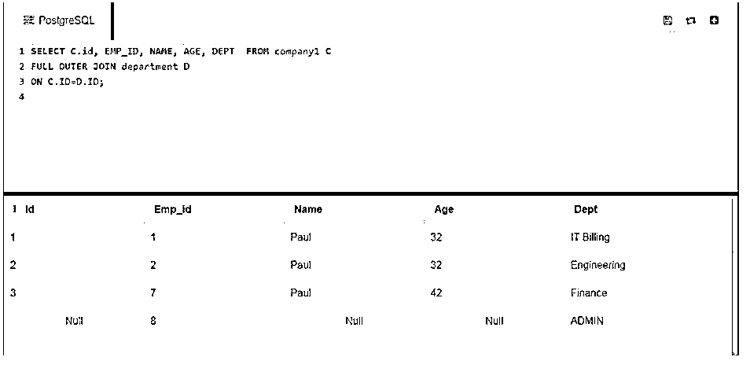

# PostgreSQL 完全外部连接

> 原文：<https://www.educba.com/postgresql-full-outer-join/>

## PostgreSQL 全外部连接简介

PostgreSQL 完全外连接是一种同时给出左表和右表数据的连接。这意味着当我们连接两个表并试图从它们中获取数据时，这个连接会从两个表中获取记录。对于没有匹配行的表的每一列，不匹配的值被设置为空值。这适用于左表和右表。如果左表值与右表不匹配，它们将被标记为 null，同样，如果它们与右表不匹配，它们在右表中将为 null。

**语法:**

<small>Hadoop、数据科学、统计学&其他</small>

`SELECT table1.columns, table2.columns
FROM table1
FULL OUTER JOIN table2
ON table1.common_filed = table2.common_field;`

该语法采用两个要匹配的表。它从两个表中选择所需的列。这里的第一个表通过使用完全外部连接与另一个表连接。关键字“OUTER”在这里是可选的。此后，给出了这些行匹配的条件。连接是基于匹配的行完成的。首先获取匹配的行。那么第一个表中与条件不匹配的行将具有空值。类似地，如果第二个表没有匹配的行，那么相同的表将采用 null 值。

### PostgreSQL 全外连接是如何工作的？

借助上面的文氏图，我们可以看到完整的外部连接是如何工作的。圆圈 A 表示左边的桌子。圆圈 B 表示右边的桌子。两个圆相交的区域表示两个表中匹配的行；无论何时运行下面的语句，编译器都会进行如下处理。

**代码:**

`SELECT A.columns, B.columns
FROM A
FULL OUTER JOIN B
ON A.common_filed = B.common_field;`

当该查询被触发时，首先选择表 A 和 B 的所有列。检查左外部连接条件，并选择与该条件匹配的行。这表示维恩图的相交区域。这些成为结果集的一部分。然后，它将从左边的表中获取所有记录，即。

右表 B 中的相应行将采用空值，因为它们不匹配。类似地，在左表之后，将获取右表 B 中的所有行，而左表 A 中的相应行将获取空值，因为它们不匹配。查询的最终结果将是两个表中的所有行。匹配记录、左表中的所有记录和右表中的所有记录，对于不匹配的行，这些记录具有空值。

### PostgreSQL 全外部连接示例

下面是一些例子:

#### 示例#1

我们有两张表，ODS_CLICC_IPTV。REGIONS_LIVE 和 ODS_CLICC_IPTV。REGIONS_LIVE_STG 该表包含区域 ID、区域名称、状态等列。

**代码:**

`select * from ODS_CLICC_IPTV.REGIONS_LIVE_STG;`

**输出:**

上表显示了指定阶段表中的不同列–ODS _ CLICC _ IPTV。REGIONS_LIVE_STG

**代码:**

`select * from ODS_CLICC_IPTV.REGIONS_LIVE;`

**输出:**

上表显示了指定主表中的不同列–ODS _ CLICC _ IPTV。地区 _ 直播。

我们现在对上面两个表应用完全外连接。阶段表的行是 2 行，主表的行是 34 行。

**代码:**

`select A.REGION_ID,B.REGION_PROXY_CODE from ODS_CLICC_IPTV.REGIONS_LIVE A
FULL OUTER JOIN ODS_CLICC_IPTV.REGIONS_LIVE_STG B
ON A.REGION_ID=B.REGION_ID;`

上面的代码获取所有行作为结果。如果您检查上述查询的输出，这里的行数是 35 行。在这里，首先获取左侧表中的所有行。然后，获取第 34 行匹配的公共行。最后，取右表中的行。

来自左表并且在右表中没有任何对应值的所有行都被标记为 null。类似地，右表的最后一行没有对应的 REGION_ID。因此，它在这里被标记为空。表 A 中的所有行、表 A 和 B 中的公共行以及表 B 中的一行构成 35 行。

**输出:**

#### 实施例 2

**代码:**

`CREATE TABLE COMPANY1(
ID INT PRIMARY KEY     NOT NULL,
NAME           TEXT    NOT NULL,
AGE            INT     NOT NULL,
ADDRESS        CHAR(50),
SALARY         REAL
);`

`SELECT * FROM company1;`

**输出:**

我们将创建另一个表格部门。

**代码:**

`CREATE TABLE DEPARTMENT(
ID INT PRIMARY KEY      NOT NULL,
DEPT           CHAR(50) NOT NULL,
EMP_ID         INT      NOT NULL
);`

`SELECT * FROM department;`

**输出:**

上面是创建的两个表的结构。

如果您在这个示例中查看，这两个表之间有一个公共的“id”列。让我们把这两张表连接起来，检查一下我们得到的结果。

**代码:**

`select C.id, EMP_ID, NAME, AGE, DEPT  from company1 C
FULL OUTER JOIN department D
ON C.ID=D.ID;`

**输出:**

这里两个表的所有列都是匹配的。两个表中的公共列具有相似的值。因此，结果中没有空值。结果与内部连接结果一样好。尽管我们使用了完全外连接，但结果类似于内连接。因此，这里的行数类似于表中的行数。

现在让我们在 department 表中插入另一行，并再次运行查询。

**代码:**

`INSERT INTO DEPARTMENT (ID, DEPT, EMP_ID)
VALUES (4, 'ADMIN', 8 );`

在部门表中插入此行后，结果将会改变。

**代码:**

`select C.id, EMP_ID, NAME, AGE, DEPT  from company1 C
FULL OUTER JOIN department D
ON C.ID=D.ID;`

**输出:**

如果您看到上面的代码片段，您将看到所有公司表值都存在空值。在 EMPID 和 Dept 上填充。由于 select 语句从 company 表中获取 ID 列，并且 company 表中没有 ID 为 4 的列，因此该值被填充为 null。

### 结论

因此，左外部连接有助于组合两个表的结果。如果没有匹配的记录，即使这样，它也会从两个表中获取记录，并在适当的地方填充空值。

### 推荐文章

这是一个关于 PostgreSQL 全外连接的指南。在这里，我们讨论介绍，如何 PostgreSQL 完全外连接工程和例子。您也可以看看以下文章，了解更多信息–

1.  [PostgreSQL 布尔值](https://www.educba.com/postgresql-boolean/)
2.  [PostgreSQL RANK()](https://www.educba.com/postgresql-rank/)
3.  [PostgreSQL 不为空](https://www.educba.com/postgresql-not-null/)
4.  [PostgreSQL 通知](https://www.educba.com/postgresql-notify/)