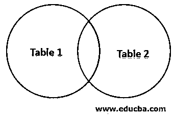
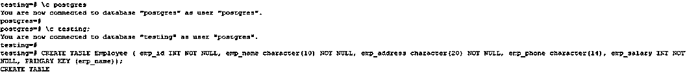
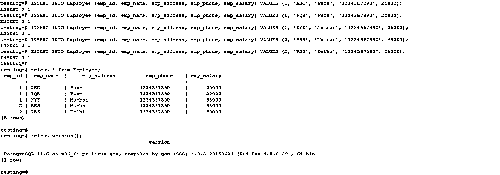
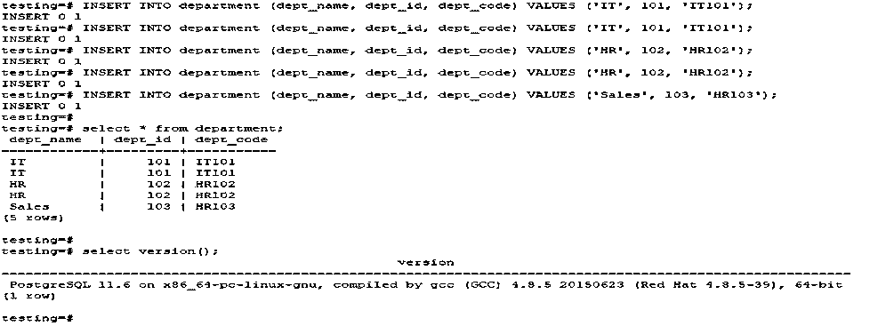
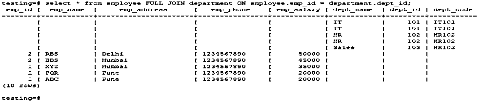
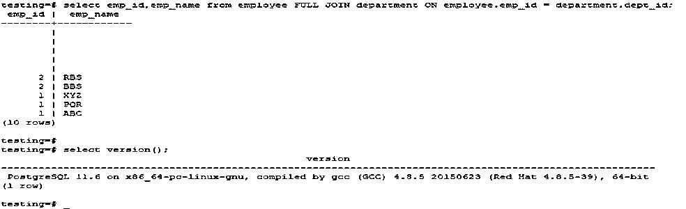

# PostgreSQL 完全连接

> 原文：<https://www.educba.com/postgresql-full-join/>

## PostgreSQL 完全连接简介

PostgreSQL 完全外连接返回左表和右表中的所有行；当不满足完全外连接条件时，它将输入空值。当使用完全外连接来连接表时，它将首先使用内连接来连接，左右连接的组合称为完全外连接。在 PostgreSQL 中，完全连接也称为完全外连接。PostgreSQL 连接用于连接多个表中的数据。每当需要从一个或多个表中检索数据时，我们都会使用此连接。

**语法**

<small>Hadoop、数据科学、统计学&其他</small>

`Select column1 …. columnN from table_name1 FULL JOIN table_name2 on table_name1.column = table_name2.column;
SELECT (*) FROM table_name1 FULL JOIN table_name2 on table_name1.column = table_name2.column;`

下面是对上述语法的参数描述如下。

*   **Column1 到 columnN:** 在完全外部联接中使用的列，用于从表中检索数据。
*   **表名:**在完全连接中使用的表名，用于从表中检索数据。
*   **全联接:**全联接用于联接两个表。
*   **星号(*):** 星号(*)定义所有表列，以从表中检索数据。

### 完全加入如何工作？

它也称为完全外部联接。这对于 PostgreSQL 中的连接类型至关重要。它将返回左表中的所有行以及右表中的所有行。当不满足完整的外部连接条件时，它将在指定的行中放置 null。当使用完全外部连接或首先使用完全连接来连接表时，它将使用内部连接来连接。左连接和右连接的组合称为完全外连接。

下面是完整外部连接的图像表示。

使用 PostgreSQL 完全连接，我们可以将 select 和 join 语句合并成一条语句。在 PostgreSQL 中，我们可以将一个具有多个名称的表作为别名连接起来。它将根据条件检索数据。

完全连接或完全外部连接在从多个表中检索数据时非常有用。

下面是 PostgreSQL 中的连接类型。

*   交叉连接
*   内部连接
*   左外部联接或左联接
*   右外部联接或右联接
*   完全外部连接或完全连接

PostgreSQL 中的完全外连接将返回左表中的所有行和右表中的所有行。

如果不满足完全连接条件，那么它将输入空值。所有匹配的行(单行)都将包含在结果集中，该结果集包含将从两个连接的表中填充的列。PostgreSQL 完全连接或完全外部连接用于在单个查询中从多个表中选择数据。

使用 PostgreSQL 完全连接从多个表中检索数据，我们不需要对第一个表和第二个表有任何约束。这将不受任何限制地显示表的输出。

假设 ABC 表通过一个连接条件与 PQR 表完全连接。在这种情况下，PostgreSQL 中的完全连接或完全外部连接将显示 ABC 和 PQR 表的输出值。它将从 ABC 以及 PQR 表中获取所有值。

### PostgreSQL 完全连接的示例

我们使用雇员和部门表来描述完全连接的例子。

#### 1.员工表

下面是一个雇员表的例子。

`CREATE TABLE Employee ( emp_id INT NOT NULL, emp_name character(10) NOT NULL, emp_address character(20) NOT NULL, emp_phone character(14), emp_salary INT NOT NULL, PRIMARY KEY (emp_name));`

`INSERT INTO Employee (emp_id, emp_name, emp_address, emp_phone, emp_salary) VALUES (1, 'ABC', 'Pune', '1234567890', 20000);
INSERT INTO Employee (emp_id, emp_name, emp_address, emp_phone, emp_salary) VALUES (1, 'PQR', 'Pune', '1234567890', 20000);
INSERT INTO Employee (emp_id, emp_name, emp_address, emp_phone, emp_salary) VALUES (1, 'XYZ', 'Mumbai', '1234567890', 35000);
INSERT INTO Employee (emp_id, emp_name, emp_address, emp_phone, emp_salary) VALUES (2, 'BBS', 'Mumbai', '1234567890', 45000);
INSERT INTO Employee (emp_id, emp_name, emp_address, emp_phone, emp_salary) VALUES (2, 'RBS', 'Delhi', '1234567890', 50000);`

#### 2.部门表

下面是部门表的例子如下。

`CREATE TABLE department ( dept_name character(10) NOT NULL, dept_id int NOT NULL, dept_code varchar(10));`

`INSERT INTO department (dept_name, dept_id, dept_code) VALUES ('IT', 101, 'IT101');
INSERT INTO department (dept_name, dept_id, dept_code) VALUES ('IT', 101, 'IT101');
INSERT INTO department (dept_name, dept_id, dept_code) VALUES ('HR', 102, 'HR102');
INSERT INTO department (dept_name, dept_id, dept_code) VALUES ('HR', 102, 'HR102');
INSERT INTO department (dept_name, dept_id, dept_code) VALUES ('Sales', 103, 'HR103');`

#### 3.PostgreSQL 完全连接或完全外部连接

以下示例显示 PostgreSQL 中的完全连接如下。

`select * from employee FULL JOIN department ON employee.emp_id = department.dept_id;`

`select emp_id, emp_name from employee FULL JOIN department ON employee.emp_id = department.dept_id;`

在上面的例子中，我们必须使用完全连接来连接雇员和部门表。在第一个示例中，将显示 employee 表中的所有记录和右侧表中的所有记录。

在第二个示例中，我们必须从 emp_id 和 emp_name 列中检索数据。在第二个示例中，不满足完整的外部连接条件，因为它将返回一个空值。上面的示例使用 PostgreSQL 完全外部连接从同一个表[中检索不同的输出。在我们的例子中，雇员表是第一个表，部门表是第二个表。](https://www.educba.com/postgresql-full-outer-join/)

我们使用 employee 表作为 emp_id 列，使用 dept 表作为 dept_id 列来连接表。当我们从一个表中选择数据，而在第二个表中没有匹配项，并且我们从第二个表中检索空值时，第二个完全外连接的例子非常有用。

### 结论

在 PostgreSQL 中，它也称为完全外部连接。PostgreSQL 完全联接或完全外联接用于检索左表中的所有行和右表中的所有行。在 PostgreSQL 中是必不可少的。

### 推荐文章

这是一个 PostgreSQL 完全连接的指南。在这里，我们讨论介绍，如何在 PostgreSQL 完全连接工程和例子和语法，代码和输出。您也可以浏览我们推荐的其他文章，了解更多信息——

1.  [PostgreSQL 架构](https://www.educba.com/postgresql-architecture/)
2.  [PostgreSQL WHERE 子句](https://www.educba.com/postgresql-where-clause/)
3.  [PostgreSQL 运算符](https://www.educba.com/postgresql-operators/)
4.  [SQL 集合运算符](https://www.educba.com/sql-set-operators/)
5.  [PostgreSQL 模式完全指南](https://www.educba.com/postgresql-schema/)