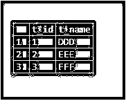
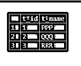
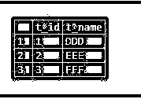
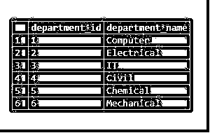
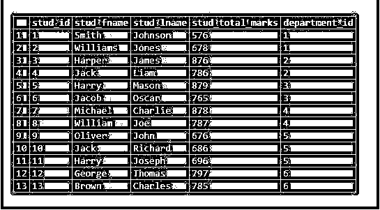
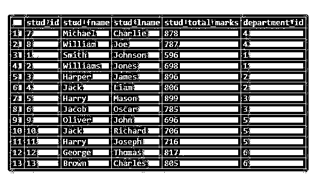

# PostgreSQL 更新联接

> 原文：<https://www.educba.com/postgresql-update-join/>

## PostgreSQL 更新连接简介

我们可以用各种方式更新存储在表中的记录；PostgreSQL 提供了 UPDATE JOIN 来做同样的事情。在某些情况下，我们需要根据另一个表的记录来更新一个表的记录。要在语句中连接另一个表，我们必须用连接的表定义 PostgreSQL FROM 子句，并且我们需要用连接条件指定 PostgreSQL WHERE 子句。我们必须添加 SET 子句，并且必须在它之后立即指定 PostgreSQL FROM 子句。

### 句法

考虑以下语法:

<small>Hadoop、数据科学、统计学&其他</small>

`UPDATE table1
SET table1.col1 = expression
FROM table2
WHERE table1.col2 = table2.col2;`

**解释:**使用 PostgreSQL FROM 子句连接语句中的另一个表。添加 SET 子句，并在其后立即指定 PostgreSQL FROM 子句。

### UPDATE JOIN 在 PostgreSQL 中如何工作？

请考虑上一节中定义的语法，以理解 PostgreSQL UPDATE JOIN 的工作方式。按照语法，我们使用表 2 中的值来更新表 1 中的值。这里，我们在表 1 和表 2 的列 2 上指定了一个连接条件。因此，如果 table1 和 table2 中的每一行都包含匹配/相同的值，那么 UPDATE 语句将更新 table1 中的 col1 列值，并按照 set 子句中定义的表达式设置该值。

### 实现 PostgreSQL 更新连接的示例

下面是提到的一些例子:

#### 示例#1

为了理解基本示例，我们将使用 CREATE TABLE 语句创建两个名为“table1”和“table2”的表，如下所示:

**代码:**

`CREATE TABLE table1
(
t_ID INT,
t_Name VARCHAR(80)
);
CREATE TABLE table2
(
t_ID INT,
t_Name VARCHAR(80)
);`

现在，我们将使用 INSERT INTO 语句向 table1 表中插入一些数据，如下所示。

`INSERT INTO table1 VALUES
(1,'DDD'),
(2,'EEE'),
(3,'FFF');`

**输出:**

`select * from table1;`

现在，我们将使用 INSERT INTO 语句向 table2 表中插入一些数据，如下所示。

`INSERT INTO table2 VALUES
(1,'PPP'),
(2,'QQQ'),
(3,'RRR');`

使用下面的 SQL 语句和快照来说明上面的 INSERT INTO 语句的结果。

`select * from table2;`

现在，如果 t_ID 字段与表 2 匹配/相同，我们将使用 PostgreSQL UPDATE JOIN 语句来更新表 2 的值。

`UPDATE table2
SET t_Name = table1.t_Name
FROM table1
WHERE table1.t_ID = table2.t_ID;`

通过使用以下 SQL 语句和快照来说明上述语句的结果。

`select * from table2;`

#### 实施例 2

为了理解示例，我们将使用 CREATE TABLE 语句创建两个名为“student”和“department”的表，如下所示:

**代码:**

`create table student
(
stud_id serial PRIMARY KEY,
stud_fname VARCHAR(80) NOT NULL,
stud_lname VARCHAR(80) NOT NULL,
stud_total_marks int NOT NULL,
department_id int NOT NULL
);
create table department
(
department_id serial PRIMARY KEY,
department_name VARCHAR(80) NOT NULL
);`

现在，我们将使用 INSERT INTO 语句向 department 表中插入一些数据，如下所示。

`INSERT INTO department(department_name)
VALUES
('Computer'),
('Electrical'),
('IT'),
('Civil'),
('Chemical'),
('Mechanical');`

**输出:**

`select * from department;`

现在，我们将使用 INSERT INTO 语句向 student 表中插入一些数据，如下所示。

`INSERT INTO student(stud_fname, stud_lname, stud_total_marks, department_id)
VALUES
('Smith','Johnson',576,1),
('Williams','Jones',678,1),
('Harper','James',876,2),
('Jack','Liam',786,2),
('Harry','Mason',879,3),
('Jacob','Oscar',765,3),
('Michael','Charlie',878,4),
('William','Joe',787,4),
('Oliver','John',676,5),
('Jack','Richard',686,5),
('Harry','Joseph',696,5),
('George','Thomas',797,6),
('Brown','Charles',785,6);`

使用下面的 SQL 语句和快照来说明上面的 INSERT INTO 语句的结果。

`select * from student;`

现在考虑这样一个例子，我们必须给每个学生额外的 20 分，除了 department_id 为 4 的土木工程系。因此，我们将使用 UPDATE JOIN 语句，如下所示:

`UPDATE student
SET stud_total_marks = stud_total_marks + 20
FROM
department
WHERE
student.department_id = department.department_id AND department.department_id <> 4;`

通过使用以下 SQL 语句和快照来说明上述语句的结果。

`select * from student;`

### 结论

我们希望从上面的文章中，您已经理解了如何使用 PostgreSQL UPDATE JOIN 以及 PostgreSQL UPDATE JOIN 如何工作。此外，我们还添加了几个 PostgreSQL UPDATE JOIN 的示例来详细了解它。

### 推荐文章

这是一个 PostgreSQL 更新连接的指南。这里我们讨论 PostgreSQL 更新连接的介绍，语法，工作和各自的例子。您也可以浏览我们的其他相关文章，了解更多信息——

1.  [PostgreSQL 不为空](https://www.educba.com/postgresql-not-null/)
2.  [PostgreSQL 时间戳](https://www.educba.com/postgresql-timestamp/)
3.  [PostgreSQL 中的外键](https://www.educba.com/foreign-key-in-postgresql/)
4.  [PostgreSQL 子查询](https://www.educba.com/postgresql-subquery/)