# PostgreSQL 查询

> 原文：<https://www.educba.com/postgresql-queries/>

## PostgreSQL 查询简介

PostgreSQL 支持标准 SQL 来查询数据或信息。查询可以一次访问多个表，也可以同时处理同一个表的多个行。可以使用查询来选择、更新或删除行。

### 带示例的 PostgreSQL 查询

以下是 PostgreSQL 的查询，下面给出例子。为了理解 SQL 查询，让我们创建一个表“student”:

<small>Hadoop、数据科学、统计学&其他</small>

#### 1.创造

**语法:**

`CREATE TABLE student (
rollno INT NOT NULL,
firstname VARCHAR(30) NOT NULL,
lastname VARCHAR(30) NOT NULL,
branch VARCHAR(30) NOT NULL,
result VARCHAR(30) NOT NULL,
joining_date VARCHAR(30) NOT NULL,
PRIMARY KEY (rollno)
);`

#### 2.插入

INSERT 语句允许我们一次向表中插入一行或多行。

##### 插入单行

**语法:**

`INSERT INTO table (column_1, column_2, …)
VALUES
(value_1, value_2, …);`

**解释:**要使用上面的命令，我们必须在 INSERT INTO 子句后为表名提供一列用逗号分隔的列名。然后在 values 子句后提供一个用逗号分隔的值列表。

`INSERT INTO student (rollno, firstname, lastname, branch, result, joining_date)
VALUES ('101', 'Harry','Robert', 'Computer', true, '2019-12-31');`

用 SELECT 语句说明插入的行。

`select * from student`

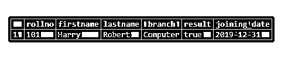

##### 一次添加多行

**语法:**

`INSERT INTO table (column_1, column_2, …)
VALUES
(value_1, value_2, …),
(value_1, value_2, …) ,...;`

**说明:**在表格中添加多行和在表格中插入单行是一样的；我们只需要在第一个列表后提供用逗号分隔的额外值列表。

`INSERT INTO student (rollno, firstname, lastname, branch, result, joining_date)
VALUES   ('101', 'Harry','Robert', 'Computer', true, '2019-12-31'),
('102', 'Jacob','Michael', 'Mechanical', false, '2019-12-30'),
('103', 'Charlie','William', 'Electrical', true, '2019-12-29'),
('104', 'Thomas','David', 'Civil', false, '2019-12-28');`

用 SELECT 语句说明插入的行。 **T2】**

`select * from student`

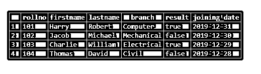

##### 从另一个表中插入数据

**语法:**

`INSERT INTO table(column1,column2,...)
SELECT column1,column2,...
FROM another_table
WHERE condition;`

为了便于理解，让我们创建一个名为“temp_student”的新表。

`CREATE TABLE temp_student (LIKE student);
INSERT INTO temp_student`

用 SELECT 语句说明插入的行。

`select * from temp_student`

#### 3.挑选

**语法:**

`SELECT column_name_1, column_name_2, ….
FROM table_name [WHERE condition];`

**说明:**

1.  在 SELECT 关键字后提供列名。如果要检索多个列的数据，请使用逗号分隔的列表来提供多个列名。使用星号(*)检索所有列的数据。
2.  在 FROM 子句后，提供表名。

##### 从一列中查询数据

查找学生表中所有学生的编号:

`SELECT rollno FROM student;`

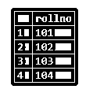

##### 从多列中查询数据

您可以在 SELECT 关键字后指定感兴趣的列 roll no、first name 和 last name，如以下查询所示:

`SELECT rollno , firstname, lastname FROM student;`

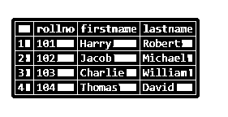

##### 带表达式的 Select 语句

将由空格分隔的“名字”和“姓氏”的组合作为“全名”返回，并返回所有学生的结果:

`SELECT
firstname
||
' '
||
lastname AS fullname,
result
FROM
Student;`
上面陈述的结果:

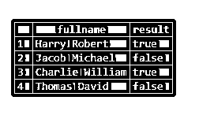

##### 带有 LIMIT 子句的 SELECT 语句

LIMIT 是 SELECT 语句的可选项，用于返回行的子集。
选择

`rollno , firstname, lastname
FROM
student
LIMIT 2;`

上述声明的结果:

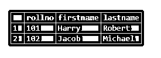

#### 4.更新

**语法:**

`UPDATE table_name
SET column_1 = value_1,
column_2 = value_2 ,...
WHERE
Condition;`

**说明:**

*   在 UPDATE 子句后提供表的名称。
*   提供要在 SET 子句中修改的列的名称列表。
*   在 WHERE 子句中添加筛选行的条件。
*   我们可以通过省略 WHERE 子句来更新所有行。

##### 部分更新表格

对于大于或等于 103 的所有 rollno，将结果更改为 true:

`UPDATE  student SET  "result" = true WHERE   rollno >= 103;
select * from student;`

上述声明的结果:

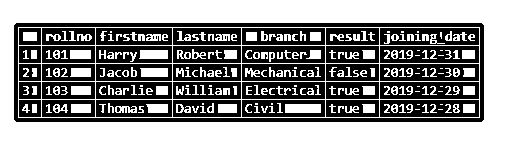

##### 更新所有行

对于所有行，将结果列的值更新为 true。

`UPDATE student SET "result" = true
select * from student;`

上述声明的结果:

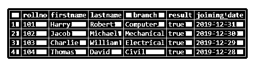

##### 用 Returning 子句更新

在 UPDATE 语句中使用 RETURNING 子句，我们可以返回更新后的条目。

更新“roll no”101 行并返回更新后的行:

`UPDATE student SET firstname = 'Bruce', lastname = 'Lee' WHERE rollno = 101
RETURNING rollno , firstname, lastname;`

上述声明的结果:

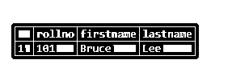

#### 6.删除

**语法:**

`DELETE FROM table_name WHERE condition;`

**说明:**

*   在 DELETE FROM 子句后提供表名。
*   使用 WHERE 子句添加条件，以决定要删除哪些行。没有 WHERE 条件的 DELETE 语句将删除所有行。

在 USING 子句的帮助下，我们可以检查对另一个表中一列或多列的引用条件。

`DELETE FROM
table_name
USING
another_table_name
WHERE
table_name.<col_name> = another_table_name.<col_name> AND …`

如果不想使用 USING，可以按如下方式使用子查询:

`DELETE FROM
table_name
WHERE
table_name.<col_name> = (SELECT <col_name> FROM another_table_name);`

我们将使用我们在数据插入部分创建的 student 和**‘temp _ student’**表。

##### 要用 WHERE 子句删除的查询

删除角色列中值为 103 的行:

`DELETE FROM student
WHERE rollno = 103;`

使用 SELECT 语句说明结果:

`SELECT  * FROM student;`

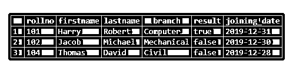

##### 要使用删除的查询

从“student”表中删除所有具有 roll 值的行“temp_student”表中没有列。

让我们举例说明“temp_student”表。

`SELECT  * FROM temp_student;`

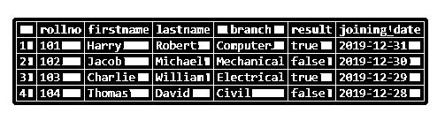

101 号卷子应该从‘学生’桌子上拿掉

`DELETE FROM student
USING temp_student
WHERE student.rollno = temp_student.rollno;`

使用 SELECT 语句说明结果:

`SELECT  * FROM student;`

##### 删除所有行的查询

`DELETE FROM student;`

使用 SELECT 语句说明结果:

`SELECT  * FROM student;`

从 temp_student 表中删除行并返回删除的行:

`DELETE FROM temp_student
RETURNING *;`

上述声明的结果:

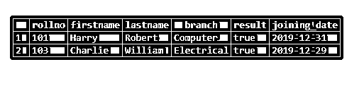

### 推荐文章

这是一个 PostgreSQL 查询指南。在这里，我们还将讨论 postgresql 的介绍和各种查询，以及不同的示例和代码实现。您也可以看看以下文章，了解更多信息–

1.  [在 PostgreSQL 中强制转换](https://www.educba.com/cast-in-postgresql/)
2.  [PostgreSQL 不为空](https://www.educba.com/postgresql-not-null/)
3.  [PostgreSQL 通知](https://www.educba.com/postgresql-notify/)
4.  [PostgreSQL 唯一约束](https://www.educba.com/postgresql-unique-constraint/)
5.  [SQL REGEXP |运算符列表](https://www.educba.com/sql-regexp/)