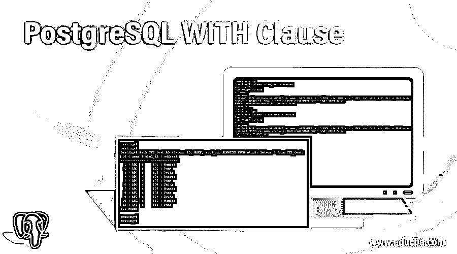
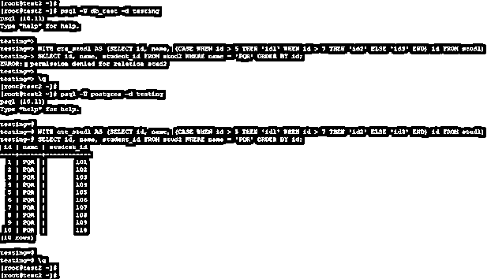
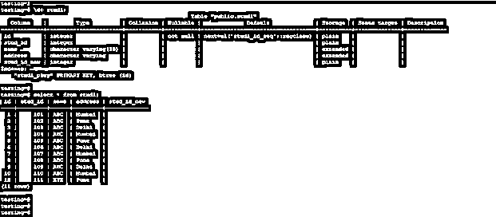
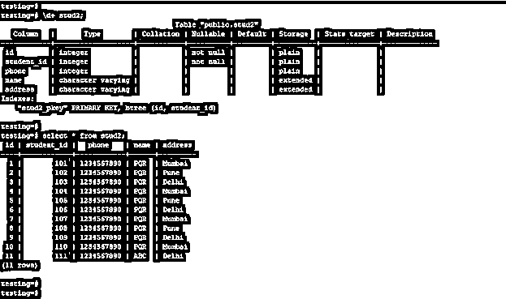
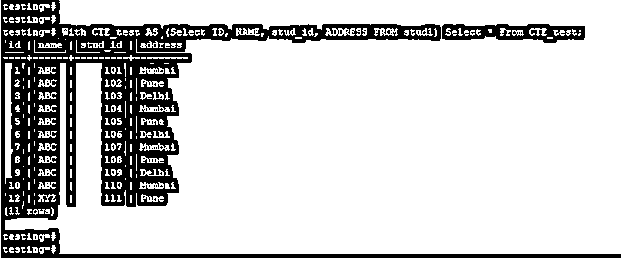
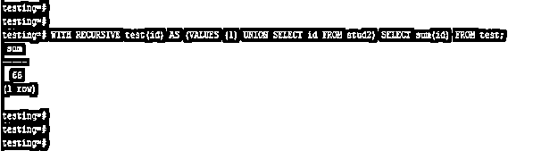
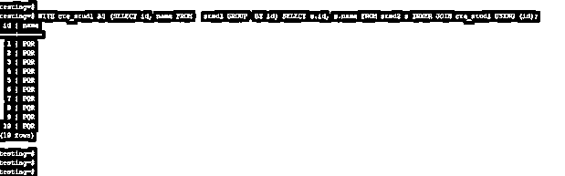
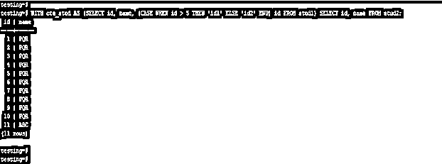

# PostgreSQL WITH 子句

> 原文：<https://www.educba.com/postgresql-with-clause/>

## PostgreSQL WITH 子句介绍

PostgreSQL with 子句用于编写使用大型查询的辅助语句，当我们将复杂的大型查询执行成简单的形式时，with 子句非常有用。使用 with 子句时，该子句的输出易于阅读，with 子句也被称为公用表表达式或 CTE，它也被定义为只存在于特定查询中的临时表。在 PostgreSQL 中，我们可以通过使用多个查询来执行多个子查询，使用多个临时表很有帮助。

### 语法和参数

下面是 PostgreSQL 中 with 子句的语法。

<small>Hadoop、数据科学、统计学&其他</small>

*   with name _ of _ CTE(list _ of _ column)AS(Select 查询语句)

`Select column_list
From name_of_table
Where condition (select column_list from name_of_table)
Order by name_of_column;`

*   用 CTE 的名字(列名)作为(

`Definition of CTE query)
Statement;`

下面是 PostgreSQL 中 with 子句的参数描述语法。

*   **With 子句:**这被定义为用于在 PostgreSQL 中执行子查询和大型子查询的子句。
*   **CTE 的名称:**这是我们在 with 子句中使用的公用表表达式的定义名称。
*   **AS:** 这被定义为我们在 with 子句中使用了公共表表达式的别名。
*   **列列表:**定义为我们在 with 子句中使用过的列列表。
*   **Select 查询语句:**我们已经使用了一个带有公共表表达式和 PostgreSQL 中的子句的 Select 查询语句。我们在 with 子句中使用了多个 select 语句。
*   **表名:**定义为我们在 PostgreSQL 中使用 with 子句从中检索数据的表名。通过在 PostgreSQL 中使用 with 子句，我们可以使用多个表从多个表中检索数据。
*   **Where condition:** 它被定义为使用我们已经从表中检索到的数据的条件。当我们必须从表中检索指定的数据时，Where 条件非常有用。
*   **Order by:** 定义为 Order by 子句与 where 子句一起使用，按升序或降序检索数据。
*   **公用表表达式的定义:**这是我们在 with 子句中使用的 CTE 的定义查询。

### PostgreSQL 中的 WITH 子句如何工作？

我们可以通过使用 PostgreSQL 中的公共表表达式来指定列列表。我们还可以通过使用 PostgreSQL 中的子句来连接该表。我们还在查询中使用了递归 with 子句。要执行 with clause 语句，我们需要对表拥有 select 权限，或者需要拥有超级用户权限来执行 with clause 语句。

以下示例显示，with clause 语句需要对表具有 select 权限或超级用户权限才能执行 with clause 语句。

**代码:**

`psql -U db_test -d testing
WITH cte_stud1 AS (SELECT id, name, (CASE WHEN id > 5 THEN 'id1' WHEN id > 7 THEN 'id2' ELSE 'id3' END) id FROM stud1)SELECT id, name, student_id FROM stud2 WHERE name = 'PQR' ORDER BY id;
psql -U postgres -d testing
WITH cte_stud1 AS (SELECT id, name, (CASE WHEN id > 5 THEN 'id1' WHEN id > 7 THEN 'id2' ELSE 'id3' END) id FROM stud1)SELECT id, name, student_id FROM stud2 WHERE name = 'PQR' ORDER BY id;`

**输出:**

**解释:**在上面的第一个示例中，我们使用用户作为 db_test，该用户没有 stud1 和 stud2 表上的 select 权限，也不是超级用户，因此在执行 with 子句语句时会出现错误。在第二个示例中，我们使用用户名 Postgres 选择了表行，使用该用户后，我们从 stud1 和 stud2 表中选择了列。Postgres 用户在 PostgreSQL 中拥有超级用户权限。

### 实现 PostgreSQL WITH 子句的示例

下面是 PostgreSQL 中 with 子句的示例。

我们用 stud1 和 stud2 表来描述 PostgreSQL 中 with 子句的一个例子如下。

*   下面是 stud1 表的表格和数据说明。

**代码:**

`\d+ stud1;
select * from stud1;`

**输出:**

*   下面是 stud2 表的表格和数据描述。

**代码:**

`\d+ stud2;
select * from stud2;`

**输出:**

#### 1.简单 with 子句。

下面的例子说明 with 子句如下。我们用 CTE 的名字作为 CTE 测试。

**代码:**

`With CTE_test AS (Select ID, NAME, stud_id, ADDRESS FROM stud1) Select * From CTE_test;`

**输出:**

#### 2.递归 With 子句

下面的例子说明递归 with 子句如下。我们使用 CTE 名字作为测试(id)。

**代码:**

`WITH RECURSIVE test(id) AS (VALUES (1) UNION SELECT id FROM stud2) SELECT sum(id) FROM test;`

**输出:**

#### 3.连接操作中的 With 子句

下面的例子说明 with 子句在 join 中的操作如下。我们使用 with 子句使用 stud1 和 stud2 表来连接操作。

**代码:**

`WITH cte_stud1 AS (SELECT id, name FROM   stud1 GROUP  BY id) SELECT s.id, s.name FROM stud2 s INNER JOIN cte_stud1 USING (id);`

**输出:**

#### 4.With 子句使用条件

以下示例显示了 with 子句的使用条件。

**代码:**

`WITH cte_stud AS (SELECT id, name, (CASE WHEN id > 5 THEN 'id1' ELSE 'id2' END) id FROM stud1) SELECT id, name FROM stud2;`

**输出:**

### 推荐文章

这是一个 PostgreSQL WITH 子句的指南。这里我们讨论 PostgreSQL WITH 子句的介绍，它如何与查询示例一起工作，以便更好地理解。你也可以通过我们的其他相关文章来了解更多-。

1.  [PostgreSQL 替换](https://www.educba.com/postgresql-replace/)
2.  [PostgreSQL 有](https://www.educba.com/postgresql-having/)
3.  [PostgreSQL 排序依据](https://www.educba.com/postgresql-order-by/)
4.  [PostgreSQL 中的索引](https://www.educba.com/indexes-in-postgresql/)