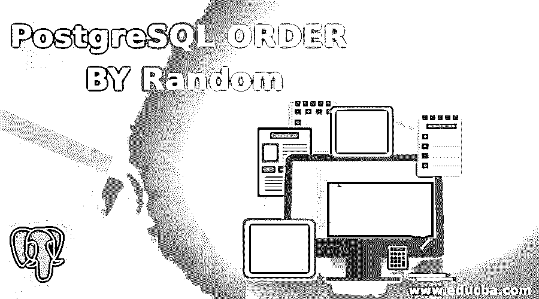
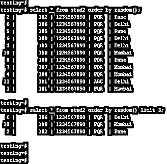
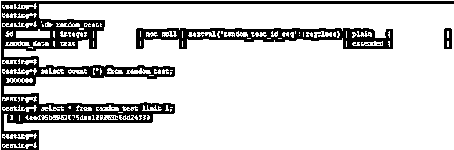
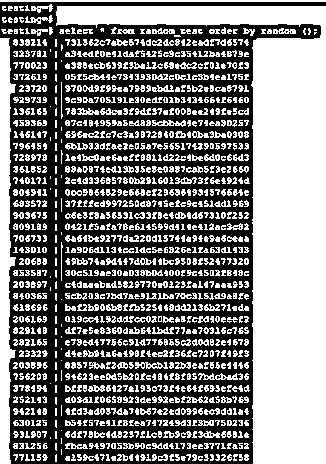
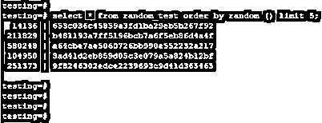
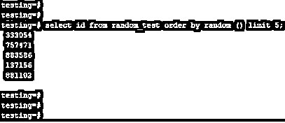

# PostgreSQL 随机排序

> 原文：<https://www.educba.com/postgresql-order-by-random/>

## PostgreSQL 随机函数排序简介

PostgreSQL order by random 函数用于通过使用 order by 子句从表中返回随机数。带有 order by 子句的随机函数与 PostgreSQL 中的 order by 子句工作方式不同，因为随机函数将从 PostgreSQL 的表中选取随机值。Order by 子句使用 random 函数在大型表上检索数据时非常有用，因为 order by random 函数将从表中返回随机数。我们还可以使用 order by random 函数，使用 limit 子句，使用 limit 子句从表中检索数据。

### 句法

下面是 PostgreSQL 中 order by random 的语法。

<small>Hadoop、数据科学、统计学&其他</small>

`Select name_of_column1, name_of_column2, name_of_column3, …., name_of_columnN from name_of_table ORDER BY RANDOM ();`

`Select name_of_column1, name_of_column2, name_of_column3, …., name_of_columnN from name_of_table ORDER BY RANDOM () limit number;`

`Select * (select all column from table) from name_of_table ORDER BY RANDOM () limit number;`

#### PostgreSQL 的参数随机排序

下面是 PostgreSQL 中 order by random 的参数描述语法。

*   **Select:** 这被定义为使用 PostgreSQL 中的 order by random 函数从表中检索数据的选择操作。我们可以从指定表的单个列、多个列和所有列中检索数据。
*   **第 1 列的名称到第 N 列的名称:**它被定义为列的名称，这是我们使用 PostgreSQL 中的 order by random 函数从列中检索数据时使用的名称。
*   **表名:**这是我们从中检索数据的表名。表名是由随机函数排序的一个基本而有用的参数。
*   **Order by Random:** 该函数用于选择一个随机值，通过 PostgreSQL 中的 Order by 子句来检索数据。Order by 子句将从指定的表列中检索随机值，这是我们在查询中使用的。
*   **From:** 这被定义为选择我们从中检索数据的指定表。From 关键字用于选择 PostgreSQL 中的表。
*   **Number:** 这被定义为限制条款的使用数；它将检索我们已经使用了限制的特定行数。
*   **Limit:Limit**子句用于使用数字从表中检索数据，我们已经在 Limit 子句中使用了该数字。这是 PostgreSQL 中 order by random 函数语法中的可选参数。

### 随机函数排序是如何工作的？

下面是 PostgreSQL 中随机排序的工作原理。

*   如果我们需要表中的随机数据，我们将使用 PostgreSQL 中的 order by random 函数。
*   如果我们没有对 order by 子句使用 limits，那么它将返回表中的所有行。如果我们在 order by 子句中使用了 limit，它将从表中返回指定数量的行。
*   下面的例子表明，如果我们没有对 order by random 函数使用限制，那么它将返回表中的所有行。

**代码:**

`select * from stud2 order by random();`

`select * from stud2 order by random() limit 3;`

**说明:**

*   在上面的第一个例子中，我们没有使用带有 order by random 函数的 limit 子句；不使用 limit 子句后，它将返回 PostgreSQL 中表的所有行。
*   在上面的第二个例子中，我们使用了一个带有 order by random 函数的 limit 子句；使用 limit 子句后，它将从我们在查询中定义的表中返回指定数量的行。
*   order by random 函数将从我们在查询中使用的表中返回随机数。
*   如果我们同时需要一个指定数量的随机列表，我们就必须对该表使用一个 order by random 函数。
*   Order by 子句将对表中的所有数据进行排序，因此与 PostgreSQL 中的其他随机方法相比，它会比较慢。
*   PostgreSQL 中的 Order by random 函数将返回介于 0 和 1 之间的数值，该数值在 PostgreSQL 中作为双精度类型获得。
*   当我们从 PostgreSQL 的表中检索随机记录时，Order by random 子句在 PostgreSQL 中非常有用和重要。

### **PostgreSQL 通过随机函数排序的例子**

下面是 PostgreSQL 中 order by random 函数的一个示例。

#### 示例#1

我们用 random_test 来描述 PostgreSQL 中的 order by random 函数的例子如下。下面是 random_test 表的计数和表结构。

**代码:**

`\d+ random_test;`

`select count (*) from random_test;`

`select * from random_test limit 1;`

**输出:**

#### 实施例 2

以下示例显示了不使用 limit 子句的 order by random 函数。在下面的例子中，我们没有使用 limit 子句来显示 random_test 表中的所有记录。

**代码:**

`select * from random_test order by random ();`

**输出:**

#### 实施例 3

以下示例通过使用 limit 子句显示了 order by random 函数。在下面的例子中，我们使用了一个 limit 子句来显示 random_test 表中指定数量的记录。

**代码:**

`select * from random_test order by random () limit 5;`

**输出:**

#### 实施例 4

以下示例显示了使用指定列的 order by random 函数。

**代码:**

`select id from random_test order by random () limit 5;`

**输出:**

#### 实施例 5

以下示例显示了在 PostgreSQL 中查找随机数的 order by random。

**代码:**

`SELECT CASE WHEN id = 0 THEN 1 ELSE id END
FROM (SELECT ROUND(RANDOM() * (SELECT MAX(id) FROM random_test)) as id) as r;`

**输出:**

### 推荐文章

这是一个 PostgreSQL 随机排序的指南。在这里，我们将讨论 PostgreSQL ORDER BY Random Function 的介绍及其语法、参数以及实际示例和不同的子查询表达式。您也可以浏览我们推荐的文章，了解更多信息——

1.  [PostgreSQL 时间戳简介](https://www.educba.com/postgresql-timestamp/)
2.  [如何在 PostgreSQL 中通知 Works？](https://www.educba.com/postgresql-notify/)
3.  [PostgreSQL JSON(示例)](https://www.educba.com/postgresql-json/)
4.  [PostgreSQL 时间戳简介](https://www.educba.com/postgresql-timestamp/)