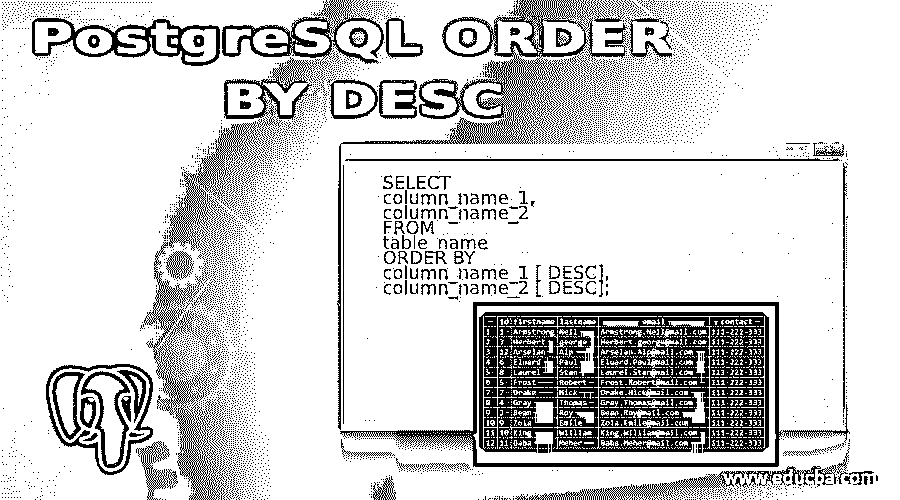
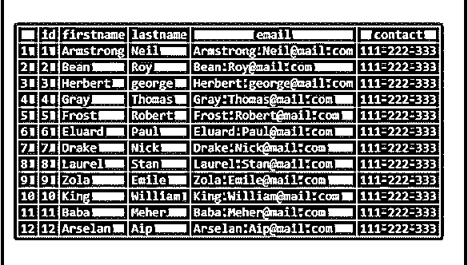
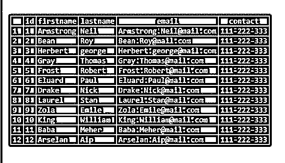
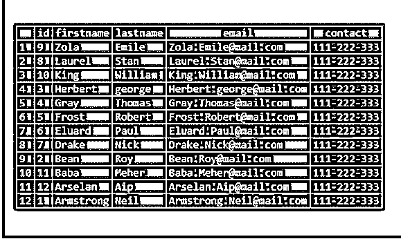
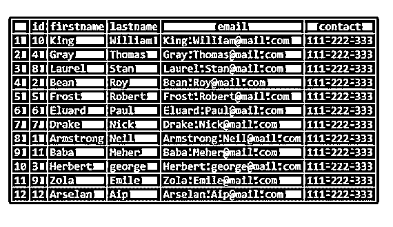

# DESC 的 PostgreSQL 顺序

> 原文：<https://www.educba.com/postgresql-order-by-desc/>

## DESC 的 PostgreSQL 顺序介绍

为了获得结果集，我们使用 SELECT 语句，该语句以随机顺序返回表中的行。因此，为了对这个结果集进行排序，我们使用 PostgreSQL ORDER BY 子句。当我们在 SELECT 语句中使用 ORDER BY 子句查询数据时，从表中返回的行可以按升序或降序排序。我们可以使用列和表达式对结果进行降序排序。当我们用 SELECT 语句指定关键字 DESC 来按降序对表中的行进行排序时，PostgreSQL 允许我们按降序对行进行排序。

**语法:**

<small>Hadoop、数据科学、统计学&其他</small>

请考虑下面的语法语句来理解 PostgreSQL ORDER BY DESC 语法:

`SELECT
column_name_1,
column_name_2
FROM
table_name
ORDER BY
column_name_1 [ DESC],
column_name_2 [ DESC];`

**说明:**

*   我们需要在 PostgreSQL 子句中定义列名来对结果进行排序。
*   在 PostgreSQL 中也可以对包含多个列的表的结果进行排序，为此我们需要指定用逗号分隔的列名。
*   我们可以使用列和表达式对结果进行降序排序。

### DESC 排序在 PostgreSQL 中是如何工作的？

*   PostgreSQL 允许我们按降序对 SELECT 语句返回的结果进行排序；为此，我们需要用 DESC 关键字指定 ORDER BY 子句。
*   如果我们没有定义 DESC 关键字，ORDER BY 子句默认情况下按升序对结果进行排序。
*   我们也可以用多个列对结果进行降序排序。我们需要在 ORDER BY 子句中用 DESC 关键字定义逗号分隔的列名。
*   我们可以使用列和表达式对结果进行降序排序。

### DESC 的 PostgreSQL 顺序示例

我们将创建一个名称租户表。另外，向租户表中添加一些数据，以便理解 ORDER BY DESC 子句。

使用以下语句创建租户表，该表由三列组成:

id，

西方人名的第一个字

姓

电子邮件

接触。

`CREATE TABLE Tenants (
id serial NOT NULL PRIMARY KEY,
firstName VARCHAR,
lastName VARCHAR,
email VARCHAR,
contact VARCHAR
);`

现在，我们将借助 insert 语句在租户表中插入一些行，如下所示:

`INSERT INTO Tenants (firstName, lastName, email, contact)
VALUES
('Armstrong', 'Neil', 'Armstrong.Neil@mail.com', '111-222-333'),
('Bean', 'Roy', 'Bean.Roy@mail.com', '111-222-333'),
('Herbert', 'george', 'Herbert.george@mail.com', '111-222-333'),
('Gray', 'Thomas', 'Gray.Thomas@mail.com', '111-222-333'),
('Frost', 'Robert', 'Frost.Robert@mail.com', '111-222-333'),
('Eluard', 'Paul', 'Eluard.Paul@mail.com', '111-222-333'),
('Drake', 'Nick', 'Drake.Nick@mail.com', '111-222-333'),
('Laurel', 'Stan', 'Laurel.Stan@mail.com', '111-222-333'),
('Zola', 'Emile', 'Zola.Emile@mail.com', '111-222-333'),
('King', 'William', 'King.William@mail.com', '111-222-333'),
('Baba', 'Meher', 'Baba.Meher@mail.com', '111-222-333'),
('Arselan', 'Aip', 'Arselan.Aip@mail.com', '111-222-333');
select * from Tenants;`

现在借助 SELECT 语句从租户表中检索数据，如下所示:

`SELECT
id,
firstName,
lastName,
email,
contact
FROM
Tenants;`

使用以下快照说明租户表的内容:

考虑下面的示例，其中 ORDER BY 子句中只使用一列。

`SELECT
id,
firstName,
lastName,
email,
contact
FROM
Tenants
ORDER BY
firstName DESC;`

在上面的 SQL 语句中，我们用 firstName 列指定了 ORDER BY 子句，并指定了 DESC 关键字，指定了降序。使用下面的快照说明上述语句的结果:

考虑下面的示例，其中您将在 ORDER BY 子句中使用多个列。

`SELECT
id,
firstName,
lastName,
email,
contact
FROM
Tenants
ORDER BY
lastName DESC,
firstName DESC;`

在上面的 SQL 语句中，我们用列 lastName 和 firstName 指定了 ORDER BY 子句，并指定了 DESC 关键字，指定了降序。
用下面的快照说明上述语句的结果:

考虑我们将在 ORDER Y 子句中使用表达式的示例。

我们将在 ORDER BY 子句中使用 LENGTH()函数，根据 firstName 列的长度对结果集进行排序。考虑下面的 SQL 语句来理解相同，SELECT id，firstName，lastName，email，contact FROM 租户 ORDER BY LENGTH(first name)desc；

在上面的 SQL 语句中，我们用 LENGTH(firstName)指定了 ORDER BY 子句，该子句返回每行名字字符的长度，并指定 DESC 关键字，该关键字指定降序。
用下面的快照说明上述语句的结果:

PostgreSQL 提供的 LENGTH()函数将一个字符串作为输入，并返回输入字符串的长度。

### 结论

我们希望从上面的文章中您已经理解了如何使用 PostgreSQL SELECT 语句和 ORDER BY 子句以降序返回结果集。此外，我们还添加了几个示例来详细了解它。

### 推荐文章

这是 DESC 的 PostgreSQL 排序指南。在这里，我们还将讨论 postgresql 中的 desc 排序的定义和工作方式。以及不同的示例及其代码实现。您也可以看看以下文章，了解更多信息–

1.  [PostgreSQL 真空](https://www.educba.com/postgresql-vacuum/)
2.  [PostgreSQL 物化视图](https://www.educba.com/postgresql-materialized-views/)
3.  [PostgreSQL CTE](https://www.educba.com/postgresql-cte/)
4.  [PostgreSQL 授权](https://www.educba.com/postgresql-grant/)