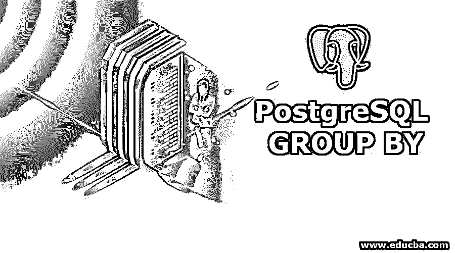
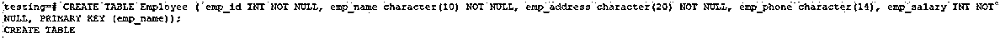
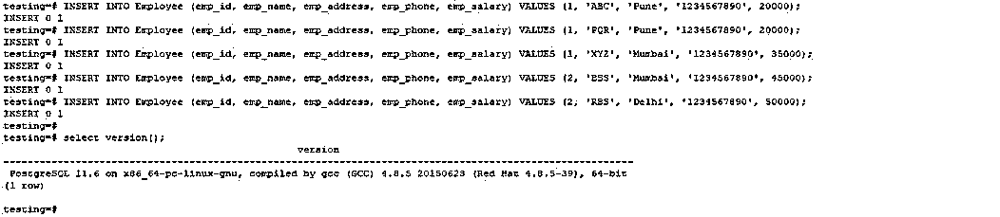
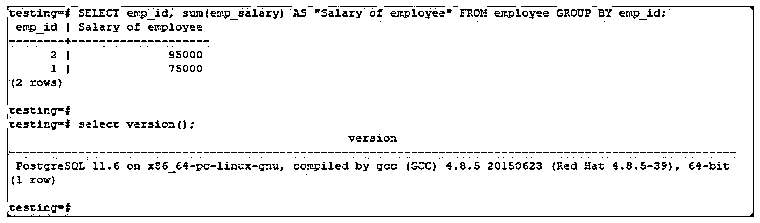
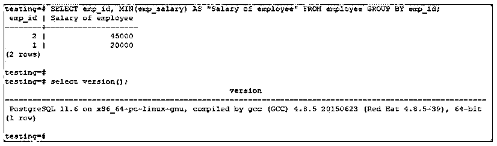
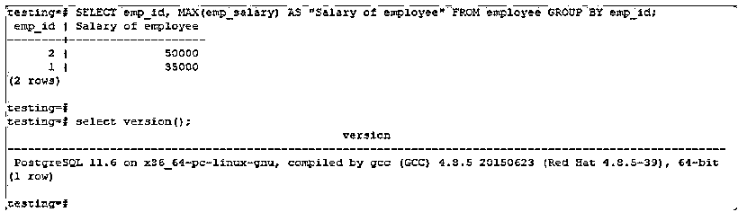
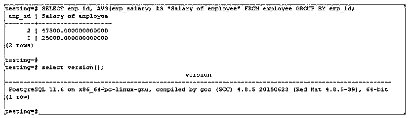
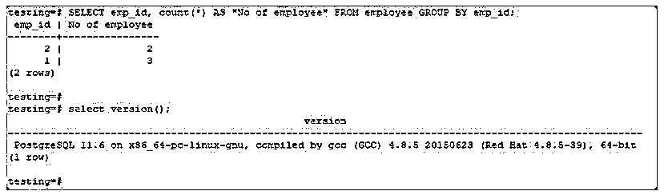

# PostgreSQL 分组依据

> 原文：<https://www.educba.com/postgresql-group-by/>

## PostgreSQL GROUP BY 简介

PostgreSQL 中的 group by 语句将 select 语句中的行分成不同的组；我们可以对 PostgreSQL group by 子句中的每个组应用一个聚合函数，group by 子句在 PostgreSQL 中将 select 语句中的行划分为多个组是非常重要的。它还用于与 select 语句协作，将输出数据分组到本质上相同的这个组中；这用于消除输出中的数据冗余，以计算适用于这些组的聚合。

### 句法

`Select expr1, expr2, …. , exprN, (Column name)
aggregate_function (expr)
From tables
Where [ condition ] GROUP BY expr1, expr2, …. , exprN`

<small>Hadoop、数据科学、统计学&其他</small>

`Select column_list (list of column we have used to fetch data from table)
From table_name (table name)
Where [ condition ] GROUP BY col1, col2, …, colN (List of column that used in group by clause)
ORDER BY col1, col2, …, colN (List of column that used in order by clause)`

`Select expr1, expr2, …. , exprN, (Column name which is used fetch data from table)
From table_name (Name of table)
Where [ condition ] GROUP BY col1, col2, …, colN (Column list)
ORDER BY col1, col2, …, colN`

下面是上述语法的参数描述:

*   **expr 1 到 expr N:** 它只是我们在表中用来从表中获取数据的列名。
*   **聚合函数:**我们在 group by 子句中使用的从表中获取数据的聚合函数可以是(SUM、MIN、AVG、MAX 和 COUNT)。
*   **表名:**我们从中检索数据的表名。
*   **Where 条件:**这是可选的。这用于选择特定的数据。
*   **Group by:** Group by 子句用于从表中检索数据。
*   **Column1 到 columnN:** 用于从表中检索数据的列数。

### PostgreSQL GROUP BY 子句如何工作？

*   PostgreSQL 中的 Group by 子句用于将具有相同数据的行组合在一起。
*   此子句用于选择语句或从表中检索相同的数据。
*   该子句将跨多条记录收集数据，并用一列或多列对结果进行分组。
*   该子句也用于减少数据的冗余。
*   Group by 子句用于将 PostgreSQL 中的冗余数据减少到无行。
*   该子句将记录分组到汇总行中，然后将大量数据返回到较小的集合中。
*   该子句将行分成较小的组，这些组在特定的列中具有相同的值。
*   此子句在 select 语句中用于将基于行值的一组行组合到特定的组或表达式中。

### 例子

我们使用雇员表来描述 PostgreSQL 中的 group by 子句。

**代码:**

`CREATE TABLE Employee ( emp_id INT NOT NULL, emp_name character(10) NOT NULL, emp_address character(20) NOT NULL, emp_phone character(14), emp_salary INT NOT NULL, PRIMARY KEY (emp_name));`

**输出:**

**代码:**

`# INSERT INTO Employee (emp_id, emp_name, emp_address, emp_phone, emp_salary) VALUES (1, 'ABC', 'Pune', '1234567890', 20000);
# INSERT INTO Employee (emp_id, emp_name, emp_address, emp_phone, emp_salary) VALUES (1, 'PQR', 'Pune', '1234567890', 20000);
# INSERT INTO Employee (emp_id, emp_name, emp_address, emp_phone, emp_salary) VALUES (1, 'XYZ', 'Mumbai', '1234567890', 35000);
# INSERT INTO Employee (emp_id, emp_name, emp_address, emp_phone, emp_salary) VALUES (2, 'BBS', 'Mumbai', '1234567890', 45000);
# INSERT INTO Employee (emp_id, emp_name, emp_address, emp_phone, emp_salary) VALUES (2, 'RBS', 'Delhi', '1234567890', 50000);`

**输出:**

#### 示例 1–使用求和函数

**代码:**

`testing=# SELECT emp_id, sum(emp_salary) AS "Salary of employee" FROM employee GROUP BY emp_id;`

**输出:**

#### 示例 2–使用最小值函数

**代码:**

`SELECT emp_id, MIN(emp_salary) AS "Salary of employee" FROM employee GROUP BY emp_id;`

**输出:**

#### 示例 3–使用最大值函数

**代码:**

`SELECT emp_id, MAX(emp_salary) AS "Salary of employee" FROM employee GROUP BY emp_id;`

**输出:**

#### 示例 4–使用 AVG 函数

**代码:**

`SELECT emp_id, AVG(emp_salary) AS "Salary of employee" FROM employee GROUP BY emp_id;`

**输出:**

#### 示例 5–使用计数函数

**代码:**

`SELECT emp_id, count(*) AS "No of employee" FROM employee GROUP BY emp_id;`

**输出:**

### 重要

*   此子句用于合并一个集合中的列数。
*   该子句用于使用 select 语句对相同数据的行进行协作。
*   相同的数据将在子句中合并。Group by 子句在 PostgreSQL 中最为[重要。](https://www.educba.com/what-is-postgresql/)
*   PostgreSQL 中的 group by 子句位于 select 语句中的 where 子句和 order by 子句之后。
*   这个子句在 PostgreSQL 中非常重要。

### 结论

Group by 子句在 PostgreSQL 中对于从单个集合中检索数据最为重要。Group by 子句在 select 语句中用于从多行中收集数据，并将结果分组到一列或多列中。相同的数据将在该子句中合并。

### 推荐文章

这是 PostgreSQL 分组指南。在这里，我们讨论介绍，它如何与不同的例子。您也可以看看以下文章，了解更多信息–

1.  [什么是 PostgreSQL？](https://www.educba.com/what-is-postgresql/)
2.  [PostgreSQL 触发器](https://www.educba.com/postgresql-triggers/)
3.  [快速浏览 MySQL 触发器](https://www.educba.com/mysql-trigger/)
4.  [PostgreSQL 视图](https://www.educba.com/postgresql-views/)