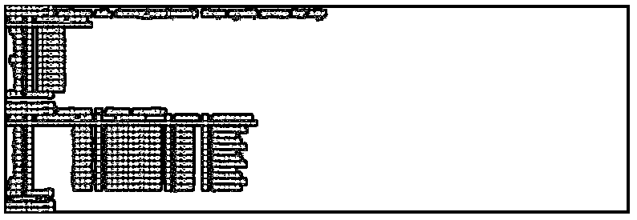
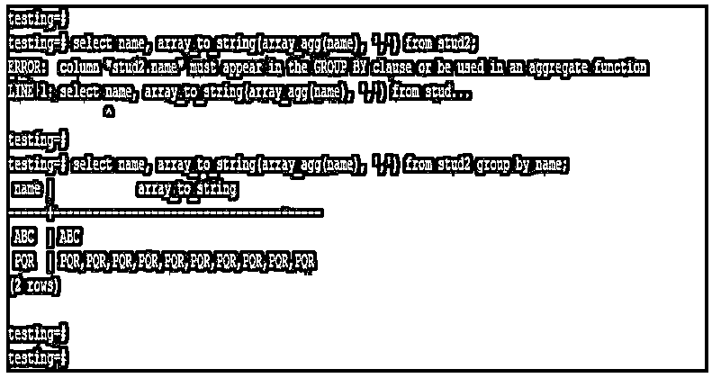
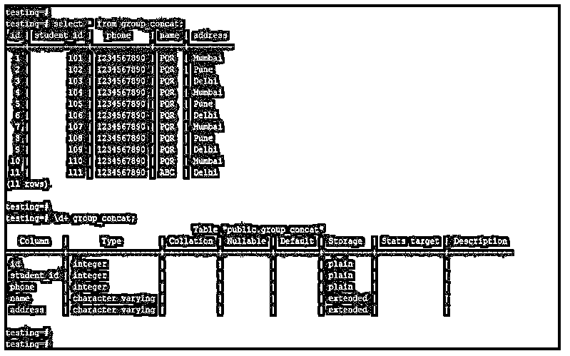
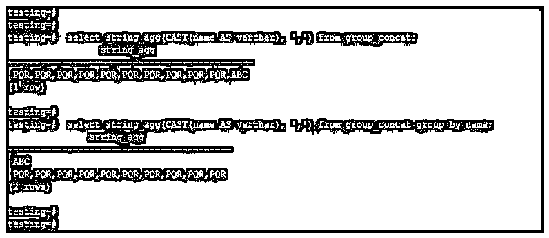
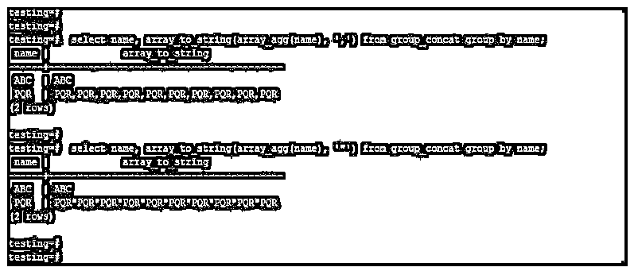
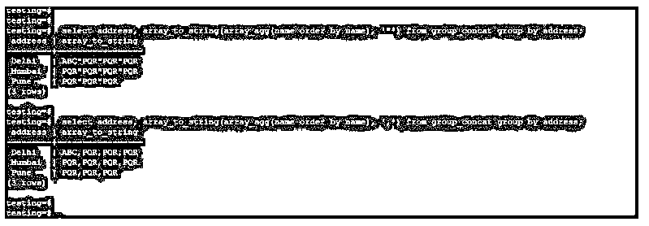

# PostgreSQL group_concat

> 原文：<https://www.educba.com/postgresql-group_concat/>

## PostgreSQL group_concat 简介

PostgreSQL group_concat 函数不可用，但我们使用了与 array_agg 和 array_to_string 相同的函数，其工作方式与 PostgreSQL 中的 group_concat 函数相同。group_concat 的 PostgreSQL 中没有可用的函数，但我们使用了 array_agg 和 array_to_string，其工作方式与 MySQL 中可用的 group_concat 相同。PostgreSQL 中的 Array_agg 函数将返回数组组的元素，array_to_string 函数将使用查询中使用的分隔符连接数组的所有值。

### PostgreSQL group_concat 的语法

下面是语法:

<small>Hadoop、数据科学、统计学&其他</small>

`Select name_of_column1, name_of_column2, name_of_column3, ….., name_of_columnN array_to_string (array_agg (name_of_column), “Value separator”) from name_of_table JOIN condition Group by condition;`

**下面是参数说明:**

*   **Select:** 该操作用于通过使用 PostgreSQL 中的 array_to_string 和 array_agg 函数来选择要连接的列值。我们可以用 array_agg 函数选择单列和多列。
*   **列名:**定义为从表中选择列名，使用 PostgreSQL 中的 array_to_string 和 array_agg 函数检索并连接列的数据。
*   **Array _ to _ string:**PostgreSQL 中的这个函数与其他数据库中使用的 group_concat 函数工作方式相同。我们可以通过使用 PostgreSQL 中的 array_agg 函数来使用这个函数。这两个函数的工作方式与 group_concat 函数相同。
*   **Array _ agg:**PostgreSQL 中的这个函数与其他数据库中使用的 group_concat 函数工作方式相同。这个函数主要用于从数组组中返回元素。在 PostgreSQL 中，这个函数对于连接列值非常重要。
*   **值分隔符:**这个定义为使用分隔符分隔列值，基本上我们可以用'，'，'；'使用 PostgreSQL 中的 array_to_string 和 array_agg 函数来分隔列值。
*   **表名:**这被定义为通过使用 PostgreSQL 中的 array_to_string 和 array_agg 函数，选择我们从中检索列值的表的名称，并连接列的数据。
*   **连接条件:**这被定义为在 PostgreSQL 中使用连接条件来连接两个特定表列数据。我们在 PostgreSQL 中使用了 array_to_string 和 array_agg 函数连接操作。
*   **Group by 条件:**该条件在 PostgreSQL 中与 array_to_string 和 array_agg 函数一起使用。

### group_concat 函数在 PostgreSQL 中是如何工作的？

*   基本上，group_concat 函数在 PostgreSQL 中是不可用的，而在 MySQL 中是可用的。我们使用 array_to_string 和 array_agg 函数，而不是在 PostgreSQL 中使用 group_concat。
*   Array_agg 函数主要用于从表中检索数组的元素。使用这个函数，我们将检索列数组元素的值。

下面的例子表明，使用 array_agg 函数后，我们只能从列中检索数组元素。

**代码:**

`select id, array_agg(name) from stud2 group by id;
select * from stud2;`

**输出:**

*   上图显示了我们在名称列上使用 array_agg 函数。在名称列上使用此函数后，它将以数组元素格式显示该列中的所有值。
*   Array_to_string 函数主要用于组合表列中的值，这些值是使用 PostgreSQL 中的 array_agg 函数从数组元素中检索的。
*   使用 Array_to_string 函数和 array_agg 函数，我们使用分隔符合并列行。
*   在 PostgreSQL 中使用 Array_to_string 和 array_agg 函数时，值分隔符是非常有用和重要的。
*   我们还使用 string_agg 函数连接 PostgreSQL 中的列值。String_agg 函数在连接 PostgreSQL 中的列值时非常有用和重要。
*   在 PostgreSQL 中，我们需要将 group by 子句与 array_to_string 函数和 array_agg 函数一起使用，如果我们没有使用 group by 子句，将会出现错误。

下面的例子说明我们需要在 PostgreSQL 中使用 group by 子句和 Array_to_string 函数以及 array_agg 函数。

**代码:**

`select name, array_to_string(array_agg(name), ',') from stud2;
select name, array_to_string(array_agg(name), ',') from stud2 group by name;`

**输出:**

*   在上面的第一个例子中，我们没有使用 group by 子句，那么它将发出错误。使用 group by 后不会出现错误，它将显示列值的串联输出。

### PostgreSQL group_concat 示例

我们使用 group_concat 表来描述 PostgreSQL 中 group_concat 函数的示例。

下面是 group_concat 表的数据和表说明。

**代码:**

`select * from group_concat;
\d+ group_concat;`

**输出:**

#### 示例#1

使用 string_agg 函数对 concat 进行分组。

*   以下示例显示了如何使用 string_agg 函数连接表列。
*   我们正在连接 group_concat 表中的 name 列。

**代码:**

`select string_agg(CAST(name AS varchar), ',') from group_concat;
select string_agg(CAST(name AS varchar), ',') from group_concat group by name;`

**输出:**

#### 实施例 2

使用 array_agg 和 array_to_string 函数对 concat 进行分组。

*   以下示例显示了在 PostgreSQL 中使用 array_agg 和 array_to_string 函数连接表列。
*   我们连接了 group_concat 表中的 name 列。

**代码:**

`select name, array_to_string(array_agg(name), ',') from group_concat group by name;
select name, array_to_string(array_agg(name), '”') from group_concat group by name;`

**输出:**

#### 实施例 3

Group concat 使用 array_agg 和 array_to_string 函数对每一列进行排序。

*   以下示例显示了 group concat 使用 PostgreSQL 中的 array_agg 和 array_to_string 函数对每一列进行排序。
*   我们使用了 group_concat 表中的 name 和 address 列。

**代码:**

`select address, array_to_string(array_agg(name order by name), '"') from group_concat group by address;
select address, array_to_string(array_agg(name order by name), ',') from group_concat group by address;`

**输出:**

### 结论

PostgreSQL 中没有 group_concat 这样的函数，而 MySQL 中有，我们使用 array_agg 和 array_to_string 函数来代替这个函数。Array_agg 和 array_to_string 函数的工作方式与 group_concat 函数在其他数据库中的工作方式相同。我们也可以在 PostgreSQL 中使用 string_agg 函数。

### 推荐文章

这是一个 PostgreSQL group_concat 的指南。这里我们讨论 PostgreSQL group_concat 的介绍，group_concat 函数如何与查询示例一起工作。您也可以看看以下文章，了解更多信息–

1.  [PostgreSQL 物化视图](https://www.educba.com/postgresql-materialized-views/)
2.  [PostgreSQL 唯一索引](https://www.educba.com/postgresql-unique-index/)
3.  [hstore in PostgreSQL](https://www.educba.com/hstore-in-postgresql/)
4.  PostgreSQL 中的[数组](https://www.educba.com/array-in-postgresql/)