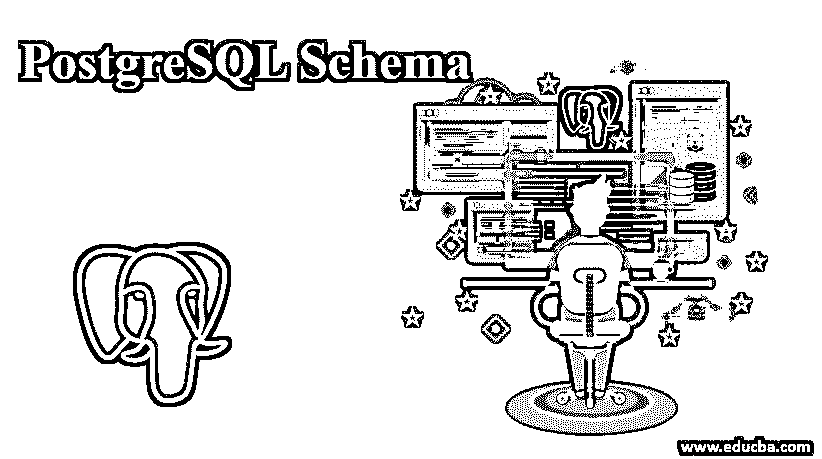
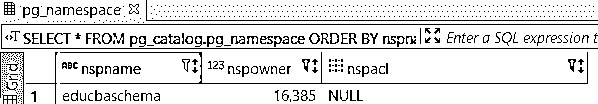
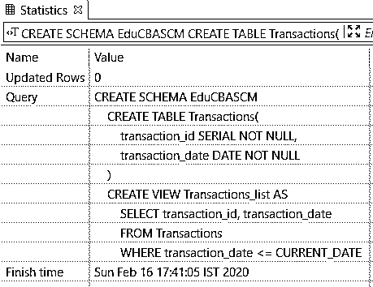
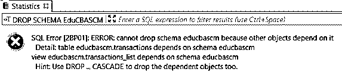

# PostgreSQL 模式

> 原文：<https://www.educba.com/postgresql-schema/>

## PostgreSQL 模式介绍

在 PostgreSQL 中，模式是数据库对象的命名集合，包含表、视图、序列、索引、数据类型、函数、运算符和其他关系。除了 PostgreSQL 模式不能嵌套之外，它们与操作系统级目录结构是对称的。

### PostgreSQL 模式的工作原理

*   数据库模式显示了部分逻辑配置或整个关系数据库。
*   根据需要的情况，可以控制对模式的访问。
*   模式的所有权是可以转移的。
*   数据库模式表示组成数据库的实体如何相互关联，包括它的视图、表、存储过程等。

### 如何创建 PostgreSQL 模式？

要创建模式，您需要使用 CREATE SCHEMA 语句。您可以为模式指定自己选择的名称。CREATE SCHEMA 语句将在当前数据库中创建一个模式。

<small>Hadoop、数据科学、统计学&其他</small>

**Note:** To execute the CREATE SCHEMA statement, the user needs to have the CREATE a special right in the current database.

**语法#1**

`CREATE SCHEMA [ IF NOT EXISTS] schema_name;`

**解释:**在 CREATE SCHEMA 子句之后，为将要创建的模式定义模式名。模式的名称在当前数据库中应该是唯一的。IF NOT EXISTS 是一个 option 子句，仅在新模式不存在时添加创建新模式的条件。如果试图创建一个新的模式，而该模式在当前数据库中已经存在，并且没有使用 IF NOT EXISTS 子句，将会导致错误。

我们还可以为特定用户创建一个模式:

**语法#2**

`CREATE SCHEMA [IF NOT EXISTS] AUTHORIZATION user_name;`

**说明:**

这类似于语法 1，唯一的区别是为特定用户创建模式时，我们需要在 AUTHORIZATION 关键字后指定 user_name，它与模式名相同。

您可以在一条语句中创建数据对象的模式和列表。

**语法#3**

`CREATE SCHEMA schema_name
CREATE TABLE table_name1 (...)
CREATE TABLE table_name2 (...)
CREATE VIEW view_name1
SELECT select_list FROM table_name1;`

**Note**: Each sub-command in the above syntax does not end with a semicolon (;).

### 实现 PostgreSQL 模式的示例

让我们借助以下示例来理解 CREATE SCHEMA 语句:

#### 示例#1

创建新模式。创建名为 EduCBASchema 的新模式:

**语法** **:**

`CREATE SCHEMA IF NOT EXISTS EduCBASchema;`

我们可以使用以下语句从当前数据库中获取所有模式。

**代码:**

`SELECT  *
FROM pg_catalog.pg_namespace
ORDER BY nspname;`

**输出:**执行上述语句后会显示以下结果:

#### 实施例 2

为特定用户创建新模式。为 EduCBA 用户创建模式:

**语法:**

`CREATE SCHEMA AUTHORIZATION EduCBA;`

在一条语句中创建模式及其对象。以下示例使用 CREATE SCHEMA 语句创建一个名为 EduCBASCM 的新架构。它还创建了一个名为“Transactions”的表和一个名为 Transactions_list 的视图，该视图属于 EduCBASCM 架构:

**代码:**

`CREATE SCHEMA EduCBASCM
CREATE TABLE Transactions(
transaction_id SERIAL NOT NULL,
transaction_date DATE NOT NULL
)
CREATE VIEW Transactions_list AS
SELECT transaction_id, transaction_date
FROM Transactions
WHERE transaction_date <= CURRENT_DATE;`

**输出:**由于上面的语句，我们将得到以下统计数据:

### 如何删除 PostgreSQL 模式？

DROP SCHEMA 用于从当前数据库中删除一个模式，并删除其所有对象。

**语法:**

`DROP SCHEMA [IF EXISTS] schema_name [ CASCADE | RESTRICT ];`

**说明:**

*   在删除我们想要删除的模式后，定义模式名
*   指定 IF EXISTS 关键字，该关键字是可选的，仅当指定的模式存在于当前数据库中时，才删除该模式。
*   使用 CASCADE 删除一个模式，它的所有对象和所有其他对象也会被删除，这取决于那些对象。
*   如果只想删除空模式，则添加 RESTRICT 关键字。

**Note:** You need to be a superuser or the schema owner to execute the DROP SCHEMA statement.

我们可以使用一行 DROP SCHEMA 语句来删除多个模式，如下所示:

**语法:**

`DROP SCHEMA [ IF EXISTS ] schema_name_1 [,schema_name_2,...] [CASCADE or RESTRICT];`

#### 示例:

为了理解删除模式的示例，我们将使用 CREATE SCHEMA 部分的一些模式。

*   **删除空模式:**以下语句用于删除 EduCBASchema 模式:

**代码:**

`DROP SCHEMA IF EXISTS EduCBASchema;`

*   **删除多个模式:**以下语句用于使用单个语句删除多模式书籍和笔记:

**代码:**

`DROP SCHEMA IF EXISTS Books, Notes;`

*   **删除非空模式:**以下语句将删除 EduCBASCM 模式。

**代码:**

`DROP SCHEMA EduCBASCM;`

上述语句的结果如下:

*   如果删除的模式为非空，并且您希望删除该模式及其对象，则应使用 CASCADE 选项，如下所示:

**代码:**

`DROP SCHEMA EduCBASCM CASCADE;`

### 使用 PostgreSQL 模式的优势

任何人都应该使用模式的原因有很多:

*   PostgreSQL 模式允许您在不干扰其他数据库的情况下使用一个数据库。
*   它将视图、索引、序列、数据类型、运算符、函数和其他关系等数据库对象组织成逻辑组，使这些对象更易于管理。
*   它用于将第三方应用程序放入单独的模式中，这使得它们不会与彼此对象的名称冲突。

### 结论

我们希望通过这篇文章，您已经了解了 PostgreSQL 模式以及如何创建和删除 PostgreSQL 模式。此外，我们希望您对 PostgreSQL 模式的工作原理及其优势有所了解。

### 推荐文章

这是一个 PostgreSQL 模式的指南。在这里，我们讨论如何创建和删除 PostgreSQL 模式，并给出了相应语法的优点和示例。您也可以浏览我们的其他相关文章，了解更多信息——

1.  [PostgreSQL 架构](https://www.educba.com/postgresql-architecture/)
2.  [PostgreSQL 交叉连接](https://www.educba.com/postgresql-cross-join/)
3.  [PostgreSQL 数据类型](https://www.educba.com/postgresql-data-types/)
4.  [PostgreSQL 别名|如何工作？](https://www.educba.com/postgresql-alias/)
5.  [PostgreSQL 限制指南](https://www.educba.com/postgresql-limit/)