# PostgreSQL 删除模式

> 原文：<https://www.educba.com/postgresql-drop-schema/>

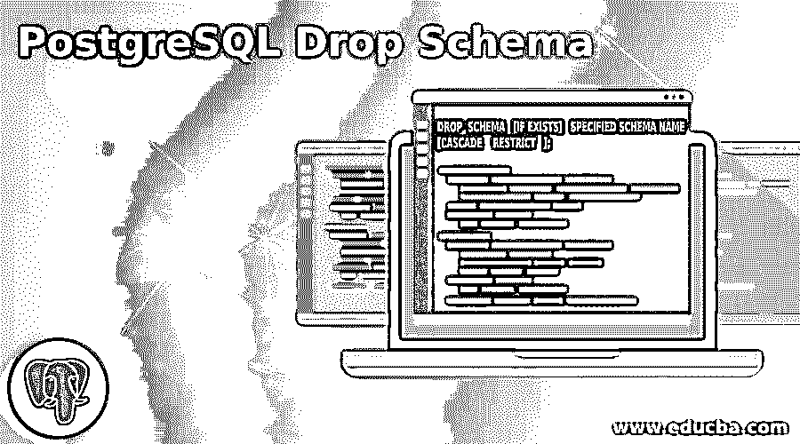

## PostgreSQL 删除模式简介

PostgreSQL 提供了一个 Drop Schema 语句。在数据库管理系统中，模式被描述为一系列数据库对象。对象由表、函数、关系和运算符组成。drop schema 语句用于从不再使用的数据库中删除模式。Drop schema 语句只能由模式的所有者或超级用户执行。在 PostgreSQL 中，它提供了通过使用 drop schema 语句同时删除多个模式的功能。在 PostgreSQL 中，我们使用不同的 drop schema 语句。最后，我们可以说 Drop schema 语句为用户提供了灵活性。

**语法:**

<small>Hadoop、数据科学、统计学&其他</small>

`DROP  SCHEMA   [IF EXISTS]   SPECIFIED SCHEMA NAME
[CASCADE    RESTRICT   ];`

**说明:**

*   在上述语法中，drop schema 语句用于从数据库中删除模式。
*   If 存在于上述语句中，是语法的可选部分。它用于检查模式是否存在。当我们在语法中包含此语句时，如果指定的模式不存在，则不会出现错误。
*   当从数据库中删除特定模式时，Cascade 是语法的一个可选部分，它还删除与该特定模式相关联的表和函数。
*   Restrict it 也是语法的可选部分。它用于确保在没有其他对象与之相关联的情况下删除模式。当模式为空时，您可以限制该子句。

### 如何使用各种方法在 PostgreSQL 中删除 Schema？

在了解 Drop schema 语句如何在 PostgreSQL 中工作之前，我们需要一些先决条件，如下所示:

*   首先，您必须在系统上安装 PostgreSQL。
*   用于检查 PostgreSQL 是否正常工作的 Service PostgreSQL status 命令。如果状态为活动，则意味着 PostgreSQL 安装成功。
*   你必须有关于 PostgreSQL 的基本知识。

现在我们创建一个新的模式来理解 drop 语句如何使用不同的方法工作。

**代码:**

`Create  schema   testschema;`

使用上面的语句，我们创建 testschema。通过使用下面的快照来说明上述声明的最终结果。

**输出:**

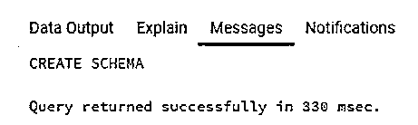

之后，我们使用下面的语句在 testschema 下创建不同的表。

**代码:**

`create   table      testschema.emp       ( emp_id   INT              NOT NULL,
emp_name VARCHAR (30)     NOT NULL,      emp_age  INT              NOT NULL,
emp_salary   DECIMAL (25, 2),        primary key (emp_id) );`

通过使用下面的快照来说明上述声明的最终结果。

**输出:**

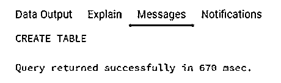

**删除模式方法:**

下面给出了删除模式的方法:

#### 1.删除架构

此方法用于从数据库中删除模式。

**语法:**

`Drop Schema   schema_name;`

**说明:**

*   在上面的语句中，drop schema 是语句，schema name 是我们需要删除的实际模式名。

**举例:**

**代码:**

`drop schema   post_schema;`

在上面的语句中，从数据库中删除 test_schema。通过使用下面的快照来说明上述声明的最终结果。

**输出:**

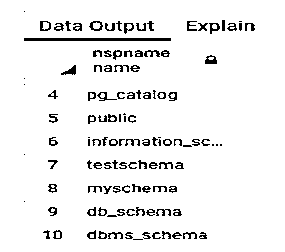

如快照所示，说明在执行上述语句之前上述语句的最终结果。

**输出:**

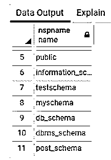

#### 2.如果存在，删除架构

这是删除模式中的第二个方法。在这个方法中，当且仅当模式存在时，我们才删除模式。

**语法:**

`Drop schema    IF EXISTS   schema name;`

**说明:**

*   在上面的语法中，where to drop schema 是一个 drop 语句，IF EXISTS 子句用于检查模式是否存在，而 schema name 是指定的我们需要删除的模式名。

**举例:**

**代码:**

`drop schema    if exists  db_schema;`

通过使用上面的语句，我们从数据库中删除了模式名 db_schema。通过使用下面的快照来说明上述声明的最终结果。

**输出:**

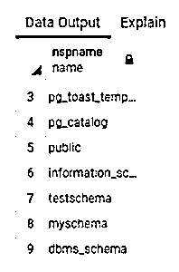

如快照所示，说明在执行上述语句之前上述语句的最终结果。

**输出:**

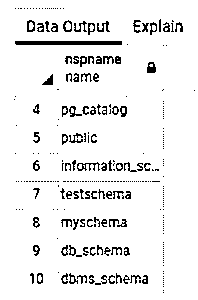

现在看看当我们执行相同的语句时会发生什么。

**代码:**

`drop schema    if exists  db_schema;`

通过使用下面的快照来说明上述声明的最终结果。

**输出:**

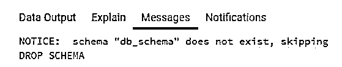

在上面的快照中，错误消息显示。

#### 3.删除模式级联

这是删除模式的第三种方法。在这种方法中，它自动删除表函数等。

**语法:**

`Drop schema    testschema,   dbms_schema;`

在上面的语句中，我们删除了模式名 testschema 和 dbms_schema，但是当我们执行上面的语句时，它返回错误消息，因为无法删除指定的对象，因为另一个对象依赖于它。通过使用下面的快照来说明上述声明的最终结果。

**输出:**

现在我们需要删除由表和函数组成的模式，只需添加 cascade 子句。

见下图快照列表中显示的模式 testschema 和 dbms_schema。

**输出:**

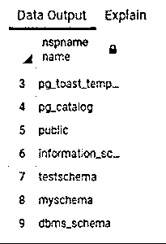

现在我们执行同样的语句。只需在语句末尾添加 cascade 子句即可。

**代码:**

`DROP SCHEMA                 testschema,                dbms_schema       cascade;`

通过使用下面的快照来说明上述声明的最终结果。

**输出:**

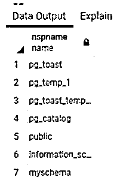

当我们使用 cascade 子句执行 drop schema 时，请注意它删除了 testschema 和 dbms_schema 以及另外两个对象或表，如 emp 和 student。通过使用下面的快照来说明上述声明的最终结果。

**输出:**

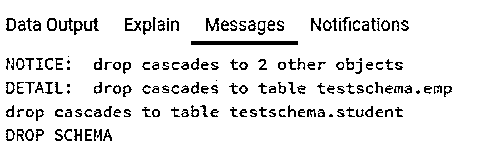

#### 4.删除多个模式

在此方法中，我们能够通过使用以下两种语法同时删除多个模式，如下所示:

**语法:**

`drop schema if exists schema name1,         schema name 2;`

**说明:**

*   在上面的语法中，如果存在具有两个模式名称的子句，如果两个模式名称都存在于数据库中，则可以删除该子句，否则会显示一条错误消息。

**举例:**

**代码:**

`drop schema     if exists   demo,  demo1;`

在上面的语句中，两个模式都存在于数据库中，因此 drop schema 语句删除这两个模式。通过使用下面的快照来说明上述声明的最终结果。

**输出:**

**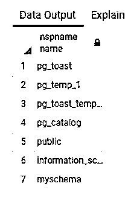

** 

**语法:**

`drop schema        schema_1,  schema_2;`

**说明:**

*   在上面的语法中，我们使用 if exists 执行 drop schema 语句。

**举例:**

**代码:**

`drop schema                     test1,               test2;`

通过使用下面的快照来说明上述声明的最终结果。

**输出:**

*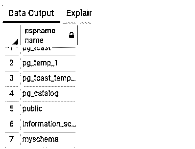

* 

如快照所示，说明在执行上述语句之前上述语句的最终结果。

**输出:**

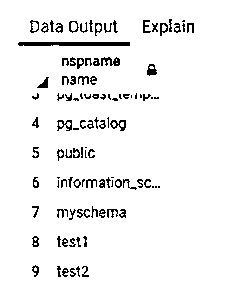

### 结论

从上面的文章中，我们看到了如何使用 can 从数据库中删除模式，以及删除模式的不同方法，如删除模式、删除模式(如果存在)以及如何通过不同的示例删除多个模式和删除模式级联。从本文中，我们看到了如何正确处理操作，因为 drop schema 是一个永久操作。

### 推荐文章

这是一个 PostgreSQL 删除模式的指南。这里我们讨论一下 PostgreSQL 中的介绍以及如何用各种方法删除 schema？您也可以看看以下文章，了解更多信息–

1.  [PostgreSQL 复制](https://www.educba.com/postgresql-replication/)
2.  [PostgreSQL 文本](https://www.educba.com/postgresql-text/)
3.  [PostgreSQL MOD()](https://www.educba.com/postgresql-mod/)
4.  [PostgreSQL TO_DATE()](https://www.educba.com/postgresql-to_date/)