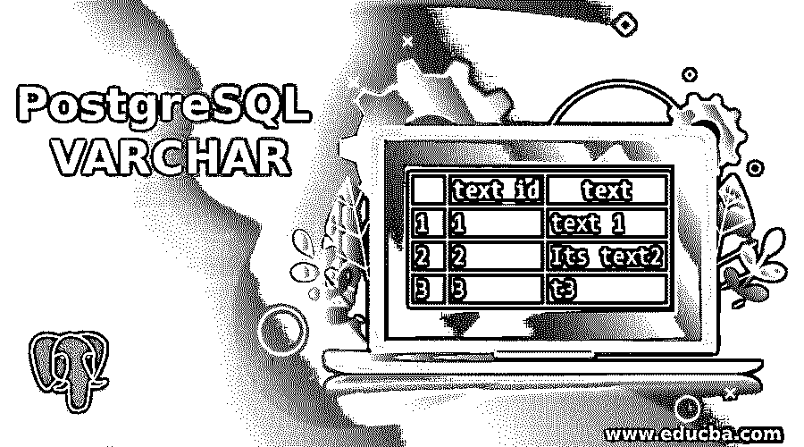
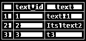
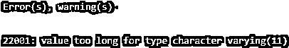
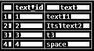
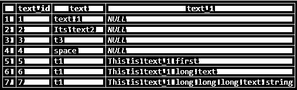

# PostgreSQL VARCHAR

> 原文：<https://www.educba.com/postgresql-varchar/>

## PostgreSQL VARCHAR 简介

PostgreSQL 支持各种数据类型；VARCHAR 数据类型用于存储字符。我们可以用 VARCHAR 指定数字来决定字符的长度。用 VARCHAR 数据类型定义的数字是一个正整数。如果文本的长度大于所定义的 VARCHAR 数据类型的长度，PostgreSQL 将抛出错误。如果我们定义的 VARCHAR 数据类型没有数字作为限制，那么它将存储无限长度的任意大小的文本字符串。VARCHAR 定义了一个数字来限制字符的数量，如 VARCHAR(n)是长度为 n 的可变字符的缩写。

**语法:**

<small>Hadoop、数据科学、统计学&其他</small>

考虑以下语法来理解 VARCHAR 数据类型

`VARCHAR(n)
Or
VARCHAR`

**说明:**

n:这定义了文本的长度或字符数。它是一个正整数。它定义了长度为 n 的可变字符。

如果没有定义“n ”,那么我们为其定义了 VARCHAR 数据类型的列将存储文本字符串，文本字符串的长度不限，大小不限。

### VARCHAR 数据类型在 PostgreSQL 中是如何工作的？

**1。**如果我们想要限制存储的字符大小，括号中的数字应该在 VARCHAR 数据类型之后定义。

**2。**如果我们用 VARCHAR 数据类型定义数字，它将存储有限制的字符。

**3。**如果我们定义了 VARCHAR 数据类型而没有数字作为限制，那么它将存储文本为无限长度的任意大小的文本字符串。

**4。**如果数字是用 VARCHAR 数据类型定义的，那么 PostgreSQL 会检查字符的长度，如果超过，就会抛出异常。

**5。**如果我们尝试插入一个全是空格的字符串，最后，PostgreSQL 会截断空格并允许它存储。

### 实现 PostgreSQL VARCHAR 的示例

以下是 PostgreSQL VARCHAR 的示例:

通常，对于使用字符数据类型，使用 VARCHAR，因为它能够存储可变长度的值。考虑一个名为 TEXTS 的表来理解 PostgreSQL VARCHAR 数据类型的示例。

让我们使用 CREATE TABLE 语句创建一个名为 TEXTS 的表，如下所示:

**查询:**

`CREATE table TEXTS
(
text_id serial PRIMARY KEY,
text VARCHAR (11) NOT NULL
);`

现在使用 INSERT INTO 语句在 TEXTS 表中插入一些数据，如下所示:

**查询:**

`INSERT INTO TEXTS (text)
VALUES
('text 1'),
('Its text2'),
('t3');`

用下面的 SQL 语句和快照说明 TEXTS 表的内容。

**查询:**

`select * from TEXTS;`

**输出:**

在上面的例子中，我们可以看到我们有一个 VARCHAR 数据类型的文本列。我们插入了不同长度值的文本值。

现在，我们将尝试在 TEXTS 表的 text 列中插入长度大于 11 的文本，如下所示。

**查询:**

`INSERT INTO TEXTS (text)
VALUES
('It is long text');`

**输出:**

如果文本的长度大于定义的 VARCHAR 数据类型的长度，PostgreSQL 将抛出错误。

现在，我们将尝试在 TEXTS 表的 text 列中插入长度大于 11 且末尾有空格的文本，如下所示:

**查询:**

`INSERT INTO TEXTS (text)
VALUES
('space            ');`

通过使用下面的 SQL 语句和一个快照，说明上述语句执行后的结果。

**查询:**

`select * from TEXTS;`

**输出:**

我们将添加一个数据类型为 VARCHAR 的列，该列没有 n，并将插入不同长度的值。

考虑以下用于添加 VARCHAR 数据类型的列的 ALTER TABLE 语句。

`ALTER TABLE TEXTS ADD COLUMN text_1 VARCHAR;`

使用下面的快照说明上述语句的结果。

现在，我们将使用 INSERT INTO 语句在 text_1 列中插入长度可变的文本字符串，如下所示:

**查询:**

`INSERT INTO TEXTS (text,text_1)
VALUES
('t1','This is text_1 first'),
('t1','This is text_1 long text' ),
('t1','This is text_1 long long long text string');`

`select * from TEXTS;`

**输出:**

在上面的例子中，我们可以看到 text_1 列包含可变长度或任意大小的文本字符串。它几乎可以接受无限大小的字符串。每当我们想要存储自由文本数据时，我们通常更喜欢使用没有数字定义的 VARCHAR 数据类型，它指定了限制。

### 结论

我们希望您已经从上面的文章中理解了 PostgreSQL VARCHAR 数据类型。此外，我们已经解释了 VARCHAR 数据类型的工作原理。，借助例子和解释的语法，我们希望你已经详细理解了 VARCHAR 数据类型。

### 推荐文章

这是一个 PostgreSQL VARCHAR 的指南。在这里，我们讨论 PostgreSQL VARCHAR 及其工作原理的介绍，并给出实际例子和不同的子查询表达式。您也可以浏览我们推荐的文章，了解更多信息——

1.  [PostgreSQL 时间戳简介](https://www.educba.com/postgresql-timestamp/)
2.  [如何在 PostgreSQL 中通知 Works？](https://www.educba.com/postgresql-notify/)
3.  [PostgreSQL JSON(示例)](https://www.educba.com/postgresql-json/)
4.  [PostgreSQL 时间戳简介](https://www.educba.com/postgresql-timestamp/)