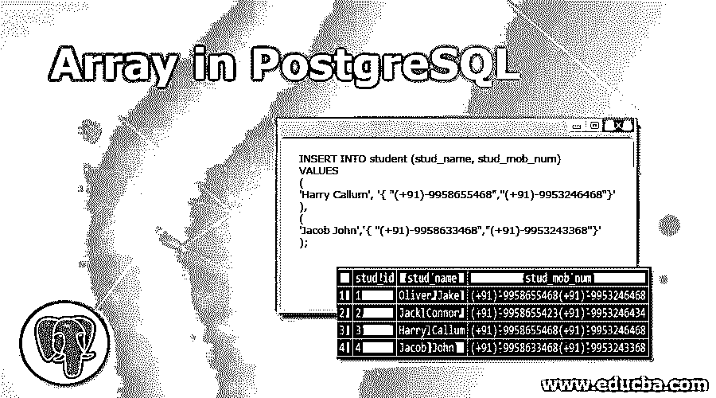
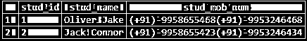
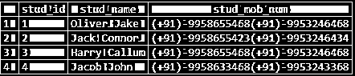
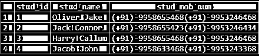
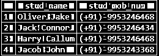
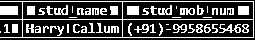
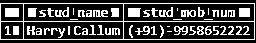
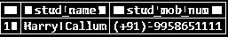
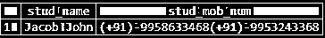
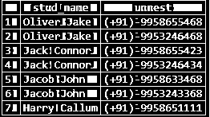

# PostgreSQL 中的数组

> 原文：<https://www.educba.com/array-in-postgresql/>

## PostgreSQL 中数组的介绍

数组在 PostgreSQL 中有着非常重要的作用。我们可以为特定的表创建可变长度的列。PostgreSQL 中定义的数据类型有自己的类型，如字符有字符[]，整数有整数[]数组等。如果我们已经指定了自己的数据类型，那么在后台，它会为定义的数据类型创建一个数组类型。我们可以为任何数据类型的任何列定义数组类型，如用户定义的类型、内置类型或枚举类型。

### 如何在 PostgreSQL 中创建数组？

为了理解数据类型插入，让我们用下面的结构创建一个“学生”表。

<small>Hadoop、数据科学、统计学&其他</small>

学生表由两列组成:

*   **stud_id:** 该列是唯一标识学生的主键列。
*   **stud_name:** 该列用于显示学生姓名
*   **stud_mob_num:** 该列以数组的形式存储学生的联系信息。

让我们使用 CREATE TABLE 语句创建表:

**查询:**

`CREATE TABLE student (
stud_id serial NOT NULL PRIMARY KEY,
stud_name VARCHAR(80) NOT NULL ,
stud_mob_num TEXT [] );`

使用以下快照和语句说明上述语句表的结果:

`SELECT * FROM student;`

### 如何在 PostgreSQL 中添加数组元素？

在数组类型列中添加元素有两种方式；我们将按如下方式逐一查看:

#### 1.使用[]下标运算符

我们可以使用下标操作符在表的数组列中插入数据，如下所示:这里，我们必须在每个元素周围使用单引号，因为我们使用[]运算符进行插入:

**查询:**

`INSERT INTO student (stud_name, stud_mob_num)
VALUES
(
‘Oliver Jake’,
ARRAY [ '(+91)-9958655468',
'(+91)-9953246468' ] ),
(
‘Jack Connor’,
ARRAY [ '(+91)-9958655423',
'(+91)-9953246434' ] );` 
用下面的快照和语句说明上述语句表的结果:

SELECT * FROM student

**输出:**

#### 2.使用{}花括号

我们可以在表格的一列中使用花括号插入数据，如下所示:这里，我们必须在每个数组元素周围使用双引号，因为我们使用{}花括号进行插入:

**查询:**

`INSERT INTO student (stud_name, stud_mob_num)
VALUES
(
'Harry Callum', '{ "(+91)-9958655468","(+91)-9953246468"}'
),
(
'Jacob John','{ "(+91)-9958633468","(+91)-9953243368"}'
);`

使用以下快照和语句说明上述语句表的结果:

`SELECT * FROM student;`

**输出:**

### 在 PostgreSQL 中实现数组操作的示例

以下是一些例子:

#### 示例# 1—访问阵列数据

*   **我们可以使用下面的快照和语句来检索数据:**

**查询:**

`SELECT * FROM student;`

**输出:**

*   **PostgreSQL 允许我们使用下标[]操作符**访问数组元素

在 PostgreSQL 中，数组元素用一个基索引进行编号，这意味着数组的基索引是一。考虑以下示例，我们将借助以下语句获得学生的姓名和第二个手机号码:

**查询:**

`SELECT
stud_name,
stud_mob_num [ 2 ] FROM
student;`

**输出:**

*   PostgreSQL 允许我们在 WHERE 子句中使用数组元素来过滤掉行。

考虑以下示例，我们将借助以下语句检查手机号码(+91)-9953243368 是否为第一个手机号码:

**查询:**

`SELECT
stud_name
FROM
student
WHERE
stud_mob_num [ 1 ] = '(+91)-9958633468';`

**输出:**

#### 示例 2–修改 PostgreSQL 数组数据

我们可以更新数组的单个元素或整个数组。

*   **更新单个元素**

我们将更新“哈里·卡勒姆”的第一个手机号码。在更新 Harry Callum 的第一个手机号码之前，我们将执行以下语句并查看快照:

**查询:**

`SELECT
stud_name,
stud_mob_num [ 1 ] FROM
student
WHERE
stud_id = 3;`

**输出:**

现在，使用以下语句更新“Harry Callum”的第一个手机号码:

**查询:**

`UPDATE student
SET stud_mob_num [ 1 ] = '(+91)-9958652222'
WHERE
stud_id = 3;` 

使用以下快照和语句说明上述语句表的结果:

`SELECT
stud_name,
stud_mob_num [ 1 ] FROM
student
WHERE
stud_id = 3;` 

**输出:**

*   **更新整个数组**

现在，我们将使用以下语句更新“Harry Callum”的整个手机号码数组:

**查询:**
`UPDATE student
SET stud_mob_num = '{"(+91)-9958651111"}'
WHERE
stud_id = 3;`
用下面的快照和语句说明上面语句表的结果:

`SELECT
stud_name,
stud_mob_num
FROM
student
WHERE
stud_id = 3;`

**输出:**

*   **PostgreSQL 数组数据搜索**

使用提供的 ANY()函数，我们可以找到任何记录，如果我们事先知道学生的手机号码，而不考虑在数组中的位置，考虑以下语句和快照:

**查询:**

`SELECT
stud_name,
stud_mob_num
FROM
student
WHERE
'(+91)-9958633468' = ANY (stud_mob_num);`

**输出:**

*   **PostgreSQL 数组展开**

使用 PostgreSQL 提供的 unnest()函数将数组扩展为行列表。考虑以下语句来扩展 stud_mob_num 数组的手机号码。

**查询:**

`SELECT
stud_name,
unnest(stud_mob_num)
FROM
student;`

**输出:**

### PostgreSQL 中数组的优势

1.  我们可以在索引的帮助下访问这些元素，从而加快访问速度。
2.  PostgreSQL 提供了各种函数来处理数组。
3.  我们可以通过使用索引来插入、更新数组元素。
4.  在数组元素上插入非常容易，因为我们可以使用多种语法，如[]运算符或{}括号。

### 结论

从上面的文章中，我们希望您已经理解了如何使用 PostgreSQL 数组数据类型以及 PostgreSQL 数组数据类型如何存储数据。此外，我们还添加了一些数组类型的示例来详细理解它。

### 推荐文章

这是一个关于 PostgreSQL 中数组的指南。在这里，我们讨论 PostgreSQL 中数组的创建和添加，以及实际的例子和不同的子查询表达式。您也可以浏览我们推荐的文章，了解更多信息——

1.  [PostgreSQL JSON(示例)](https://www.educba.com/postgresql-json/)
2.  [PostgreSQL 唯一约束](https://www.educba.com/postgresql-unique-constraint/)
3.  [PostgreSQL 连载|如何工作？](https://www.educba.com/postgresql-serial/)
4.  [PostgreSQL 随机示例](https://www.educba.com/postgresql-random/)