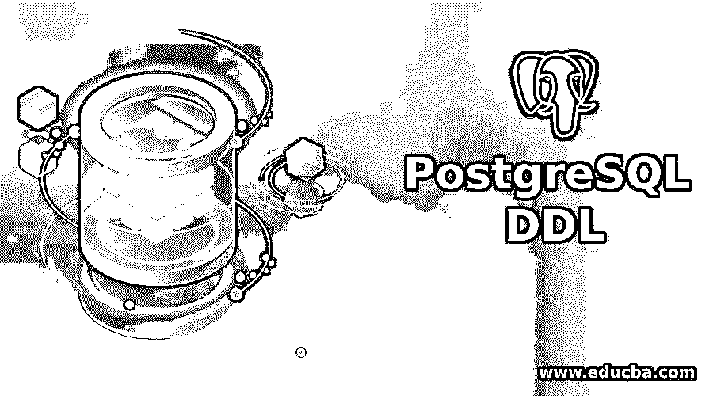
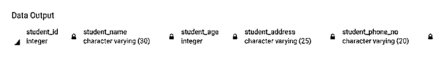
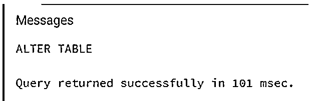
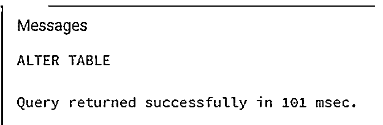
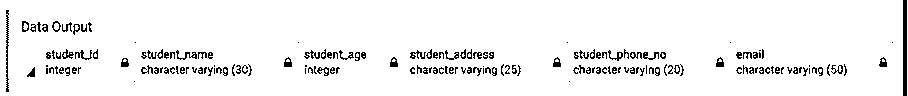
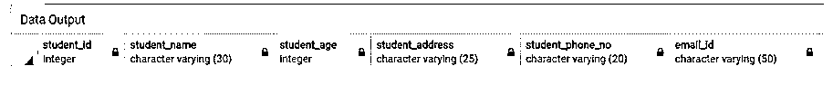
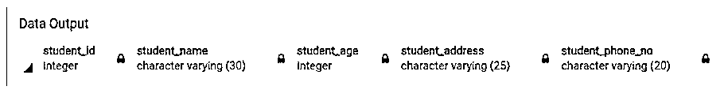
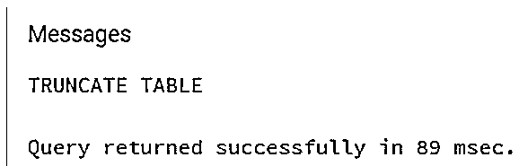
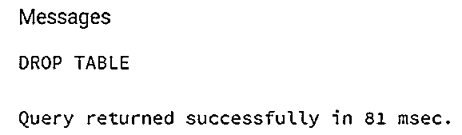

# PostgreSQL DDL

> 原文：<https://www.educba.com/postgresql-ddl/>

## PostgreSQL DDL 简介

PostgreSQL DDL 是数据定义语言的缩写。数据定义语言用于处理数据库描述和模式，并用于定义和修改数据结构。在数据定义语言的帮助下，我们决定数据应该如何存储在数据库中。我们可以通过创建新的数据库、改变现有的数据库以及删除、截断或重命名现有的数据库来对数据库执行操作。

### PostgreSQL 中的 DDL 语句是如何工作的？

*   数据定义语言用于定义和修改数据的结构。
*   这意味着数据定义语言命令可用于创建、删除或修改数据库中的表。

### PostgreSQL DDL 语句列表

数据定义语言由以下语句组成:

<small>Hadoop、数据科学、统计学&其他</small>

*   创造
*   改变
*   缩短
*   滴

#### 1.创建语句

CREATE 语句用于创建数据库对象，如数据库、表、索引、视图、存储过程、函数和触发器。

**语法:**

`CREATE TABLE <table_name>
(column_name_1 datatype,
column_name_2 datatype,
.
.
column_name_n datatype
);`

**举例:**

**代码:**

`CREATE TABLE student
(
student_id INT,
student_name VARCHAR(30),
student_age INT,
student_address VARCHAR(25),
student_phone_no VARCHAR(20)
);`

通过使用以下 SQL 语句和快照来说明上述语句的结果:

**代码:**

`Select * from student;`

**输出:**

#### 2.ALTER 语句

ALTER 语句允许修改现有的数据库对象。我们可以使用 alter 语句改变或修改数据库结构。

我们可以使用 ALTER 语句执行以下操作:

*   在表中添加一列。
*   删除现有列。
*   更改列的数据类型。

形容词（adjective 的缩写）考虑以下 ALTER 语句语法，以便在现有表中的列上添加主键。

**语法:**

`ALTER TABLE
<tableName>
ADD PRIMARY KEY (<columnName>);`

**举例:**

**代码:**

`ALTER TABLE
student
ADD PRIMARY KEY (student_id);`

b.请考虑下面的 ALTER 语句语法，以便对现有表中的列设置 NOT NULL。

**语法:**

`ALTER TABLE
<tableName>
ALTER COLUMN
<columnName>
SET NOT NULL;`

**举例:**

**代码:**

`ALTER TABLE
student
ALTER COLUMN
student_name
SET NOT NULL;`

**输出:**

碳（carbon 的缩写）考虑下面的 ALTER 语句语法，该语法用于对现有表中的列删除 NOT NULL。

**语法:**

`ALTER TABLE
<tableName>
ALTER COLUMN
<columnName>
DROP NOT NULL;`

**举例:**

**代码:**

`ALTER TABLE
student
ALTER COLUMN
student_name
DROP NOT NULL;`

**输出:**

d.考虑以下在现有表中添加新列的 ALTER 语句语法。

**语法:**

`ALTER TABLE
<tableName>
ADD <columnName data-type>;`

**举例:**

**代码:**

`ALTER TABLE
student
ADD email varchar(50);`

通过使用以下 SQL 语句和快照来说明上述语句的结果:

**代码:**

`Select * from student;`

**输出:**

考虑使用以下 ALTER 语句语法将现有列名重命名为新列名。

**语法:**

`ALTER TABLE
<tableName>
RENAME COLUMN
<oldColumnName> TO <newColumnName>;`

**举例:**

**代码:**

`ALTER TABLE
student
RENAME COLUMN
Email TO email_id;`

通过使用以下 SQL 语句和快照来说明上述语句的结果:

**代码:**

`Select * from student;`

**输出:**

考虑以下从表中删除现有列的 ALTER 语句语法。

**语法:**

`ALTER TABLE
<tableName>
DROP COLUMN
<columnName>;`

**举例:**

**代码:**

`ALTER TABLE
student
DROP COLUMN
Email_id;`

通过使用以下 SQL 语句和快照来说明上述语句的结果:

**代码:**

`Select * from student;`

**输出:**

我们可以重命名数据库对象。RENAME 语句用于重命名数据库中的表。

考虑以下重命名表中现有列的 RENAME 语句语法。

**语法:**

`ALTER TABLE <oldName>
RENAME
TO
<newName>;`

**举例:**

**代码:**

`ALTER TABLE
student
RENAME TO
studentInfo;`

#### 3.截断语句

我们可以删除表中的所有行，包括为这些行分配的所有空间。

考虑使用以下 TRUNCATE 语句语法从表中删除所有行。

**语法:**

`TRUNCATE TABLE
<tableName>;`

**举例:**

**代码:**

`TRUNCATE TABLE studentInfo;`

**输出:**

#### 4.DROP 语句

我们可以使用 DROP 语句删除数据库对象，如表、索引或视图等。

考虑以下删除整个数据库对象结构的 DROP 语句语法。

**语法:**

`DROP TABLE
<tableName>;`

运筹学

`DROP DATABASE
<databaseName>;`

**举例:**

**代码:**

`DROP TABLE studentInfo;`

**输出:**

### 结论

在本文中，我们看到了如何使用 PostgreSQL DDL 以及 PostgreSQL DDL 是如何工作的。此外，我们还添加了每个 PostgreSQL DDL 的几个示例。

### 推荐文章

这是一个 PostgreSQL DDL 的指南。这里我们讨论一下如何在 PostgreSQL 中做 DDL 语句工作以及 DDL 语句的列表。您也可以看看以下文章，了解更多信息–

1.  [PostgreSQL 更新连接](https://www.educba.com/postgresql-update-join/)
2.  [PostgreSQL 变量](https://www.educba.com/postgresql-variables/)
3.  [PostgreSQL 授权](https://www.educba.com/postgresql-grant/)
4.  [PostgreSQL 回合](https://www.educba.com/postgresql-round/)