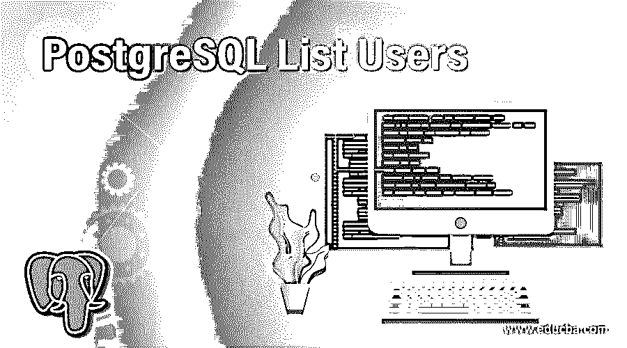
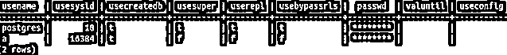
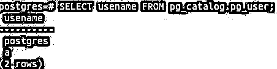
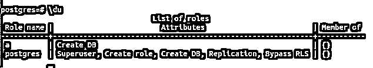
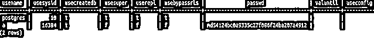
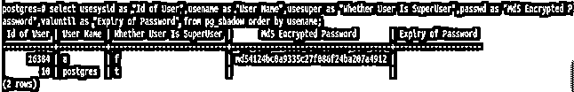

# PostgreSQL 列表用户

> 原文：<https://www.educba.com/postgresql-list-users/>

## PostgreSQL 列表用户简介

在任何数据库中，我们都需要创建并拥有多个可以访问数据库的用户。每个用户都应该有一定的访问权限，并且应该被授权。默认情况下，在 PostgreSQL 数据库服务器中有一个名为 Postgres 的默认用户。这是超级用户，拥有授予所有数据库和表的所有权利和特权。他可以自己创建新用户并为他们分配角色，授予和撤销其他用户的权限，等等。通常，超级用户或数据库管理员需要了解当前数据库服务器中的所有用户。在本文中，我们将了解如何列出当前数据库服务器中的所有用户。让我们从研究数据库中用户相关数据的存储和操作开始。

### PostgreSQL 列表用户

以下是三种不同的列表用户:

<small>Hadoop、数据科学、统计学&其他</small>

#### 1.PostgreSQL 中的用户数据

所有与用户相关的数据都存储在名为 pg_user 的表中，该表属于名为 pg_catalog 的模式。该表包含所有信息，如用户名、usesysid、usecreatedb、usesuper、userepl、usebypassrls、passwd、valuntil 和 useconfig。Username、usesysid 和 passwd 是存储在用户的 md5 哈希加密系统中的名称、id 和密码。同时，所有其他参数都是布尔参数，用于指定用户是否拥有该权限，例如 usesuper，用于指定该用户是否是超级用户。如果是，那么它包含的值为 t，代表真，否则 f 代表假。让我们看看检索到的所有其他字段在实践中意味着什么。

*   **Usecreatedb:** 这个字段告诉我们这个特定的用户是否可以创建一个新的数据库，以及是否有权限这样做。
*   我们可以在许多其他数据库中创建单个表的副本。只有拥有该权限的特定用户才能这样做。因此，如果用户拥有创建新副本的权限，此字段将设置为 true。
*   **Usebypassrls:** 仅当允许用户绕过 rls 时，该字段才设置为真

我们将首先看看如何从 pg_user 表中检索与用户相关的信息。我们需要以如下方式构建我们的查询——

**代码:**

`SELECT * FROM pg_catalog.pg_user;`

**输出:**

如果您只想获得包含其名称的用户列表，可以执行以下查询。

**代码:**

`SELECT usename FROM pg_catalog.pg_user;`

**输出:**

#### 2.使用元命令

PostgreSQL 为我们提供了一个名为 psql 的奇妙实用程序，我们可以在其中使用元命令。元命令是现成的简短实用程序，可以使用，使数据库管理员的工作变得非常容易。为了检索用户相关数据，du 是可以使用的元命令。为此，您需要在 PostgreSQL 中使用 psql 命令提示符。让我们启动这个命令，看看我们得到的结果是什么:

**代码:**

`\du`

**输出:**

*   这里，角色名称是用户的名称。角色列表，即特定用户自己拥有的角色属性。超级用户、创建角色、创建数据库、复制、绕过 RLS 是分配给超级用户的规则，这意味着超级用户可以创建新角色和用户、创建新数据库、执行现有对象的复制并绕过 RLS。
*   “成员”字段指定用户是否是任何组的成员。在 PostgreSQL 中，数据库管理员可以创建多个组，并将不同的用户添加到不同的组中，这有助于他在划分和撤销权限时正确地管理用户。如果存在任何此类组，并且该特定用户属于任何特定组，则该组的名称将显示在“成员”列中该用户的前面。
*   这个元命令在内部触发对 pg_catalog.pg_user 表的查询，以检索用户信息。这里，我们将角色名称作为用户名，角色属性列表帮助我们了解特定用户被授予了哪些特权，而字段成员告诉我们该用户是否是任何特定组(如果存在)的成员。使用\du 元命令后在内部触发的查询有点类似于下面的查询语句:

**代码:**

`SELECT u.usename AS "Role name",
CASE WHEN u.usesuper AND u.usecreatedb THEN CAST('Create DB, Superuser' AS pg_catalog.text)
WHEN u.usesuper THEN CAST('Superuser' AS pg_catalog.text) WHEN u.usecreatedb THEN CAST('Create DB' AS pg_catalog.text)
ELSE CAST('' AS pg_catalog.text) END AS "Attributes"
FROM pg_catalog.pg_user u ORDER BY 1;`

#### 3.使用 pg_shadow

获取用户列表的另一种方法是使用 pg_shadow 表，该表也包含关于 PostgreSQL 服务器中用户的信息。保留此表是为了向后兼容 8.1 之前的 PostgreSQL 版本。此表存储了可以登录的角色，并在 pg_authid 表中将 rolcanlogin 标记为 1。Pg_user 是在基表 pg_shadow table 上创建的视图，它是公开可用的。pg_shadow 只能由超级用户访问。pg_user 视图包含空白的密码字段以保持安全性。pg_ shadow 表包含数据库服务器中所有用户的 username、usesysid、usecreatedb、usesuper、userepl、usebypassrls、passwd、valuntil 和 useconfig 字段。

**代码:**

`SELECT * FROM pg_shadow;`

**输出:**

`select usesysid as "Id of User", usename as "User Name",
usesuper as "Whether User Is SuperUser", passwd as "Md5 Encrypted Password", valuntil as "Expiry of Password"
from pg_shadow order by usename;`

**输出:**

### 结论

在 PostgreSQL 数据库服务器中，我们可以通过从属于 pg_catalog 模式的 pg_user 表中检索记录来检索用户信息。还有一种方法是使用元命令\du，它在内部触发对 pg_user 表本身的查询。除此之外，还有一个名为 pg_shadow 的表，它存储有关用户的信息，并可进一步用于列出 PostgreSQL 数据库服务器中的所有用户。注意，所有这些方法的范围是整个数据库服务器。

### 推荐文章

这是 PostgreSQL 列表用户指南。这里我们讨论用户数据、用户元命令和用户 pg_shadow，并举例实现。您也可以浏览我们的其他相关文章，了解更多信息——

1.  [PostgreSQL 获取](https://www.educba.com/postgresql-fetch/)
2.  [PostgreSQL 中的外键](https://www.educba.com/foreign-key-in-postgresql/)
3.  [PostgreSQL 表](https://www.educba.com/postgresql-table/)
4.  [PostgreSQL 查询|简介|示例](https://www.educba.com/postgresql-queries/)
5.  [PostgreSQL REGEXP _ MATCHES()](https://www.educba.com/postgresql-regexp_matches/)
6.  [SQL REGEXP 指南](https://www.educba.com/sql-regexp/)