# Postgres 默认用户

> 原文：<https://www.educba.com/postgres-default-user/>

## Postgres 默认用户介绍

每个数据库服务器或集群都有许多可以访问和操作它的用户。在 Postgres 中，我们也可以有许多用户，并根据需求为这些用户分配权限。这些用户不同于操作系统登录系统可用的用户。Postgres 用户可以将数据库对象的访问权限分配给其他用户，并且可以拥有自己创建的数据库对象。但是谁是创建其他用户的第一个用户呢？每当您在系统中安装 PostgreSQL 时，还会创建一个名为 Postgres 的默认用户。它拥有所有 privilege _ types 和所有数据库对象的访问权限，可以创建和操作数据库、表、模式、视图、存储过程、函数、序列和 PostgreSQL 数据库的所有其他对象。

默认用户拥有 ident 身份验证模式的密码机制。这意味着密码没有设置为默认用户。这取决于您登录操作系统时使用的用户，PostgreSQL 的默认用户(即 Postgres 用户)也使用相同的身份验证。因此，如果您希望以默认用户身份登录 PostgreSQL，那么您登录操作系统时使用的用户应该以相同的名称出现在 PostgreSQL 中。

<small>Hadoop、数据科学、统计学&其他</small>

**打开 Postgres-**

您可以在安装 PostgreSQL 后，通过运行以下命令来检查 Postgres 用户是否已创建

`cat /etc/passwd`

这给出了以下输出–

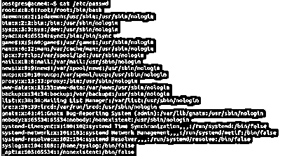

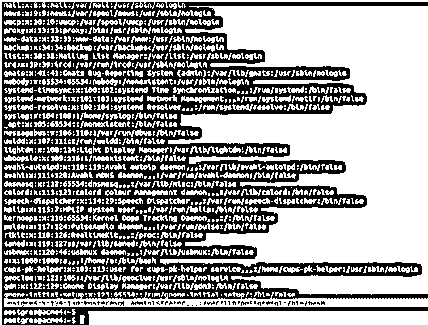

`postgres:x:124:130:PostgreSQL administrator,,,:/var/lib/postgresql:/bin/bash`

行显示 postgres 用户存在。

现在，要了解为 Postgres 设置的默认身份验证机制，您可以打开 pg_hba.conf 文件，在我的示例中，该文件位于/etc/postgresql/12/main 文件夹中，如下所示

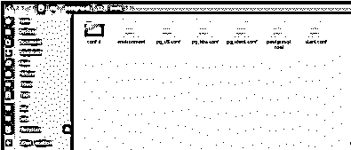

打开该文件后，您将看到以下几行显示 postgres 使用的身份验证模式

#通过 Unix 域套接字进行数据库管理登录

本地所有 postgres 标识

#类型数据库用户地址方法

#“本地”仅用于 Unix 域套接字连接

本地所有标识

# IPv4 本地连接:

托管所有 127.0.0.1/32 标识

# IPv6 本地连接:

主机全部::1/128 标识

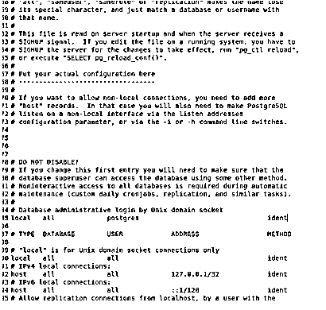

或者，您可以使用以下命令从命令行检查 PostgreSQL 数据库服务器中 Postgres 用户的身份验证模式

`cat /etc/postgresql/12/main/pg_hba.conf`

这给出了以下输出:

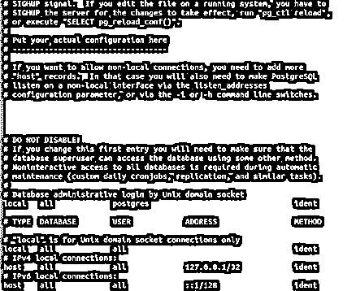

ident 身份验证模式匹配操作系统当前登录用户和您登录 Postgres 所用用户的凭据。您可以将此身份验证模式更改为 md5 或您希望的任何其他身份验证模式。

现在，让我们通过输入以下命令进入 Postgres 终端来登录 PostgreSQL

`sudo su – postgres`

然后输入 sudo 密码。

要进入 psql 命令提示符终端外壳，请输入以下命令

`psql`

并在出现提示时输入密码。

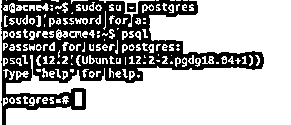

安装 PostgreSQL 后，您可以通过在存储用户信息的 pg_user 表上触发\du 元命令或 select 命令来检查 PostgreSQL 数据库服务器中的用户列表。

\du 给出以下输出–

`\du`

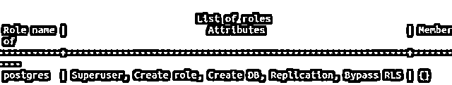

或者，在 pg_user 表上触发 select 命令，以下列方式检索 usename 列值

`SELECT usename FROM pg_user;`

在终端上给出以下结果。

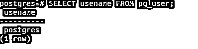

从这两个查询中，我们可以得出结论，在 PostgreSQL 数据库服务器中只存在一个名为 Postgres 的默认用户。这是超级用户。

要检查分配给用户的权限，可以在 table_privileges 表上执行查询，该表存储了与访问所有用户权限相关的信息。为了检查默认用户的访问权限，我们可以在 table_privileges 表上执行 select 查询。

我们可以通过执行以下查询来检查这一点

`SELECT table_schema as schema, table_name as table, privilege_type as privilege
FROM information_schema.table_privileges
WHERE grantee = 'postgres';`

这给出了以下输出–

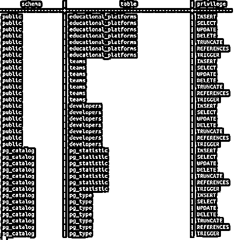

使用 postgreuser 登录后，可以通过以下方式使用命令创建用户来创建新用户。要创建名为 Payal 的新用户，您可以启动以下命令--

`CREATE USER payal;`

这将输出以下结果

要检查在创建 payal 用户后为其分配了哪些权限，可以使用\du 命令

`\du`

或者

`select usename from pg_user;`

给出以下输出

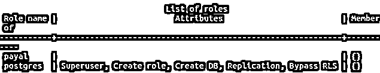

然后，对于其他权限，请使用以下 select 查询进行检查–

`SELECT table_schema as schema, table_name as table, privilege_type as privilege
FROM information_schema.table_privileges
WHERE grantee = 'payal';`

给出如下输出-

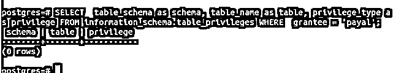

可以看到，在创建新用户时，没有为其分配任何权限。您可以使用 GRANT 和 REVOKE 命令来分配不同权限类型的权限。您应该始终使用超级用户以外的用户对数据库进行操作，并且只在执行某些需要更高权限的操作时才使用超级用户。

通过更改环境变量 PGUSER 的值，可以将默认用户更改为除 Postgres 之外的其他用户。这将使默认用户被您希望的目标用户覆盖。

### 结论

Postgres 是创建的默认用户，在我们的系统中安装 PostgreSQL 后，默认情况下您使用该用户登录您的 PostgreSQL 数据库服务器。Postgres 用户是超级用户，拥有插入、更新、删除和选择数据库对象(如表、列、视图、序列、模式、函数、存储过程等)的访问权限。我们可以通过检查 pg_hba.conf 配置文件的内容来检查 Postgres 使用的身份验证模式。默认情况下，安装后，身份验证方法设置为 ident，如果您愿意，可以进一步更改为 md5 或任何其他身份验证机制。

通过更改名为 PGUSER 的环境变量，可以更改登录 Postgres 的默认用户。您应该始终使用除超级用户之外的用户来操作 PostgreSQL 数据库，并且只有当您希望以更高的权限执行某项操作时，才应该切换到超级用户。Postgres 中所有用户的范围是整个数据库服务器或集群(如果存在的话)。

### 推荐文章

这是 Postgres 默认用户指南。在这里，我们讨论的介绍，语法，命令与例子，及其代码实现。您也可以看看以下文章，了解更多信息–

1.  [Postgres 删除级联](https://www.educba.com/postgres-delete-cascade/)
2.  [PostgreSQL 标识列](https://www.educba.com/postgresql-identity-column/)
3.  [PostgreSQL 角色](https://www.educba.com/postgresql-roles/)
4.  [PostgreSQL MIN()](https://www.educba.com/postgresql-min/)