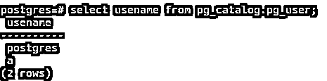
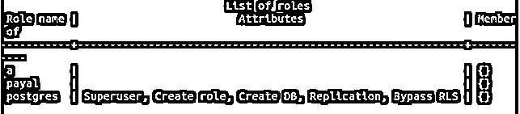
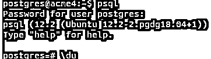
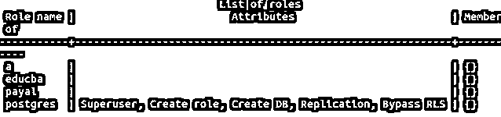
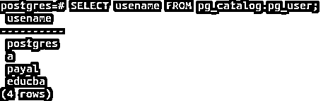

# Postgres 添加用户

> 原文：<https://www.educba.com/postgres-add-user/>

## Postgres 添加用户简介

安装 PostgreSQL 后出现在其中的默认用户是 Postgres 用户。除此之外，实时需要创建许多用户，以便可以相应地分配访问权限来维护数据库的安全性。在本文中，我们将学习如何在 PostgreSQL 中创建新用户。有两种方法可以做到。第一种方法是使用 CREATE query 语句创建新用户，第二种方法是使用元命令在 PostgreSQL 的 psql 实用程序中创建用户。我们将研究这两种方法中提供的语法和选项，还将看到如何使用上述每种方法在 PostgreSQL 中创建新用户的示例。

**语法:**

<small>Hadoop、数据科学、统计学&其他</small>

格式 1–

`CREATE USER name [ [ WITH ] option [ ... ] ]`

其中选项可以是:

`SYSID uid
CREATEDB | NOCREATEDB
| CREATEUSER | NOCREATEUSER
| [ ENCRYPTED | UNENCRYPTED ] PASSWORD 'newPassword'
| VALID UNTIL 'expirytime'`

使用上面的创建命令，可以创建新用户，同时也可以分配其他选项。

*   **Name–**是您要更改其属性或密码的用户或角色的名称。
*   **选项—**我们可以使用此格式更改与用户相关的多个参数和权限。下一节将提到一些选项属性。
*   **SYSID uID–**这是创建用户时分配给用户的用户 id，用于在数据库服务器中唯一标识用户。没必要提。如果未提及，则系统会将等于最大用户 id 加 1 的值分配给正在创建的当前用户 id。
*   **CREATEDB–**如果您想授予用户创建新数据库的权限，可以指定这个选项
*   **NOCREATEDB–**如果您想限制用户创建任何新的数据库，可以提到这一点。
*   **create user–**可以指定该属性来允许用户创建新用户。
*   **NOCREATEUSER–**当在上述格式的查询中提到该属性时，用户将无法创建新用户。
*   **ENCRYPTED–**该属性确定存储在 pg_catalog 的 pg_shadow 表中的密码是否以 MD5 加密格式存储。
*   **未加密—**密码不以加密格式存储在 pg_catalog 中。如果既未指定加密属性也未指定未加密属性，并且在创建用户时也未指定，则默认密码存储机制将根据 password_encryption 配置变量决定。
*   **密码—**新密码是您要设置为用户密码的字符串。如果未指定此字段，并且用户之前没有为其设置任何密码，则不会对用户进行任何身份验证，用户可以登录系统而无需输入密码。但是如果你切换到密码认证系统，用户将无法登录。
*   **有效期至到期时间–**如果您想将设置的密码延长至某个特定时间段，可使用该字段。此字段是您希望允许分配的密码生效的时间戳。

### Postgres 添加用户示例

我们将首先通过 Postgres 默认用户登录系统。这里我们已经将我的密码分配给了 Postgres 角色。所以，我们要输入密码。

`sudo su - postgres`

此外，让我们通过使用 psql promp 发出命令来检查数据库服务器中的所有用户

`select usename from pg_catalog.pg_user;`

或者，您可以使用 meta-command \du 来检索给出相同结果的用户详细信息。

现在，我们将在以下查询的帮助下，使用上面提到的创建用户格式，在当前数据库服务器中创建一个名为 payal 的新用户

`CREATE USER payal WITH ENCRYPTED PASSWORD 'payal@123';`

这给出了以下输出–

因为输出是创建角色。用户已成功创建。

让我们使用\du 元命令进行检查，该命令会产生以下输出–

`\du`

格式 2–

`createuser [options...] [nameofuser]`

该命令只能由超级用户用来在 PostgreSQL 中创建新用户。

*   name of user–这是要创建的用户的名称。
*   options–在创建用户中使用时，有许多可用的选项，如 A、A、E、E、D、D、I、q、N、P 等，这些选项由–sign 前置。

远程创建用户时，操作中支持的一些连接相关选项如下所述

-h nameOfHost or –host nameOfHost

它帮助我们指定运行服务器的主机的名称。

-p 端口名称或-端口名称

它帮助我们指定本地 UNIX 域的 TCP 或套接字端口，在该端口上服务器正在监听连接。

-U nameOfUser 或–username nameofuser

它有助于我们指定您想要连接的用户名。

-W 或–密码

它帮助我们指定是否要求新用户输入密码提示。

例如–

让我们使用上面的语法创建一个名为 educba 的新用户

`createuser educba;`

给出了以下输出，并要求 educba 用户输入密码-

请注意，该命令不能在 psql 命令提示符下运行，只能在 postgres shell 上运行。

让我们检查 educba 用户是否是通过登录到 psql 命令提示符并启动\du meta 命令创建的，如下所示

`Psql`

运行\du 命令会产生以下输出，其中包含我们创建的 educba 用户。

`\du`

`SELECT usename FROM pg_catalog.pg_user;`

给出以下输出–

### 结论

我们可以通过在 psql 终端上使用 CREATE query 或者在 psql shell 上使用 createuser 命令来创建多个新用户。这两种方法都提供了在 PostgreSQL 中创建用户时指定用户相关属性和其他所需细节的灵活性。

### 推荐文章

这是 Postgres 添加用户的指南。在这里，我们讨论的介绍，语法，命令与例子，及其代码实现。您也可以看看以下文章，了解更多信息–

1.  [Postgres 删除级联](https://www.educba.com/postgres-delete-cascade/)
2.  [PostgreSQL 墙](https://www.educba.com/postgresql-wal/)
3.  [PostgreSQL 日期时间](https://www.educba.com/postgresql-datetime/)
4.  [PostgreSQL 命令](https://www.educba.com/postgresql-commands/)