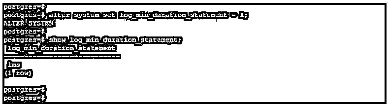
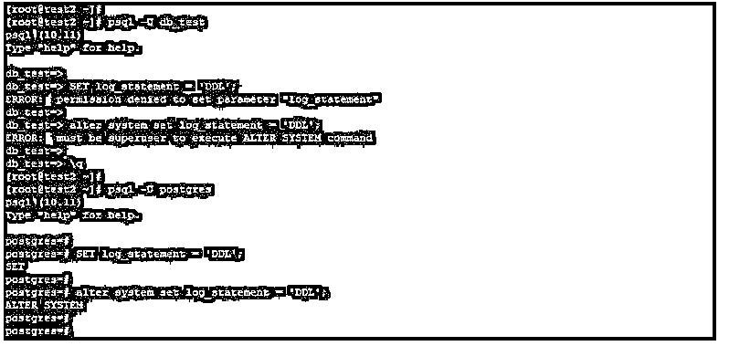
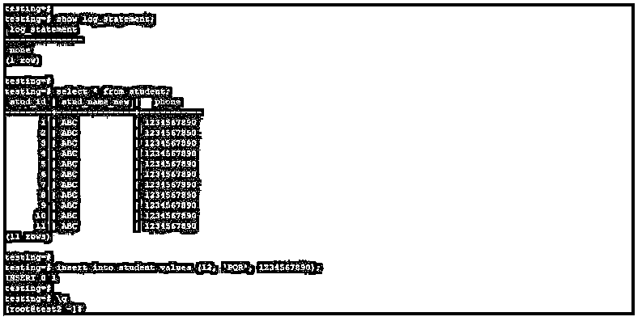
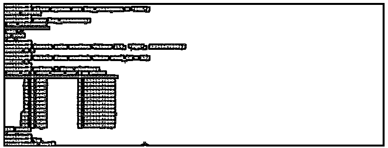
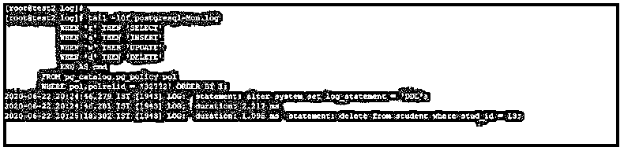
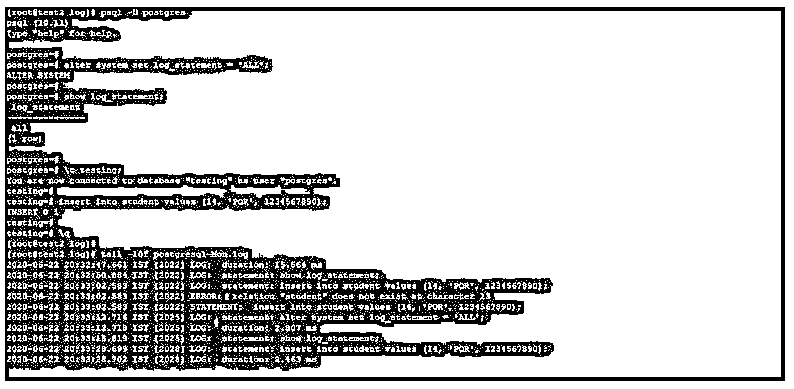
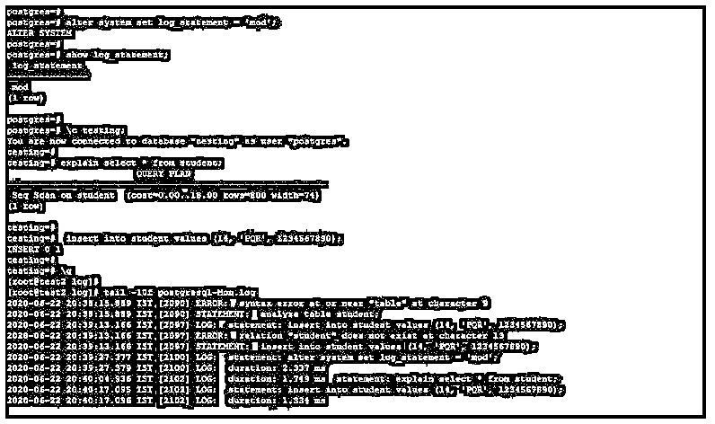

# PostgreSQL log _ 语句

> 原文：<https://www.educba.com/postgresql-log_statement/>

## PostgreSQL log_statement 简介

PostgreSQL log_statement 参数基本上与错误和报告有关，用于记录错误、警告和数据库查询，我们可以根据我们在配置文件中配置的选项在 PostgreSQL 中记录 log_statement。PostgreSQL 配置文件中的默认 log_statement 选项是 none，表示不在错误文件中记录任何内容。log_statement of error 和 SQL 查询报告有四个选项，即 none、ddl、mod 和 all，ddl 指定将所有 DDL 查询记录到错误日志中。log_statement 的所有选项被定义为记录数据库服务器的所有查询。Log_statement 是 PostgreSQL 中的重要参数。

### PostgreSQL log _ 语句的语法

下面给出了语法:

<small>Hadoop、数据科学、统计学&其他</small>

`Set log_statement = options;`

或者

`Log_statement (options or enum);`

或者

`Alter system set log_statement = options;`

#### 参数:

*   **Set:** 该关键字用于在 PostgreSQL 中设置会话级的 log_statement 参数。
*   **log_statement:** 是 PostgreSQL 中的配置参数，用来记录错误日志文件中的具体语句。日志语句有四个选项，这是我们在配置文件中配置的。
*   **选项:**该参数定义为 log_statement 的 set 选项。我们可以用 PostgreSQL 中的 log_statement 设置四个选项。
*   **Alter system:** 我们已经在 PostgreSQL 中使用 Alter system 命令设置了 log_statement 配置参数。使用 alter system 命令，我们已经在全局级别设置了此配置参数。
*   **枚举:**这是我们用 log_statement 配置参数配置的指定选项。

### log_statement 在 PostgreSQL 中如何工作？

Log_statement 是 PostgreSQL 中最基本、最重要、最有用的参数，用于记录错误日志、数据库警告消息和 SQL 查询。要使用 log_statement 参数，我们需要为日志查询设置 log_min_duration_statement 配置参数。

在下面的示例中，我们将 log_min_duration_statement 参数设置为 1ms，以运行 log_statement 参数。

**代码:**

`alter system set log_min_duration_statement = 1;
show log_min_duration_statement;`

**输出:**

如果我们想在 PostgreSQL 中设置 log_statement 配置参数，我们需要拥有超级用户权限来设置这些选项。

下面的例子说明我们需要超级用户权限来设置 PostgreSQL 中的 log_statement 参数。

**代码:**

`psql -U db_test
SET log_statement = 'DDL';
alter system set log_statement = 'DDL';
psql -U postgres
SET log_statement = 'DDL';
alter system set log_statement = 'DDL';`

**输出:**

在上面的第一个示例中，我们尝试使用 db_test 用户设置 log_statement 配置参数，但是 db_test 用户没有设置选项的权限，因此会出现错误。在第二个示例中，我们尝试使用 postgres 用户设置 log_statement 配置参数，该用户拥有在 PostgreSQL 中设置参数的超级用户权限。

**Log_statement 在 PostgreSQL 中有四个可用选项:**

*   **None:**log _ statement 的这个选项定义为不在错误日志文件中记录任何查询。这是 log_statement 可用的默认配置选项。这也被定义为 off log _ statement 参数。
*   **DDL:**log _ statement 的这个选项定义为包含 DDL 语句的 log all 查询。DDL 查询被定义为 create、alter 和 drop 语句。
*   **All:** 该选项定义为记录用户执行的所有语句。它记录了 DDL、DML 和 PostgreSQL 中的所有查询语言。我们不能在生产环境中启用此选项，因为记录所有语句会占用数据库很高的开销。它将记录数据库用户发出的所有查询。
*   **Mod:**log _ statement 中的这个选项被定义为记录 DDL 查询以及记录删除、更新、截断、插入、复制、执行和准备等修改语句。它还会将分析语句记录到错误日志中。

当我们收到来自数据库客户端或用户的消息时，会将 PostgreSQL 登录到错误日志文件中。它还将在 PostgreSQL 中报告错误时包含 bind 参数。

### 例子

下面是提到的例子:

#### 示例#1

使用 none 选项的 Log_statement。

在下面的示例中，我们对 log_statement 参数使用了 none 选项。它不会在错误日志中记录任何内容。

**代码:**

`show log_statement;
select * from student;
insert into student values (12, 'PQR', 1234567890);`

**输出:**

tail -10f postgresql-Mon.log

#### 实施例 2

使用 DDL 选项的 Log_statement。

在下面的例子中，我们使用了带有 log_statement 参数的 DDL 选项。它只会将 DDL 语句记录到错误日志中。

**代码:**

`alter system set log_statement = 'DDL';
show log_statement;
insert into student values (14, 'PQR', 1234567890);id = 13;
delete from student where stud_id = 13;
select * from student;`

**输出** **:**

tail -10f postgresql-Mon.log

#### 实施例 3

使用所有选项的 Log_statement。

在下面的例子中，我们使用了 log_statement 参数的所有选项。它会将所有语句记录到错误日志中。

**代码:**

`alter system set log_statement = 'ALL';
show log_statement;
insert into student values (14, 'PQR', 1234567890);
tail -10f postgresql-Mon.log`

**输出:**

#### 实施例 4

Log_statement 使用 mod 选项。

在下面的例子中，我们使用了带有 log_statement 参数的 mod 选项。它会将 DDL 和数据修改语句记录到错误日志中。

**代码:**

`alter system set log_statement = 'mod';
show log_statement;
explain select * from student;
insert into student values (14, 'PQR', 1234567890);
tail -10f postgresql-Mon.log`

**输出:**

### 推荐文章

这是一个 PostgreSQL log_statement 的指南。这里我们讨论 PostgreSQL log_statement 的介绍，log_statement 如何与查询示例一起工作。您也可以看看以下文章，了解更多信息–

1.  [PostgreSQL VARCHAR](https://www.educba.com/postgresql-varchar/)
2.  [PostgreSQL 日期 _ 部分()](https://www.educba.com/postgresql-date_part/)
3.  [PostgreSQL 事务](https://www.educba.com/postgresql-transaction/)
4.  [PostgreSQL 物化视图](https://www.educba.com/postgresql-materialized-views/)