# PostgreSQL 字符串函数

> 原文：<https://www.educba.com/postgresql-string-functions/>

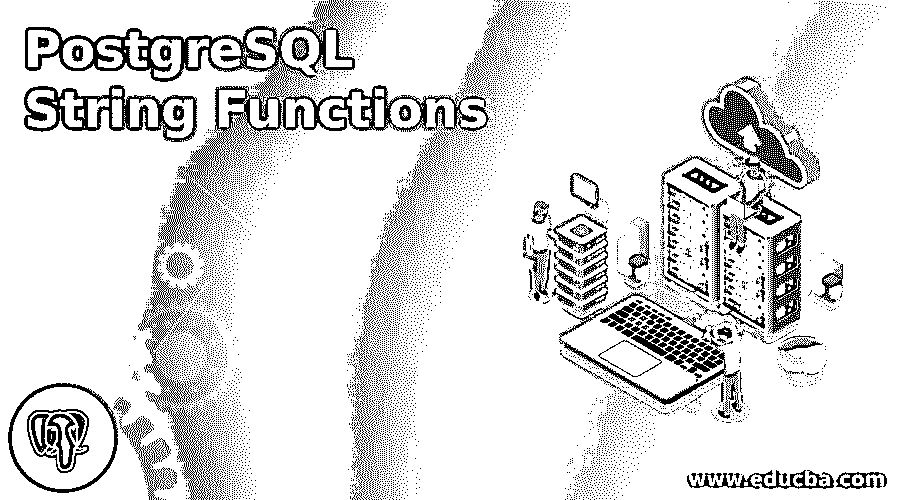

## PostgreSQL 字符串函数简介

PostgreSQL 是一个强大的对象关系数据库管理系统。它为内置数据类型提供了许多函数和操作符，从而将开发人员从简单的任务中解放出来，并专注于更大问题的解决方案。PostgreSQL 字符串函数就是这样一类内置函数。字符串格式化，如连接、以特定格式显示、插入/删除子字符串等。，有时可能是一项乏味的任务。PostgreSQL 字符串函数会为您处理这些问题。

PostgreSQL 有许多标准 SQL 函数中没有定义的函数。这为开发人员提供了一个广阔的功能范围来解决更大的问题。

<small>Hadoop、数据科学、统计学&其他</small>

为了说明各种 PostgreSQL 字符串函数，我们首先需要创建一个数据库。以下数据库将在所有示例中引用:

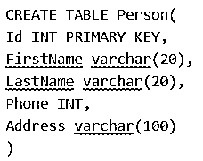

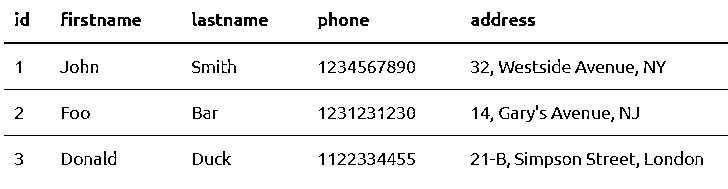

### PostgreSQL 中的字符串函数示例

这里我们将讨论如何在 PostgreSQL 中使用字符串函数。

#### 1.ASCII(字符串)

返回字符串 str 最左边字符的 ASCII 值。

`SELECT FirstName, ASCII(FirstName) from Person`

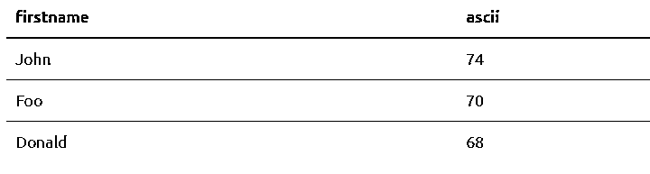

#### 2.比特长度

以位为单位返回字符串 str 的长度。

`SELECT FirstName, BIT_LENGTH(FirstName) from Person`

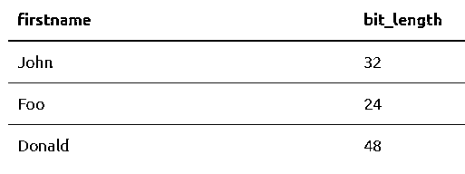

#### 3.字符长度(字符串)/字符长度(字符串)

返回字符串 str 的长度，以字符为单位。

`SELECT FirstName, CHAR_LENGTH(FirstName) from Person`

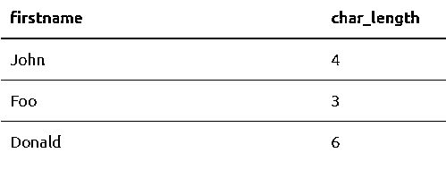

#### 4.CONCAT(str1，str2，…，strn)

返回由 str1 和 strn 连接而成的字符串。空参数被忽略。

`SELECT FirstName, LastName, CONCAT(FirstName, LastName) as DisplayName from Person`

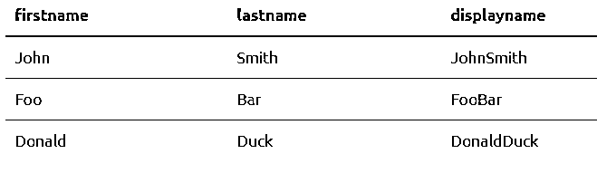

#### 5.str1 || str2 ||…||非 str ||…|| strn

连接 str1、str2 到 strn，甚至非字符串参数。

`SELECT Id || FirstName || LastName || phone || address as Concat_All from Person`

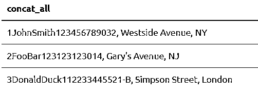

#### 6.INITCAP(str)

将字符串大写，即每个单词的第一个字母大写，其余字母小写。非字母数字分隔符决定单词。

`Select INITCAP('This is a PostgreSQL example.')`

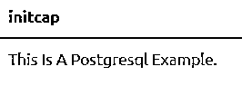

#### 7.下部()和上部()

将字符串转换为小写和大写。

`SELECT FirstName, LOWER(FirstName) as Lower, UPPER(FirstName) as Upper from Person`

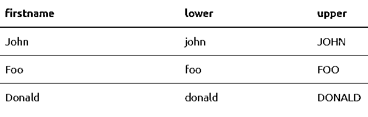

#### 8.左(字符串，长度)/右(字符串，长度)

从字符串 str 中返回最左边和最右边的 len 字符。当 len 为负时，它返回除最左侧或最右侧 len 字符之外的字符串 str。

`SELECT FirstName, LastName, CONCAT(LEFT(LastName, 3), RIGHT(FirstName, 2)) as LoginID from Person`

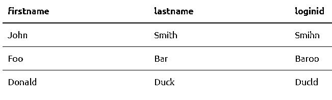

#### 9.长度(字符串)/长度(字符串，编码)

返回字符串 str 的长度，以字符为单位。不过，这不同于 SQL 中长度函数的操作。指定时，编码提供特定编码的长度。

`SELECT FirstName, LENGTH(FirstName), CHAR_LENGTH(FirstName) from Person`

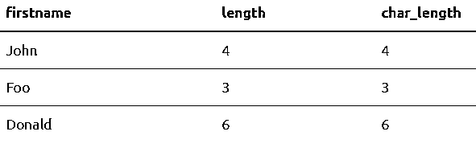

#### 10.八位字节长度(字符串)

以字节为单位计算字符串 str 的长度。

`SELECT FirstName, LENGTH(FirstName), CHAR_LENGTH(FirstName), OCTET_LENGTH(FirstName) from Person`

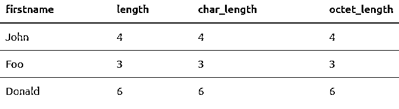

这非常类似于 LENGTH 和 CHAR_LENGTH 函数。当涉及到多字节字符时，区别就出现了。

`SELECT '€' as multibyte_char, LENGTH('€'), CHAR_LENGTH('€'), OCTET_LENGTH('€')`

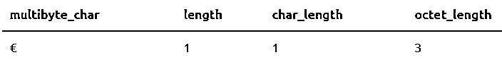

这是因为欧元符号占用了 3 个字节的内存。

#### 11.LPAD(str，len，padstr) / RPAD(str，len，padstr)

从字符串 padstr 的位置 0 开始，在字符串 str 的开头和结尾插入子字符串，直到结果字符串为 len 个字符。

`SELECT FirstName, LastName, LPAD(CONCAT_WS(' ', FirstName, LastName), CHAR_LENGTH(CONCAT_WS(' ', FirstName, LastName))+CHAR_LENGTH('Mr. '), 'Mr. ') as DisplayName from Person`

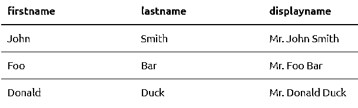

#### 12.LTRIM(str、chars) / RTRIM(str、chars) / TRIM(str、chars)

从左、右或两端修剪所有出现的字符后，返回字符串 str。如果参数中没有指定字符，空格将被删除。

`SELECT LTRIM('     abc     ') as L1, RTRIM('     abc     ') as R1, TRIM('     abc     ') as T1, LTRIM('xxxyyabcxyz', 'xyz') as L2, RTRIM('xxxyyabcxyz', 'xyz') as R2, TRIM('xxxyyabcxyz', 'xyz') as T2`

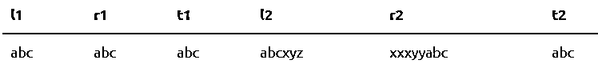

#### 13.位置(str 中的 substr)/STRPOS(str，substr)

在字符串 str 中查找子字符串 substr 的位置。记住，在 PostgreSQL 中，索引从 1 开始。如果没有找到匹配项，则返回 0。

`SELECT Address, POSITION('Avenue' in Address) from Person`

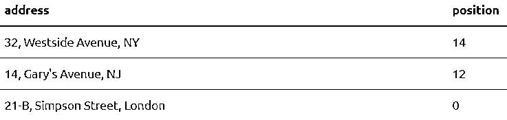

#### 14.报价标识(字符串)/报价文字(字符串)

该查询对字符串 str 加引号和不加引号。大多数特殊字符都是双倍的。

`SELECT Address, QUOTE_IDENT(Address), QUOTE_LITERAL(Address) from Person`

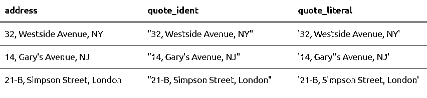

#### 15.REPLACE(str，from_str，to_str)

用字符串 str 中的子字符串 to_str 替换所有出现的子字符串 from_str。它区分大小写。

`SELECT Address, REPLACE(Address, 's', 'SS') from Person`

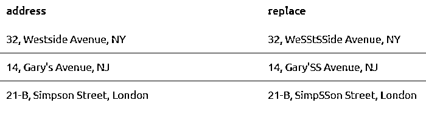

#### 16.反向(字符串)

反转字符串 str。

`SELECT FirstName, REVERSE(FirstName) from Person`

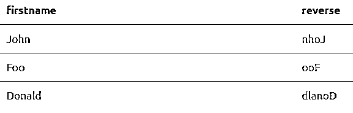

#### 17.REGEXP_MATCHES(字符串，模式)

返回与 POSIX Regex 模式匹配的所有子字符串。

`SELECT Address, REGEXP_MATCHES(Address, '.[sN]i.') from Perso`

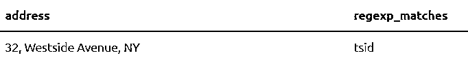

#### 18.REGEXP_REPLACE(str，pattern，newstr)

用 newstr 替换所有与 POSIX Regex 模式匹配的子字符串。

`SELECT Address, REGEXP_MATCHES(Address, '..[e][n]..'), REGEXP_REPLACE(Address, '..[e][n]..', 'Street') from Person`

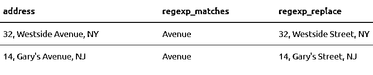

#### 19.REGEXP_SPLIT_TO_ARRAY(字符串，模式)

将字符串 str 拆分成由 POSIX Regex 模式分隔的子字符串数组。模式 E'\\s+'表示一个或多个空格。

`SELECT Address, REGEXP_SPLIT_TO_ARRAY(Address, E'\\s+') from Person`

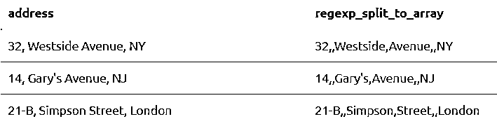

#### 20.REGEXP_SPLIT_TO_TABLE(字符串，模式)

将字符串 str 拆分成由 POSIX Regex 模式分隔的子字符串表。

`SELECT Address, REGEXP_SPLIT_TO_TABLE(Address, E'\\s+') from Person`

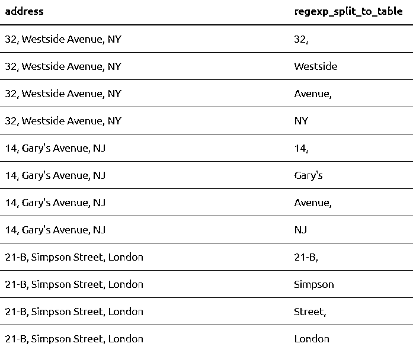

#### 21.子字符串(长度位置字符串)

从长度为 len 的位置 pos 开始，返回字符串 str 中的子字符串。

`SELECT FirstName, SUBSTRING(FirstName from 2 for 4) as a sub from Person`

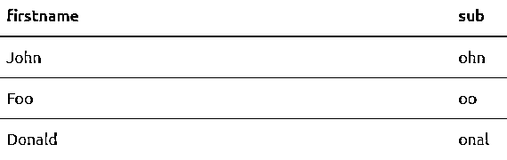

#### 22.SUBSTRING(POSIX _ pattern 中的字符串)/ SUBSTRING(用于转义的 sql_pattern 中的字符串)

从字符串 str 中返回与 POSIX Regex 或 SQL Regex 匹配的子字符串。正则表达式是计算机中一个很大的、奇妙的、有益的话题。建议在随意实现正则表达式模式之前先掌握它们。

`SELECT FirstName, SUBSTRING(FirstName from '...$') as sub1, substring(FirstName from '%#"o_a#"_%' for '#') as sub2 from Person`

### 结论

因此，总结来说，这些以及其他内置函数是 PostgreSQL 如此强大的原因。正则表达式模式的引入增加了它的功能。一旦学习并掌握了编写正则表达式模式的艺术，玩数据库就会有趣得多。

### 推荐文章

这是 PostgreSQL 字符串函数的指南。在这里，我们借助例子讨论了如何使用字符串函数。您也可以浏览我们推荐的其他文章，了解更多信息——

1.  [Java 中的字符串函数及示例](https://www.educba.com/string-functions-in-java/)
2.  [如何安装 PostgreSQL？](https://www.educba.com/install-postgresql/)
3.  [PostgreSQL 面试问题](https://www.educba.com/postgresql-interview-questions/)
4.  [Python 中的 Regex 函数(示例)](https://www.educba.com/python-regex/)
5.  [学习不同版本的 PostgreSQL](https://www.educba.com/postgresql-versions/)
6.  [不同的 PostgreSQL 架构](https://www.educba.com/postgresql-architecture/)
7.  [PostgreSQL 特性](https://www.educba.com/postgresql-features/)