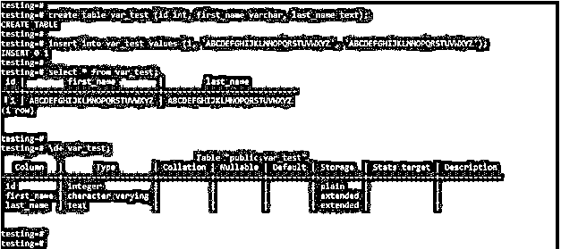
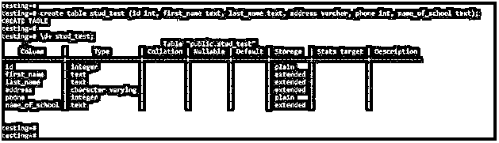
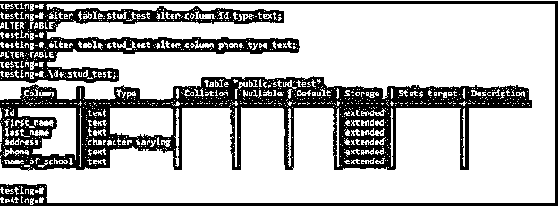

# PostgreSQL 文本

> 原文：<https://www.educba.com/postgresql-text/>

## PostgreSQL 文本介绍

PostgreSQL 文本用于定义 varchar 列的文本数据类型，文本数据类型是 PostgreSQL 中的字符数据类型。基本上，它用于存储表中的字符值。文本数据类型基本用于存储变量的无限长度；在 PostgreSQL 中，我们可以使用文本数据类型在列字段中存储无限长的变量。使用文本数据类型，我们不需要在 PostgreSQL 中定义长度说明符。

### 句法

以下是 PostgreSQL 中文本数据类型的语法:

<small>Hadoop、数据科学、统计学&其他</small>

`Text`

**或**

`Create table table_name (column_name1 data_type, column_name2 data_type,column_name3 text,column_nameN data_type)`

#### 参数

下面是 PostgreSQL 中文本数据类型的参数描述语法:

**Text:** 这是 PostgreSQL 中用来存储字符串无限长度的数据类型。我们在列上使用了文本数据类型，与 PostgreSQL 中的其他数据类型相同。

**创建:**该操作用于创建数据类型为文本的表格。我们可以在单个表中的多个列上定义文本数据类型。

**表名:**表名是在列上定义文本数据类型时必不可少的参数。表名被定义为在表列上定义文本数据类型。我们已经使用任何表来定义列上的文本数据类型。

**列名:**定义为我们定义文本数据类型的列名。在 PostgreSQL 中使用文本数据类型时，列名也是一个重要的参数。

**数据类型:**这是因为我们必须在表列上定义另一种数据类型。我们在 PostgreSQL 中使用了数据类型，比如 int、char 和 varchar。

### 文本数据类型在 PostgreSQL 中如何工作

PostgreSQL 以文本形式提供数据类型名称；基本上，它用于将任意长度的字符串存储到列字段中。基本上，在 PostgreSQL 中，我们使用 char、varchar 和 text 数据类型存储字符串。PostgreSQL 中的每种数据类型都有重要的区别。Varchar 和 text 数据类型的工作原理是一样的，但不同之处在于，在 varchar 数据类型中，我们必须定义字符的长度说明符，它被允许存储到表中。

下面的例子说明了 varchar 和 text 数据类型的工作原理是一样的，但是我们必须定义一个长度说明符来存储 varchar 数据类型中的字符值。

**代码:**

`create table var_test (id int, first_name varchar, last_name text);
insert into var_test values (1, 'ABCDEFGHIJKLMNOPQRSTUVWXYZ', 'ABCDEFGHIJKLMNOPQRSTUVWXYZ');
select * from var_test;
\d+ var_test;`

**输出:**

**说明:**在上面的例子中，我们已经创建了一个表名为 var _ test 在创建表时，我们已经在列上定义了 varchar 和 text 数据类型。创建表后，我们必须将记录插入表中。我们插入了相同的 varchar 和 text 数据类型字符串。上述示例表明，如果我们不指定 varchar 数据类型列的长度说明符，它的工作方式与 PostgreSQL 中的文本数据类型相同。

在指定 varchar 数据类型列的长度说明符时，它的作用与 text 数据类型不同。使用 PostgreSQL 中的文本数据类型，我们可以存储无限长度的字符串。文本数据类型是在列的字段中存储的最大 1 GB 的数据。在 PostgreSQL 中，Varchar 和 text 数据类型的性能是相同的。但是 varchar 只允许在列中存储 255 个字符。我们可以很容易地将文本数据类型转换成其他数据类型；此外，我们必须轻松地将其他数据类型转换成文本。

### 实现 PostgreSQL 文本的示例

下面是文本数据类型的示例:

#### 1.在创建表时为列定义文本数据类型

以下示例显示了在创建表时将数据类型定义为文本。我们已经创建了一个名为 stud_test 的表，并在列上定义了文本数据类型。

**代码:**

`create table stud_test (id int, first_name text, last_name text, address varchar, phone int, name_of_school text);
\d+ stud_test;`

**输出:**

**解释:**在上面的例子中，我们必须在 first_name、last_name 和 name_of_school 列上定义文本数据类型。此外，我们在地址列上定义了 varchar 数据类型；在定义 varchar 数据类型时，我们没有声明任何长度说明符，因此它在 PostgreSQL 中作为文本数据类型工作。在创建表时，我们已经在 id 和 phone 列上定义了 int 数据类型。

#### 2.将值插入文本数据类型列

以下示例显示了将值插入文本数据类型列。我们已经在 stud_test 表中插入了一个值。

**代码:**

`insert into stud_test (id, first_name, last_name, address, phone, name_of_school) values (1, 'First name of the student', 'last name of the student', 'Pune', 1234567890, 'School name of the student');
insert into stud_test (id, first_name, last_name, address, phone, name_of_school) values (2, 'second student first name', 'second student last name', 'Address of the student', 1234567890, 'School name of the student');
select * from stud_test;`

**输出:**

**解释:**在上面的第一个例子中，我们将值作为文本列插入；我们在 varchar 数据类型列中指定了长度说明符。在第二个示例中，我们没有在 varchar 数据类型列中指定长度说明符。

#### 3.更改列以更改列的数据类型

以下示例显示了将数据类型从另一种数据类型更改为文本。我们必须更改 id 和 phone 列的数据类型。

**代码:**

`alter table stud_test alter column id type text;
alter table stud_test alter column phone type text;
\d+ stud_test;`

**输出:**

### 推荐文章

这是一个 PostgreSQL 文本指南。这里我们讨论 PostgreSQL 文本、语法、参数、工作原理和示例的介绍。您也可以浏览我们的其他相关文章，了解更多信息——

1.  [PostgreSQL 变量](https://www.educba.com/postgresql-variables/)
2.  [PostgreSQL 解码()](https://www.educba.com/postgresql-decode/)
3.  [PostgreSQL 函数](https://www.educba.com/postgresql-functions/)
4.  [PostgreSQL 表空间](https://www.educba.com/postgresql-tablespaces/)