# PostgreSQL 约束

> 原文：<https://www.educba.com/postgresql-constraints/>

## PostgreSQL 约束的定义

PostgreSQL 约束用于对表的数据列实施规则；这对于防止无效数据进入表中非常有用。PostgreSQL 约束有利于发现重复值；他们不会接受表中的重复值或无效数据。PostgreSQL 约束确保了表中数据的准确性和可靠性。我们必须在表级和列级定义约束。表级约束应用于整个表，而列级约束仅应用于一列。

### 带示例的 PostgreSQL 约束

以下是 PostgreSQL 中可用的常用约束。

<small>Hadoop、数据科学、统计学&其他</small>

#### 1.非空约束

*   在 PostgreSQL 中，默认情况下，列接受空值；对列使用 no null 约束将不会接受列中的任何 null 值。
*   PostgreSQL 中的 Not null 约束总是被写成列约束。

**语法:**

`Create table table_name (
Column_name1 data type Not Null,
Column_nameN data type Not Null);`

下面是对上述语法的描述。

*   **Create:** 在创建表时，我们已经在列上创建了 not null 约束。
*   **表格名称:**是表格的名称。
*   **列名 1 到列名 N:** 列名。
*   **数据类型:**我们定义给列的数据类型。
*   **Not Null:** 约束名，该约束不接受列中的空值。

**例子**

下面是创建表时 not null 约束的示例。

`CREATE TABLE Employee ( emp_id INT NOT NULL, emp_name character(10) NOT NULL, emp_address character(20) NOT NULL, emp_phone character(14), emp_salary INT NOT NULL, date_of_joining date NOT NULL);`

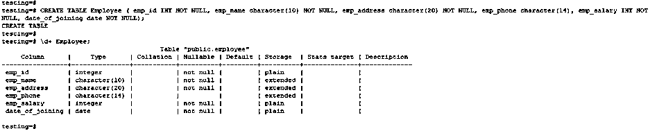

`INSERT INTO Employee (emp_id, emp_name, emp_address, emp_phone, emp_salary, date_of_joining) VALUES (1, 'ABC', 'Pune', '1234567890', 20000, '01-01-2020');
select * from Employee;`

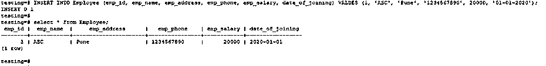

#### 2.唯一约束

*   Unique 约束与其名称 unique 相同；这将防止在表中添加两个相同的值。
*   唯一约束确保列中的所有值都相同。

**语法:**

`Create table table_name (
Column_name1 data type Not Null Unique,
Column_nameN data type Not Null Unique);`

下面是对上述语法的描述。

*   **Create:** 在创建表时，我们已经在列上创建了一个惟一约束。
*   **表格名称:**是表格的名称。
*   **列名 1 到列名 N:** 列名。
*   **数据类型:**列的数据类型。
*   **唯一:**约束名称。

**例子**

下面是创建表时唯一约束的一个示例。

`CREATE TABLE department ( dept_name character(10) NOT NULL UNIQUE, dept_id int NOT NULL UNIQUE, dept_code varchar(10));`

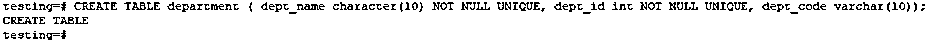

`INSERT INTO department (dept_name, dept_id, dept_code) VALUES ('IT', 101, 'IT101');`

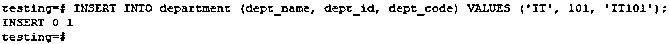

`INSERT INTO department (dept_name, dept_id, dept_code) VALUES ('IT', 101, 'IT101');`

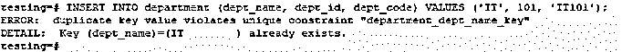

*   在第二个示例中，不允许在表中插入相同的值，因为我们在 dept_id 列上使用了惟一约束。

#### 3.主键约束

*   主约束，唯一标识数据库表中的每条记录。我们可以在一个表上定义多个 primary key 约束。在单个表上只允许有一个 primary key 约束。
*   下面是 PostgreSQL 中主键约束的示例和语法。

**语法:**

`Create table table_name (
Column_name1 data type primary key Not Null,
Column_nameN data type Not Null);`

下面是对上述语法的描述。

*   **Create:** 在创建表的时候，我们已经在列上创建了一个主约束。
*   **表格名称:**表格的名称。
*   **列名 1 到列名 N:** 列名。
*   **数据类型:**列的数据类型。
*   **主键:**约束名称。

**例子**

下面是创建表时 PostgreSQL 中主键约束的一个示例。

`CREATE TABLE Employee_test ( emp_id INT PRIMARY KEY NOT NULL, emp_name character(10) NOT NULL, emp_address character(20) NOT NULL, emp_phone character(14), emp_salary INT NOT NULL);`

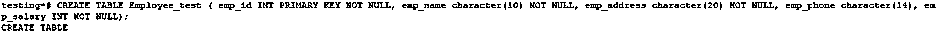

`INSERT INTO Employee_test (emp_id, emp_name, emp_address, emp_phone, emp_salary) VALUES (1, 'ABC', 'Pune', '1234567890', 20000);`

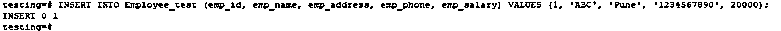

`INSERT INTO Employee_test (emp_id, emp_name, emp_address, emp_phone, emp_salary) VALUES (1, 'PQR', 'MUMBAI', '1234567880', 25000);`

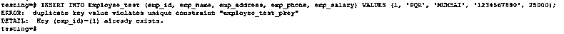

*   在第二个示例中，不允许在表中插入相同的 emp_id，因为我们在 emp_id 列上使用了 primary key 约束。

#### 4.外键约束

*   PostgreSQL 中的外键约束规定，第一个表列中的值必须与第二个表列中的值一起出现。
*   下面是 PostgreSQL 中外键约束的语法和示例。

**语法:**

`Create table table_name (
Column_name1 data type primary key Not Null,
Column_nameN data type references table_name (column_name));`

下面是对上述语法的描述。

*   **创建:**创建表语句。
*   **表格名称:**是表格的名称。
*   **Column_name1 到 column_nameN:** 列的名称。
*   **数据类型:**列的数据类型。

**例子**

下面是创建表时 PostgreSQL 中外键约束的示例。

`CREATE TABLE Employee_test1 ( emp_id INT PRIMARY KEY NOT NULL, emp_name character(10) NOT NULL, emp_address character(20) NOT NULL, emp_phone character(14), emp_salary INT NOT NULL);`

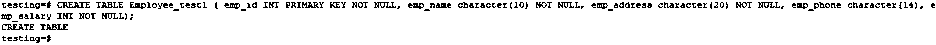

`CREATE TABLE Employee_test2 ( emp_id INT PRIMARY KEY NOT NULL, emp_name character(10) NOT NULL, emp_salary INT NOT NULL, id int references Employee_test1(emp_id));`

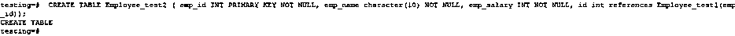

`\d+ Employee_test1;`

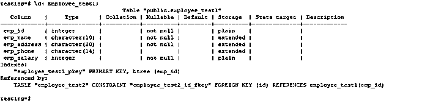

`\d+ Employee_test2;`

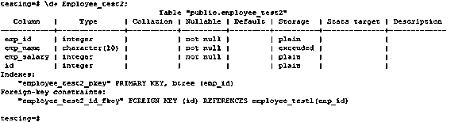

#### 5.检查约束

*   PostgreSQL 中的 Check condition 允许检查值输入到记录中的情况。
*   下面是语法，PostgreSQL 中检查约束的例子如下。

**语法:**

`Create table table_name (
Column_name1 data type primary key Not Null
Column_nameN data type Not Null check condition);`

下面是对上述语法的描述。

*   **创建:**创建表语句。
*   **表格名称:**表格的名称。
*   **列名 1 到列名 N:** 列名。
*   **数据类型:**列的数据类型。
*   **检查条件:**用条件检查约束。

**例子**

`CREATE TABLE EMP_TEST (ID INT PRIMARY KEY NOT NULL, NAME TEXT NOT NULL, SALARY REAL CHECK(SALARY > 1000));`

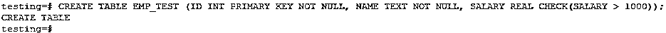

`INSERT into EMP_TEST (ID, NAME, SALARY) VALUES (1, 'ABC', 5000);`

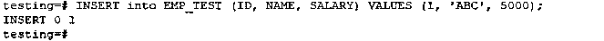

`INSERT into EMP_TEST (ID, NAME, SALARY) VALUES (1, 'ABC', 500);`

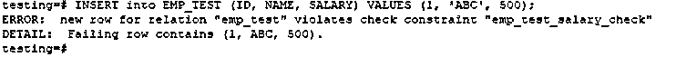

*   第二个示例 salary less 1000 不允许在表中插入，因为我们对 salary 列使用了 check 约束。

### 结论

PostgreSQL 约束有利于验证表中包含重复数据和不需要的数据的数据。我们在 PostgreSQL 中主要使用了 not null、主键、外键、检查和唯一键约束。约束是 PostgreSQL 中最重要和最有用的。

### 推荐文章

这是一个 PostgreSQL 约束的指南。这里我们讨论 PostgreSQL 中常用的约束，以及不同的例子和代码实现。您也可以看看以下文章，了解更多信息–

1.  [PostgreSQL 有什么特点？](https://www.educba.com/postgresql-features/)
2.  [PostgreSQL 架构介绍](https://www.educba.com/postgresql-architecture/)
3.  [PostgreSQL 的不同版本&特性](https://www.educba.com/postgresql-versions/)
4.  [PostgreSQL 视图指南](https://www.educba.com/postgresql-views/)
5.  [PostgreSQL 获取指南](https://www.educba.com/postgresql-fetch/)
6.  [Oracle 约束指南](https://www.educba.com/oracle-constraints/)
7.  [MySQL 约束的完整指南](https://www.educba.com/mysql-constraints/)
8.  [MySQL 中唯一键的例子](https://www.educba.com/unique-key-in-mysql/)