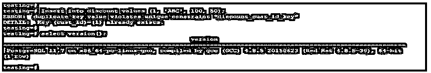
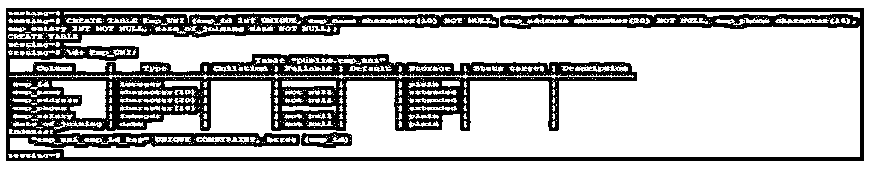
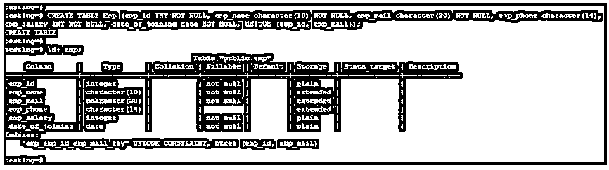
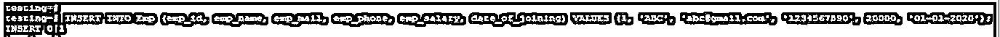
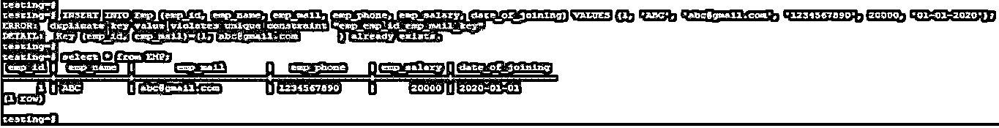
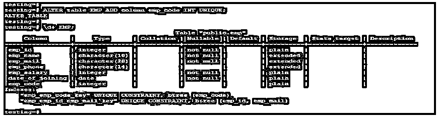

# PostgreSQL 唯一约束

> 原文：<https://www.educba.com/postgresql-unique-constraint/>

## PostgreSQL 唯一约束简介

PostgreSQL 唯一约束是直接的，即表列中的所有记录都是唯一的，在 PostgreSQL 唯一约束中不允许重复。它们声明一列或几组列行值在表的所有行中是唯一的。如果我们需要在同一列中存储唯一值，如邮件 ID 或员工 ID，我们需要在 PostgreSQL 中定义唯一约束。PostgreSQL 中的唯一约束提供了正确维护数据唯一性的唯一约束。

**语法:**

<small>Hadoop、数据科学、统计学&其他</small>

`CREATE TABLE table_name (column_name1 data type UNIQUE, column_name2 data_type,column_nameN data_type);`

上面的语法显示了在我们定义列名和数据类型时创建的唯一约束。

`CREATE TABLE table_name (column_name1 data type, column_name2 data_type,
column_nameNdata_type, UNIQUE (Column_name));`

上面的语法显示了在定义列名和数据类型之后创建的唯一约束。

`CREATE TABLE table_name (column_name1 data type, column_name2 data_type,
column_nameNdata_type, UNIQUE (Column_name1, Column_name2));`

上面的语法显示了 unique 约束是由一组多个列同时创建的。

`ALTER table table_name add column_name data_type UNIQUE;`

**下面是上述语法的参数描述:**

*   **Create:** 使用 PostgreSQL 中的唯一约束创建一个表。我们可以在表列上创建一个约束。
*   **列 1 到列 N:** 在 PostgreSQL 中创建列时使用的列名。在本专栏中，我们将创建一个唯一约束。
*   **数据类型:**数据类型定义了我们存储在表格中的数据的类型。创建表时，数据类型是最重要的。
*   **表名:**表名，我们将在该列上创建唯一约束。
*   **唯一约束:** PostgreSQL 唯一约束是直接的，即表列中的所有记录都是唯一的，不允许重复。

### 唯一约束在 PostgreSQL 中是如何工作的？

当我们创建一个唯一约束列或该列的任何组时，PostgreSQL 将自动在该列上创建一个索引。

以下示例显示索引将自动在 cust_id 列上创建:

**代码:**

`CREATE TABLE discount (cust_ID INT Unique, product_name VARCHAR (100) NOT NULL, product_price varchar (10) NOT NULL, product_discount NUMERIC);`

**输出:**

*   在上面的例子中，我们在折扣表中的 cust_id 列上创建了一个惟一约束。
*   在 cust_id 列上，Btree 索引是在对 cust_id 列使用 unique 约束时自动创建的。
*   当每次插入数据时在列上创建唯一约束时，它将检查表中所有行的重复记录。
*   如果我们正在更新列行上的值，并且该值已经存在于表中，它将发出一个错误。
*   如果我们插入一个已经存在于表中的值，它将发出类似“重复键违反唯一约束”的错误。
*   下图显示了插入相同记录后的错误消息，该记录存在于一个表中。
*   插入折扣值(1，' ABC '，100，50)；

**输出:**

*   它们声明一列或几组列行值在所有表中是唯一的。
*   在使用 alter 命令创建表之后，我们还可以在列上创建唯一约束。

### PostgreSQL 唯一约束的示例

下面是一些例子:

#### 示例#1

Unique 约束在定义列的数据类型时创建。

**代码:**

`CREATE TABLE Emp_UNI (emp_id INT UNIQUE, emp_name character(10) NOT NULL, emp_address character(20) NOT NULL, emp_phone character(14), emp_salary INT NOT NULL, date_of_joining date NOT NULL);< >`

**输出:**

在上面的例子中，我们在 emp_id 列上创建了一个惟一约束；定义唯一约束后，索引将自动在 emp_id 列上创建。默认情况下，它会在 emp_id 列上创建一个 Btree 索引。

#### 实施例 2

唯一约束在定义列的数据类型后创建。

**代码:**

`CREATE TABLE dis_uni (cust_ID INT, product_name VARCHAR (100) NOT NULL, product_price varchar (10) NOT NULL, product_discount NUMERIC, UNIQUE (CUST_ID));`

**输出:**

在上面的例子中，我们在 cust_id 列上创建了一个惟一约束。我们在定义列数据类型后创建这个唯一约束。

#### 实施例 3

在多个列上创建唯一约束。

**代码:**

`CREATE TABLE Emp (emp_id INT NOT NULL, emp_name character(10) NOT NULL, emp_mail character(20) NOT NULL, emp_phone character(14), emp_salary INT NOT NULL, date_of_joining date NOT NULL, UNIQUE (emp_id, emp_mail));`

**输出:**

在上面的例子中，我们在 emp_id 和 emp_mail 列上创建了一个索引。同时，在创建表时，我们在多个列上创建一个惟一的约束。

#### 实施例 4

在对列创建唯一约束后，在表中插入记录。

下面的例子表明我们必须在 EMP 表中插入一条记录。

**代码:**

`INSERT INTO Emp (emp_id, emp_name, emp_mail, emp_phone, emp_salary, date_of_joining) VALUES (1, 'ABC', 'abc@gmail.com', '1234567890', 20000, '01-01-2020');` 

**输出:**

**代码:**

`INSERT INTO Emp (emp_id, emp_name, emp_mail, emp_phone, emp_salary, date_of_joining) VALUES (1, 'ABC', 'abc@gmail.com', '1234567890', 20000, '01-01-2020');
select * from EMP;`

**输出:**

在第一个例子中，我们插入了一条记录，它将正确无误地插入。但是第二次，它会发出一个错误，因为重复的键值违反了唯一约束。

#### 实施例 5

Alter table 向现有表中添加一列，并在该表上添加一个唯一约束。

**代码:**

`ALTER table EMP ADD column emp_code INT UNIQUE;`

**输出:**

### 结论

PostgreSQL 唯一约束声明一列或几组列行值在所有表中是唯一的。如果我们需要在同一列中存储惟一的值，如雇员 ID 或雇员邮件，我们需要定义惟一的约束。

### 推荐文章

这是 PostgreSQL 唯一约束的指南。在这里，我们讨论介绍，唯一约束如何在 PostgreSQL 与各自的例子工作。您也可以看看以下文章，了解更多信息–

1.  [PostgreSQL 中的外键](https://www.educba.com/foreign-key-in-postgresql/)
2.  [PostgreSQL 表](https://www.educba.com/postgresql-table/)
3.  [SQL 中的唯一键](https://www.educba.com/unique-key-in-sql/)
4.  [PostgreSQL 版本](https://www.educba.com/postgresql-versions/)
5.  [PostgreSQL RANK() |如何工作？](https://www.educba.com/postgresql-rank/)