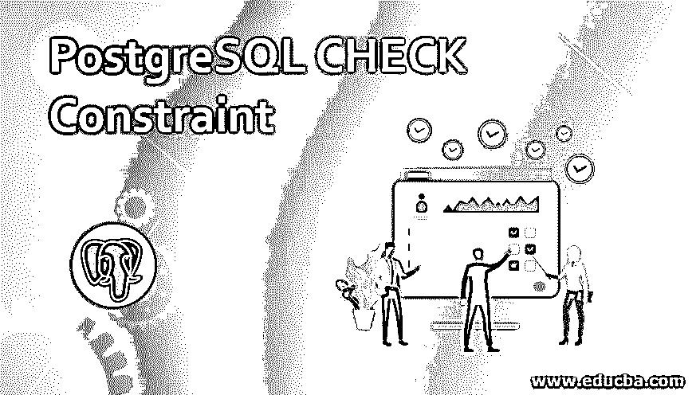
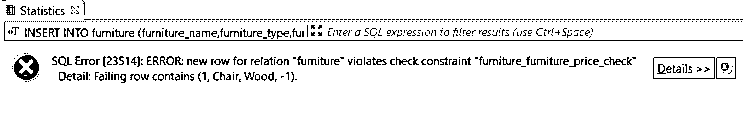
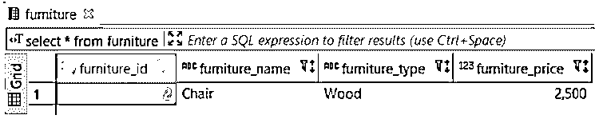
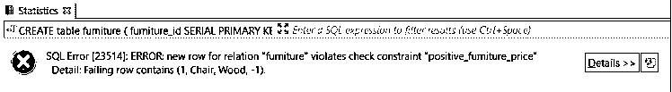
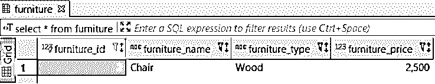
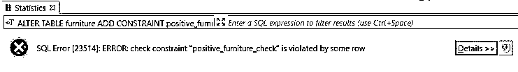
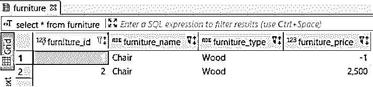

# PostgreSQL 检查约束

> 原文：<https://www.educba.com/postgresql-check-constraint/>

## PostgreSQL 检查约束简介

借助 PostgreSQL 检查约束，我们可以控制插入到表中的列的值。我们可以定义一个条件，用 PostgreSQL CHECK 约束来决定将哪些值插入表中，哪些值不插入表中。关键字 CHECK 用于定义 CHECK 约束，后面是括号中定义的条件。

**语法**

<small>Hadoop、数据科学、统计学&其他</small>

`column CHECK condition`

**解释**

**列:**我们在其上添加检查约束的列的定义。

**检查:**添加约束的关键字

**条件:**一个条件，后跟 CHECK 关键字，用于决定在表中插入或更新值。

### PostgreSQL 中的检查约束是如何工作的？

*   PostgreSQL 检查约束使用条件返回的布尔值来决定是否应该插入该值。
*   如果特定值满足定义的条件，则该值可以插入到表中。
*   如果不满足定义的条件，则在更新或插入操作时将拒绝该值。

### 在 PostgreSQL 中实现检查约束的示例

让我们创建桌子家具，以便详细理解 PostgreSQL 检查约束。

#### 1.具有默认名称的 PostgreSQL 检查约束

为了理解使用 CREATE TABLE 语句的示例，让我们创建一个名为“furniture”的表，如下所示:

`CREATE table furniture
(
furniture_id SERIAL PRIMARY KEY,
furniture_name VARCHAR (256) NOT null,
furniture_type VARCHAR (256) NOT null,
furniture_price int NULL CHECK(furniture_price > 0)
);`

现在尝试将负家具价格插入家具表。

`INSERT INTO furniture (furniture_name,furniture_type,furniture_price)
VALUES
('Chair','Wood',-1);`

在执行上述语句后，我们将得到以下错误，因为 funiture_price 不能插入负值。考虑下面的快照来说明结果。

因此，上面的 insert 语句失败了，因为我们试图在“furniture”表的 furniture_price 列中插入负值。

现在，我们将在“家具”表的家具价格列中插入正值，如下所示:

`INSERT INTO furniture (furniture_name,furniture_type,furniture_price)
VALUES
('Chair','Wood',2500);`

上面的语句将成功地在家具表中插入记录，因为家具的价格是正数

让我们借助以下 SQL 语句和快照来检查“furniture”表的状态:

`select * from furniture;`

PostgreSQL 检查约束的名称默认采用以下模式:

`{table}_{column}_check`

类似地，桌子家具对 furniture_price 价格列有约束，其赋值如下:

`furniture_furniture_price_check`

#### 2.具有指定名称的 PostgreSQL 检查约束

但是，我们可以按如下方式分配 PostgreSQL 检查约束名称:

`column_name data_type CONSTRAINT constraint_name CHECK condition`

我们需要在 constraint 关键字后指定约束名称，如上所示。

让我们创建一个名为“furniture”的表，以便理解使用 CREATE TABLE 语句分配 positive_furniture_price 约束名称的示例，如下所示:

`CREATE table furniture
(
furniture_id SERIAL PRIMARY KEY,
furniture_name VARCHAR (256) NOT null,
furniture_type VARCHAR (256) NOT null,
furniture_price int NULL CONSTRAINT positive_furniture_price CHECK(furniture_price > 0)
);`

现在尝试将负家具价格插入家具表。

`INSERT INTO furniture (furniture_name,furniture_type,furniture_price)
VALUES
('Chair','Wood',-1);`

在执行上述语句后，我们将得到以下错误，因为 funiture_price 不能插入负值。考虑以下快照，并验证约束名称是否为“positive_furniture_price”。

现在，我们将在“家具”表的家具价格列中插入正值，如下所示:

`INSERT INTO furniture (furniture_name,furniture_type,furniture_price)
VALUES
('Chair','Wood',2500);`

上面的语句将成功地在家具表中插入记录，因为家具的价格是正数。

让我们借助以下 SQL 语句和快照来检查“furniture”表的状态:

`select * from furniture;`

#### 3.在现有表上添加检查约束

为了理解示例，让我们创建一个名为“furniture”的表:

`CREATE table furniture
(
furniture_id SERIAL PRIMARY KEY,
furniture_name VARCHAR (256) NOT null,
furniture_type VARCHAR (256) NOT null,
furniture_price int NULL
);`

现在，借助以下语句，使用 ALTER TABLE 语句在 furniture_price 表上添加约束:

`ALTER TABLE furniture ADD CONSTRAINT positive_furniture_check CHECK (
furniture_price > 0
);`

如果表中包含在对列添加约束之前已经存在负值的任何行，我们将得到以下错误:

#### 4.删除表的检查约束

现在，借助以下语句，使用 ALTER TABLE 语句删除在 furniture_price 表上第 3 点中添加的检查约束:

ALTER TABLE furniture DROP CONSTRAINT positive _ furniture _ check 现在该表没有为任何列分配任何 CHECK 约束，因此我们可以在 furniture 表中插入正值或负值。

让我们使用 INSERT TABLE 语句来验证插入，如下所示:

`INSERT INTO furniture (furniture_name,furniture_type,furniture_price)
VALUES
('Chair','Wood',-1),
('Chair','Wood',2500);`

在上面的例子中，我们在家具表中插入了一个正值和一个负值。

借助下面的语句和快照说明上面语句的结果

`select * from furniture;`

### 结论

我们希望通过上面的文章，您已经理解了如何使用 PostgreSQL CHECK 约束，以及 PostgreSQL CHECK 约束如何使用 condition 来插入或更新值。此外，我们还添加了一些 PostgreSQL 检查约束的示例来详细理解它。

### 推荐文章

这是一个 PostgreSQL 检查约束的指南。这里我们讨论在 PostgreSQL 中实现检查约束的例子。您也可以看看以下文章，了解更多信息–

1.  [PostgreSQL 数据库](https://www.educba.com/postgresql-database/)
2.  [安装 PostgreSQL](https://www.educba.com/install-postgresql/)
3.  [SQL 左连接](https://www.educba.com/sql-left-join/)
4.  [自然连接 SQL](https://www.educba.com/natural-join-sql/)