# PostgreSQL INTERSECT

> 原文：<https://www.educba.com/postgresql-intersect/>

## PostgreSQL 中的 INTERSECT 简介

PostgreSQL INTERSECT 将组合两个或多个 select 语句的结果，就像 PostgreSQL 中的 union 和 except 操作一样。它将合并两个或多个 select 语句的结果。它将两个或多个 select 语句结果集合并成一个结果集。

该运算符返回在两个结果集中均可用的行。通过使用该操作符，我们可以将一个或多个 select 查询结果集合并成一个结果集，在 PostgreSQL 中它更加有用和重要。

<small>Hadoop、数据科学、统计学&其他</small>

**语法 1**

`Select Column_name1, Column_name2, …, Column_nameN from table1
INTERSECT
Select Column_name1, Column_name2, …, Column_nameN from table2
Where condition`

**语法 2**

`Select expression1, expression2, …, expressionN from table1
INTERSECT
Select expression 1, expression 2, …, expressionN from table2
Where condition`

**语法 3**

`elect * from table1
INTERSECT
Select * from table2
Where condition`

下面是对上述语法的参数描述如下:

*   **Select:** Select 语句用于从表中选择第几列。
*   **Column1 到 ColumnN:**select 语句中使用的列，使用该列提取结果
*   PostgreSQL 中的 intersect。
*   **expression 1 to expression n:**select 语句中用于获取结果的列
*   PostgreSQL 中的 intersect。
*   .**表 1 和表 2:** 使用 PostgreSQL 中的运算符检索数据的表。
*   **Intersect:** 该操作符用于将两个或多个选择查询的结果组合成一个结果集。
*   **From:** 关键字，定义我们从中取数的表。
*   **Where condition:**Where condition 用于取特定条件的数据。
*   **星号(*):** 从指定的表中检索结果集中的所有列。

### PostgreSQL 中的 INTERSECT 运算符是如何工作的？

*   它将用于将两个或多个 select 语句组合成一个查询，并从两个数据集中检索匹配的行。
*   下面是 INTERSECT 的图片表示如下:

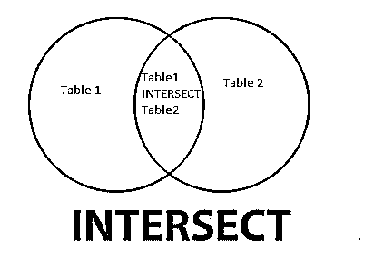

*   上图显示了表 1 和表 2 的交集。表 1 和表 2 的交集结果与单个结果集相结合。
*   只有在两个结果集中都有重复数据的情况下，才使用运算符。
*   intersect 仅获取结果集中的可用数据，在 PostgreSQL 中使用 INTERSECT 获取重复数据。
*   我们没有在 INTERSECT 操作符中使用 order by 子句来按升序或降序提取数据。
*   该运算符将两个或多个数据集的交集返回到单个结果数据集中。
*   select 语句将定义 INTERSECT 中的每个数据集，每个数据集中存在的记录都将包含在结果集中。

### PostgreSQL INTERSECT 运算符示例

为了在 PostgreSQL 中使用 INTERSECT 运算符，我们使用 emp_test1 和 emp_test2 表来描述 PostgreSQL 中的 INTERSECT。

#### 表 1: emp_test1

`CREATE TABLE emp_test1 ( emp_id INT NOT NULL, emp_name character(10) NOT NULL, emp_address character(20) NOT NULL, emp_phone character(14), emp_salary INT NOT NULL, date_of_joining date NOT NULL, PRIMARY KEY (emp_id));`

**输出:**

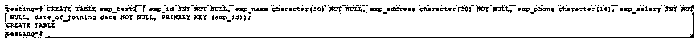

`INSERT INTO emp_test1 (emp_id, emp_name, emp_address, emp_phone, emp_salary, date_of_joining) VALUES (1, 'ABC', 'Pune', '1234567890', 20000, '01-01-2020');`

**输出:**

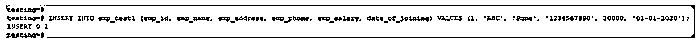

`INSERT INTO emp_test1 (emp_id, emp_name, emp_address, emp_phone, emp_salary, date_of_joining) VALUES (2, 'PQR', 'Pune', '1234567890', 20000, '01-01-2020');`

**输出:**

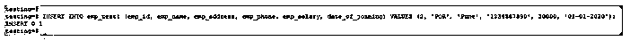

`INSERT INTO emp_test1 (emp_id, emp_name, emp_address, emp_phone, emp_salary, date_of_joining) VALUES (3, 'XYZ', 'Mumbai', '1234567890', 35000, '02-01-2020');`

**输出:**

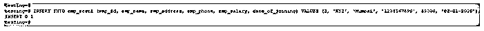

`INSERT INTO emp_test1 (emp_id, emp_name, emp_address, emp_phone, emp_salary, date_of_joining) VALUES (4, 'BBS', 'Mumbai', '1234567890', 45000, '02-01-2020');`

**输出:**

`INSERT INTO emp_test1 (emp_id, emp_name, emp_address, emp_phone, emp_salary, date_of_joining) VALUES (5, 'RBS', 'Delhi', '1234567890', 50000, '03-01-2020');`

**输出:**

`select * from emp_test1;`

**输出:**

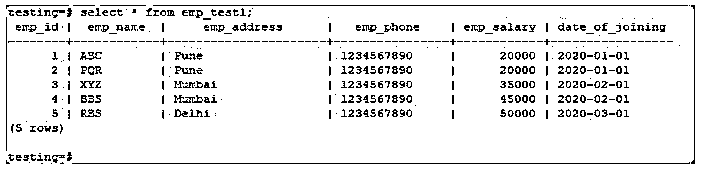

#### 表 2:雇员测试 2

`CREATE TABLE emp_test2 ( emp_id INT NOT NULL, emp_name character(10) NOT NULL, emp_address character(20) NOT NULL, emp_phone character(14), emp_salary INT NOT NULL, date_of_joining date NOT NULL, PRIMARY KEY (emp_id));`

**输出:**

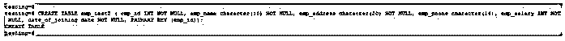

`INSERT INTO emp_test2 (emp_id, emp_name, emp_address, emp_phone, emp_salary, date_of_joining) VALUES (6, 'PQR', 'Pune', '1234567890', 20000, '01-01-2020');`

**输出:**

`INSERT INTO emp_test2 (emp_id, emp_name, emp_address, emp_phone, emp_salary, date_of_joining) VALUES (7, 'XYZ', 'Mumbai', '1234567890', 35000, '02-01-2020');`

**输出:**

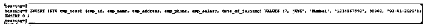

`INSERT INTO emp_test2 (emp_id, emp_name, emp_address, emp_phone, emp_salary, date_of_joining) VALUES (8, 'BBS', 'Mumbai', '1234567890', 45000, '02-01-2020');`

**输出:**

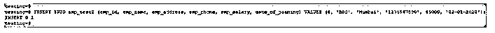

`INSERT INTO emp_test2 (emp_id, emp_name, emp_address, emp_phone, emp_salary, date_of_joining) VALUES (9, 'RBS', 'Delhi', '1234567890', 50000, '03-01-2020');`

**输出:**

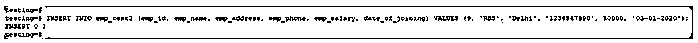

`INSERT INTO emp_test2 (emp_id, emp_name, emp_address, emp_phone, emp_salary, date_of_joining) VALUES (10, 'ABC', 'Pune', '1234567890', 20000, '01-01-2020');`

**输出:**

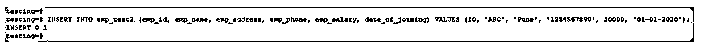

`select * from emp_test2;`

**输出:**

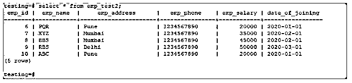

请在下面查找 PostgreSQL 中 INTERSECT 运算符的示例:

#### 示例#1

Intersect 运算符使用两个表中的所有列:

*   在下面的例子中，我们必须从所有的列中检索数据。在这种情况下，所有数据都与 emp_test1 和 emp_test2 表组合在一起。
*   在这种情况下，将从两个表中检索所有记录。

`select * from Emp_Test1 INTERSECT select * from Emp_Test2;`

**输出:**

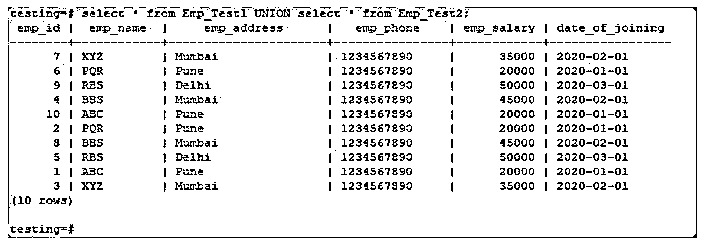

#### 实施例 2

使用两个表中的特定列的 Intersect 运算符:

*   在下面的例子中，我们必须从特定的列中检索数据。在这种情况下，只提取两个表中匹配的记录。
*   使用 PostgreSQL 中的 intersect 获取两个表中的重复记录。
*   在这种情况下，将使用 PostgreSQL 中的 intersect 从两个表中只检索匹配的记录。

`select emp_name, emp_address from Employee_Test1 INTERSECT select emp_name, emp_address from Employee_Test2;`

**输出:**

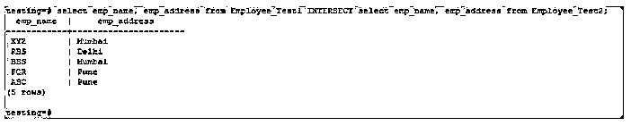

### PostgreSQL 中 INTERSECT 的规则和规范

*   PostgreSQL 中的 Intersect 将返回两个数据集共有的那些行。
*   PostgreSQL 中的 Intersect 运算符不按升序或降序管理数据。
*   它只从两个数据集中检索匹配的记录。
*   如果我们只需要同时来自两个不同表的匹配记录，我们可以在 PostgreSQL 中使用 intersect。
*   在 PostgreSQL 中，这个操作符对于从两个或更多的数据集中检索匹配的数据是方便而重要的。
*   该操作符返回 PostgreSQL 数据集中可用的那些行。

### 结论

在 PostgreSQL 中是必不可少的。在使用 PostgreSQL intersect 运算符的同时，从两个或多个数据集中检索匹配数据。该运算符只从两个数据集中检索匹配的记录。如果我们需要同时匹配记录数据集，我们在 PostgreSQL 中使用 intersect。

### 推荐文章

这是 PostgreSQL INTERSECT 的指南。在这里我们讨论介绍，这个操作符如何在 PostgreSQL 中工作，并举例说明。您也可以看看以下文章，了解更多信息–

1.  [SQL 集合运算符](https://www.educba.com/sql-set-operators/)
2.  [加入甲骨文](https://www.educba.com/joins-in-oracle/)
3.  [SQL 集合运算符](https://www.educba.com/sql-set-operators/)
4.  [SQL 右连接](https://www.educba.com/sql-right-join/)
5.  [PostgreSQL 视图(示例)](https://www.educba.com/postgresql-views/)
6.  [PostgreSQL 获取示例](https://www.educba.com/cyber-security-incidents/)