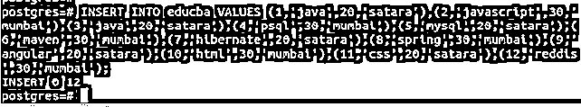
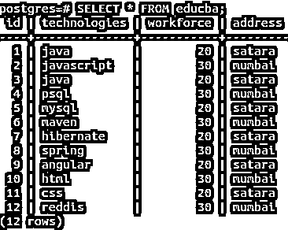
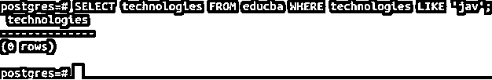
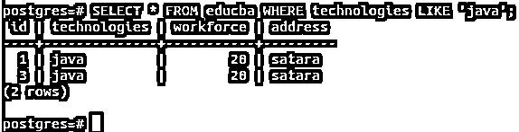
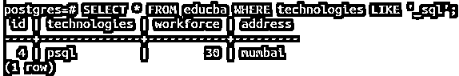
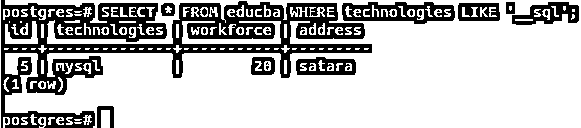
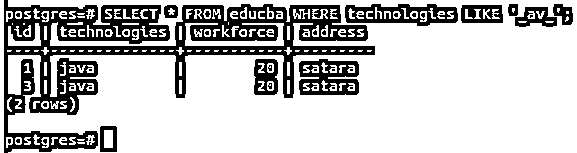
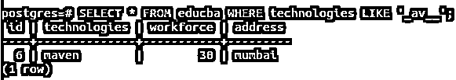
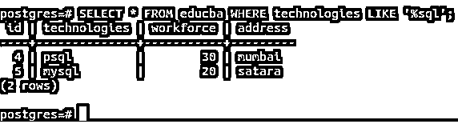
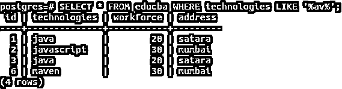

# PostgreSQL Like

> 原文：<https://www.educba.com/postgresql-like/>

## PostgreSQL 简介喜欢

每当在 PostgreSQL 中处理字符串操作时，通常需要将字符串与特定的模式进行匹配，如果匹配成功，就对字符串执行一些操作。当涉及到字符串比较和操作时，这是最常见的用例之一。SQL 中执行模式匹配的传统方法是使用 LIKE 表达式。PostgreSQL 中引入了许多其他的模式匹配方法，比如 POSIX 正则表达式匹配和类似于表达式的模式匹配。本文将学习 LIKE 表达式的语法，以及我们如何在 PostgreSQL 中使用它来执行字符串中的模式匹配。

### PostgreSQL Like 的语法

`demoString LIKE anyPattern [ESCAPE characterThatNeedsToBeEscaped] demoString NOT LIKE anyPattern [ESCAPE characterThatNeedsToBeEscaped]`

<small>Hadoop、数据科学、统计学&其他</small>

**DemoString** :可以是任意字符串值，也可以是存储字符串的特定表的列，您要检查它是否匹配某个模式，或者是否包含某些字符或子串。

**AnyPattern** :模式是一个特定的字符串，您希望与 demoString 进行匹配。它可能包含有助于定义模式的%(百分比)符号和 _(下划线)符号。下划线符号表示任何字符都可能出现在模式字符串的特定位置，而%表示在模式字符串中出现的任何位置，在模式字符串之前、之后或之间都存在一个或多个字符。我们将在下一节课中详细讨论它，并举例说明这个概念。

**characters theneedstobeescaped**:每当进行模式匹配时，在作为原始字符串的演示字符串中，有一些字符是您希望在匹配时跳过的。这些字符被称为转义字符。默认情况下，反斜杠被认为是转义字符，在模式匹配时将被跳过。如果要在模式匹配中考虑反斜杠，只需指定双反斜杠作为转义符即可。您可以在 CharacterThatNeedsToBeEscaped 参数中指定要跳过的任何其他字符。该字段是可选的，默认值为反斜杠。

### PostgreSQL Like 函数

当使用 LIKE 表达式将某个字符串与模式匹配时，如果模式匹配，则返回 true 否则，like 表达式将返回 false。不同的表达方式表现相反。当字符串与模式匹配时返回 true，当匹配成功时返回 false。demoString NOT LIKE any pattern[ESCAPE character that needstobeescaped]等价于 NOT(LIKE any pattern[ESCAPE character that needstobeescaped])。

该模式可以是您想要比较的任何字符串，并且包含下划线和百分号以匹配多个大小写。当模式中没有提到这样的符号，而是一个普通的字符串时，Like 的行为与等号运算符的行为相同。当下划线出现时，该位置可以被要匹配的原始字符串中的任何其他字符占据。而百分号确保在提到它的地方可以有零个或多个字符。让我们逐一研究所有这些案例。

### PostgreSQL Like 的实现示例

让我们创建一个例子，并在表中插入一些记录，以了解如何使用 LIKE 表达式进行模式匹配。打开 PostgreSQL 命令行提示符，输入以下命令创建一个名为 educba 的表:

#### 示例#1

**查询:**

`CREATE TABLE educba
(id INTEGER PRIMARY KEY,
technologies VARCHAR,
workforce INTEGER,
address VARCHAR);`

**输出:**

#### 实施例 2

让我们使用以下语句在 educba 表中插入一些值:

**查询:**

`INSERT INTO educba VALUES (1,'java',20,'satara'),(2,'javascript',30,'mumbai'),(3,'java',20,'satara'),(4,'psql',30,'mumbai'),(5,'mysql',20,'satara'),(6,'maven',30,'mumbai'),(7,'hibernate',20,'satara'),(8,'spring',30,'mumbai'),(9,'angular',20,'satara'),(10,'html',30,'mumbai'),(11,'css',20,'satara'),(12,'reddis',30,'mumbai');`

**输出:**

#### 实施例 3

让我们创建一个简单的 select 查询语句，从 educba 表中检索所有记录。我们的查询语句如下。

**查询:**

`SELECT * FROM educba;`

这里，*表示要检索的所有列，并在以下输出中触发上述查询结果:

**输出:**

#### 示例# 4–字符串匹配字符串

让我们取一个没有下划线或百分号的模式，并用一个相似的表达式来匹配它。

**查询:**

`SELECT technologies FROM educba WHERE technologies LIKE 'jav';`

**输出:**

因为没有记录的 technologies 列具有 jav 值，所以它返回零行。

#### 实施例 5

现在让我们启动下面的查询。

**查询:**

`SELECT * FROM educba WHERE technologies LIKE 'java';`

**输出:**

有两个 java 命名技术的记录；因此，检索到两条记录。

#### 示例# 6–模式中与 _ 匹配的字符串

现在，我们将检索第一个位置有下划线，然后是字符串 SQL for technologies 列值的所有记录。为此，我们将发出以下查询语句–

**查询:**

`SELECT * FROM educba WHERE technologies LIKE '_sql';`

这给出了下面的输出:只有一条技术值为 psql 的记录与模式匹配。

**输出:**

#### 实施例 7

现在，我们将使用下面的查询语句检索在第一个和第二个位置有 __ 个下划线的记录，然后是字符串 SQL。

**查询:**

`SELECT * FROM educba WHERE technologies LIKE '__sql';`

**输出:**

只有一个带有 MySQL technologies 值的记录符合我们指定的模式。

#### 实施例 8

类似地，我们可以在任何想要的位置放置下划线任意次来构建我们的模式。当我们想要查找具有 technologies 字段值的记录，以便它包含 av 子字符串前面的一个字符和后面的一个字符时，我们将发出如下查询语句

**查询:**

`SELECT * FROM educba WHERE technologies LIKE '_av_';`

**输出:**

#### 实施例 9

在上面的模式中再插入一个 _ 会产生以下查询:

**查询:**

`SELECT * FROM educba WHERE technologies LIKE '_av__';`

**输出:**

#### 示例# 10–模式中与%匹配的字符串

假设我们想要检索所有以字符串 SQL 结尾并且在 technologies 字段前面有任意数量字符的记录。然后，我们可以使用%符号来检查零个或多个字符的存在，我的查询语句如下:

**查询:**

`SELECT * FROM educba WHERE technologies LIKE '%sql';`

这导致输出包含 psql 和 Mysql，因为在“技术”字段值中的 SQL 字符串之前可以有任意数量的字符。

#### 实施例 11

现在，为了检索在技术字段值的字符串和 present anywhere 之间包含 av 的记录，我们必须在 av 前后提到%,以搜索原始技术字段值字符串中的子字符串 av presence。y 查询语句将如下。

**查询:**

`SELECT * FROM educba WHERE technologies LIKE '%av%';`

**输出:**

### 结论

我们可以使用 PostgreSQL 中的 LIKE 表达式来执行模式匹配，以检索匹配特定模式的记录。此外，我们可以根据它们是否匹配模式来执行操作，比如分割或替换原始字符串的子字符串。

### 推荐文章

这是一个类似 PostgreSQL 的指南。在这里，我们讨论 PostgreSQL Like 的介绍及其工作方式，并给出实际例子和不同的子查询表达式。您也可以浏览我们推荐的文章，了解更多信息——

1.  [PostgreSQL 时间戳简介](https://www.educba.com/postgresql-timestamp/)
2.  [如何在 PostgreSQL 中通知 Works？](https://www.educba.com/postgresql-notify/)
3.  [PostgreSQL JSON(示例)](https://www.educba.com/postgresql-json/)
4.  [PostgreSQL 时间戳简介](https://www.educba.com/postgresql-timestamp/)