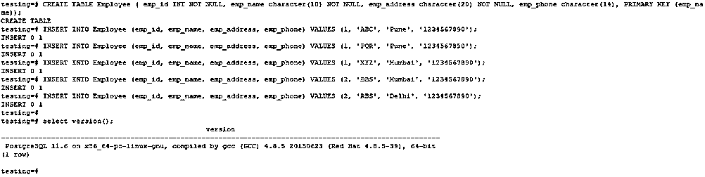
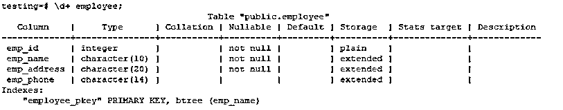
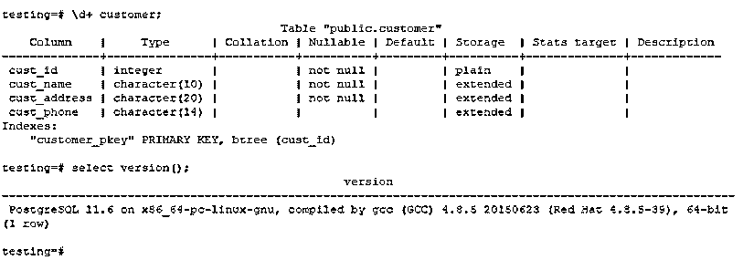
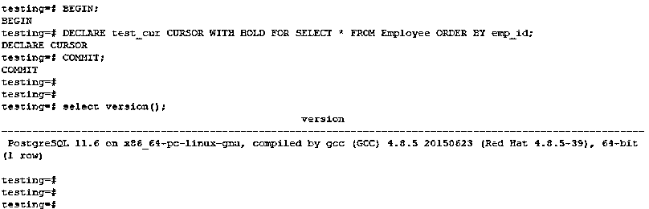
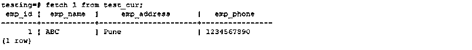
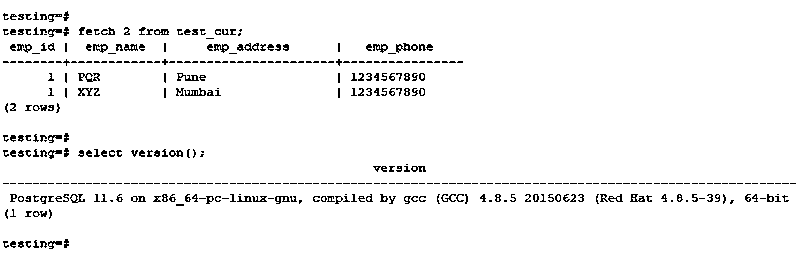
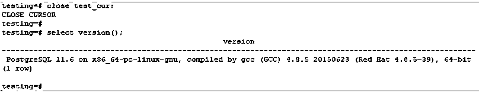
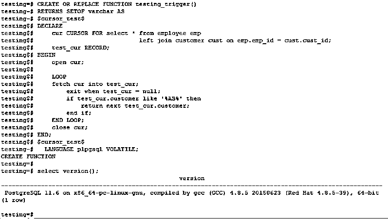

# PostgreSQL 中的游标

> 原文：<https://www.educba.com/cursors-in-postgresql/>

## PostgreSQL 中的游标简介

游标在 PostgreSQL 中非常重要，在 PostgreSQL 中使用游标，可以封装查询而不是一次执行整个查询；封装查询后，可以从结果集中读取几行，这样做的主要目的是避免数据库服务器的内存消耗。如果查询结果包含更多行，for-loop 会自动使用游标来避免 PostgreSQL 中的内存问题，这是由 PostgreSQL 中的 for 循环自动完成的，游标最重要的用途是它一次读取结果的几行。

**语法**

<small>Hadoop、数据科学、统计学&其他</small>

下面是语法。

`Create or replace function (function name)
Return text (return value) as $$
DECLARE cursor_name (Any name given to cursor) [BINARY] [ INSENSITIVE ] [ SCROLL ] CURSOR (keyword) for query (query to use in cursor)
[ for { READ ONLY (defines cursor only for read only) | UPDATE [ OF column ]}] Begin
Open cursor cursor_name
FETCH (KEYWORD) [ FORWARD | BACKWARD ] (specify the direction)
[ # | ALL | NEXT | PRIOR (Specify the direction) ] [ IN | FROM ] CURSOR (cursor name)
Close cursor_name
Return
END $$
Language pl/pgsql`

**下面是上述语法的参数描述如下。**

*   **Declare-**Declare 关键字在 PostgreSQL 中声明一个游标。
*   **游标名称–**为游标指定的任何名称，用于声明游标。
*   **Binary–**这是一个可选光标，它获取 ASCII 格式的输出。它仅对自定义应用程序有效。
*   **不敏感—**描述默认行为的关键字。Insensitive 关键字定义 PostgreSQL 游标中的数据从未从其他连接更改过。
*   **Scroll–**Scroll 关键字也描述了 PostgreSQL 的默认行为。滚动被定义为光标可以一次选择多行。
*   **光标用于–**它用于描述完整的查询结果集。
*   **查询—**在声明游标中使用的实际查询，用于检索结果集数据。
*   **Read-only-**Read only 关键字被定义为光标仅用于只读。
*   **Fetch–**使用 Fetch 命令检索行。
*   **前进—**指定方向；在 PostgreSQL 中，默认情况下使用 forward。
*   **向后—**指定方向。
*   **Next–**Next 关键字从当前光标位置返回下一个光标行。
*   **previous–**该关键字在当前光标位置之前产生一行。
*   **创建或替换功能-**创建功能创建新功能。
*   **Declare–**在 PostgreSQL 中声明游标的变量。
*   **Begin—**Begin 关键字。
*   **打开—**打开关键字打开光标。
*   **关闭—**关闭关键字关闭光标。
*   **语言—**在 PostgreSQL 中用于创建描述光标的函数的语言。

### PostgreSQL 中的光标操作

我们使用雇员和客户表来描述例子。

**代码:**

`CREATE TABLE Employee ( emp_id INT NOT NULL, emp_name character(10) NOT NULL, emp_address character(20) NOT NULL, emp_phone character(14), PRIMARY KEY (emp_name));
INSERT INTO Employee (emp_id, emp_name, emp_address, emp_phone) VALUES (1, 'ABC', 'Pune', '1234567890');
INSERT INTO Employee (emp_id, emp_name, emp_address, emp_phone) VALUES (1, 'PQR', 'Pune', '1234567890');
INSERT INTO Employee (emp_id, emp_name, emp_address, emp_phone) VALUES (1, 'XYZ', 'Mumbai', '1234567890');`

`\d+ employee;`

`\d+ customer;`

### 描述游标的雇员和客户表示例

下面是光标的作用如下。

*   声明
*   打开
*   取得
*   关闭

#### 1.声明

下面是 PostgreSQL 中 declare cursor 的语法。在下面的示例中，test_cur 被声明为保存 employee 表中的所有记录。

**语法**

下面是声明的示例:

`DECLARE cursor_name (Any name given to cursor) [BINARY] [INSENSITIVE] [SCROLL] CURSOR (keyword) for query (query to use in cursor)
[For {READ ONLY | UPDATE [OF column (defines cursor only for read only)]}]`

**例子**

下面是在 PostgreSQL 中声明游标的示例。

`BEGIN;
DECLARE test_cur CURSOR WITH HOLD FOR SELECT * FROM Employee ORDER BY emp_id;
COMMIT;`

#### 2.打开

open 关键字用于在 PostgreSQL 中打开游标。下面是一个例子

**语法**

`Open [[ NO ] SCROLL } FOR query (any query);`

**例子**

为 select * from employee 打开 test_cursor，其中 EMP _ id = 1；

#### 3.取得

下面是语法和示例:

**语法**

`FETCH [direction {FROM | IN}] cursor_name into target;`

**例子**

`fetch 1 from test_cur;`

`fetch 2 from test_cur;`

#### 4.关闭

下面是语法和示例:

**语法**

`Close cursor_name;`

**例子**

`close test_cur;`

关闭光标。

**PostgreSQL 中的光标示例**

*   下面是使用 PostgreSQL 中的函数创建游标的示例。
*   我们使用了雇员和客户表来连接该表。

**例子**

`CREATE OR REPLACE FUNCTION testing_trigger()
RETURNS SETOF varchar AS
$cursor_test$
DECLARE
cur CURSOR FOR select * from employee emp
left join customer cust on emp.emp_id = cust.cust_id;
test_cur RECORD;
BEGIN
open cur;
LOOP
fetch cur into test_cur;
exit when test_cur = null;
if test_cur.customer like '%AB%' then
return next test_cur.customer;
end if;
END LOOP;
close cur;
END;
$cursor_test$
LANGUAGE plpgsql VOLATILE;`

### 游标在 PostgreSQL 中的重要性

下面是重要性如下。

*   PostgreSQL 中游标的主要作用是从结果集中检索单个记录。
*   这个游标将节省时间，因为我们不需要等待检索或处理整个数据集。
*   这个游标节省了内存，因为客户机和服务器不需要更多的内存来存储数据结果。
*   游标最小化了服务器上的负载以及我们的网络带宽。
*   如果我们在表上进行操作，它不会直接影响光标。当我们保存一行时，其他进程可以更新、选择或删除这些行。

### 结论

在 PostgreSQL 中，从整个结果集中提取单个记录是很重要的。它用于节省服务器上的内存和网络带宽。

如果我们从游标中读取数据，其他会话可以执行它们的操作；对其他连接没有影响。

### 推荐文章

这是 PostgreSQL 中的游标指南。在这里，我们讨论了光标的行动，以及例子和重要性。您也可以看看以下文章，了解更多信息–

1.  [什么是 PostgreSQL？](https://www.educba.com/what-is-postgresql/)
2.  [PostgreSQL 字符串函数](https://www.educba.com/postgresql-string-functions/)
3.  [PostgreSQL 运算符](https://www.educba.com/postgresql-operators/)
4.  [如何修改 PostgreSQL 视图？](https://www.educba.com/postgresql-views/)
5.  [PostgreSQL 获取指南](https://www.educba.com/postgresql-fetch/)
6.  [Python 返回值指南](https://www.educba.com/python-return-value/)
7.  [PostgreSQL 提交|示例](https://www.educba.com/postgresql-commit/)