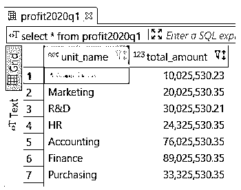
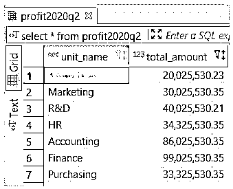
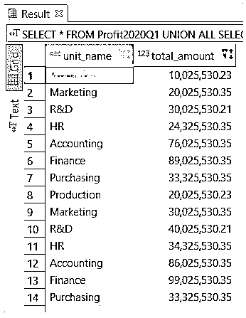
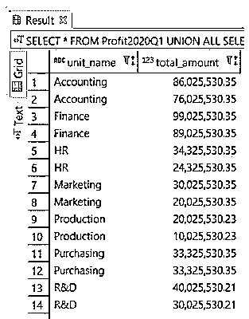

# PostgreSQL UNION ALL

> 原文：<https://www.educba.com/postgresql-union-all/>

## PostgreSQL UNION 简介全部

PostgreSQL UNION ALL 运算符提供多个 SELECT 语句的组合结果集。结果包含查询中的所有行，并且不会删除多个 SELECT 语句之间的重复行。通常，UNION 运算符用在报表系统或数据仓库系统中，用于组合相似表中未经规范化的行。

**语法:**

<small>Hadoop、数据科学、统计学&其他</small>

`SELECT
expression_1,
expression_2
…
expression_n
FROM
table_name_1
[WHERE conditions] UNION ALL
SELECT
expression_1,
expression_2
…
expression_n
FROM
table_name_2;
[WHERE conditions]`

**说明:**

*   它定义了我们要获取的列名或计算的列表，是使用 expression_1、expression_2 … expression_n 等定义的。
*   此外，它还定义了要从中获取记录的表的名称。FROM 子句中应该至少指定一个表名。
*   WHERE 子句是可选的；您可以指定选择记录应满足的条件。
*   定义两个 SELECT 语句之间的 UNION ALL 关键字。

### PostgreSQL 中 UNION ALL 子句如何工作？

*   UNION 中定义的 SELECT 语句的结果全部组合在一起。
*   UNION ALL 不会从结果集中删除重复的行；如果 SELECT 语句在结果集中包含重复行，则 UNION ALL 运算符在组合结果集时会考虑同一行。
*   如果希望对结果集进行排序，那么可以在查询的末尾指定 ORDER BY 子句。

### PostgreSQL UNION ALL 示例

让我们考虑下面的表结构来理解 UNION ALL 操作符的例子。

**Profit2020Q1** :该表存储了一个组织 2020 年第一季度的利润。

**Profit2020Q2** :该表存储了一个组织 2020 年第二季度的利润。

`CREATE TABLE Profit2020Q1(
unit_name VARCHAR (50) NOT NULL,
total_amount numeric(10,2)
);
CREATE TABLE Profit2020Q2(
unit_name VARCHAR (50) NOT NULL,
total_amount numeric(10,2)
);`

上述语句将创建 Profit2020Q2 和 Profit2020Q2 表；现在在上表中插入一些数据，如下所示:

`INSERT INTO Profit2020Q1 (unit_name, total_amount)
values
('Production', 10025530.23),
('Marketing', 20025530.35),
('R&D', 30025530.21),
('HR', 24325530.35),
('Accounting', 76025530.35),
('Finance', 89025530.35),
('Purchasing', 33325530.35);`

`INSERT INTO Profit2020Q2 (unit_name, total_amount)
values
('Production', 20025530.23),
('Marketing', 30025530.35),
('R&D', 40025530.21),
('HR', 34325530.35),
('Accounting', 86025530.35),
('Finance', 99025530.35),
('Purchasing', 33325530.35*);*`

现在，通过从两个表中检索数据来验证插入的数据，如下所示:

`select * from Profit2020Q1 ;`

`select * from Profit2020Q2 ;`

**Note:** In the following examples, we are using an asterisk(*) to fetch all columns, but if you want to fetch for specific columns that are common in both tables, which you can specify.

#### 例#1: **UNION ALL**

以下 PostgreSQL 示例返回两个表中的所有列，包括重复值。

`SELECT *
FROM
Profit2020Q1
UNION ALL
SELECT *
FROM
Profit2020Q2;`

**借助以下快照验证上述语句的结果:**

您可以看到在 Profit2020Q1 和 Profit2020Q1 表中重复出现的列“Purchasing”也被返回；这是 UNION ALL 运算符不删除重复项。如果要删除重复的行，可以使用 PostgreSQL UNION 运算符，而不是 UNION ALL 运算符。

#### 示例 2: UNION ALL with ORDER BY

以下示例向我们展示了带有 ORDER BY 子句的 UNION ALL 运算符。以下语句的组合结果将按照 [ORDER BY 子句](https://www.educba.com/order-by-clause-in-sql/)中指定的顺序排序。我们需要在语句的末尾添加 ORDER BY 子句，以便以排序的方式获取结果集。

`SELECT *
FROM
Profit2020Q1
UNION ALL
SELECT *
FROM
Profit2020Q2
ORDER BY
unit_name ASC,
total_amount DESC;`

**借助以下快照验证上述语句的结果:**

***

*** 

您可以在每个语句的末尾指定 ORDER BY 子句，但是合并后的结果集将不会具有我们想要的排序顺序。这背后的原因是 UNION 操作符组合了每个语句的排序结果集，因此，行的顺序没有保证。

### PostgreSQL 中 UNION ALL 的规则和规定

*   两个 SELECT 语句必须返回相同数量的表达式。
*   每个对应的表达式或列应该具有兼容的数据类型。
*   结果集将具有在第一个 SELECT 语句中定义的列名。可以使用 ORDER BY 子句按定义的列对组合结果集中的行进行排序。

### 结论

这里我们已经看到了如何使用 PostgreSQL UNION ALL 操作符。我们还学习了 PostgreSQL UNION ALL 操作符将多个语句的结果集组合成一个结果集。我们还看到了 PostgreSQL 中 UNION ALL 操作符的规则和规定。

### 推荐文章

这是一个 PostgreSQL UNION ALL 的指南。这里我们讨论简介，UNION ALL 子句如何在 PostgreSQL 中工作，以及相应的示例和输出。您也可以看看以下文章，了解更多信息–

1.  [Oracle 中的分组依据](https://www.educba.com/group-by-in-oracle/)
2.  [开源软件](https://www.educba.com/open-source-software/)
3.  [MySQL 查询命令](https://www.educba.com/mysql-query-commands/)
4.  [PostgreSQL 视图|示例](https://www.educba.com/postgresql-views/)
5.  [PostgreSQL 获取|示例](https://www.educba.com/postgresql-fetch/)
6.  PostgreSQL |中的序列[如何工作？](https://www.educba.com/sequence-in-postgresql/)