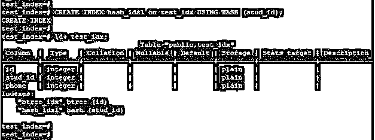
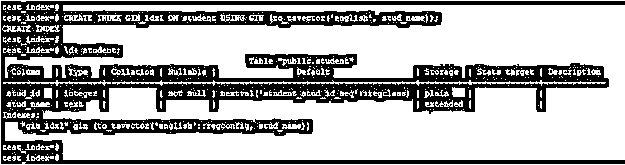
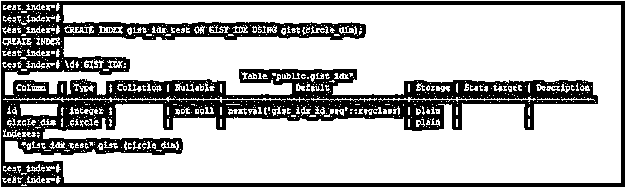
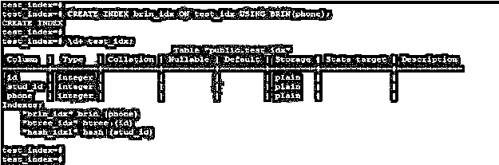

# PostgreSQL 索引类型

> 原文：<https://www.educba.com/postgresql-index-types/>

## PostgreSQL 索引类型简介

PostgreSQL 索引类型基本上分为六种类型，即 B 树、哈希、GIN、BRIN、SP-GIST 和 GIST 索引，每种索引类型都有不同的存储结构和算法来从查询中检索数据。PostgreSQL 索引在 PostgreSQL 中非常重要和有用，用于从表中最快地访问数据。我们必须使用 PostgreSQL 中的 create index 语句创建索引，当我们在表列上创建索引时，我们需要指定索引的类型。如果我们在创建索引时没有指定任何索引类型，那么它将自动创建一个 B 树索引。

### 句法

下面是 PostgreSQL 索引的语法:

<small>Hadoop、数据科学、统计学&其他</small>

`CREATE INDEX (name_of_index) on (name_of_table) USING (index_type) (name_of_column);`

**或**

`Create index (name_of_index) on (name_of_table) (column_name1, column_name2, column_name3)`

**解释:**在上面的语法中索引名称被定义为新创建的索引的名称，我们可以给索引取任何名称。表名被定义为我们在其上创建索引的表的名称。我们可以在 PostgreSQL 中创建单个和多个索引。当我们必须在单列上创建索引时，它被称为单列索引。当我们必须在多个列上创建一个索引时，在 PostgreSQL 中它被称为多列索引。

### PostgreSQL 索引类型

PostgreSQL 中的索引用于从表中快速检索数据。PostgreSQL 索引和书的索引是一样的。PostgreSQL 索引将加速选择查询的操作。它还将支持在 where 子句中快速检索数据。PostgreSQL 索引降低了 insert 和 update 语句的操作速度，我们可以在不丢失数据的情况下创建更新和删除索引。

以下是 PostgreSQL 中可用的索引类型:

*   b 树索引。
*   哈希索引。
*   空间分区要点索引
*   块范围索引(布林)
*   广义倒排索引
*   广义倒排搜索树索引

#### 1.b 树索引

PostgreSQL 中的 b 树索引被定义为自平衡树，它维护排序的数据，并允许插入、删除和选择访问。当查询涉及比较时，PostgreSQL B 树索引查询规划器会考虑以下运算符。<=, =, =，IN，Between，IS NOT NULL，IS NULL

如果 PostgreSQL 中的模式是常量，Query planner 还会检查模式匹配运算符，如 and ~。下面是 PostgreSQL 中 B 树索引的示例和语法。

**代码:**

`CREATE INDEX btree_idx on test_idx USING BTREE (id);
\d+ test_idx;`

**输出:**

**解释:**在上面的例子中，我们已经在 test_idx 表中的 id 列上创建了一个索引。我们还将新创建的索引的名称定义为 btree_idx。

#### 2.散列索引

PostgreSQL 中的散列索引将只处理简单的相等比较，即(=)。它表明无论得到什么不等式操作符，查询规划器都会在散列索引中考虑它。要在 PostgreSQL 中创建散列索引，我们需要使用 create index 语句。哈希索引不是事务安全的，它不会在流或基于文件的复制中被复制。

下面是 PostgreSQL 中散列索引的语法和示例:

**代码:**

`CREATE INDEX hash_idx on test_idx USING HASH (stud_id);
\d+ test_idx;`

**输出:**

**解释:**在上面的例子中，我们在 test_idx 表中的 stud_id 列上创建了一个索引。我们还将新创建的索引的名称定义为 hash_idx。

#### 3.杜松子酒指数

GIN 指数也称为广义倒排指数。它通常被称为杜松子酒指数。当我们必须在表列中存储多个值时，使用 GIN 索引。多值的一个例子是数组、jsonb 和范围类型。PostgreSQL 中的 GIN 索引将在文本列上创建。

下面是 PostgreSQL 中 GIN 索引的语法和示例。

**代码:**

`CREATE INDEX GIN_idx1 ON student USING GIN (to_tsvector('english', stud_name));
\d+ student;`

**输出:**

**解释:**在上面的例子中，我们在 stud_name 列上创建了一个索引。我们还为新创建的索引定义了名称 GIN_idx1。

#### 4.要点索引

GiST 索引也称为广义倒排搜索树索引。PostgreSQL 中的要点索引将允许建立一般的树结构。GiST 索引在 PostgreSQL 的几何数据类型和全数据搜索中很有用。要点索引由多个节点值组成。GiST 索引的节点将以树形结构的方式组织。

下面是 PostgreSQL 中 GiST 索引的语法和示例。

**代码:**

`CREATE INDEX gist_idx_test ON GIST_IDX USING gist(circle_dim);
\d+ GIST_IDX;`

**输出:**

**解释:**在上面的例子中，我们在 GIST_IDX 表中的 circle_dimcolumn 上创建了一个索引。我们还为新创建的索引定义了名称 gist_idx_test。

#### 5.SP-GiST 索引

SP-GiST 索引也称为空间分割的广义倒排搜索树。它将支持分区搜索树。SP-GiST 索引对自然聚类元素最有用。SP-GiST 索引提供了分区搜索树。

以下是 SP-GiST 索引的语法和示例:

**代码:**

`CREATE INDEX spgist_idx ON spgist_table USING SPGiST (phone_no);
\d+ spgist_table;`

**输出:**

**解释:**在上面的例子中，我们在 spgist_table 表中的 phone_no 列上创建了一个索引。我们还为新创建的索引定义了名称 spgist_idx。

#### 6.布林指数

布林指数也称为区间指数。保持与 Btree 指数的比较规模更小，成本更低。BRIN 索引用于大型表，如果没有水平分区，使用 Btree 是不实际的。

以下是布林索引的语法和示例:

**代码:**

`CREATE INDEX brin_idx ON test_idx USING BRIN(phone);
\d+ test_idx;`

**输出:**

**解释:**在上面的例子中，我们在 test_idx 表中的 phone 列上创建了一个索引。我们还将新创建的索引的名称定义为 brin_idx。

### 推荐文章

这是 PostgreSQL 索引类型指南。这里我们讨论 PostgreSQL 索引类型的介绍、适当的语法、6 种不同的类型和查询示例。您也可以浏览我们的其他相关文章，了解更多信息——

1.  [PostgreSQL 内部连接](https://www.educba.com/postgresql-inner-join/)
2.  [PostgreSQL 序列](https://www.educba.com/postgresql-serial/)
3.  [PostgreSQL 模式](https://www.educba.com/postgresql-schema/)
4.  [PostgreSQL 视图](https://www.educba.com/postgresql-views/)