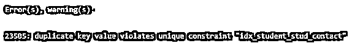
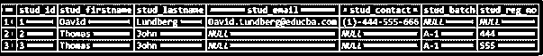
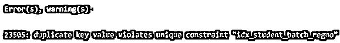

# PostgreSQL 唯一索引

> 原文：<https://www.educba.com/postgresql-unique-index/>

## PostgreSQL 唯一索引简介

当我们希望确保列只存储唯一值时，使用 PostgreSQL 唯一索引。如果我们在特定的列上定义唯一索引，那么该列在多个行中不能有相同的值。此外，我们可以在多个列上定义惟一索引，以强制它们存储组合的惟一值。创建表时，我们可以为表添加唯一约束或主键，这将为我们标记为表的主键的列或添加了唯一约束的列自动构造唯一索引。

**语法:**

<small>Hadoop、数据科学、统计学&其他</small>

考虑以下创建 PostgreSQL 唯一索引的语法:

`CREATE UNIQUE INDEX index_name ON table_name(column_name, [...]);`

解释:

*   **index_name:** 定义唯一索引的名称。
*   **table_name:** 它定义了我们将在哪个表上添加唯一索引。
*   **column_name:** 这定义了唯一索引下将包含的具有唯一值的列或列列表。

### 唯一索引在 PostgreSQL 中是如何工作的？

**1。**我们可以在一列或多列上添加唯一索引；如果我们在单个列上添加了唯一索引，那么该列在多个行中不能有相同的值。

**2。**此外，如果在多个列上添加了唯一索引，那么所有这些列的组合值应该是唯一的，并且在多个行中不能有相同的值

**3。**空值被视为非重复值，因此应用了唯一索引的列可以存储多个空值。类似的情况也适用于我们已经应用了唯一索引的多个列。

**4。**如果我们在创建表时为表添加了唯一约束或主键，它会自动为我们标记为表主键的列或添加了唯一约束的列构建唯一索引。

### 实现 PostgreSQL 唯一索引的示例

以下是 PostgreSQL 唯一索引的示例:

我们将创建一个名为“student22”的表，用于详细了解唯一索引。考虑下面的 CREATE TABLE 语句，它将创建一个“student22”表。

**查询:**

`CREATE TABLE student22 (
stud_id SERIAL PRIMARY KEY,
stud_firstname VARCHAR(255) NOT NULL,
stud_lastname VARCHAR(255) NOT NULL,
stud_email VARCHAR(255) UNIQUE
);`

在上面的语句中，我们添加了 stud_id 列作为主键列。此外，列 stud_email 是用应用于它的 UNIQUE 约束定义的，这将导致为 stud_id 和 stud_email 列创建两个唯一索引。

我们可以通过使用以下 SQL 语句来获取 student22 表的索引:

**查询:**

`SELECT  tablename, indexname, indexdef
FROM
pg_indexes
WHERE
tablename = 'student22';`

**输出:**

#### 示例# 1–单柱

现在，我们将使用以下语句向“student22”表中添加一个名为“stud_contact”的列:

**查询:**

`ALTER TABLE student22 ADD stud_contact VARCHAR(20);`

每个人的联系电话应该是唯一的。因此，我们将为 stud_contact 列添加一个唯一的索引，以确保所有学生的联系号码都是不同的。

考虑下面的 SQL 语句，它将为 stud_contact 列添加一个惟一的索引。

**查询:**

`CREATE UNIQUE INDEX idx_student_stud_contact
ON student22(stud_contact);`

现在，我们将向 student 表中插入一些数据，以验证 stud_contact 列的唯一性。

考虑以下用于向 student22 表中插入新行的 INSERT INTO 语句:

**查询:**

`INSERT INTO student22
(stud_firstname, stud_lastname, stud_email, stud_contact)
VALUES
('David','Lundberg','David.Lundberg@educba.com', '(1)-444-555-666');`

通过使用以下快照和 SQL 语句来说明上述语句的结果。

**查询:**

`select * from student22;`

**输出:**

再次考虑下面的 INSERT INTO 语句，该语句用于向 student22 表中插入一个新行，但是这一次我们将添加与前面添加的相同的联系人号码。

**查询:**

`INSERT INTO student22
(stud_firstname, stud_lastname, stud_email, stud_contact)
VALUES
('Patrik','Brand','Patrik.Brand@educba.com', '(1)-444-555-666');`

**输出:**

这里我们得到一个错误，这是因为我们试图在 stud_contact 列中插入重复的联系号码。

#### 示例 2–多列

现在，我们将使用以下语句向“student22”表中添加两个名为“stud_batch”和“stud_reg_no”的新列:

**查询:**

`ALTER TABLE student22
ADD stud_batch VARCHAR(5),
ADD stud_reg_no VARCHAR(5);`

多个学生的批次可以相同，但每个学生的注册不能相同。为了确保相同的标准，我们必须在列上定义唯一的索引。

“student22”表的“stud_batch”和“stud_reg_no”。

**查询:**

`CREATE UNIQUE INDEX idx_student_batch_regno
ON student22(stud_batch,stud_reg_no);`

现在，我们将向学生表中插入一些数据，以验证 stud_batch 和 stud_reg_no 列的唯一性。

考虑以下用于向 student22 表中插入新行的 INSERT INTO 语句:

**查询:**

`INSERT INTO student22
(stud_firstname, stud_lastname, stud_batch, stud_reg_no)
VALUES
('Thomas','John','A-1', '444');`

通过使用以下快照和 SQL 语句来说明上述语句的结果。

**查询:**

`select * from student22;`

**输出:**

再次考虑下面的 INSERT INTO 语句，该语句用于向 student22 表中插入一个新行，但这次我们将添加与前面添加的相同的批处理，但使用不同的 stud_reg_no。

**查询:**

`INSERT INTO student22
(stud_firstname, stud_lastname, stud_batch, stud_reg_no)
VALUES
('Thomas','John','A-1', '555');`

通过使用以下快照和 SQL 语句来说明上述语句的结果。

**查询:**

`select * from student22;`

**输出:**

stud_batch 和 stud_reg_no 列的值的组合是唯一的，因为这个 INSERT INTO 语句没有任何错误。

再次考虑下面的 INSERT INTO 语句，该语句用于向 student22 表中插入一个新行，但这次我们将添加与前面添加的相同的批处理和 stud_reg_no。

**查询:**

`INSERT INTO student22
(stud_firstname, stud_lastname, stud_batch, stud_reg_no)
VALUES
('Thomas','John','A-1', '555');`

**输出:**

这里我们得到一个错误，这是因为我们试图插入重复的 stud_batch，stud_reg_no，它已经存在于 student22 表中。

### 结论

我们希望通过上面的文章，您已经理解了如何使用 PostgreSQL 唯一索引以及 PostgreSQL 唯一索引是如何工作的。此外，我们还添加了几个 PostgreSQL 唯一索引的示例来详细理解它。

### 推荐文章

这是一个 PostgreSQL 唯一索引的指南。在这里，我们讨论 PostgreSQL 唯一索引的介绍及其工作方式，并给出实际例子和不同的子查询表达式。您也可以浏览我们推荐的文章，了解更多信息——

1.  [PostgreSQL 时间戳简介](https://www.educba.com/postgresql-timestamp/)
2.  [如何在 PostgreSQL 中通知 Works？](https://www.educba.com/postgresql-notify/)
3.  [PostgreSQL JSON(示例)](https://www.educba.com/postgresql-json/)
4.  [PostgreSQL 时间戳简介](https://www.educba.com/postgresql-timestamp/)