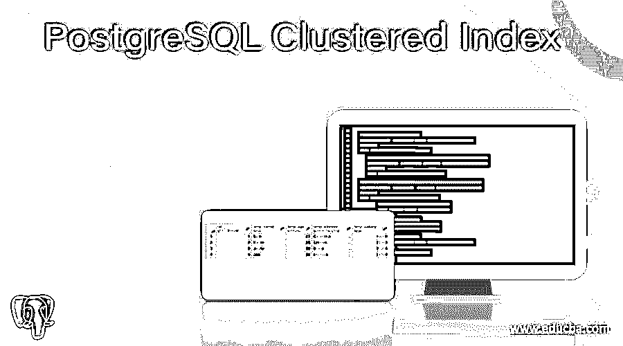
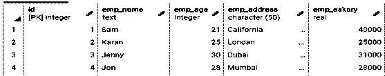

# PostgreSQL 聚集索引

> 原文：<https://www.educba.com/postgresql-clustered-index/>

## PostgreSQL 聚集索引的定义

PostgreSQL 为用户提供了聚集索引功能，其中数据库的每个表都有一个唯一的聚集索引。聚集索引意味着它在辅助存储上存储表的另一个值。聚集索引用于唯一标识表中的行。当我们谈到包含相似项目组的聚集索引时，或者我们可以说是聚集的属性。默认情况下，表的列名和主键有一个聚集索引。在 postgreSQL 中，聚集属性存储相应索引的元数据，而不是关系。在 postgreSQL 中，聚集索引是一对一的关系。

**语法:**

<small>Hadoop、数据科学、统计学&其他</small>

`Clustered schema name using index name;`

**说明:**

在上面的语法中，模式名意味着我们需要聚集的表名，这意味着表的内容根据索引进行物理重新排序。聚类是一次性操作，这意味着不允许对聚类进行更改。索引名称是指索引名称。VERBOSE 用于打印集群中数据库表的进度报告。

### 如何在 PostgreSQL 中使用聚集索引？

我们必须在您的系统中安装 PostgreSQL。我们需要关于 PostgreSQL 的基础知识。我们必须需要一个数据库表来创建聚集索引。我们只需要集群索引的基本知识，也就是如何使用它。我们可以在 **psql** 和 **pgAdmin** 的帮助下对数据库表执行不同的操作。

让我们看一个不同的聚集索引示例，以便更好地理解如下内容。

#### 示例#1

首先对于聚集索引的实现，我们需要用 primary 创建一个表，所以让我们用下面的语句创建一个表。

`CREATE TABLE test(ID INT PRIMARY KEY NOT NULL, Name TEXT NOT NULL,  Age INT NOT NULL, Address CHAR(50), Salary REAL);`

**解释**

在上面的例子中，我们用不同的数据类型和大小创建了一个具有不同属性的测试表，比如雇员 ID、姓名、年龄、地址和薪水。使用下面的快照说明上述声明的最终结果。

现在，通过使用如下 insert into 语句将一条记录插入到表中。

`INSERT INTO test (ID,Name,Age,Address,Salary)
VALUES (3, 'Sam', 21, 'California', 40000.00),
(1, 'Karan', 25, 'Londan', 25000.00),
(4, 'Jenny', 30, 'Dubai', 31000.00),
(2, 'Jon', 28, 'Mumbai', 28000.00);`

**解释**

在上面的例子中，我们按照上面的语句所示的随机顺序在表中插入了 4 行。之后，当我们执行 select 语句时，它以升序显示，这意味着每个表都有一个默认索引，并且它会将数据物理地重新排序到数据库表中。使用下面的快照说明上述声明的最终结果。

现在让我们看看如何实现聚集索引，如下所示。

#### 实施例 2

`CREATE UNIQUE INDEX "test_Age_Salary"
ON public.test USING btree
(age ASC NULLS LAST, salary ASC NULLS LAST)
WITH (FILLFACTOR=10)
TABLESPACE pg_default;`

**解释**

首先，在上述语句的帮助下，我们为两列(如年龄和薪水)创建了一个索引，并按照上述语句中所示的升序排列它们。之后，我们使用 alter 命令，如下所示。

`ALTER TABLE public.test
CLUSTER ON "test_Age_Salary";`

**解释**

在上面的语句中，我们使用 alter 命令在 PostgreSQL 中实现了一个集群索引。这里我们使用公共。测试来访问表名，我们在测试数据库表的 Age 和 Salary 列上创建了一个聚集索引。使用下面的快照说明上述声明的最终结果。

因此，我们使用上面的两条语句创建了一个聚集索引，并且我们希望看到聚集表的详细信息，所以我们使用下面的语法。

**语法:**

`\d table_name;`

**解释**

在上面的语句中，我们\d 表示使用表名描述表命令，它用于显示表的所有详细结构，如表的主键、表的聚类和列的数据类型，或者我们可以说 size 表示它显示表的所有详细结构。

### 笔记

*   当您创建一个带有主键或任何其他索引的数据库表时，您可以通过指定索引名来执行集群命令，以获得数据库的物理顺序
*   PostgreSQL cluster 用于根据索引名指定表名，并且必须已经在表上定义了索引。
*   聚集索引按照表的聚集索引显示数据的物理顺序。
*   我们可以根据需要更新该表，但是在集群中不允许进行更改，因为集群是一次性操作。这意味着集群没有存储任何新的或更新的行。
*   根据我们的要求，我们可以使用 cluster 命令对表进行重新聚类。
*   为了执行集群命令，我们需要访问
*   当我们执行一个集群命令时，它会创建一个表的临时副本，所以我们需要为它释放空间。

### 使用

*   聚集索引主要用于通过使用表中的特定索引来重新访问数据库表。
*   Cluster 是作为另一个磁盘位置上的临时文件创建的，因此在对表执行 update 命令后，它会保留表的原始内容。
*   聚集索引用于对表中的数据进行重新排序。
*   在集群中，当我们向表中插入新记录时，它会自动插入到表的末尾。
*   聚集索引使得从表中访问数据的查询速度更快。
*   根据表，簇索引是唯一的索引。
*   基本上，集群索引用于提高数据库性能，因此我们根据需要使用集群来提高数据库的速度。

### 结论

我们希望通过这篇文章，您已经了解了 PostgreSQL **聚集索引**。从上面的文章中，我们已经了解了**聚集索引**的基本语法。我们还通过**聚集索引**的例子学习了如何在 PostgreSQL 中实现它们。聚类用于对数据库表中的数据进行物理重新排序。从本文中，我们了解了如何在 PostgreSQL 中处理**聚集索引**。

### 推荐文章

这是 PostgreSQL 聚集索引指南。这里我们讨论一下定义，如何在 PostgreSQL 中使用聚簇索引？和示例。您也可以看看以下文章，了解更多信息–

1.  [PostgreSQL 限制偏移量](https://www.educba.com/postgresql-limit-offset/)
2.  [PostgreSQL 浮点型](https://www.educba.com/postgresql-float/)
3.  [PostgreSQL 客户端](https://www.educba.com/postgresql-client/)
4.  [PostgreSQL 删除](https://www.educba.com/postgresql-delete/)