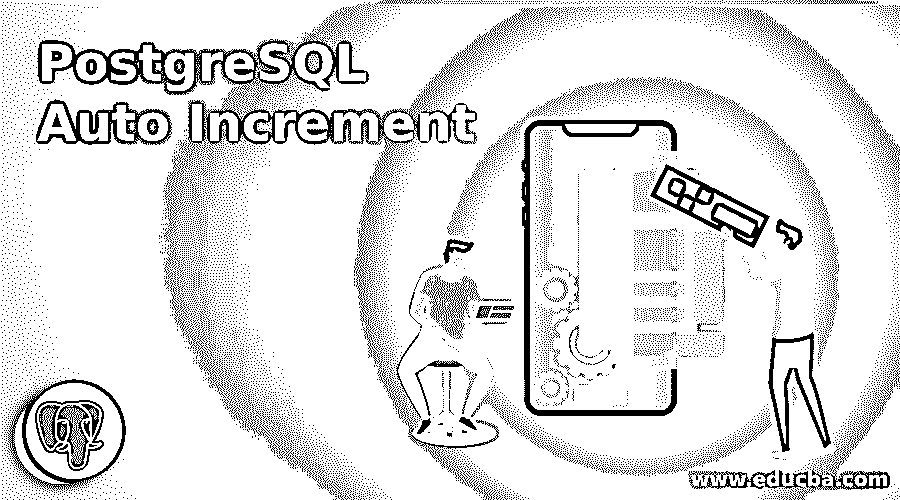
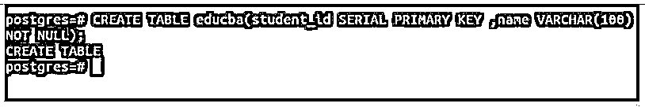
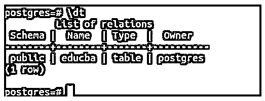
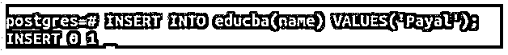
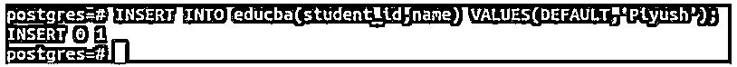
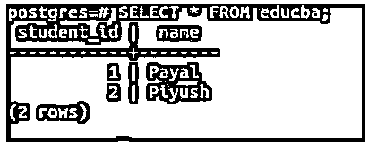
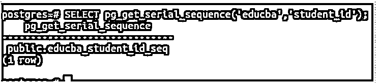

# PostgreSQL 自动递增

> 原文：<https://www.educba.com/postgresql-auto-increment/>

## PostgreSQL 自动增量简介

以下文章提供了关于 PostgreSQL 自动增量的概述。在 PostgreSQL 中，我们有一个特殊的数据库对象，称为 SEQUENCE 对象，它列出有序的整数值。当我们想要描述数据库表中自动递增的唯一键或主键或列时，经常使用 SEQUENCE。SERIAL 是一种伪类型，当特定列被声明为伪类型时，它会生成一个 SEQUENCE 对象。

### 序列数据库对象

*   首先，您需要了解序列对象是如何工作的。
*   序列完全是一个模式绑定的对象，由用户根据自己的特殊需求定义。{11，12，13，14，15，…}是一个完全不同于{100，99，98，97，..}序列。
*   可以在 CREATE SEQUENCE 语句的帮助下创建一个序列。
*   我们可以定义序列和缓存空间的最小和最大值、增量步长值、名称和所有者，缓存空间需要是有序列表的内存中预分配的空间。

### 串行伪类型

*   在 PostgreSQL 中创建表时，如果我们在内部声明任何类型为 SERIAL 的列，SERIAL 伪类型也会为该列和表默认值创建一个新的 SEQUENCE 对象。
*   这进一步帮助我们实现某些声明为 SERIAL 类型的列的值的自动递增。

### 内部工作

当我们在“educba”表的表创建查询中以下面的方式声明 SERIAL 类型的名为“student_id”的列时。

<small>Hadoop、数据科学、统计学&其他</small>

**代码:**

`CREATE TABLE educba(student_id SERIAL,name VARCHAR(100));`

然后在内部，有一堆命令被执行。

其中一些如下:

`CREATE SEQUENCE educba_student_id_seq;`

`CREATE TABLE educba (student_id integer NOT NULL DEFAULT nextval('educba_student_id_seq'), name VARCHAR(100));`

`ALTER SEQUENCE educba_student_id_seq OWNED BY educba.student_id;`

当在表中声明任何类型为 SERIAL 的列时，执行上述内部查询。

*   为列 student_id 创建一个新的 SEQUENCE 对象，并将该序列的下一个值赋给 student_id 列的默认值。
*   由于序列总是生成一个非空的整数值，因此将为列 student_id 分配 NOT NULL 约束。
*   如果删除了 student_id 列，那么与之相关联的序列对象也应该被删除。
*   为此，创建的序列 educba_student_id_seq 的所有者被设置为 educba 表的 student_id 列。

### 串行伪类型的类型

在 PostgreSQL 中，我们可以创建一个串行伪类型，它可以属于以下三种类型中的任何一种。

*   小型串行
*   连续的
*   大串行

它们的存储空间和范围限制不同。这类似于短整型、整型和长整型。

所有三种伪类型串行的存储空间和范围如下:

| **伪类型名** | **所需存储容量** | **列表中其值的范围** |
| --- | --- | --- |
| 小型串行 | 2 字节的空间 | 1 – 32,767 |
| 连续的 | 4 字节的空间 | 1 – 2,147,483,647 |
| 大串行 | 8 字节的空间 | 1 – 9,223,372,036,854,775,807 |

### 串行伪类型示例

现在让我们举一个例子，看看串行伪类型如何帮助我们实现自动增量。但是，有必要知道，每当一个列被声明为 SERIAL 类型时，这并不意味着在该列上创建了索引或者该列被视为其主键。为此，您需要在外部将该列定义为主键。

**代码:**

`CREATE TABLE educba(student_id SERIAL PRIMARY KEY ,name VARCHAR(100) NOT NULL);`

**输出:**

为了验证我们的表创建，让我们启动\dt 命令。

**输出:**

可以看出，名为 educba 的表创建成功。当在具有自动递增值列的表中插入记录时，可以跳过插入这些列值，也可以在 insert 查询语句中为这些列指定默认关键字。我们将使用这两种方法插入记录。首先，跳过 student_id 列。

**代码:**

`INSERT INTO educba(name) VALUES('Payal');`

**输出:**

表示成功插入了 1 行。现在，让我们插入一条记录，指定 student_id 列的默认值。

**代码:**

`INSERT INTO educba(student_id,name) VALUES(DEFAULT,'Piyush');`

**输出:**

说我们多插了一行。现在，让我们检查 educba 表记录，看看是否为 student_id 列插入了值，以及它们是否自动递增。

**代码:**

`SELECT * FROM educba;`

**输出:**

因此，我们可以看到 student_id 列现在作为自动递增的字段工作。

### 序列值方法

与数据库中创建的序列对象相关的方法，如获取序列对象的名称和检索该序列对象的当前最大值。pg_get_serial_sequence 方法用于获取为特定表的序列类型列创建的序列对象的名称。它有两个参数，一个是表名，另一个是该表的列名。

**代码:**

`pg_get_serial_sequence('tableName','columnName');`

让我们检索为 student_id 列创建的序列对象的名称。

**代码:**

`SELECT pg_get_serial_sequence('educba','student_id');`

**输出:**

因此，educba_student_id_seq 是序列对象的名称。

我们将使用方法 currval(nameOfSequence)检索这个 Sequence 对象分配给列 student_id 的最大值或最后一个值，该方法只接受一个参数，即 sequence 对象的名称。

**代码:**

`SELECT currval(pg_get_serial_sequence('educba', 'student_id'));`

**输出:**

但是，您需要知道序列类型化列的序列值不是事务安全值。在访问数据库的相同表的两个实例中，插入记录，然后两者将获得不同的序列值，并且如果其中一个回复或回滚事务，则该会话检索的值保持不变，因此在自动递增字段的表值中产生间隙。

### 结论

在 PostgreSQL 中，自动增量是通过声明伪数据类型 SERIAL 的列来实现的，并由 SEQUENCE 数据库对象在内部管理，这是一种有序列表。

### 推荐文章

这是一个 PostgreSQL 自动增量的指南。在这里，我们讨论对 PostgreSQL 自动递增序列数据库对象、序列伪类型和序列值方法的介绍。您也可以看看以下文章，了解更多信息–

1.  [PostgreSQL 布尔值](https://www.educba.com/postgresql-boolean/)
2.  [PostgreSQL RANK()](https://www.educba.com/postgresql-rank/)
3.  [在 PostgreSQL 中强制转换](https://www.educba.com/cast-in-postgresql/)
4.  [PostgreSQL 通知](https://www.educba.com/postgresql-notify/)
5.  [PostgreSQL Trunc()](https://www.educba.com/postgresql-trunc/)