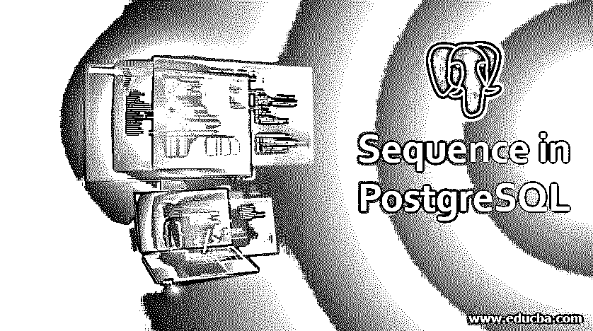
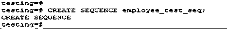
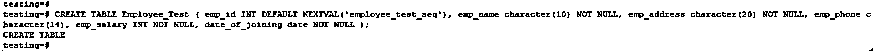
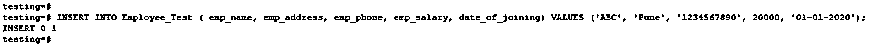
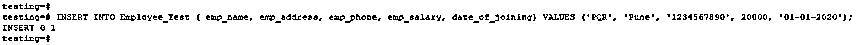
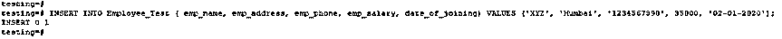
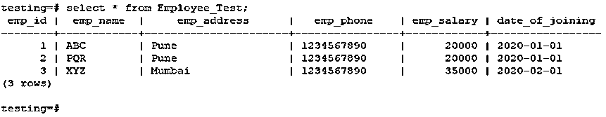
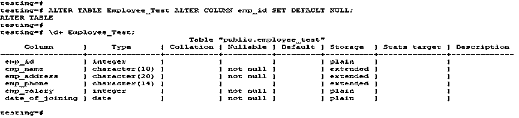

# PostgreSQL 中的序列

> 原文：<https://www.educba.com/sequence-in-postgresql/>

## PostgreSQL 中的序列介绍

PostgreSQL 中的一个序列，用于在数据库中生成唯一的数字标识符；它与 MySQL 中的自动增量类似，但不完全相同。我们已经使用 create sequence 语句在 PostgreSQL 数据库中创建新的序列；它将创建一个新的序列。如果我们在创建序列时指定了模式名，那么序列将使用指定的模式创建；否则，它将在当前模式中创建。临时序列存在于一个特殊的模式中，因此我们在创建 PostgreSQL 临时序列时不需要给出模式名。

### PostgreSQL 中序列的语法

下面是创建序列的语法如下。

<small>Hadoop、数据科学、统计学&其他</small>

`CREATE [TEMPORARY | TEMP] SEQUENCE [IF NOT EXISTS] name (name of sequence) [INCREMENT [BY] increment] [MINVALUE minvalue | NO MINVALUE] [MAXVALUE maxvalue | NO MAXVALUE] [START [WITH] start] [CACHE cache] [ [ NO ] CYCLE ] [OWNED BY {Table_name. Column_name | NONE}]`

**下面是上述语法的参数描述如下。**

*   **Create-**Create 语句用于在 PostgreSQL 中创建新的序列。
*   **Temporary 或 temp–**在 PostgreSQL 中创建临时序列时使用了 Temporary 关键字。
*   **Sequence–**在 PostgreSQL 中创建序列时使用了 Sequence 关键字。
*   **如果不存在-**使用该关键字后，不会抛出同名序列已经存在的错误。
*   **名称—**要创建的序列的名称。
*   **Increment–**这是在 PostgreSQL 中创建序列时使用的可选子句。正值表示升序，负值表示降序。默认值为 1。
*   **最小值–**它将生成序列的最小值。这是在序列创建时使用的可选子句。
*   **最大值—**它将生成序列的最大值。这是在序列创建时使用的可选子句。
*   **Start—**它是 sequence 的可选子句。该参数的默认起始值是升序序列的最小值和降序序列的最大值。
*   **Cache–**该操作符用于指定预分配和存储在内存中的序列号数量，以加快访问速度。这是 sequence 的可选子句。
*   **循环–**该选项允许在上升和下降序列达到最大值和最小值时回绕。
*   **Owned by-**该参数与具体的表名和列名相关联。
*   **列名—**我们在其上创建序列的列名。

### Postgre SQL 中的 Sequence 是如何工作的？

*   PostgreSQL 有几个函数是为序列设计的。下面是最常用的功能如下。

1.  Nextval
2.  库尔瓦尔
3.  塞特瓦尔
4.  拉斯特瓦尔

*   Nextval 函数将递增指定序列的值，并以整数类型返回新值。
*   Currval 将返回 Nextval 函数的最后一个返回值。如果我们没有使用 Nextval，那么它不会返回任何值。
*   PostgreSQL 序列中的 Setval 将序列的当前值设置为 N 值。
*   PostgreSQL 中的 Lastval 函数将返回最近获得的序列和下一个值。
*   在 PostgreSQL 中，create sequence 用于创建新的序列生成器。
*   序列名称必须不同于 PostgreSQL 中序列、表、视图或外部表的任何其他名称。
*   如果我们在创建序列时已经给定了一个模式名，那么将使用指定的模式创建序列。否则，它将在当前模式中创建。
*   创建序列后，我们使用了 Nextval、Lastval、Currval 和 Setval 等函数来操作 PostgreSQL 序列。
*   PostgreSQL 中的序列对于在数据库中生成唯一的数字标识是必不可少的。
*   这是一个将用来自动生成序列号的对象。
*   我们可以创建任意数量的序列，但是我们需要在创建时定义每个序列唯一的名称。
*   PostgreSQL 中的序列是一种特殊的对象，用于生成数字标识符。这通常用于在 PostgreSQL 中生成人工主键。
*   PostgreSQL 中的序列与 MySQL 中的自动增量相似，但不完全相同。
*   PostgreSQL 中最常用于 serial 伪类型的序列。serial 是 PostgreSQL 中的一种特殊数据类型，用于对信息进行编码，如下所示。
*   PostgreSQL 中的 Serial 表示该列的值是通过查询序列生成的。
*   PostgreSQL 中的 Serial 将创建一个新的 sequence 对象，并将列的默认值设置为序列产生的下一个值。
*   序列总是产生非空值；它会将 not null 约束添加到列中。
*   使用序列后，我们假设序列仅用于为包含一个序列列的表创建一个新值。
*   如果表中的序列列被删除，序列将自动被删除。

### PostgreSQL 中实现 Sequence 的例子

下面是一个创建序列的示例，以及在向表中插入数据时它是如何工作的。

**1。创建一个名为 employee_test_seq 的序列。**

`CREATE SEQUENCE employee_test_seq;`

**输出:**

**2。创建一个表，并在向表中插入数据时使用 employee_test_seq 序列。**

`CREATE TABLE Employee_Test ( emp_id INT DEFAULT NEXTVAL('employee_test_seq'), emp_name character(10) NOT NULL, emp_address character(20) NOT NULL, emp_phone character(14), emp_salary INT NOT NULL, date_of_joining date NOT NULL );`

**输出:**

`INSERT INTO Employee_Test ( emp_name, emp_address, emp_phone, emp_salary, date_of_joining) VALUES ('ABC', 'Pune', '1234567890', 20000, '01-01-2020');`

**输出:**

`INSERT INTO Employee_Test ( emp_name, emp_address, emp_phone, emp_salary, date_of_joining) VALUES ('PQR', 'Pune', '1234567890', 20000, '01-01-2020');`

**输出:**

`INSERT INTO Employee_Test ( emp_name, emp_address, emp_phone, emp_salary, date_of_joining) VALUES ('XYZ', 'Mumbai', '1234567890', 35000, '02-01-2020');`

**输出:**

`select * from Employee_Test;`

**输出:**

### Postgre SQL 中的删除序列

以下查询显示了如何删除序列。

*   **改变表格列以删除序列。**

`ALTER TABLE Employee_Test ALTER COLUMN emp_id SET DEFAULT NULL;
\d+ Employee_Test;`

**输出:**

*   **下降顺序**

`DROP SEQUENCE employee_test_seq;`

**输出:**

### 结论

序列对于生成数据库的唯一标识号是最重要的。它有几个函数，如 Nextval、Setval、Lastval 和 Currval，这些函数是为序列设计的。我们还使用 create sequence 语句在数据库中创建新的序列。

### 推荐文章

这是一个 PostgreSQL 中的序列指南。在这里，我们将讨论 PostgreSQL 中的 Sequence 是如何工作的，以及示例、语法和参数。您也可以阅读以下文章，了解更多信息——

1.  [PostgreSQL 触发器](https://www.educba.com/postgresql-triggers/)
2.  [PostgreSQL 过程](https://www.educba.com/postgresql-procedures/)
3.  [PostgreSQL 排序依据](https://www.educba.com/postgresql-order-by/)
4.  [PostgreSQL 中的索引](https://www.educba.com/indexes-in-postgresql/)
5.  [PostgreSQL 获取指南](https://www.educba.com/postgresql-fetch/)
6.  [Oracle 约束条件完整指南](https://www.educba.com/oracle-constraints/)