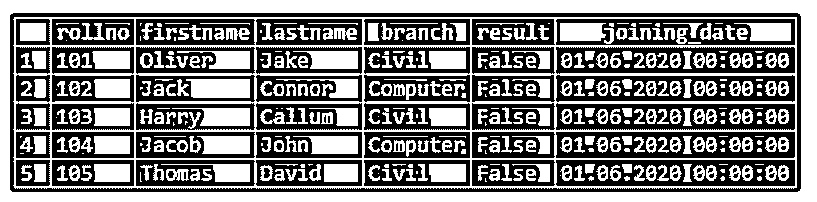
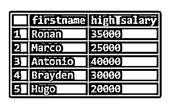

# PostgreSQL 别名

> 原文：<https://www.educba.com/postgresql-alias/>

## PostgreSQL 别名介绍

简单地说，别名意味着临时给一个表或一个列取另一个名称。为了给出表或列的临时名称，我们通常使用 PostgreSQL 别名。PostgreSQL 别名用于为列或表创建临时名称。别名的存在仅限于 PostgreSQL 语句的执行，这意味着 PostgreSQL 别名用于重命名特定 PostgreSQL 查询中的列或表。因此，数据库中实际的表名或列名不会改变。在对表执行自连接以创建临时表时，我们通常使用临时名称。

### 句法

我们可以使用 PostgreSQL 别名为列、表或表达式创建一个临时名称。让我们理解别名的语法如下:

<small>Hadoop、数据科学、统计学&其他</small>

**1。列**的 PostgreSQL 别名

`SELECT column [AS] alias_name
FROM table;`

**2。表达式的 PostgreSQL 别名**

`SELECT expression [AS] alias_name
FROM table;`

**3。表**的 PostgreSQL 别名

`SELECT column
FROM table [AS] alias_name;`

**说明:**

*   **列:**我们要为其指定别名的实际列名。
*   **table_name:** 我们要为其指定别名的实际表名。
*   **表达式:**我们要为其指定别名的表达式。
*   **AS:** 是可选关键字。无论是否定义，AS 关键字都不会影响 PostgreSQL 语句中的别名。在 PostgreSQL 中，是否定义为关键字是程序员的选择。
*   **别名:**表达式、列或表的临时名称。PostgreSQL 别名可以包含空格。但是，在别名表的情况下，使用带空格的别名并不是最佳做法。

### PostgreSQL 中的别名是如何工作的？

PostgreSQL 别名用于消除自连接的模糊性。自连接意味着同一个表被多次扫描以检索数据。PostgreSQL 别名与可选的“Alias”关键字一起使用，但是如果提供了该关键字，它会隐藏列或表的实际名称。如果我们在 PostgreSQL 语句中指定了别名，我们需要定义列名和定义的别名，并且它的范围仅限于同一条语句。

**举例:**

*   考虑一个语句“FROM MyTable AS MT”，我们将它与 SELECT 语句一起使用，那么它实际上使用的是“MT”而不是“MyTable”。
*   考虑以下语句以理解 PostgreSQL 实际上是如何处理长表名的:

`SELECT long_table_name.column
FROM long_table_name;`

我们可以使用别名作为长表名，如下所示:

`SELECT ltn.column
FROM long_table_name ltn;`

这里我们为表' long_table_name '指定了别名' ltn '。

### 在 PostgreSQL 中实现别名的示例

让我们创建一个名为“学生”和“教师”的表来详细理解 PostgreSQL 别名示例:

#### 示例#1

创建一个名为“学生”表

**代码:**

`CREATE TABLE student(
rollno int PRIMARY KEY,
firstname VARCHAR (50) NOT NULL,
lastname VARCHAR (50) NOT NULL,
branch VARCHAR (50) NOT NULL,
result boolean,
joining_date DATE NOT NULL
);`

现在，将一些数据插入到学生的表中。

`INSERT INTO student (rollno, firstname, lastname, branch, result, joining_date)
values
('101', 'Oliver','Jake', 'Civil', false, '06-01-2020'),
('102', 'Jack','Connor', 'Computer', false, '06-01-2020'),
('103', 'Harry','Callum', 'Civil', false, '06-01-2020'),
('104', 'Jacob','John', 'Computer', false, '06-01-2020'),
('105', 'Thomas','David', 'Civil', false, '06-01-2020');`

现在，在以下 SQL 语句的帮助下，举例说明插入到“student”表中的数据。

`select * from student;`

#### 实施例 2

创建一个名为“教师”表

**代码:**

`CREATE TABLE teacher (
teacher_id INT NOT NULL PRIMARY KEY,
firstname VARCHAR (50) NOT NULL,
lastname VARCHAR (50) NOT NULL,
branch VARCHAR (50) NOT null,
salary numeric
);`

现在，向“教师”表中插入一些数据。

`INSERT INTO teacher (teacher_id, firstname, lastname, branch,salary)
values
('1', 'Hugo','Smith', 'Computer',20000),
('2', 'Brayden','Johnson', 'Computer',30000),
('3', 'Ronan','Williams', 'Civil',35000),
('4', 'Antonio','Brown', 'Civil',40000),
('5', 'Marco','Davis', 'Civil',25000);`

现在，在以下 SQL 语句的帮助下，举例说明插入到“教师”表中的数据。

`select * from teacher;`

##### 1.列的 PostgreSQL 别名

我们指定别名以使列标题在最终结果集中更具可读性。就像每当我们使用像 MAX 这样的函数时，我们可以给 MAX 函数的结果起别名，以便于阅读。

`SELECT firstname, MAX(salary) AS high_salary
FROM teacher
GROUP BY firstname;`

使用下面的快照说明上述语句的结果。

在上面的例子中，MAX(salary)的别名是 high_salary。因此，第二列的列标题将显示为“high_salary”。在本例中，我们没有在中添加任何空格，因此不需要在给定的 alias_name 周围添加引号。

可以在 PostgreSQL 别名中的 alias_name 两边加上引号，如下所示:

`SELECT firstname, MAX(salary) AS "high_salary"
FROM teacher
GROUP BY firstname;`

使用下面的快照说明上述语句的结果。

如果别名中有空格，我们应该用引号括起来。考虑下面的例子。

`SELECT firstname, MAX(salary) AS "high salary"
FROM teacher
GROUP BY firstname;`

使用下面的快照说明上述语句的结果。

##### 2.表的 PostgreSQL 别名

为了使查询更易读、更简短，或者在自连接的情况下，我们多次使用同一个表，如果我们想缩写表的名称，我们通常在表上使用别名。可以为您希望提供临时名称的表定义别名，而不是为所有的表定义别名。

让我们考虑下面的例子来理解表别名。

`SELECT s.firstname, s.branch, teacher.firstname
FROM student s
INNER JOIN teacher
ON s.branch = teacher.branch
ORDER BY s.rollno asc;`

使用下面的快照说明上述语句的结果。

在上面针对“学生”表的语句中，我们创建了别名 s。因此在该语句中，我们可以使用“s”来代替学生表，因为它指的是“学生”表。

现在我们将为“教师”表添加一个别名“t ”,请看下面的例子。

`SELECT s.firstname, s.branch, t.firstname
FROM student s
INNER JOIN teacher t
ON s.branch = t.branch
ORDER BY s.rollno asc;`

使用下面的快照说明上述语句的结果。

### 推荐文章

这是一个 PostgreSQL 别名的指南。在这里，我们讨论 PostgreSQL 中别名的介绍和工作原理，以及不同的示例和代码实现。您也可以阅读以下文章，了解更多信息——

1.  [加入 PostgreSQL](https://www.educba.com/joins-in-postgresql/)
2.  [PostgreSQL 触发器](https://www.educba.com/postgresql-triggers/)
3.  [PostgreSQL 分组依据](https://www.educba.com/postgresql-group-by/)
4.  [PostgreSQL 排序依据](https://www.educba.com/postgresql-order-by/)
5.  如何实现 PostgreSQL 的极限？
6.  [PostgreSQL 唯一约束指南](https://www.educba.com/postgresql-unique-constraint/)