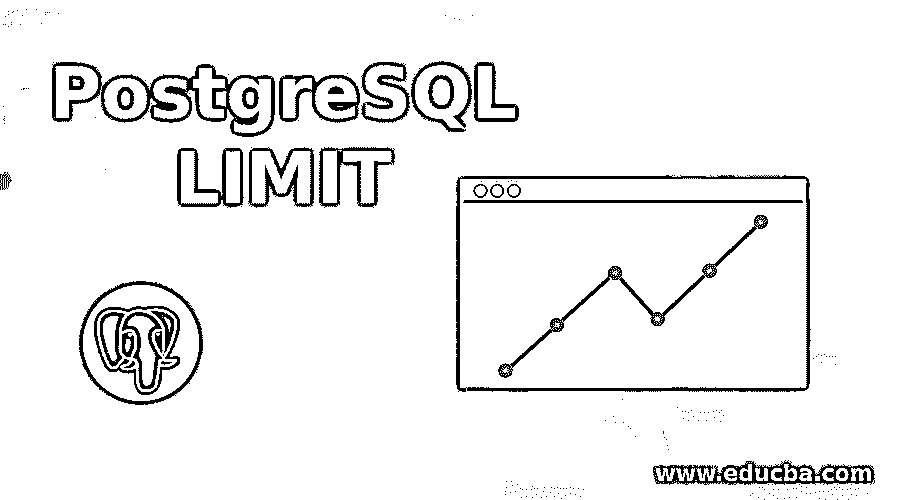
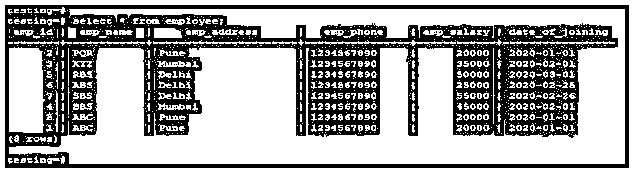
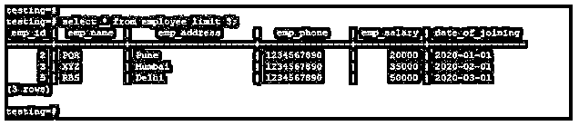
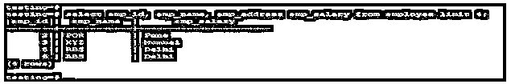
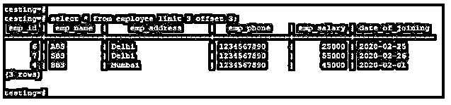
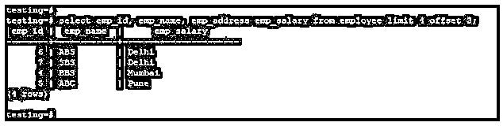
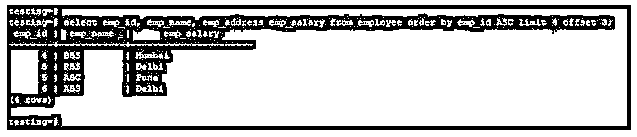
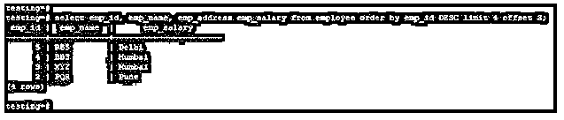

# PostgreSQL 限制

> 原文：<https://www.educba.com/postgresql-limit/>

## PostgreSQL 限制简介

PostgreSQL limit 子句返回表中的行数，这是从表中提取记录时在 limit 值中提到的。它是 PostgreSQL select 语句的可选子句，用于从整个表中获取有限数量的行；该子句还与 offset 子句一起使用，从表中提取记录。我们可以将该子句与 order by 子句一起使用来查找升序和降序数；在 PostgreSQL 中使用 limit 子句是查找行的顶部和底部值的最佳方式。

**语法:**

<small>Hadoop、数据科学、统计学&其他</small>

1.PostgreSQL 限制子句

`Select column_name1, …, column_nameN from table_name LIMIT N (Number of rows count)`

`Select * (select all table columns) from table_name LIMIT N (Number of rows count)`

2.使用抵消条款的限制条款

`Select column_name1, …, column_nameN from table_name LIMIT N (Number of rows count) OFFSET N (Number of offset)`

`Select * (select all table columns) from table_name LIMIT N (Number of rows count) OFFSET N (Number of offset)`

3.使用 order by 子句

`Select column_name1, …, column_nameN from table_name ORDER BY column_name LIMIT N (Number of rows count)`

`Select column_name1, …, column_nameN from table_name ORDER BY column_name LIMIT N (Number of rows count) OFFSET N (Number of offset)`

`Select column_name1, …, column_nameN from table_name ORDER BY column_name DESC LIMIT N (Number of rows count)`

`Select column_name1, …, column_nameN from table_name ORDER BY column_name ASC LIMIT N (Number of rows count)`

**上述语法的参数描述如下:**

*   **Select:** Select 语句用于使用 limit 子句不选择任何行。
*   **Column _ name 1 to Column _ nameN:**我们使用 limit 子句从表中选择一列来提取数据。
*   **From:** 关键字，用于选择使用 limit 子句提取数据的指定表。
*   **表名:**使用 limit 子句从表中获取指定记录的表。
*   **星号(*):** 星号用于从表中选择所有要提取数据的列。
*   **Limit N:**PostgreSQL 中的一个 Limit 子句，用于从表中选择指定数量的行。
*   **Offset N:** 与 limit 子句一起使用的 Offset 子句使用偏移值提取指定的行。
*   **Order by:** Order by 子句用在 limit 子句中，按升序或降序提取记录。
*   **ASC:** 使用 PostgreSQL 中的 order by 和 limit 子句按升序取数据。
*   **DESC:** 使用 PostgreSQL 中的 order by 和 limit 子句按降序取数据。

### PostgreSQL 中的 LIMIT 子句是如何工作的？

*   此子句是 select 语句的可选子句。
*   Limit 子句在 PostgreSQL 中是必不可少的。
*   我们可以通过使用 offset 子句来使用 limit 子句。offset 子句将在返回结果之前跳过 N 行。
*   limit 用于限制从表中返回的记录数。
*   limit 是 PostgreSQL select 语句的可选子句，用于从整个表中提取有限数量的行。
*   该子句还与 offset 子句一起使用，从表中提取记录。
*   我们可以将该子句与 order by 子句一起使用来查找升序和降序的数字。
*   在 order by 子句中使用 limit，我们可以很容易地找到表的顶行和底行。
*   Limit 子句返回从表中提取记录时 limit value 中提到的表中的行数。

### PostgreSQL 限制的示例

以下是 PostgreSQL 限制的示例:

我们使用了一个雇员表来描述 PostgreSQL 中的一个限制示例:

#### 示例#1

Employee 表来描述 PostgreSQL 中的一个限制示例。

**代码:**

`select * from employee;`

**输出:**

#### 实施例 2

通过从表中获取所有列和指定行数的数据进行限制的示例。

在下面的示例中，我们使用 PostgreSQL 限制从所有列中获取记录，并且只从三列中检索数据。

**代码:**

`select * from employee limit 3;`

**输出:**

#### 实施例 3

通过从表中提取指定列和指定行数的数据进行限制的示例。

在下面的示例中，我们使用 PostgreSQL 限制从指定的列中获取记录，并仅从四列中检索数据。

**代码:**

`select emp_id, emp_name, emp_address emp_salary from employee limit 4;`

**输出:**

#### 实施例 4

Limit 子句，方法是使用 offset 子句从所有列和指定行中提取数据。

*   在下面的示例中，我们使用 limit 和 offset 子句从所有列和指定行中检索数据。offset 子句将跳过 N 个偏移量的行。
*   在下面的例子中，我们跳过如下三行。

**代码:**

`select * from employee limit 3 offset 3;`

**输出:**

#### 实施例 5

Limit 子句，方法是使用 offset 子句从指定的列和指定的行中提取数据。

*   在下面的示例中，我们使用 limit 和 offset 子句从指定的列和指定的行中检索数据。
*   在下面的例子中，我们跳过如下三行。

**代码:**

`select emp_id, emp_name, emp_address emp_salary from employee limit 4 offset 3;`

**输出:**

#### 实施例 6

使用 order by 子句进行限制。

1.使用 order by 按升序提取数据。

**代码:**

`select emp_id, emp_name, emp_address emp_salary from employee order by emp_id ASC limit 4 offset 3;`

**输出:**

2.使用 order by 按降序提取数据。

**代码:**

`select emp_id, emp_name, emp_address emp_salary from employee order by emp_id DESC limit 4 offset 3;`

**输出:**

### 结论

PostgreSQL limit 子句在 PostgreSQL 中对于从选择查询中返回有限数量的行是必不可少的。我们已经在 PostgreSQL 中使用了使用 offset 的 limit 子句；此外，我们必须使用 order by 子句以升序和降序获取数据。它是 select 语句的可选子句。

### 推荐文章

这是一个 PostgreSQL 限制的指南。这里我们讨论一下入门，PostgreSQL 中的 LIMIT 子句是如何工作的？还有例子。您也可以看看以下文章，了解更多信息–

1.  [PostgreSQL UNION ALL](https://www.educba.com/postgresql-union-all/)
2.  [PostgreSQL 约束](https://www.educba.com/postgresql-constraints/)
3.  [PostgreSQL 排序依据](https://www.educba.com/postgresql-order-by/)
4.  [PostgreSQL 特性](https://www.educba.com/postgresql-features/)
5.  [PostgreSQL 唯一约束指南](https://www.educba.com/postgresql-unique-constraint/)
6.  [PostgreSQL 通知|如何工作？](https://www.educba.com/postgresql-notify/)