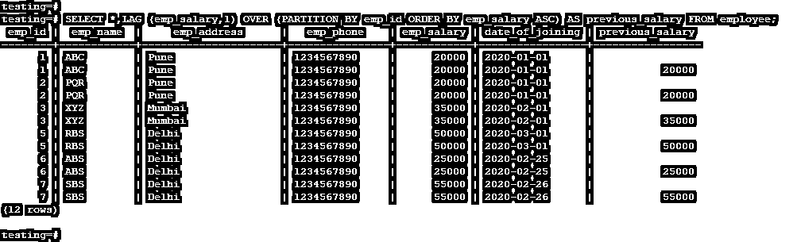
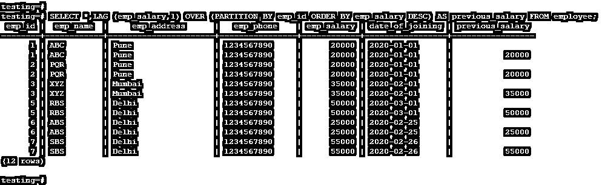

# PostgreSQL 滞后()

> 原文：<https://www.educba.com/postgresql-lag/>

## PostgreSQL LAG()的定义

PostgreSQL lag()是一个函数，在该函数中，行将出现在当前行之前，作为输出或查询的指定偏移量。一般来说，PostgreSQL lag 函数将声明，对于当前行值，lag 函数将访问来自先前行的数据；它总是从前面的行中访问数据，以显示查询的输出。在 PostgreSQL 中，lag 函数对于比较当前行和以前行的值或数据是必不可少的，也是非常有用的。它用于比较当前行和前一行的值。

### PostgreSQL LAG()的语法

下面是语法如下。

<small>Hadoop、数据科学、统计学&其他</small>

#### 1.使用 Partition by 子句

**语法:**

`LAG (expression (Expression is column name of table) [, offset (Which specifies the rows number that comes before current row) [, default_value (Default value of lag function)]]) OVER (
[PARTITION BY (It will divides rows into partition) partition_expression (Partition column name), ... ] ORDER BY (Order by clause is used to sort the data) sort_expression [ASC | DESC], ... (Sort column row by ascending or descending order))`

#### 2.Partition by 子句的默认值

**语法:**

`LAG (expression (Expression is column name of table) [, offset (Which specifies the rows number that comes before current row) [, default_value (Default value of lag function)]]) OVER (
ORDER BY (Order by clause is used to sort the data) sort_expression [ASC | DESC], ... (Sort column row by ascending or descending order))`

##### 参数

下面是对上述语法的参数描述如下。

*   **Expression** : Expression 就是一个列名，在 lag 函数中用来显示指定的列数据。这是一个列或子查询。它将在 lag 函数中返回一个值。
*   **Lag():** PostgreSQL lag()函数是一个函数，它将行放在当前行之前，作为输出或查询的指定偏移量。
*   **Offset** : Offset 是 lag 函数中的一个整数，指定当前行之前的数字。滞后函数中的偏移默认值为 1。如果我们不指定偏移值，默认情况下将取 1。
*   **默认值**:这是一个滞后函数的默认值；如果偏移量超过分区的作用域值，PostgreSQL lag 函数将返回默认值。
*   **Partition by** : Partition by 是 PostgreSQL 的一个子句，用在一个 lag 函数中。PostgreSQL lag 函数中的 Partition by 子句将行划分到应用了 lag 函数的分区中。如果我们不指定 partition by 子句，它将考虑表的整个单个分区。
*   **Partition expression**:Partition expression 除了我们在 partition by 子句中用来将表值划分到分区中的列名之外，什么都没有。
*   **Order by** :这是 PostgreSQL 子句，与 lag 函数一起使用，以升序和降序指定数据。如果我们指定 ASC，那么数据将以升序提取；如果我们指定 DESC，那么数据将按降序提取。
*   **ASC** : Ascending 与 lag 函数中的 order by 子句一起使用，以升序提取数据。
*   **DESC** : Descending 与 lag 函数中的 order by 子句一起使用，以降序提取数据。
*   **排序表达式**:这是我们在 order by 子句中使用的列名，通过升序或降序获取数据。

### PostgreSQL LAG()函数如何工作？

下面是 lag 函数的工作原理。

*   lag 函数通过其落后于当前行的名称来工作；它将从以前的行中获取数据。
*   PostgreSQL lag()函数是一个函数，该函数将某行放在当前行之前，作为输出或查询的指定偏移量。
*   PostgreSQL lag 函数将声明对于当前行，PostgreSQL lag 函数将从前面的行中访问数据；它将总是从前面的行中访问数据，以显示查询的输出。
*   我们已经在 lag 函数中使用了 partition by 子句；通过 PostgreSQL lag 函数中的子句进行分区会将行划分到应用了 lag 函数的分区中。如果我们不指定 partition by 子句，它将考虑表的整个分区。如果我们指定了一个分区，那么数据将按顺序提取。
*   在 PostgreSQL 中，lag 函数对于比较当前行和以前行的值或数据是必不可少的，也是非常有用的。它用于比较当前行和前一行的值。
*   lag 函数与 order by 子句一起使用，通过升序或降序显示或获取数据。
*   lag 函数用于比较表格的当前行和前几行。如果我们需要同时比较两个表，我们在 PostgreSQL 中使用了 lag 函数。
*   lag 函数对于当前行和前一行的比较更重要。

### 实现 LAG()函数的示例

*   下面是在 PostgreSQL 中实现一个 lag 函数的例子。
*   我们已经使用 employee 表描述了 PostgreSQL 中 lag 函数的例子；下图显示了雇员表的数据。

`testing=# select * from Employee;`

-1.1")

#### 1.Lag 函数默认 Partition by 子句

以下示例显示了 PostgreSQL 中的 lag 函数默认 partition by 子句如下。

`testing=# SELECT *,LAG (emp_salary,1) OVER (ORDER BY emp_salary ASC) AS previous_salary FROM Employee;`

-1.2")

`testing=# SELECT *,LAG (emp_salary,1) OVER (ORDER BY emp_salary DESC) AS previous_salary FROM Employee;`

-1.3")

#### 2.具有 Partition by 子句的滞后函数

以下示例显示了 PostgreSQL 中具有 partition by 子句的 Lag 函数如下。

`testing=# SELECT *,LAG (emp_salary,1) OVER (PARTITION BY emp_id ORDER BY emp_salary ASC) AS previous_salary FROM employee;`

`testing=# SELECT *,LAG (emp_salary,1) OVER (PARTITION BY emp_id ORDER BY emp_salary DESC) AS previous_salary FROM employee;`

### 推荐文章

这是 PostgreSQL LAG()的指南。在这里，我们讨论定义和它如何工作，以及不同的例子和它的代码实现。您也可以看看以下文章，了解更多信息–

1.  [PostgreSQL 中的通配符](https://www.educba.com/wildcards-in-postgresql/)
2.  [PostgreSQL 左连接](https://www.educba.com/postgresql-left-join/)
3.  [PostgreSQL 中的序列](https://www.educba.com/sequence-in-postgresql/)
4.  [安装 PostgreSQL](https://www.educba.com/install-postgresql/)