# PostgreSQL 表

> 原文：<https://www.educba.com/postgresql-table/>

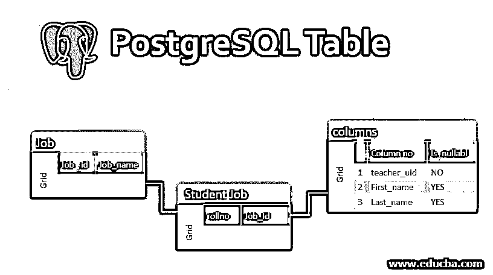

## PostgreSQL 表简介

在本文中，我们将了解 PostgreSQL 表。

表是数据库中表格格式的数据集合，由列和行组成。该表可用于表示关系数据模型；我们可以通过使用不同的键链接多个表来实现关系管理。

<small>Hadoop、数据科学、统计学&其他</small>

**语法**

`CREATE TABLE table_name (
column_name datatype column_constraint,
table_constraint table_constraint
) INHERITS existing_table_name;`

*   **CREATE TABLE 子句:**在 CREATE TABLE 子句后定义新的表名。
*   定义列名列表(用逗号分隔的一个或多个)、其数据类型以及各自的列约束。
*   在列列表之后，为表指定一个约束，我们称之为表级约束。它定义了表中数据的规则。
*   **INHERITS 子句:**指定要从中继承新表的现有表名。这定义了新创建的表将具有 CREATE TABLE 语句中定义的列和现有表的所有列。INHERITS 子句是 PostgreSQL 对 SQL 的扩展。

创建 student 表，该表包含以下列约束:

**代码:**

`CREATE TABLE student (
rollno int PRIMARY KEY,
firstname VARCHAR (50) NOT NULL,
lastname VARCHAR (50) NOT NULL,
email VARCHAR (355) UNIQUE NOT NULL,
branch VARCHAR (50) NOT NULL,
result boolean,
joining_date DATE NOT NULL
);`

**代码:**

`select * from student;`

**输出:**

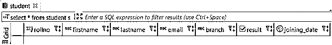

以下语句创建“作业”表:

**代码:**

`CREATE TABLE job (
job_id serial PRIMARY KEY,
job_name VARCHAR (255) UNIQUE NOT NULL
);`

**代码:**

`select * from job;`

**输出:**

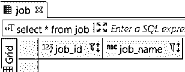

**代码:**

`select * from student_job;`

**输出:**

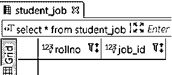

### 如何在 PostgreSQL 中删除表？

下面，我们将了解下降表:

**语法:**

`DROP TABLE [IF EXISTS] table_name [CASCADE | RESTRICT];`

*   为了从数据库中删除表，需要在 DROP TABLE 关键字后定义表的名称。
*   如果删除不存在的表，PostgreSQL 将抛出错误。为了避免在删除这种情况时出现异常，请在 DROP TABLE 子句后添加 IF EXISTS 参数。
*   如果要删除约束、视图或任何其他对象中使用的表，需要在表名后指定 CASCADE，这样可以删除表及其所有依赖对象。
*   默认情况下，PostgreSQL 使用 RESTRICT，它限制任何依赖于它的对象的表删除。
*   为了一次删除多个表，需要在 DROP TABLE 子句后指定一个逗号分隔的表名列表。

**1。**以下语句从数据库中删除‘MY _ TABLE’

**代码:**

`DROP TABLE MY_TABLE;`

PostgreSQL 抛出错误，因为 MY_TABLE 不存在。为了避免此错误，请使用 IF EXISTS 参数。

**代码:**

`DROP TABLE IF EXISTS MY_TABLE;`

**2。**创建以下表格，以便更好地了解 DROP TABLE:

**代码:**

`CREATE TABLE teacher (
teacher_id INT NOT NULL PRIMARY KEY,
first_name VARCHAR (50),
last_name VARCHAR (50)
);
CREATE TABLE subject (
subject_id serial PRIMARY KEY,
name VARCHAR (80) NOT NULL,
teacher_id INT NOT NULL,
FOREIGN KEY (teacher_id) REFERENCES teacher (teacher_id)
);`

*   移除教师表

**代码:**

`DROP TABLE IF EXISTS teacher;`

*   因为 subject 表的约束依赖于 teacher 表，所以 PostgreSQL 会发出一条错误消息。

**输出:**

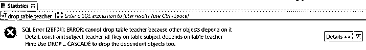

*   在这种情况下，您需要在删除教师表之前先删除所有相关对象，或者使用 CASCADE 参数，如下所示:

**代码:**

`DROP TABLE teacher CASCADE;`

*   PostgreSQL 删除教师表和主题表中的约束。

**Note:**  drop cascades to constraint subject_teacher_id_fkey on table subject.

### 如何在 PostgreSQL 中重命名表？

**语法:**

`ALTER TABLE table_name RENAME TO new_table_name;`

**解释:**在 ALTER TABLE 子句后定义要重命名的表名。在 RENAME TO 子句后指定表的新名称。

*   如果您尝试重命名不存在的表，PostgreSQL 将抛出错误。为了避免这种情况，您需要添加 IF EXISTS 参数，如下所示:

**代码:**

`ALTER TABLE IF EXISTS table_name
RENAME TO new_table_name;`

*   为了一次重命名多个表，需要执行 ALTER TABLE RENAME TO 的多个语句。你不可能一语成谶。让我们创建一个“Books”表进行演示。

**代码:**

`CREATE TABLE Books (
id serial PRIMARY KEY,
name VARCHAR NOT NULL
);`

*   使用以下语句将“Books”表重命名为“Notebooks”

**代码:**

`ALTER TABLE Books RENAME TO Notebooks;`

### 如何在 PostgreSQL 中截断表？

为了删除表中的所有行，必须使用 DELETE 语句。但是对于较大的表，使用 TRUNCATE TABLE 语句更有效。TRUNCATE TABLE 语句比 DELETE 语句快，因为它无需扫描就可以从表中删除数据。

从单个表中删除所有数据:

**语法#1**

`TRUNCATE TABLE table_name;`

**示例:**从“Notes”表中删除所有行

`TRUNCATE TABLE Notes;`

*   PostgreSQL TRUNCATE TABLE 语句通过定义重启标识并从表中删除所有数据来重置表的关联序列生成器。

**语法#2**

`TRUNCATE TABLE table_name RESTART IDENTITY;`

**示例:**从 Notes 表中删除所有行，并重置与 note_id 列相关的序列:

`TRUNCATE TABLE Notes RESTART IDENTITY;`

*   为了一次从多个表中删除所有数据，需要指定逗号(，)分隔的表名列表，如下所示:

**语法#3**

`TRUNCATE TABLE table_name1, table_name2`

**示例:**以下语句删除 Books 和 Notes 表中的所有数据:

`TRUNCATE TABLE Books, Notes;`

*   为了从主表和依赖于它的所有其他表中删除数据，这些表具有对主表的外键引用，您需要使用 CASCADE 参数。

**语法#4**

`TRUNCATE TABLE table_name CASCADE;`

**示例:**删除 Notes 表中的所有数据，并级联到通过外键约束引用 Notes 表的任何表

`TRUNCATE TABLE Notes CASCADE;`

### 如何在 PostgreSQL 中修改表？

若要更改现有的表结构，请使用 ALTER TABLE 语句。

**语法:**

`ALTER TABLE table_name action;`

**1。**了解 PostgreSQL 支持的动作，教师表具有以下结构:

`select * from teacher;`

**输出:**

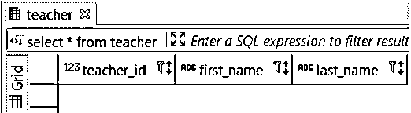

**2。**使用 ALTER TABLE ADD COLUMN 语句向表中添加新列:

**语法:**

`ALTER TABLE table_name ADD COLUMN new_column_name TYPE;`

**代码:**

`ALTER TABLE teacher ADD COLUMN email VARCHAR (80);`

**输出:**

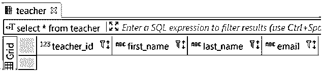

**3。**使用 ALTER TABLE DROP COLUMN 语句删除现有列:

**语法**

`ALTER TABLE table_name DROP COLUMN column_name;`

**代码:**

`ALTER TABLE teacher DROP COLUMN email;`

**输出:**

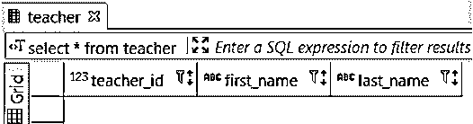

**4。**使用 ALTER TABLE RENAME COLUMN TO 语句重命名现有列:

**语法:**

`ALTER TABLE table_name RENAME COLUMN column_name TO new_column_name;`

**代号:** `ALTER TABLE teacher RENAME COLUMN teacher_id TO teacher_uid;`

**输出:**

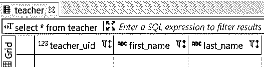

**5。**使用 ALTER TABLE ALTER COLUMN SET DEFAULT 或 DROP DEFAULT 更改列的默认值:

**语法:**

`ALTER TABLE table_name ALTER COLUMN column_name [SET DEFAULT value | DROP DEFAULT];`

**6。**使用 ALTER TABLE ALTER COLUMN 语句更改 NOT NULL 约束:

**语法:**

`ALTER TABLE table_name ALTER COLUMN column_name [SET NOT NULL| DROP NOT NULL];`

**代码:**

让我们使用下面的语句来检查教师表的列模式:

`SELECT column_name, is_nullable
FROM  information_schema.columns
WHERE  TABLE_NAME = 'teacher';`

**输出:**

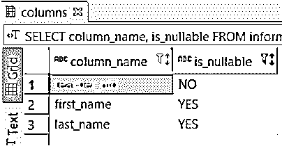

**7。**现在将 first_name 改为 not null，并再次执行上面的语句。

**代码:**

`ALTER TABLE teacher ALTER COLUMN first_name SET NOT null;`

**输出:**

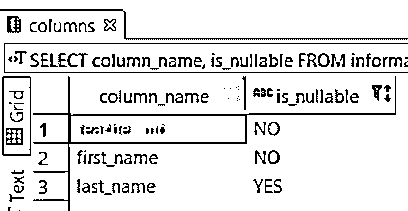

**8。**使用 ALTER TABLE ADD CHECK 语句添加检查约束:

**代码:**

`ALTER TABLE table_name ADD CHECK expression;`

**9。**使用 ALTER TABLE ADD CONSTRAINT 语句添加约束:

**代码:**

`ALTER TABLE table_name ADD CONSTRAINT constraint_name constraint_definition;`

10。使用 ALTER TABLE RENAME TO 语句重命名表:

**语法:**

`ALTER TABLE table_name RENAME TO new_table_name;`

**代码:**

`ALTER TABLE teacher RENAME TO staff;`

**输出:**

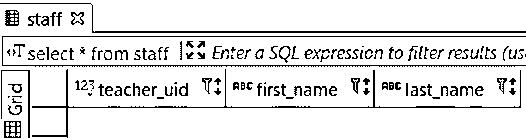

### 如何从表中获取数据？

PostgreSQL 提供 FETCH 子句来提取查询返回的一部分行。

**语法:**

`OFFSET start { ROW | ROWS }
FETCH { FIRST | NEXT } [ row_count ] { ROW | ROWS } ONLY`

**解释:** ROW | ROWS 和 FIRST | NEXT 同义。起始值是一个整数，必须为零或正数。

如果未定义 OFFSET 子句，则 start 的默认值为零。如果开始大于返回的行数，则查询不返回任何行。

*   row_count 等于或大于 1。
*   如果未定义 OFFSET 子句，row_count 的默认值为 1。

### 如何在 PostgreSQL 中复制表？

让我们了解使用 staff 表复制表结构的各种方法。

**代码:**

`Insert some data on the staff table.
INSERT INTO staff (teacher_uid , first_name, last_name)
values
('101', 'Oliver','Jake'),
('102', 'Jack','Connor'),
('103', 'Harry','Callum'),
('104', 'Jacob','John'),
('105', 'Thomas','David');`

**1。**完全复制一张完整的表格

**语法:**

`CREATE TABLE new_table AS
TABLE existing_table;`

**代码:**

`CREATE TABLE teacher AS
TABLE staff;`

**输出:**

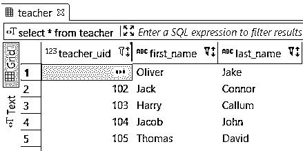

**2。**从现有表格中复制没有数据的表格

**语法:**

`CREATE TABLE new_table AS
TABLE existing_table
WITH NO DATA;`

**代码:**

`CREATE TABLE teacher AS
TABLE staff
WITH NO DATA;`

**输出:**

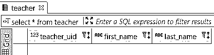

**3。**从现有表中复制包含部分数据的表结构

**语法:**

`CREATE TABLE new_table AS
SELECT *
FROM  existing_table
WHERE condition;`

*   **条件:**定义从已有表中复制的行

**代码:**

`CREATE TABLE teacher AS
SELECT *
FROM  staff s2
WHERE first_name like 'J%';`

**输出:**

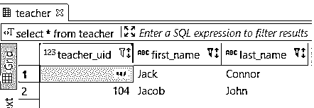

### 结论

我希望通过以上内容，您已经详细了解了 PostgreSQL 表，并学会了如何创建表、删除现有表、重命名表、截断表、复制表等。

### 推荐文章

这是一个 PostgreSQL 表的指南。这里我们讨论如何创建一个表，删除现有的表，重命名表，截断表和复制表等。，详细说明适当的语法和相应的示例。您也可以浏览我们的其他相关文章，了解更多信息——

1.  [PostgreSQL 架构](https://www.educba.com/postgresql-architecture/)
2.  [PostgreSQL 版本](https://www.educba.com/postgresql-versions/)
3.  [PostgreSQL WHERE 子句](https://www.educba.com/postgresql-where-clause/)
4.  [PostgreSQL 模式完全指南](https://www.educba.com/postgresql-schema/)
5.  [PostgreSQL 偏移量示例和参数](https://www.educba.com/postgresql-offset/)
6.  [如何使用 PostgreSQL 别名？](https://www.educba.com/postgresql-alias/)