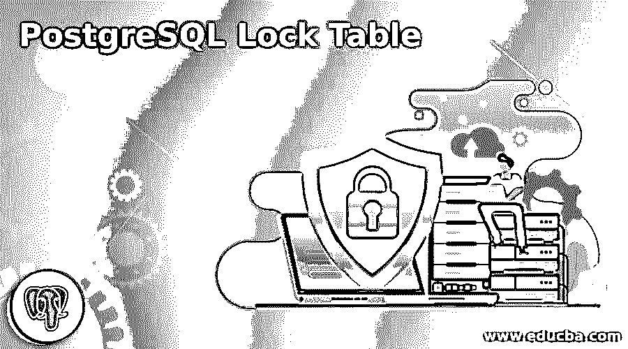
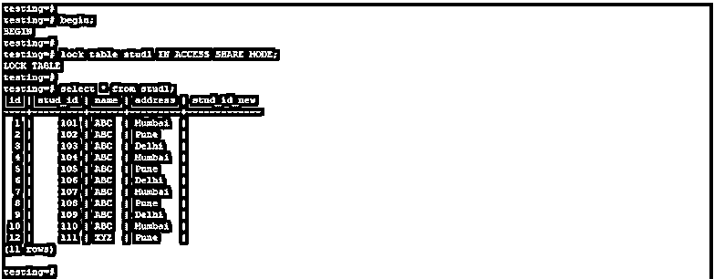
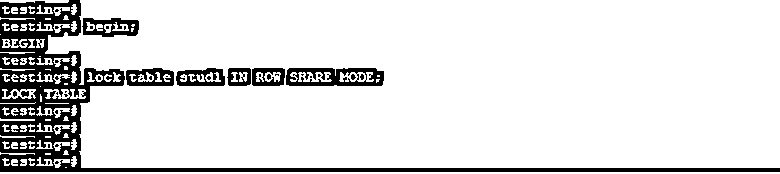
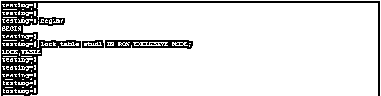
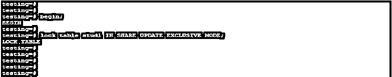
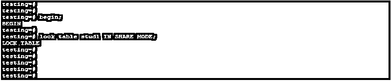
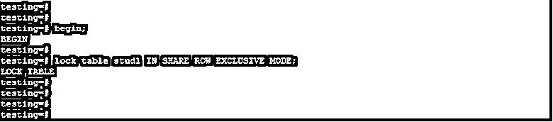
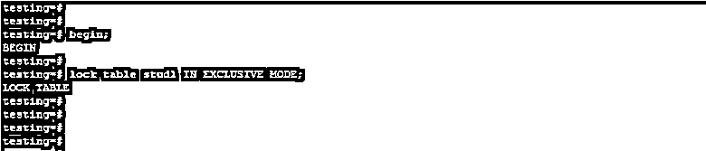
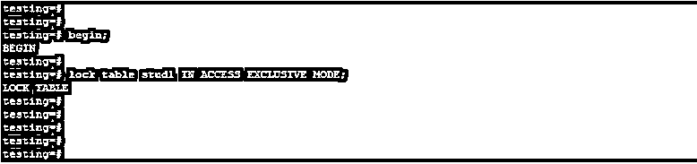

# PostgreSQL 锁表

> 原文：<https://www.educba.com/postgresql-lock-table/>

## PostgreSQL 锁表的定义

PostgreSQL 锁表被定义为一个供用户访问的锁表，我们可以锁定表的读访问或写访问。锁在 PostgreSQL 中非常有用和重要，它可以防止用户修改单个行或所有表。我们可以在 PostgreSQL 中使用 access share、row share、row exclusive、share、share update exclusive、exclusive、share row exclusive 和 access exclusive 模式来锁定表。使用 lock 命令，我们需要指定表名和我们在表上应用的模式名。

### PostgreSQL 中如何锁表？

下面是定义如何在 PostgreSQL 中锁定表的方法。下面的语法显示了如何锁定表。

<small>Hadoop、数据科学、统计学&其他</small>

**语法:**

`Lock table name_of_table IN [Mode of locking] [NOWAIT]`

*   在上面的例子中，锁表被定义为一个用来锁定表的命令，我们在 PostgreSQL 中锁定表时使用的是哪种模式。在对表应用锁之后，就不能进行读或写操作了。
*   表的名称被定义为我们对其应用锁的表名。
*   锁定模式被定义为在 PostgreSQL 中锁定表时使用的模式。如果我们没有使用任何锁模式，那么在 PostgreSQL 中将使用默认的独占访问模式。
*   现在它被定义为不要等待任何锁从表中被释放。如果没有获得锁，那么事务将直接中止，而不在 PostgreSQL 中等待。
*   我们可以使用 lock 命令显式地获取锁。下面是 PostgreSQL 中锁的模式。

#### 锁的模式

*   访问共享
*   行份额
*   行独占
*   共享更新专用
*   分享
*   独占共享行
*   独家的
*   独占访问
*   上面的锁模式将包含其指定的函数来锁定 PostgreSQL 中的表如下。

##### 1.访问共享

*   PostgreSQL 中的这种锁定与唯一的独占访问模式相冲突。PostgreSQL 中的 Select 命令将获取指定表上的这些锁。
*   这被定义为我们只能从表中读取数据，在获得表上的这些锁之后，我们不能修改表。

##### 2.行份额

*   PostgreSQL 中的这个锁与 access exclusive 和 exclusive 的模式冲突。select for share 和 select for update 语句将在表上获取这些类型的锁。

##### 3.行独占

*   PostgreSQL 中的这种锁与 share row exclusive、share、access exclusive 和 exclusive 模式相冲突。
*   update deletes 和 insert 将获取表上的锁。基本上，这些锁是在修改 PostgreSQL 语句的锁上获得的。

##### 4.共享更新专用

*   PostgreSQL 中的这种锁与 share row exclusive、share、access exclusive、share update exclusive 和 exclusive 模式冲突。
*   它将获得 PostgreSQL 中的 vacuum、index creation、alter table 和 validate 命令。

##### 5.分享

*   PostgreSQL 中的这种锁与 share row exclusive、share、access exclusive、share update exclusive、share 和 exclusive 的模式冲突。
*   这种锁模式将从 PostgreSQL 中的 create index 命令获取锁。

##### 6.独占共享行

*   PostgreSQL 中的这个锁与 share row exclusive、share、access exclusive、share update exclusive、share row exclusive、share 和 exclusive 的模式冲突。
*   这种模式不会在我们使用 lock 命令应用的表上自动获得。

##### 7.独家的

*   PostgreSQL 中的这个锁与 share row exclusive、share、access exclusive、share update exclusive、share row exclusive、share 和 exclusive 的模式冲突。
*   该锁是通过使用刷新实体化视图获得的。

##### 8.独占访问

*   PostgreSQL 中的这个锁与 share row exclusive、share、access exclusive、share update exclusive、share row exclusive、share、access exclusive 和 exclusive 的模式冲突。
*   使用该锁时，只有在表上应用锁的用户才能访问该表。

### PostgreSQL 锁表示例

下面是 PostgreSQL 中锁表的例子。

**1。使用访问共享锁定模式锁定表**

*   下面的例子显示了锁表通过使用访问共享锁模式。

`begin;
lock table stud1 IN ACCESS SHARE MODE;
select * from stud1;`

**2。使用行共享锁定模式锁定表**

*   以下示例显示了使用行共享锁定模式锁定表。

`begin;
lock table stud1 IN ROW SHARE MODE;`

**3。使用 roexclusive lock mode**锁定表格

*   下面的例子显示了使用行排他锁模式锁表。

`begin;
lock table stud1 IN ROW EXCLUSIVE MODE;`

**4。使用共享更新排他锁模式锁定表**

*   下面的例子显示了使用共享更新排他锁模式的锁表。

`begin;
lock table stud1 IN SHARE UPDATE EXCLUSIVE MODE;`

**5。使用共享锁定模式锁定表格**

*   下面的例子显示了使用共享锁模式的锁表。

`begin;
lock table stud1 IN SHARE MODE;`

**6。使用共享行排他锁模式**锁表

*   下面的例子显示了使用共享行排他锁模式锁表。

`begin;
lock table stud1 IN SHARE ROW EXCLUSIVEMODE;`

**7。使用独占锁定模式**锁定表格

*   下面的例子显示了使用排他锁模式锁表。

`begin;
lock table stud1 IN EXCLUSIVE MODE;`

**8。使用访问独占锁定模式**锁定表格

*   下面的例子显示了通过使用访问独占锁定模式来锁定表。

`begin;
lock table stud1 IN ACCESS EXCLUSIVE MODE;`

### 推荐文章

这是一个 PostgreSQL 锁表的指南。这里我们还讨论了 postgresql 中锁表的定义和方法，以及不同的例子和代码实现。您也可以看看以下文章，了解更多信息–

1.  [PostgreSQL 浮点型](https://www.educba.com/postgresql-float/)
2.  [PostgreSQL 删除](https://www.educba.com/postgresql-delete/)
3.  [PostgreSQL 导入 CSV](https://www.educba.com/postgresql-import-csv/)
4.  [PostgreSQL 字符串数组](https://www.educba.com/postgresql-string-array/)