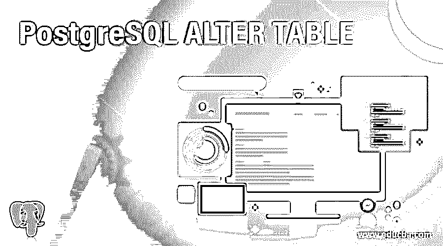
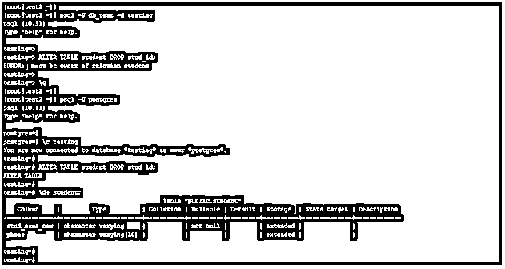
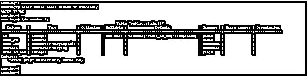
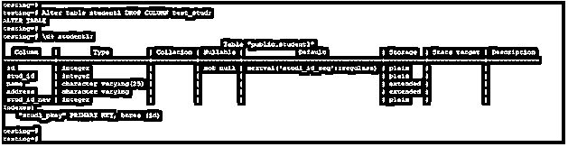
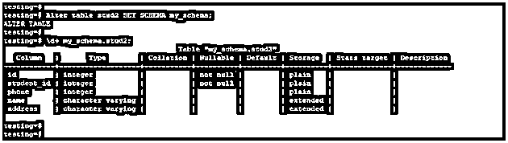
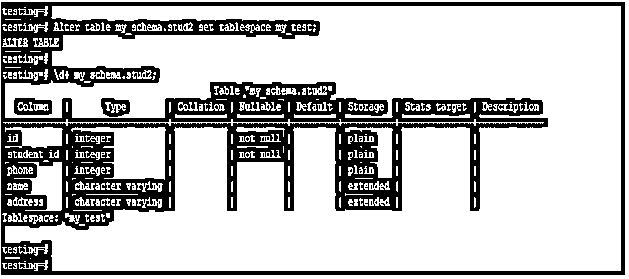
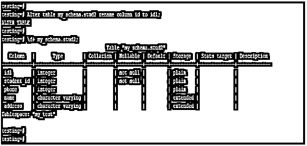

# PostgreSQL 更改表

> 原文：<https://www.educba.com/postgresql-alter-table/>

## PostgreSQL ALTER TABLE 简介

PostgreSQL alter table 语句用于改变表结构，我们可以改变表名、列名，添加或删除表列，从表中添加或删除约束，给表设置新的模式。要在 PostgreSQL 中使用 alter table 语句，我们需要拥有表的所有者权限或超级用户权限来执行 alter table 语句。Alter table 语句用于删除、添加和修改 PostgreSQL 中现有表的结构。

### PostgreSQL 变更表的语法

下面是语法:

<small>Hadoop、数据科学、统计学&其他</small>

**1。Alter table 更改表的名称**

`Alter table name_of_table RENAME TO new_name_of_table;`

**2。更改表格以添加一列**

`Alter table name_of_table ADD name_of_column data_type_of_column;`

**3。更改表以删除列**

`Alter table name_of_table DROP name_of_column;`

**4。更改表以更改列**的数据类型

`Alter table name_of_tableALTER COLUMN name_of_column type data_type_of_column;`

**5。更改表以设置新模式**

`Alter table name_of_table SET SCHEMA new_schema_name;`

**6。更改表以重命名列**

`Alter table name_of_table rename column old_column_name to new_column_name;`

7 .**。更改列以添加非空约束**

`Alter table name_of_table modify name_of_column data_type not null;`

**8。更改表以删除约束**

`Alter table name_of_table drop constraint name_of_constraint;`

**9。更改表以更改表空间**

`Alter table name_of_table set tablespace name_of_tablespace;`

#### 因素

下面是 PostgreSQL 中 alter table 语句的参数描述语法。

1.  **Alter table—**该语句用于改变 PostgreSQL 中的表结构。
2.  **表格名称–**这被定义为我们用来改变表格结构的表格名称。
3.  **Rename to–**该关键字用于更改表名，我们已经使用 Rename 关键字更改了表名。
4.  **表的新名称–**这是我们用 alter table 语句修改的新创建的表的名称。
5.  **Add column–**我们可以在 alter table 语句中使用 Add column 关键字来添加表格的一列。
6.  **列名–**这被定义为我们用 alter table 语句更改的列名。
7.  **列的数据类型—**这被定义为我们分配给该列的数据类型。
8.  **Modify-**该关键字用于修改 PostgreSQL 中添加 not null 约束的列。
9.  **Set tablespace–**使用 alter table 语句将新的表空间设置到表中。
10.  **Set schema–**使用 alter table 语句为表设置新的模式。
11.  **Drop constraint–**用于使用 alter table 语句从表中删除约束。

### 如何在 PostgreSQL 中修改表语句？

下面是 PostgreSQL 中 alter table 语句的工作方式。PostgreSQL 中的 Alter table 用于改变表的结构。

下面的例子表明我们需要拥有表的所有者的特权或超级用户特权。

`psql -U db_test -d testing
ALTER TABLE student DROP stud_id;
psql -U Postgres
\c testing
ALTER TABLE student DROP stud_id;
\d+ student;`

在上面的第一个例子中，我们使用用户作为 db_test，这个用户没有表所有者或超级用户的权限，所以在执行 alter table 语句时会出现错误。

在第二个例子中，我们使用用户名 Postgres 修改了表，在使用这个用户之后，我们必须从 student 表中删除列名 stud_id。

Alter table 用于对表做如下操作。

1.  更改表的名称。
2.  添加列。
3.  删除列。
4.  更改表的架构。
5.  更改表的表空间。
6.  向表中添加约束。
7.  从表中删除约束。
8.  重命名列。
9.  添加 not null 约束。

### 例子

下面是 PostgreSQL 中 alter table 语句的例子。我们使用 stud1 和 stud2 表来描述 alter table 语句的示例。

下面是 stud1 和 stud2 表的表说明。

`\d+ stud1;
\d+ stud2;`

#### 示例# 1–Alter table 更改表的名称

下面的例子显示了 alter table 改变表的名称。我们必须将 stud1 表名改为 student1。

`Alter table stud1 RENAME TO student1;
\d+ student1;`

#### 示例 2–更改表格以添加新列

下面的例子显示了 alter table 添加新列的过程。我们已经将 test_stud 列添加到 student1 表中。

`Alter table student1 ADD test_stud varchar;
\d+ student1;`

#### 示例# 3–将表改为删除列

下面的示例显示了 alter table 删除列。我们已经从 student1 表中删除了 test_stud 列。

`Alter table student1 DROP COLUMN test_stud;
\d+ student1;`

#### 示例# 4–Alter table 更改表的模式

以下示例显示了如何更改 stud2 表的模式。我们已经将模式 public 更改为 my_schema。

`Alter table stud2 SET SCHEMA my_schema;
\d+ my_schema.stud2;`

#### 示例# 5–更改表以更改表的表空间

以下示例显示了如何更改 stud2 表的表空间。我们已经将表空间从 default 改为 my_test。

`Alter table my_schema.stud2 set tablespace my_test;
\d+ my_schema.stud2;`

#### 示例# 6–更改表以重命名列

下面的例子显示了 alter table 对列的重命名。我们必须将 id 列更改为 id1 列。

`Alter table my_schema.stud2 rename column id to id1;
\d+ my_schema.stud2;`

### 推荐文章

这是一个 PostgreSQL ALTER TABLE 的指南。这里我们讨论如何在 PostgreSQL 中改变表，并给出查询示例。您也可以看看以下文章，了解更多信息–

1.  [PostgreSQL CTE](https://www.educba.com/postgresql-cte/)
2.  [PostgreSQL 内部连接](https://www.educba.com/postgresql-inner-join/)
3.  [PostgreSQL 日志](https://www.educba.com/postgresql-log/)
4.  PostgreSQL 中的[数组](https://www.educba.com/array-in-postgresql/)