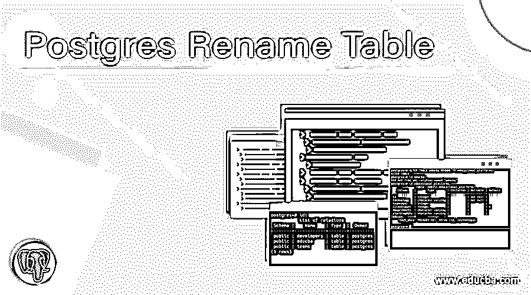
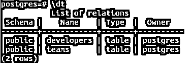
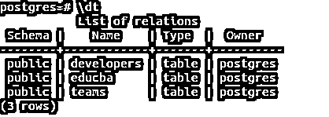
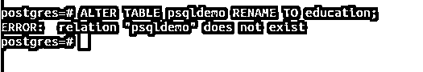
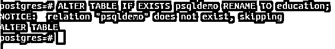
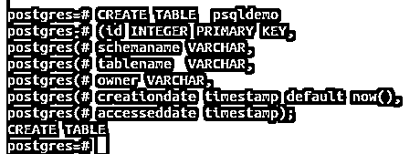
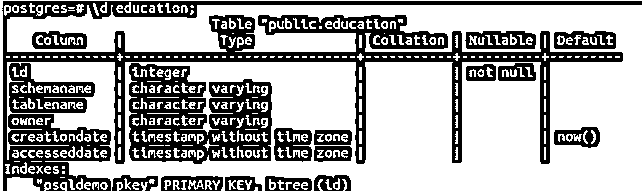

# Postgres 重命名表

> 原文：<https://www.educba.com/postgres-rename-table/>

## Postgres 重命名表简介

每当我们对 PostgreSQL 数据库中的表执行操作时，我们经常会觉得有必要对现有的表执行一些更改。我们可以向表中添加更多列，修改现有列及其相关属性，添加或删除约束，删除列，重命名表或为表中的某些列分配默认值，添加或删除主键和外键约束，以及重命名表。我们可以使用 PostgreSQL 中的 ALTER TABLE 命令来执行所有这些操作。在本文中，我们将研究 ALTER TABLE 命令的语法，并查看几个示例来了解如何更改 PostgreSQL 数据库中的表名。

**语法:**

<small>Hadoop、数据科学、统计学&其他</small>

`ALTER TABLE tableName
RENAME TO alteredTableName`

*   **tableName**–这是当前 PostgreSQL 数据库中您希望重命名的表的名称。
*   **altered TableName**–这是您要分配给具有 tableName 的表格的名称，并将其重命名。

### Postgres 重命名表示例

让我们首先创建一个名为 educba 的新表，在使用\dt 命令检查当前数据库中的所有表后，该表将存储与公司相关的数据

`\dt`

`CREATE TABLE educba
(id INTEGER PRIMARY KEY,
technologies VARCHAR,
workforce INTEGER,
address VARCHAR);`

检查表是否是由\dt 命令创建的，该命令给出输出-

`\dt`

我们可以使用 alter table 命令重命名表名。要将表 educba 的名称重命名为 educational_platforms，我们可以通过以下方式使用上面提到的 alter table 命令的语法

`ALTER TABLE educba RENAME TO educational_platforms;`

让我们在启动上述命令来描述 educba 和 educational _ platforms 表之后，使用\d 命令进行检查。这将产生以下输出–

`\d educba;
\d educational_platforms;`

**T2】**

 **可以看出，educba 表无法描述，因为它已被重命名，现在我们的数据库中不存在任何名为 educba 的表。在描述了 educational _ platforms 之后，它包含了与我们之前创建的 educba 表相同的结构和键。因此，我们可以得出结论，我们的表被成功地重命名。

让我们看看如果我们试图改变数据库中不存在的表会发生什么，比如 SQL demo。

`ALTER TABLE SQL demo RENAME TO education;`

这将导致执行上述命令后的错误输出如下

执行上述命令的输出中给出了错误消息，称关系名 SQL demo 不存在。为了避免这种错误，我们可以按以下方式在 alter table 语法中使用 IF EXISTS 语句

`ALTER TABLE IF EXISTS tableName
RENAME TO alteredTableName;`

这将防止系统在当前数据库中不存在名为 tableName 的表时抛出错误。相反，系统会发出通知说不存在这样的表。让我们尝试执行以下查询语句–

`ALTER TABLE IF EXISTS psqldemo RENAME TO education;`

执行上述查询语句会产生以下输出–

由于这些表在 PostgreSQL 数据库服务器中被称为关系，因此会生成一个通知,“关系名 psqldemo 不存在，因此将跳过 alter table 命令的执行”。

让我们创建一个名为 psqldemo 的表，然后使用上述语法(如果存在的话)尝试修改它。

使用以下查询语句创建一个名为 psqldemo 的表，其中包含 id、schemaname、tablename、owner、creationdate 和 accesseddate 等列

`CREATE TABLE psqldemo
(id INTEGER PRIMARY KEY,
schemaname VARCHAR,
tablename VARCHAR,
owner VARCHAR,
creationdate timestamp default now(),
accesseddate timestamp);`

在 PostgreSQL 命令提示符下执行上述命令会产生以下输出

现在让我们尝试使用 alter table 语法 ith 将 psqldemo 表重命名为 education，如果其中存在语句的话。查询语句如下所示

`ALTER TABLE IF EXISTS psqldemo RENAME TO education;`

执行查询后，输出如下

让我们尝试描述 psqldemo 和教育表，并查看输出–

为了描述 psqldemo，启动以下命令–

`\d psqldemo;`

这会产生以下输出–

输出表明当前数据库中不存在名为 psqldemo 的关系。

使用以下查询语句描述教育表

`\d education;`

给出以下输出

它类似于我们分配给 psqldemo 表的结构和键，psql demo 表是我们创建的，后来被我们重命名。因此，我们的表被成功重命名。

### 要记住的要点

在 PostgreSQL 中重命名任何表时，有几点您应该牢记在心。它们如下所列

*   每当我们重命名该表时，该表上的依赖对象(如使用该表的视图、任何外键(如果该表有))以及所有其他约束和索引都会自动更新。
*   如果您想重命名数据库的多个表，我们无法为它们发出一个 alter 命令。需要对每个表使用 alter 查询分别重命名每个表。
*   每当重命名表时，表中的所有内容都不会受到影响，也不会发生更改。
*   每当试图使用 if exists 语句重命名不存在的表时，执行流都不会对表进行重命名。它首先检查表是否存在，并在表不存在时发出通知，然后终止执行。

### 结论

我们在 PostgreSQL 数据库中有一个通用的可变 ALTER TABLE 命令，可以用来添加、删除和修改列及其数据类型、约束(如 not null、default 等)。我们可以使用这种方法来重命名当前 Postgres 数据库中的表名。为了避免在试图重命名数据库中不存在的表时抛出错误，我们可以使用 IF EXISTS 语句，该语句有助于发出通知，说明数据库中不存在这样的关系，即具有指定名称的表不存在。我们应该尝试最大限度地利用 PostgreSQL 中可用的命令来准备高效、健壮和一致的 PostgreSQL 数据库。

### 推荐文章

这是 Postgres 重命名表的指南。在这里，我们讨论的介绍，语法，命令与例子，及其代码实现。您也可以看看以下文章，了解更多信息–

1.  [PostgreSQL 角色](https://www.educba.com/postgresql-roles/)
2.  [PostgreSQL 标识列](https://www.educba.com/postgresql-identity-column/)
3.  [PostgreSQL 当前日期](https://www.educba.com/postgresql-current-date/)
4.  [PostgreSQL 链接](https://www.educba.com/postgresql-link/)**